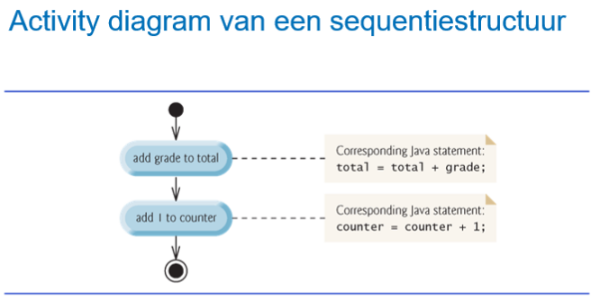
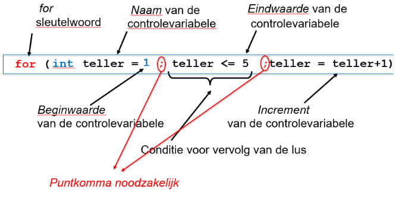

# Doelstellingen

- om een eenvoudige methode te schrijven en aan te roepen in een applicatie
- om de juiste controlestructuur te kiezen
- om een correcte controlestructuur te schrijven in Java
- om een eenvoudige methode te gebruiken om dubbele code te vermijden

# Inleiding

- Waarom controlestructuren?
	- principe van gestructureerd programmeren toepassen
	- controlestructuren helpen om methodes leesbaar en performant uit te werken

# Algoritmen

- Een algoritme is een procedure om een probleem op te lossen in termen van
	- de opdrachten die uitgevoerd worden
	- de volgorde waarin ze worden uitgevoerd

- Voorbeeld in pseudo-code:
```
Sta op en ga werken algoritme

1) Kom uit bed
2) Doe je pyama uit
3) Neem een douche
4) Kleed je aan
5) Eet een gezond ontbijt
6) Carpool naar het werk
```


# Pseudo-code

- Pseudocode is
	- een informele taal om algoritmen te ontwikkelen
	- GEEN taal die uitgevoerd wordt door computers
	- een taal die softwareontwikkelaars helpt bij het "uitdenken" van algoritmen
	- meestal beperkt tot de uitvoerbare statements, geen declaraties

# Controlestructuren

- Programmacontrole is de volgorde waarin de acties uitgevoerd worden in een programma en **3 controlestructuren** helpen hierbij:

## controlestructuren

- **sequentiestructuur**: Java heeft een "ingebouwde" sequentiestructuur, **dit is default behaviour**. De s**tatements in een programma worden één voor één uitgevoerd in de volgorde waarin ze geschreven zijn**.

- **selectiestructuur**: Java voorziet drie selectiestructuren
	- `if`
	- `if/else`
	- `switch-case`
	  Elk van deze woorden is een Java-sleutelwoord.

- **herhalingsstructuur**: Java voorziet drie herhalingsstructuren
	- `for`
	- `while`
	- `do/while`
	 Elk van deze woorden is een Java-sleutelwoord.

##  Activity diagram
 - Grafische representatie van een algoritme.
- Lijnen geven de volgorde aan waarin de acties worden uitgevoerd.
	 Voor een sequentie ziet zo’n activity diagram er als volgt uit:



# Een eenvoudige methode voor een programma

## Wat en hoe

In de hierna volgende programmavoorbeelden **wordt telkens een methode gebruikt die vanuit de main-methode wordt aangeroepen in de applicatieklasse**. Om deze methode te kunnen aanroepen moet je eerst **een object maken van de klasse waarin deze main-methode staat**. Zo’n **object maak je met de constructor (zie H3) die wordt aangeroepen met het keyword `new`**.

## Voorbeeld

1. **Object aanmaken**: Om een niet-statische methode aan te roepen, maak je eerst een object van de klasse aan met de constructor:
    
    ```java
    H2VoorbeeldMetMethode object = new H2VoorbeeldMetMethode();
    ```
    
2. **Methode-definitie**:
    
    - De methode **is niet-statisch**, dus geen `static` keyword.
	    - **Niet-statisch** betekent dat een *methode hoort bij een object en dat je een object moet maken om de methode te gebruiken*.
    - De methode is **private** en *kan alleen binnen de klasse gebruikt worden*.
    - Geef de methode een duidelijke naam in gebiedende wijs (bijv. `doeIets`).
3. **Methode aanroepen**:
    
    - Gebruik de puntnotatie om de methode op het object aan te roepen:
        
        ```java
        object.doeIets();
        ```
        
4. **Volledige klasse**:
    
    ```java
    public class H2VoorbeeldMetMethode {
        public static void main(String[] args) {
            H2VoorbeeldMetMethode object = new H2VoorbeeldMetMethode();
            object.doeIets();
        }
    
        private void doeIets() {
            // Code voor de functionaliteit
        }
    }
    ```
    

### Belangrijk:

- Een **niet-statische methode** hoort bij een object, daarom maak je een object aan.
- **Puntnotatie** verbindt het object en de methode.
- Dit lijkt op hoe je een `Scanner` gebruikt:
    
    ```java
    Scanner invoer = new Scanner(System.in);
    String input = invoer.nextLine();
    ```


# De selectiestructuren

## De "`if`" selectiestructuur

```java
if (voorwaarde) statement
```

- Het statement **wordt alleen uitgevoerd als de voorwaarde WAAR is** (true).
- Het statement kan ook op de volgende lijn staan.
- Als het statement **enkelvoudig is, dan wordt de selectiestructuur afgesloten met het puntkomma** `;` in het statement. **Als het statement samengesteld is, dan bestaat het statement uit meerdere enkelvoudige statements die gebundeld worden aan de hand van accolades** `{}` de selectiestructuur wordt dan afgesloten met de eind-accolade van het statement.
- Voorwaarden kunnen geformuleerd worden **met relationele operatoren en/of gelijkheidsoperatoren**
- De **ronde haakjes rond de voorwaarde zijn verplicht**!

```java
if (condition) {

}
```

### Gelijkheidsoperatoren

| Operator | In java |                           |
| -------- | ------- | ------------------------- |
| =        | `=`     | exact gelijk              |
| ≠        | `!=`    | verschillend              |
| >        | `>`     | groter dan                |
| <        | `<`     | kleiner dan               |
| ≥        | `>=`    | groter dan of gelijk aan  |
| ≤        | `<=`    | kleiner dan of gelijk aan |
### Prioriteitsregels:

- **Bij gelijke prioriteit ⇒ regels van de associativiteit (van L naar R)**
	- **Uitzondering: =** (assignment)
		- `x = y = z;` *wordt geëvalueerd als* `x = (y = z);`

| Prioriteit | Teken                |         |
| ---------- | -------------------- | ------- |
| 1          | `( )`                | haakjes |
| 2          | `*`,`/`,`%`          |         |
| 3          | `+`,`-`              |         |
| 4          | `<`, `<=`, `>`, `>=` |         |
| 5          | `==`, `!=`           |         |
| 6          | `=`                  |         |


## De "`if-else`" selectiestructuur

```java
if (voorwaarde) statement1 else statement2
```

- **Ofwel** wordt `statement1` uitgevoerd, **ofwel** ``statement2``; **NOOIT beide**!
- Het `statement1` wordt **enkel uitgevoerd wanneer de voorwaarde WAAR** (`true`) **is**.
- Het **alternatieve** `statement2` **wordt enkel uitgevoerd wanneer de voorwaarde VALS** (`false`) **is**.

```java
if (condition) {

} else {

}
```


## Geneste "if-else" selectiestructuren

- Noteer in **commentaar naast de `else` de negatie van de** `voorwaarde;` **zo zie je beter in wat er eventueel nog moet getest worden!**
- Gebruik van `{}` **om aan te geven bij welke** `if` **de** `else` **hoort** en om meerdere statements te groeperen in een blok.

**Voorbeeld**
```java
if (getal1 > 10) {
	if (getal2 > 20){
		System.out.println("getal1 > 10 en getal2 > 20");
	}
}
else {
	System.out.println("???");
}
```

## De conditionele operator (`?:`)

- De conditionele operator kan gebruikt worden om sommige `if`/`else`-**structuren korter te schrijven**. In de **conditionele operator komt altijd een vraagteken** (`?`) **en een dubbel punt** (`:`) **voor**.
- We hebben telkens in beide takken een gemeenschappelijk stukje code dat we vooraan kunnen plaatsen! Hebben we dat niet, dan kan deze operator niet gebruikt worden.

```java
voorwaarde ? expressie1 : expressie2
```
- Indien de `voorwaarde` waar is, wordt `expressie1` uitgevoerd.
- Indien de `voorwaarde` niet waar is, wordt `expressie2` uitgevoerd.

**Voorbeeld**

- Lange manier
```java
if ( a < b)
	system.out.printf("%d",a);
else
	system.out.printf("%d",b);
```

- met conditionele operator (`?:`)
```java
system.out.printf("%d",a<b?a:b);
```

## De "`switch`" meervoudige selectiestructuur
- De switch-structuur wordt gebruikt voor meervoudige selecties:

```java
switch (variabele) { case label1 -> statement1; case label2 -> statement2; default -> statement3; }
```

- Er zijn **5 mogelijke types voor de `variabelen` en de `labels`**:
	- `byte`
	- `short`
	- `int`
	- `char`
	- `String`

### Regels:
-  **Alle labels moeten verschillend zijn**
- **Labels van het type `char` staan tussen enkele quotes `' '`**
- **Labels van het type `String` tussen dubbele quotes `" "`**
- Het **type van de labels is hetzelfde type als de variabele**
- De volgorde van de labels is willekeurig; default staat meestal als laatste
- Het **default-label is niet verplicht**

#### Voorbeeld

- `switch` statement met `int` als type
```java
System.out.print("Geef uw keuze in: ");
int keuze = input.nextInt();
switch (keuze) {
	case 1 -> System.out.println("Keuze 1! Je hebt gekozen om op te tellen.");
	case 2 -> System.out.println("Keuze 2! Je hebt gekozen om te delen.");
	case 3 -> System.out.println("Keuze 3! Je hebt gekozen om af te
	trekken.");
	default -> System.out.println("Foutieve keuze!");
}
```
# Samengestelde toekenningsoperatoren

- In Java kunnen we in bepaalde situaties uitdrukkingen voor toekenningen afkorten:

```java
x -= a;
x *= a;
x /= a;
x %= a;
```

- Iets bij een variabele optellen:
```java
int teller = 1;
teller = teller + 1;
teller = teller + 3;
```
- **afgekort**:
```java
teller += 1;
teller += 3;
```
# Increment- en decrementoperatoren

- In het bijzonder komt het vaak voor, dat een telvariabele (bijvoorbeeld teller) **met 1 moet verhoogd of verlaagd worden**.

- Unaire increment operator (`++`): **vermeerdert de waarde van de variabele met 1**
- Unaire decrement operator (`--`): **vermindert de waarde van de variabele met 1**

| Operator | Wordt genoemd | Voorbeeld expressie | Uitleg                                                              |
| -------- | ------------- | ------------------- | ------------------------------------------------------------------- |
| `++`     | preincrement  | `++a`               | Vermeerder a met 1. Eerst optellen, dan de nieuwe waarde gebruiken  |
| `++`     | postincrement | `a++`               | Vermeerder a met 1. Eerst de huidige waarde gebruiken, dan optellen |
| `--`     | predecrement  | `--b`               | Verminder b met 1. Eerst aftrekken, dan de nieuwe waarde gebruiken  |
| `--`     | postdecrement | `b--`               | Verminder b met 1. Eerst de huidige waarde gebruiken, dan aftrekken |


- **Telt eerst op** *en definieert dan eventuele variabele*
```java
//Lange manier
teller += 1; //geld enkel voor 1, andere getallen kan je niet korter schrijven
teller -= 1; //geld enkel voor 1, andere getallen kan je niet korter schrijven

//Kortere manier
++teller; // Prefix: eerst optellen, dan de nieuwe waarde gebruiken
--teller; // Prefix: eerst aftrekken, dan de nieuwe waarde gebruiken
```

- **Definieert eerst eventuele variabele** *en telt dan pas op*
```java
teller++; // Postfix: eerst de huidige waarde gebruiken, dan optellen
teller--; // Postfix: eerst de huidige waarde gebruiken, dan aftrekken
```

### Wat is nu het verschil tussen teller++ en ++teller?

```java
int teller1, result1, teller2, result2;
teller1 = 0;
teller2 = 0;
result1 = teller1++; ①
result2 = ++teller2; ②
System.out.printf("%s : %d%n", "teller1", teller1); //teller1 = 1
System.out.printf("%s : %d%n", "result1", result1); //result1 = 0
System.out.printf("%s : %d%n", "teller2", teller2); //teller2 = 1
System.out.printf("%s : %d%n", "result2", result2); //result2 = 1
```


# De herhalingsstructuren


## Inleiding

- We kunnen 2 soorten lussen onderscheiden:
	- een lus waarvan je op voorhand weet om hoeveel herhalingen het gaat, dit noemen we ook een tellergestuurde lus
	- een lus waarvan je op voorhand NIET weet om hoeveel herhalingen het gaat

## Tellergestuurde lus `for`

### for-lus

```java
for ( expressie1; expressie2; expressie3 ) statement
```

- Een `for`-lus wordt gebruikt **om een reeks instructies herhaaldelijk uit te voeren**. 
- Het wordt gebruikt wanneer je een bepaald stuk code een **vast aantal keren wilt herhalen**.
- Een `for`-lus is als het ware "gemaakt" om een herhaling met een `teller` te implementeren.

```java
for (int i = 0; i < args.length; i++) {

}
```

### Voorbeeld
```java
for (int teller = 1; teller <= 5; teller++) {
	System.out.printf("%d ", teller);
}
```

- Uitvoer:
```
1 2 3 4 5
```




## De andere lussen

### De while-lus met schildwacht `while`

```java
while (voorwaarde) statement
```

- Het statement **wordt herhaald zolang de voorwaarde WAAR (`true`) blijft**!
- Zorg ervoor dat de voorwaarde beïnvloed wordt in het statement, anders krijg je een oneindige lus!
- Als het statement **enkelvoudig is, dan wordt de herhalingsstructuur afgesloten met het punt-komma`;`** in het statement. Als het **statement samengesteld is, dan wordt de herhalingsstructuur afgesloten met de eind-accolade`{}`** van het statement.
- **Voorwaarden kunnen geformuleerd worden met relationele operatoren en/of gelijkheidsoperatoren**.
- De **ronde haakjes rond de voorwaarde** zijn verplicht!
- Voor een herhaling met een schildwacht zijn **nodig**:
	- een `waarde (schildwacht, sentinel)` **die het einde van de invoer van data aangeeft**
	- de **schildwacht wordt niet meer verwerkt**!

```java
while (condition) {

}
```

### De do-while-lus `do-while`

```java
do statement while (voorwaarde);
```

- Lijkt op de while structuur, MAAR **test of de lus verder doorlopen moet worden NADAT de body van de loop uitgevoerd is**.
- De lus wordt **altijd MINSTENS ÉÉN MAAL doorlopen**, gezien de test NA het statement staat.
- Het statement wordt **herhaald zolang de voorwaarde WAAR** blijft!
- Zorg ervoor dat de **voorwaarde beïnvloed wordt in het statement, anders krijg je een oneindige lus**!
- Als het statement **enkelvoudig is, dan zijn de accolades overbodig**. Als het statement **samengesteld is, dan zijn de accolades`{}` noodzakelijk**.
- Deze herhalingsstructuur **wordt ALTIJD afgesloten met een punt-komma`;`**.
- **Voorwaarden kunnen geformuleerd worden met relationele operatoren en/of gelijkheidsoperatoren**.
- De **ronde haakjes rond de voorwaarde zijn verplicht**!

```java
do {

} while (condition);
```


## Samenvatting herhalingsstructuren

- Je gebruikt een `for` **indien je van tevoren weet om hoeveel herhalingen het gaat**.

- **Weet je niet van tevoren om hoeveel herhalingen** het gaat, dan dien je een `while` **of** een `do-while` te gebruiken.
	- Je kiest voor een `while` indien de **body van de while misschien nooit mag worden uitgevoerd**. **De voorwaarde wordt eerst getest**. De body van de `while` wordt uitgevoerd zolang de voorwaarde waar is.
	- Je kiest voor een `do-while` indien de **body van de do-while tenminste één keer moet worden uitgevoerd**. **Eerst wordt de body van de `do-while` uitgevoerd, vervolgens wordt de voorwaarde gecontroleerd**. Zolang de expressie waar is, wordt de body van de do-while uitgevoerd.
# Logische operatoren

- Logische operatoren **combineren eenvoudige condities tot complexere condities**.

- Logische operatoren in Java

| Operator | Betekenis       |     |
| -------- | --------------- | --- |
| **&&**   | contitionele EN | AND |
| **\|\|** | conditionel OF  | OR  |
| **!**    | logische NIET   | NOT |
## Waarheidstabel conditionele en (&&)

- **Enkel WAAR als beide delen WAAR zijn**! Na het controleren van de eerste voorwaarde, kan je dus mogelijk al besluiten dat het eindresultaat VALS zal zijn!
- Plaats bij de **operator && de conditie die de meeste kans heeft om vals te zijn links van de operator**
- Plaats **de conditie die eventueel niet mag geëvalueerd worden rechts**.

| expression1 | expression2 | expression1 && expression2 |
| ----------- | ----------- | -------------------------- |
| false       | false       | false                      |
| false       | true        | false                      |
| true        | false       | false                      |
| true        | true        | true                       |

## Waarheidstabel conditionele of (||)

- **Enkel VALS als beide delen VALS zijn**! Na het controleren van de eerste voorwaarde, kan je dus mogelijk al besluiten dat het eindresultaat WAAR zal zijn!
- Plaats bij de **operator || de conditie die de meeste kans heeft om waar te zijn links van de operator** plaatsen.
- Plaats **de conditie die eventueel niet mag geëvalueerd worden rechts**.

| expression1 | expression2 | expression1 && expression2 |
| ----------- | ----------- | -------------------------- |
| false       | false       | false                      |
| false       | true        | true                       |
| true        | false       | true                       |
| true        | true        | true                       |

## Waarheidstabel logische niet (!)

| expression | !expression |
| ---------- | ----------- |
| false      | true        |
| true       | false       |


# Precedentie en associativiteit van de operatoren (leesrichting)

- We kennen nu wiskundige-, relationele-, conditionele-, logische-, increment- en decrement-operatoren. We zijn in staat om complexe voorwaarden samen te stellen.

- Haakjes kunnen gebruikt worden om de prioriteiten te negeren. **Alles wat tussen de haakjes staat wordt altijd het eerst uitgewerkt**.
	- Bij complexe voorwaarden is het soms aangewezen haakjes te gebruiken, om de lezer zonder meer duidelijk te maken hoe de expressie wordt uitgewerkt.
	- Een belangrijke stelregel is: **bij twijfel, gebruik altijd haakjes**.

| Operators                      | Associativiteit       | Type           |
| ------------------------------ | --------------------- | -------------- |
| `()`                           | van links naar rechts | haakjes        |
| `++` `--`                      | van rechts naar links | unair postfix  |
| `++` `--` `+` `-` `!` `(type)` | van rechts naar links | unair          |
| `*` `/` `%`                    | van links naar rechts | multiplicerend |
| `+` `-`                        | van links naar rechts | toevoegend     |
| `<` `<=` `>` `>=`              | van links naar rechts | relationeel    |
| `==` `!=`                      | van links naar rechts | gelijkheid     |
| `&&`                           | van links naar rechts | logische EN    |
| \|\|                           | van links naar rechts | logische OF    |
| `? :`                          | van rechts naar links | conditioneel   |
| `=` `+=` `-=` `*=` `/=` `%=`   | van rechts naar links | toekenning     |
## Voorbeeld conditioneel

- Hier wordt eerst `1 + 2` (optelling) en `3 * 4` (vermenigvuldiging) uitgevoerd **voordat** de ternary operator beslist welke waarde moet worden toegekend aan `resultaat`.
```java
int resultaat = true ? 1 + 2 : 3 * 4;
```

- **Precedentie:** De ternary operator (`? :`) wordt uitgevoerd nadat operators met een hogere prioriteit zijn verwerkt.  
- **Associativiteit:** Bij meerdere ternary operators wordt de meest rechtse eerst uitgevoerd (van rechts naar links).

## Voorbeeld unair postfix

- Hier wordt eerst de waarde van `teller` gebruikt voor de optelling, **voordat** de postfix operator (`++`) de waarde van `teller` verhoogt.

```java
int teller = 5;
int resultaat = teller++ + 2; // resultaat = 7, teller = 6
```

- **Precedentie:** De postfix operator (`++`) heeft een hogere prioriteit dan de meeste andere operators.
- **Associativiteit:** Evaluatie verloopt van **links naar rechts**.

---

## Voorbeeld unair

- Hier wordt de negatieve waarde van `getal` bepaald **voordat** deze wordt toegekend aan `resultaat`.

```java
int getal = 5;
int resultaat = -getal; // resultaat = -5
```

- **Precedentie:** De unaire operator (`-`) heeft een hogere prioriteit dan toekenning.
- **Associativiteit:** Evaluatie verloopt van **rechts naar links**.

---

## Voorbeeld toekenning

- Hier wordt eerst `2 * 3` berekend **voordat** de waarde wordt toegewezen aan `getal`.

```java
int getal;
getal = 2 * 3; // getal = 6
```

- **Precedentie:** Toekenning (`=`) heeft de laagste prioriteit en wordt als laatste uitgevoerd.
- **Associativiteit:** Evaluatie verloopt van **rechts naar links**.
# Primitieve datatypes

- Primitieve types zijn "bouwblokken" voor ingewikkeldere types
- Java is sterk getypeerd: **alle variabelen in een Java programma MOETEN een type hebben**
- Primitieve types in Java zijn overdraagbaar over computerplatformen die Java ondersteunen
- Elk primitief type heeft een bijbehorende **wrapperklasse**: `Boolean`, `Character`, `Byte`, `Short`, `Integer`, `Long`, `Float` en `Double`.
	- De wrapperklassen `Byte`, `Short`, `Integer`, `Long`, `Float` en `Double` hebben constanten: `MAX_VALUE` en `MIN_VALUE`.
	- Voor `Byte`, `Short`, `Integer` en `Long` geven deze de **grootst** en **kleinst mogelijke waarde** van dat type aan.
	- Bij `Float` en `Double` staat `MAX_VALUE` voor de **grootste positieve waarde**, en `MIN_VALUE` voor de **kleinste positieve waarde dicht bij nul**.

| Type    | Grootte in bits | Waarden                                                  | Standaard                   |
|---------|-----------------|----------------------------------------------------------|-----------------------------|
| boolean | 8               | `true` of `false`                                       |                             |
| char    | 16              | `\u0000` tot `\uFFFF` (0 tot 65535)                     | ISO Unicode character set  |
| byte    | 8               | -128 tot +127                                           |                             |
| short   | 16              | -32,768 tot +32,767                                     |                             |
| int     | 32              | -2,147,483,648 tot +2,147,483,647                       |                             |
| long    | 64              | -9,223,372,036,854,775,808 tot +9,223,372,036,854,775,807 |                             |
| float   | 32              | Negatief bereik: -3.4028234663852886E+38 tot -1.40129846432481707E-45  <br> Positief bereik: 1.40129846432481707E-45 tot 3.4028234663852886E+38 | IEEE 754 floating point    |
| double  | 64              | Negatief bereik: -1.7976931348623157E+308 tot -4.94065645841246544E-324  <br> Positief bereik: 4.94065645841246544E-324 tot 1.7976931348623157E+308 | IEEE 754 floating point    |
### Wrapperklasse

#### Voor elk primitief type bestaat een wrapperklasse:

| Primitief type | Wrapperklasse |
| -------------- | ------------- |
| `boolean`      | `Boolean`     |
| `char`         | `Character`   |
| `byte`         | `Byte`        |
| `short`        | `Short`       |
| `int`          | `Integer`     |
| `long`         | `Long`        |
| `float`        | `Float`       |
| `double`       | `Double`      |

#### Waarom wrapperklassen?

- **Object-functionaliteit:** Primitieve types hebben geen methodes; wrapperklassen bieden extra functionaliteiten, zoals `Integer.parseInt()` om een `String` om te zetten naar een `int`.
- **Gebruik in collecties:** Java-collecties (zoals `ArrayList`) kunnen alleen objecten opslaan, geen primitieve types.
- **Autoboxing en unboxing:** Java converteert automatisch primitieve types naar wrapperklassen (autoboxing) en omgekeerd (unboxing) wanneer dat nodig is.

#### Voorbeeld:

```java
int getal = 5; // primitief type
Integer wrapper = getal; // autoboxing: int wordt omgezet naar Integer

int opnieuwGetal = wrapper; // unboxing: Integer wordt omgezet naar int

System.out.println(wrapper.MAX_VALUE); // Grootste waarde die een Integer kan hebben

```

Kort samengevat: **Wrapperklassen breiden primitieve types uit met handige methoden en maken gebruik in objectgebaseerde contexten mogelijk.**
## Het primitieve datatype: `boolean`

Variabelen van het type `boolean` **kunnen slechts twee waarden bevatten**: `true` of `false`

```java
boolean gevonden;
gevonden = false;
```
## Het primitieve datatype: `char`

- In variabelen van het type `char` kan je **één letter of één ander teken opslaan**. Nooit meer dan één. Zo’n **teken moet je in het programma tussen enkele quotes zetten**.
	- bijvoorbeeld de letter **a** als `'a'`, een **punt** als `'.'`, etc.

```java
char letter1, letter2;
letter1 = 'a';
letter2 = '*';
```

## Het primitieve datatype: `byte`

- In een variabele van het type `byte` **kun je gehele getallen van -128 (= Byte.MIN_VALUE) t.e.m. 127 (= Byte.MAX_VALUE) bewaren**.

```java
byte getal1, getal2, getal3;
getal1 = 50;
getal2 = -128;
getal3 = 127;
```

## Het primitieve datatype: `short`

In een variabele van het type `short` kun je **gehele getallen van -32768 (= Short.MIN_VALUE) t.e.m. 32767 (= Short.MAX_VALUE) bewaren**.

```java
short getal4, getal5;
getal4 = -32768;
getal5 = 32767;
```

## Het primitieve datatype: int

- In een variabele van het type `int` **kun je gehele getallen van -2 147 483 648 (= Integer.MIN_VALUE) tot 2 147 483 647 (= Integer.MAX_VALUE) bewaren**.

```java
int getal1, getal2;
getal1 = -2147483648; // Minimumwaarde voor int
getal2 = 2147483647;  // Maximumwaarde voor int
```
## Het primitieve datatype: `long`

- In een variabele van het type `long` **kun je gehele getallen van -9 223 372 036 854 775 808 (=Long.MIN_VALUE) tot 9 223 372 036 854 775 807 (= Long.MAX_VALUE) bewaren**.

```java
long getal3, getal4;
getal3 = -9223372036854775808L; // Minimumwaarde voor long
getal4 = 9223372036854775807L;  // Maximumwaarde voor long


long getal6, getal7;
getal6 = 2147483647; // bovengrens van int
getal7 = getal6 * 10;
```
## De primitieve datatypen: `float` en `double`

- In veel gevallen waarin gerekend wordt, heb je **reële getallen** nodig, zoals bijvoorbeeld 24.75. Voor reële getallen kent het Engels de term floating-point getallen.

- Java heeft voor reële getallen **twee verschillende primitieve typen**:
	- `float`: storing **single-precision floating-point**
	- `double`: storing **double-precision floating-point**
	
- De **nauwkeurigheid van getallen van het type `float` is 6 tot 7 cijfers**. Dat lijkt misschien veel, maar **leidt in de praktijk al gauw tot grote onnauwkeurigheden door afrondingsfouten**.

- Getallen van het type `double` **nemen meer geheugen in beslag dan float, maar hebben een nauwkeurigheid van 15 cijfers**.

```java
float float_getal;
double double_getal;

float_getal = 10;
double_getal = float_getal; //①
float_getal *= 12.123456789;
double_getal *= 12.123456789;

System.out.printf("%s%.14f%n", "float: ", float_getal); //②
System.out.printf("%s%.14f%n", "double: ", double_getal); //③
```
- ① **Automatische casting** van een `float` **naar** een `double`.
- ② De uitvoer is `float`: 121,23456573486328
- ③ De uitvoer is `double`: 121,23456789000001

## default waarde datatype

| datatype | default waarde attribuut |
| -------- | ------------------------ |
| boolean  | false                    |
| byte     | 0                        |
| short    | 0                        |
| int      | 0                        |
| long     | 0                        |
| char     | 0                        |
| float    | 0.0                      |
| double   | 0.0                      |

# Extra

- Voorlopig hebben we nog geen kennis van datastructuren waarin meerdere elementen kunnen bijgehouden worden (volgt pas in H4).
- 
- Wil je toch informatie over meerdere elementen bijhouden, dan kan je bijvoorbeeld een String opbouwen met deze informatie.


