# Doelstellingen

- kan volgende OO concepten begrijpen en omschrijven: klasse, object, toestand, eigenschappen, attributen, gedrag, operatie, constructor, getter, setter, actie , identiteit, abstractie, inkapseling
- kan volgende UML concepten begrijpen en omschrijven: klassendiagram, attributen, operaties, constructor, visibiliteit
- kan een klasse weergeven in UML
- kan een klasse voorgesteld in UML vertalen naar java code
- kan die javaklasse testen m.b.v. een gegeven testklasse (JUnit)
- kan een applicatie bouwen die werkt met objecten van een eigen gemaakte klasse

# Inleiding: een aantal sleutelconcepten

- De naam van dit opleidingsonderdeel is Object oriented software development. De bedoeling is om software te ontwikkelen met een object georiënteerde programmeertaal. Het is dus belangrijk om eerst even na te gaan wat een object is.
- Er bestaan drie sleutelconcepten:
	- object
	- abstractie
	- klasse
# Object

- Bij het ontwikkelen van software, heeft de klant een stuk software nodig om bepaalde problemen op te lossen, om efficiënter te kunnen werken, … De klant beschrijft de reële situatie waarvoor de te ontwikkelen software een oplossing moet zijn. Object georiënteerd werken sluit nauw aan bij de werkelijkheid, die reële situatie beschreven door de klant.
- Met real-world objecten zijn we vertrouwd. Als we even rondom ons kijken, zien we heel wat van die objecten. Deze objecten kunnen we beschrijven:
	- Waarvoor dienen ze?
	- Welke eigenschappen/karakteristieken hebben ze?
	- Wat je ermee kan doen?

## Real-world objecten

- **kunnen onderscheiden worden van elkaar**
- hebben **eigenschappen** 
	- Die *benoemd kunnen worden en die een waarde kunnen hebben*
- hebben een **gedrag**. 
	- Dit omvat *wat je kan doen met het object*. 
	- Dit *gedrag kan eventueel eigenschappen veranderen van waarde*. 
	- Bijvoorbeeld door de pennenzak te wassen kan de kleur wijzigen.

- Software **objecten zijn een weerspiegeling van deze real-world objecten**: ze kunnen onderscheiden worden, ze hebben eigenschappen en ze hebben gedrag

## Voorbeeld real-world object: een pennenzak


### Beschrijving

Een pennenzak werd oorspronkelijk uit leer vervaardigd, maar is tegenwoordig in allerlei materialen verkrijgbaar. De pennenzak is voorzien van een afsluitmechanisme, bijvoorbeeld een rits. Het heeft een handzaam formaat en is eenvoudig mee te nemen. Pennenzakken zijn beschikbaar in verschillende kleuren en worden soms ook van plaatjes voorzien.

### Eigenschappen

- kleur
- lengte
- hoogte
- breedte
- materiaal

### Wat kan je ermee doen?

- openen
- sluiten
- gooien
- wassen
- leegmaken
- vullen

# Abstractie

- Bij het *ontwikkelen van software is abstractie een heel belangrijk concept*. 
- Abstractie verwijst eigenlijk naar **het enkel opnemen van de noodzakelijke eigenschappen en/of gedrag en tegelijk het verbergen van irrelevante details**. 
- Zo *reduceren we de complexiteit van een applicatie en bevorderen we de efficiëntie* ervan.
- Een software object kan in de ene context andere eigenschappen en gedrag vertonen dan in een andere context.

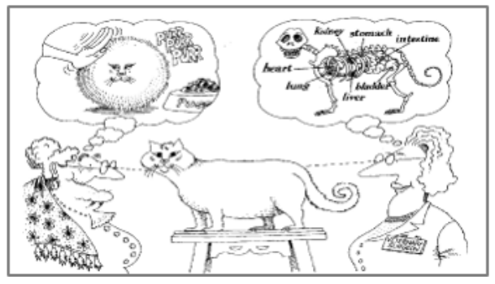

## Voorbeeld: pennenzak in 2 verschillende contexten
### Applicatie 1: fabrikant van pennenzakken

- Belangrijk: Alle productiedetails en alle verkoopdetails zijn uitermate belangrijk. 
- Van welk materiaal is de pennenzak gemaakt, hoeveel kan er in die pennenzak, hoeveel stof is er nodig om de pennenzak te vervaardigen, …

 ### Applicatie 2: grafische, schematische voorstelling van een klas
 
- De details van een pennenzak zijn hier in deze context helemaal niet belangrijk. 
- Hier is het belangrijk om te weten of de student al dan niet een pennenzak heeft en of die al dan niet op de tafel gelegd wordt.


# Klasse

- Via abstractie ontstaan soorten, types van objecten.
- Soortgelijke objecten hebben
	- dezelfde eigenschappen
	- hetzelfde gedrag
- Een **klasse bevat de omschrijving van de eigenschappen en het gedrag van soortgelijke objecten** 


- De **klasse is een abstracte omschrijving** van een pennenzak. 
- Een **object is een concreet** item, **conform de abstracte omschrijving**.
- **Van die klasse kunnen we nu oneindige veel instanties maken**. 
- Een **instantie** *is een synoniem voor een* **object**. 
- *Bij het instantiëren van een klasse, maken we dus een object waarbij al zijn eigenschappen een concrete waarde krijgen*. 
- Eens het object gemaakt is, kan het dan van alles doen. 
	- Dit is dan het gedrag van dit object.

## Voorbeeld

- Klasse Pennenzak

	- Eigenschappen
		- kleur
		- open/dicht
		- lengte

	- Gedrag
		- geefKleur
		- maakOpen
		- vulMetPotlood

# Klassen en objecten: in de diepte

## Wanneer is iets een object?

- In de **OO-wereld is alles een object**
- Een **object wordt beschreven door een klasse**
- Een **object is een instantie van een klasse**

- Voor om het **even wat je wil voorstellen in je OO-applicatie heb je een object nodig**.
### Wat kan een Object (instantie van een klasse) zijn

- **iets tastbaar**
	- een auto, een pennenzak, …
- **een concept** of **abstract ding**
	- een bankrekening, een klas, …
- **een organisatorische eenheid**
	- een departement, een manager, …
- **een interactie die moet onthouden worden**
	- een aankoop, …

## Kenmerken van een object

- Elk object heeft:
	- een **toestand**
	- een **gedrag**
	- een **identiteit**

### Toestand

- *Eigenschappen van objecten* - **attributen**:
	- worden omschreven in hun klasse met behulp van een **naam én een type**.

- Objecten zijn instanties van een klasse en hebben een toestand.
	- de **eigenschappen van de klasse met een actuele waarde**
	- het *type van de actuele waarde moet overeenkomen met het type beschreven in de klasse*

- Merk op dat wanneer software wordt uitgevoerd
	- de **toestand van een object mogelijks evolueert met de tijd**
	- de **toestand mogelijks verschilt van object tot object**

- Eigenschappen worden voorgesteld door een attribuut.

- Elk attribuut heeft een naam en een type. 
	- De **naam** van een attribuut is *in 1 woord geschreven (geen spaties)* en *begint altijd met een kleine letter*. 
	- Het **type** *bepaalt de mogelijke waarde voor die eigenschap*.
		- `boolean` – ja/nee
		- `int` – gehele getallen
		- `String` – karakterstrings
		- `double` - kommagetallen
		- …

#### Voorbeeld

- We bekijken deze drie kenmerken aan de hand van een voorbeeld van een kauwgomautomaat. 

##### We bekijken onderstaande objecten.

- Som een aantal mogelijke eigenschappen op.
- Wat is de huidige waarde van die eigenschap?
- Kan die waarde evolueren in de tijd?
- Kan die waarde van object tot object verschillen?

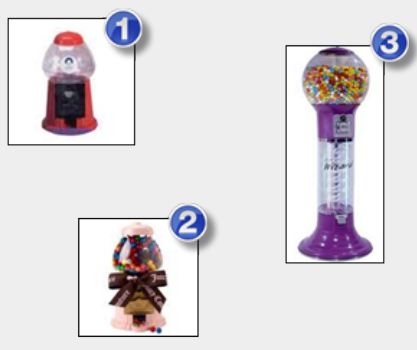

- Een aantal mogelijke eigenschappen
	- de kleur
	- al dan niet vergrendeld
	- de hoogte
	- aantal kauwgomballetjes in de pot

- Huidige waarde van de eigenschappen
	- Kauwgomautomaat 1 heeft een rode kleur.
	- Kauwgomautomaat 3 is 1m hoog.
	- Kauwgomautomaat 2 bevat 63 kauwgomballetjes.

- Evolutie van de waarde van een eigenschap
	- De kleur kan veranderen, bv verbleken in de zon of kan herspoten worden.
	- Het aantal kauwgomballetjes verandert bij het vullen van de automaat. 
	- Het aantal kauwgomballetjes wijzigt ook wanneer iemand voldoende centen in de automaat stopt en draait aan de knop.
	- De hoogte blijft altijd dezelfde.
	- De vergrendeling kan wijzigen van vergrendeld naar niet vergrendeld en omgekeerd.

-  Verschilt de waarde van een eigenschap van object tot object?
	- Kauwgomautomaat 3 is veel hoger dan kauwgomautomaat 1.
	- Kauwgomautomaat 2 bevat 63 kauwgomballetjes, terwijl kauwgomautomaat 1 leeg is.

##### We noteren deze eigenschappen nu op een meer gestructureerde manier.

|                     | Attributen |          |
| ------------------- | ---------- | -------- |
| **naam**            |            | **type** |
| kleur               |            | String   |
| vergrendeld         |            | boolean  |
| hoogte              |            | double   |
| aantalKauwgomballen |            | int      |
### Gedrag

- Een *kenmerk van objecten is dat ze gedrag vertonen*. 
- Daaronder begrijpen we **wat objecten kunnen doen**. 
- Dat **gedrag zijn eigenlijk diensten die een object aanbiedt**.

- het gedrag **is een verzameling van diensten dat een object aanbiedt**
- de diensten zijn **omschreven als methodes in een klasse**
- *objecten interageren met elkaar door boodschappen te versturen*
	- we noemen dit ook het **aanroepen van methodes**
- *wanneer een object een boodschap ontvangt* **wordt de logica van methode uitgevoerd**
	- **de logica maakt gebruik van de actuele toestand van het object**
	- **de logica kan eventueel op zijn beurt leiden tot het versturen van boodschappen** *waardoor een complexe interactie tussen vele objecten kan ontstaan*
- **door uitvoering van de logica kan de toestand van het object wijzigen**
- de *uitvoering van de logica kan resulteren in een antwoord*, *het object die de boodschap verstuurde ontvangt dan dit antwoord*


#### De signatuur van de methode

- **Stelt objecten in staat om op een correcte wijze boodschappen te versturen**
- de **signatuur bestaat uit**
	- een **naam**
	- **eventuele parameter(s)**
	- **eventueel returntype**

- De **signatuur** bevat alleen de **naam, parameters, en returntype**. 
- Zaken zoals **de implementatie** (het binnenwerk van de methode) maken **geen deel uit van de signatuur**.
- De signatuur dient puur als contract om te begrijpen hoe methoden correct aan te roepen zijn.

##### naam

- Een naamkeuze is uitermate belangrijk tijdens het gehele software ontwikkelingsproces! 
- Uit de naam die je bepaalt voor deze methode **moet je perfect kunnen afleiden wat precies die ene taak is waarvoor deze methode dient**.
	- **De naam moet een geldige identifier zijn** (zie H1)
	- Aangezien een methode een actie voorstelt, zorgen we ervoor **dat de naam start met de stam van een werkwoord**.

##### eventuele parameters

- **Parameters laten toe extra informatie met een boodschap te versturen**. 
	- De methode heeft die parameters nodig om zijn taak te kunnen uitvoeren. 
	- Die parameters worden dan gebruikt in het stuk logica van de methode (zie later).

 - **Elke parameter heeft een `naam` en een `type`**. 
	 - We zorgen voor een **betekenisvolle `naam` van de parameter**. 
	 - Zo weet je exact aan de naam welke informatie de parameter bevat. 
	 - Het `type` **legt de soort informatie vast**, bv. een kommagetal, een stukje tekst, …
##### returntype
- Een methode kan op het eind van de reactie **een resultaat, een antwoord teruggeven**.
- Het `returntype` **bepaalt de soort van de returnwaarde**, bv. een kommagetal, een stukje tekst, …
- Niet elke methode geeft iets terug aan het eind van de reactie. 
	- **Indien de methode niets teruggeeft, is het returntype** `void`. 
		- Dit betekent per definitie dat er geen antwoord terugkomt.

##### Voorbeeld

**- Voorbeeld 1**
	- Signiatuur:  `String getKleur()`
	- Getter voor de kleur met de naam "getKleur" is een returntype `String`
```java
    public String getKleur() {
        return "rood"; // Retourneert een String
    }
```

**- Voorbeeld 2**
	- Signiatuur:  `void setKleur(String kleur)`
	- Setter voor de kleur met de naam "setKleur" en een parameter `String kleur`
```java
    public void setKleur(String kleur) {
        // Verandert de toestand van het object
    }
```

**- Voorbeeld 3**
	- Signiatuur:  `void draaiHendel()`
	- Specifieke actie met de naam "draaiHendel"
```java
    public void draaiHendel() {
        // Voert een actie uit zonder iets terug te geven
    }
```

#### Het stuk logica van een methode

- **stelt objecten in staat om op een correcte wijze te reageren op boodschappen**
- voorlopig gaan we niet verder inzoomen op deze logica, dit komt later aan bod

#### De Getters, de Setters en specifieke acties

- Er zijn **twee soorten operaties/methoden** die heel typisch zijn en vaak zullen voorkomen in klassen.
	- **operaties om de waarde van een welbepaald attribuut op te vragen**, we noemen deze methoden de `getters`
	- **operaties om de waarde van een welbepaald attribuut te wijzigen**, we noemen deze methoden de `setters`

- Een klasse meestal nog enkele `specifieke acties` **die door de objecten van deze klasse moeten kunnen uitgevoerd worden**. 
	
##### GETTERS

- Laten ons toe de waarde van een welbepaald **attribuut van een object op te vragen**
	- een getter retourneert steeds een waarde
	- een getter zal de toestand van een object nooit veranderen
	- conventie naam: 
		- de naam van dergelijke methodes **start met** `get`
		- **Samengesteld met de naam van het attribuut**. 
		- In die samenstelling wordt de **naam van het attribuut gestart met een hoofdletter** (*camelCasing*).
		- **Kan ook starten met** `is`, **indien het attribuut van het type boolean is** 
			- bv: `isVergrendeld()`

###### Voorbeeld:

|                 | Gedrag         |                |
| --------------- | -------------- | -------------- |
| **naam**        | **parameters** | **returntype** |
| `getKleur`      | geen           | String         |
| `isVergrendeld` | geen           | boolean        |

##### SETTERS

- Laten ons toe de waarde van een welbepaald **attribuut van een object te wijzigen**
	- een setter retourneert nooit een waarde
	- een setter zal de toestand van een object mogelijks veranderen
	- de nieuwe waarde voor het attribuut wordt aangeleverd via een parameter
	- **conventie naam**: 
		- de naam van dergelijke methodes **start met** `set`
		- **samengesteld met de naam van het attribuut**. 
		- In die samenstelling wordt de **naam van het attribuut gestart met een hoofdletter** (*camelCasing*).

###### Voorbeeld

|            | Gedrag                    |                |
| ---------- | ------------------------- | -------------- |
| **naam**   | **parameters**            | **returntype** |
| `setKleur` | kleur van het type String | void           |

##### specifieke acties

- Dit zijn methoden die een object in staat stellen **om specifieke functionaliteiten of gedrag uit te voeren**.
- Ze zijn **vaak gericht op een bepaalde taak of actie die typisch is voor de klasse waartoe het object behoort**.
- De **naam van deze methoden beschrijft meestal duidelijk wat de actie inhoudt**.

###### Voorbeeld

|               | Gedrag         |                |
| ------------- | -------------- | -------------- |
| **naam**      | **parameters** | **returntype** |
| `draaiHendel` | geen           | void           |
### Identiteit

- **Ieder object heeft een unieke identiteit**. 
- Dit **maakt het mogelijk om objecten van elkaar te onderscheiden**. 
- Twee objecten van eenzelfde klasse, met exact dezelfde waarden voor hun attributen, blijven via hun verschillende identiteit ook twee unieke objecten.

- Een object verkrijgt zijn identiteit wanneer het geïnstantieerd wordt.

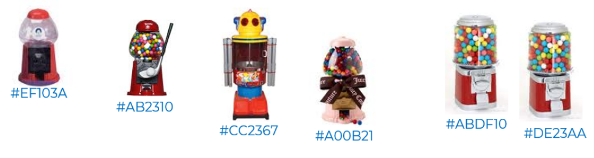

#### instantiëren

- Het instantiëren van een klasse **gebeurt door gebruik te maken van de** `constructor` **in combinatie met** een speciale operator, meestal noemt dit de `new` **operator**.
- **Als resultaat wordt een nieuw object (een nieuwe instantie) gecreëerd**. 
- De attributen van dit nieuw object kunnen worden ingesteld via de logica van de `constructor`.

##### Voorbeeld:

- Een nieuw object instantiëren (maken) op basis van de klasse 
```java
 KauwgomAutomaat automaat = new KauwgomAutomaat("rood", 20);
//(van het type) (naamObject) = new (ConstructorVanKlasse(parameters,...))
```

#### CONSTRUCTOREN

- CONSTRUCTOREN binnen een klasse **laten toe objecten te instantiëren en te initialiseren**.

- Net zoals een methode **heeft een constructor een signatuur**
	- `naam`: Deze kan je niet zelf kiezen, je **moet de naam van de klasse gebruiken**.
	- `parameters`: Deze kunnen **helpen om een initieel geldige toestand te verzekeren**.
	- Merk op dat de signatuur van een constructor **GEEN returntype** heeft.

- Net zoals een methode **heeft een constructor een stuk logica**. 
	- Deze logica zorgt dat het nieuw geïnstantieerde object **een geldige initiële toestand krijgt**.

- Aangezien de signatuur van een constructor vrij gelijkaardig is aan die van methoden, kunnen we ook de constructor netjes noteren in onze tabel (meestal als eerste methode).

###### Voorbeeld

|                   | Constructor                                                             |                |
| ----------------- | ----------------------------------------------------------------------- | -------------- |
| **naam**          | **parameters**                                                          | **returntype** |
| `KauwgomAutomaat` | `kleur` van het type **String**<br> `aantalBallen` van het type **int** | ---            |

```java
// Blauwdruk: de klasse 'KauwgomAutomaat' 
public class KauwgomAutomaat { 
	// Constructor 
	public KauwgomAutomaat(String kleur, int aantalBallen) {
		// Hier kan je initialiseren (bijv. startkleur, startvoorraad, etc.) 
	} 
}
```


## Verantwoordelijkheid van een object

- Een **`object` heeft een duidelijke, wel afgebakende verantwoordelijkheid**, deze wordt gerealiseerd via
	- de `toestand`, de **eigenschappen van het object**
	- het `gedrag`, de **diensten die het object aanbiedt**.

- `Software` **heeft een duidelijke, wel afgebakende verantwoordelijkheid, het biedt een wel gedefinieerde functionaliteit aan, deze wordt gerealiseerd** via
	- de **creatie van objecten**
	- een **complexe interactie tussen de objecten**.

- Elke object draagt een deel van de verantwoordelijkheid voor het geheel 
	- Eén van de grote **uitdagingen** bij OO-ontwerpen **is** het **toekennen van de juiste verantwoordelijkheden aan de juiste soort objecten**

## Relaties tussen objecten

- Tussen objecten bestaan relaties. 
- Deze ontstaan **wanneer één of meerdere attributen van een object, verwijzen naar een ander object**. 
- Dit is **mogelijk door in een `klasse eigenschappen` op te nemen die als `type` een andere klasse** hebben. 
	- Bijvoorbeeld *een object van de klasse `Student` heeft als attribuut een instantie van de klasse `Pennenzak`*. 
	
- We hebben tot nu toe gewerkt met primitieve types: int, double, boolean, … en klasse String. 

- In volgende hoofdstukken zullen we dieper ingaan op relaties tussen objecten. 

- De **toestand van een object is op deze manier bepaald door de toestand van andere objecten**. 
	- *Objecten moeten elkaar kennen om beroep te kunnen doen op elkaar*. 
	- Dit "kennen" *kunnen we realiseren door relaties tussen objecten te definiëren*. 
	- Eén van de grote uitdagingen bij OO-ontwerpen is het definiëren van de juiste relaties tussen de juiste objecten.

## Objecten van eenzelfde soort

- Een klasse bevat de omschrijving van de eigenschappen en het gedrag van soortgelijke objecten.
- Dus de opgemaakte tabellen met de beschrijving van de eigenschappen en het gedrag, zijn eigenlijk ook de beschrijving van de klasse. 
- Alles wat gedefinieerd wordt in een klasse, vinden we nu terug in de voorbeeld tabel.

### Voorbeeld tabel

Onderstaande voorbeeld toont hoe je de klasse **`KauwgomAutomaat`** overzichtelijk in twee Markdown-tabellen kunt presenteren.

#### Klasse KauwgomAutomaat

##### Attributen

|**Naam**|**Type**|
|---|---|
|`kleur`|`String`|
|`vergrendeld`|`boolean`|
|`hoogte`|`double`|
|`aantalKauwgomballen`|`int`|
##### Methoden en constructoren

| **Naam**          | **Parameters**                                                   | **Returntype** |             |
| ----------------- | ---------------------------------------------------------------- | -------------- | ----------- |
| `KauwgomAutomaat` | `kleur` van het type `String`, `aantalBallen` van het type `int` | _n.v.t._       | constructor |
| `draaiHendel`     | geen                                                             | `void`         | Methoden    |
| `getKleur`        | geen                                                             | `String`       | Methoden    |
| `setKleur`        | `kleur` van het type `String`                                    | `void`         | Methoden    |
| `vulBij`          | `aantal` van het type `int`                                      | `void`         | Methoden    |
# Voorstelling klasse in UML

## Inleiding
### Klassen vormgeven en definiëren

- **Tijdens OO ontwerpen gaan we**
	- **klassen vorm geven**
	- **klassen definiëren**. 

- Deze **klassen  zullen bepalen**
	- **welk soort van objecten** er kunnen gemaakt worden
	- **welke verantwoordelijkheid**  ze dragen
	- **hoe ze gerelateerd zijn**. 

- We kunnen dit relatief **taalonafhankelijk** doen. 

- Dit wil  zeggen dat het "*model*" dat we bouwen in **om het even welke OO programmeertaal kan geïmplementeerd worden**.

### UML: Unified Modeling Language

- UML: Unified Modeling Language

- Dit **is een modelleertaal die toelaat OO analyses en ontwerpen te maken**. 

- Het is een **grafische weergave** van bepaalde kenmerken van een OO systeem. 

- We kunnen deze grafische voorstelling  op papier tekenen of met behulp van specifieke software, zoals Visual Paradigm.

### Één klasse opbouwen in UML

- In dit onderdeel bouwen we 1 klasse op in UML en deze klasse plaatsen we op een klassendiagram.  
- In volgende hoofdstukken zal dit dan nog verder uitgroeien met meerdere klassen en onderlinge relaties tussen deze klassen.

### Voorstelling van een klasse in UML

- Een klasse wordt in UML **voorgesteld door een rechthoek** met maximaal **3 compartimenten**. 
	- Er is  **altijd** een `klassenaam`
	- Als optie `omschijving van toestand`
		- **Opsomming van attributen**
	- Als optie `opsomming van de constructoren en omschrijving van gedrag`
		- **Opsomming van operatoren**

### Voorbeeld

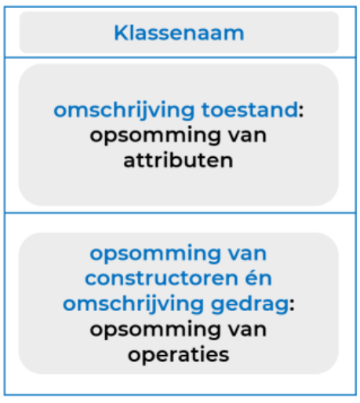

## Klassenaam

- **in het midden van het bovenste vakje van de rechthoek**
- moet **betekenisvol** zijn, de naam vertelt ons reeds heel veel over de klasse!
- gebruik steeds een **zelfstandig naamwoord**
- gebruik **steeds enkelvoud**, nooit meervoud
- de naam van een klasse **start steeds met een hoofdletter**, en staat verder in **camel case**

### voorbeeld

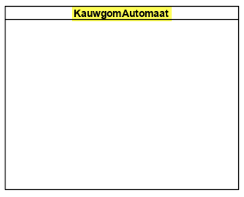


## Attributen

- Voor **elk attribuut definieer je onderstaande zaken**:
	
	- `visibiliteit`
		- Hiermee **geven we aan of andere objecten rechtstreeks dit attribuut kunnen raadplegen en/of wijzigen**. 
		- Een **attribuut mag nooit rechtstreeks wijzigbaar zijn, we schermen dit altijd af**. 
		- De **visibiliteit van een attribuut is ALTIJD private**. Later wordt dit nog duidelijker!
	
	- `naam`
		- **Altijd startend met een kleine letter**, gevolgd door **camel case**. 
		- Het is essentieel om **betekenisvolle** namen te gebruiken die **ondubbelzinnig verduidelijken** wat het attribuut voorstelt
	
	- `datatype`
		- Hiermee geven we aan **welk soort** gegevens aan dit attribuut kunnen worden toegekend 
	
	- `standaardwaarde`
		- De **waarde die het object automatisch krijgt bij instantiatie**, *dit is optioneel te vermelden*

### voorbeeld

- Elk kauwgomautomaat-object heeft een eigenschap genaamd aantalBallen.
- Dit is een private attribuut (-) wat betekent dat andere objecten dit attribuut niet kunnen raadplegen of wijzigen
- in dit attribuut kunnen we een geheel getal (integer) plaatsen (int)
- voor dit attribuut is niet expliciet een standaardwaarde gedefinieerd, de impliciete standaardwaarde voor gehele getallen is 0
- Het attribuut vergrendeld kreeg wel een standaardwaarde, namelijk true.

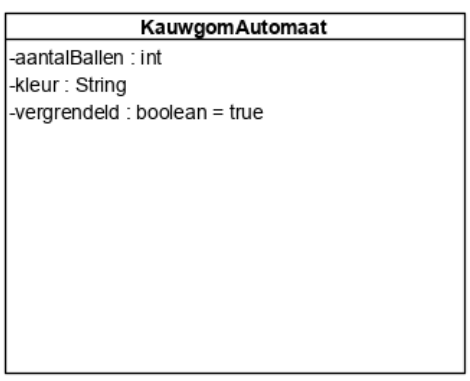

## Operaties (=methodes)

### Visibiliteit

- Hiermee geven we aan **of andere objecten beroep kunnen doen op dit gedrag**.

### Naam

- Startend met **een kleine letter**, gevolgd door **camel case**.
- **Start steeds met de stam van een werkwoord**.
- Het is essentieel om **betekenisvolle** namen te gebruiken die de intentie van de **operatie verduidelijken**.

### Parameters

- Hiermee geven we aan **welk soort gegevens moeten aangeleverd worden** om de operatie zinvol te kunnen uitvoeren.
- Een methode kan parameters hebben, maar dat **is niet verplicht**.

### Datatype terugkeerwaarde

- Hiermee wordt aangegeven **welk soort gegevens de operatie kan retourneren**.
- Wanneer een operatie wordt aangeroepen, kan deze als antwoord een resultaat naar de aanroeper retourneren.

### De getter

- Via een getter **vraag je de waarde van een welbepaald attribuut op**.
- **De signatuur** van een getter leid je automatisch af uit het te bevragen attribuut:
    - **visibiliteit**: meestal `+ (public)` (**zodat een ander object iets kan opvragen**)
    - **naam**: `getNaamBevraagdeAttribuut`
    - **parameters**: geen
    - **datatype returntype**: datatype van het bevraagde attribuut

### De setter

- Via een setter **ken je een waarde toe aan een welbepaald attribuut**.
- **De signatuur** van een setter leid je automatisch af uit het attribuut waaraan je een waarde wil toekennen:
    - **visibiliteit**:
        - `- (private)` als het puur voor **intern gebruik** in de klasse is
        - `+ (public)` **als een ander object een nieuwe waarde moet kunnen doorgeven**
        - (Of je nu kiest voor `-` of `+`, daar komen we later op terug.)
    - **naam**: `setNaamBevraagdeAttribuut`
    - **parameters**: exact 1 parameter (de waarde die je aan het attribuut wenst te geven)
    - **datatype returntype**: Altijd `void` (er wordt dus niets teruggegeven)
    - **Een setter heeft nooit returnwaarde**

### voorbeeld

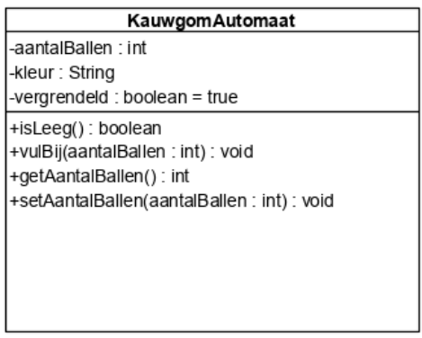

#### Voorbeeld 1: operatie `isLeeg`
- Aan elke kauwgomautomaat-object kan je vragen of die leeg is via de operatie genaamd `isLeeg`
- Dit is een publieke operatie (+) wat betekent dat andere objecten deze operatie mogen gebruiken
- Als je deze operatie gebruikt (~aanroept) hoef je geen extra informatie door te geven, de parameterlijst van de methode is leeg (). 
	- Je ziet enkel een rond haakje open en dicht staan.
- Als je deze operatie aanroept krijg je een antwoord van het type boolean

#### Voorbeeld 2: operatie `vulBij`
- Aan elke kauwgomautomaat-object kan je vragen om zich bij te vullen via de operatie genaamd `vulBij`
- Dit is een publieke operatie (+) wat betekent dat andere objecten deze operatie mogen gebruiken
-  Als je deze operatie gebruikt (~aanroept) moet je extra informatie doorgeven, namelijk het aantal ballen waarmee het kauwgomautomaat-object wordt bijgevuld.
	  - De parameterlijst bevat 1 parameter genaamd aantalBallen en deze is van het datatype int (aantalBallen: int)
- als je deze operatie aanroept krijg je geen antwoord, dit geven we aan met void

#### Voorbeeld 3: een getter `getAantalBallen`
- De getter waarmee we aan een kauwgomautomaat-object kunnen vragen wat de waarde is van zijn attribuut genaamd aantalBallen noemt `getAantalBallen`
- Een getter heeft altijd een lege parameterlijst: (). 
	- Een getter heeft nooit nood aan extra informatie, alle informatie om de operatie uit te voeren is immers aanwezig in het object!
- De getter retourneert een int. Een getter zal per definitie steeds een waarde retourneren, het datatype van deze returnwaarde is altijd gelijk aan het datatype van het bevraagde attribuut

#### Voorbeeld 4: een setter `setAantalBallen`
- De setter waarmee we een waarde kunnen toekennen aan het attribuut genaamd aantalBallen van een kauwgomautomaat-object noemt `setAantalBallen`
- Een setter heeft altijd een parameterlijst met 1 parameter: (aantalBallen: int). 
	- Het datatype van deze parameter is steeds gelijk aan het datatype van het attribuut waaraan we een waarde willen toekennen. 
	- Ook de naam van de parameter komt overeen met de naam van het attribuut waaraan we een waarde willen toekennen.
- Een setter heeft nooit returnwaarde
	- Returnwaarde is altijd `void`

## Constructoren

- De constructoren worden eveneens **in het vakje met operaties** vermeld, **al behoren constructors niet tot het gedrag van een object**.

 - Ze zijn als volgt opgebouwd
	 - `naam`: is **identiek aan de naam van de klasse**, inclusief de hoofdletter. 
		 - Merk op dat in het vak met operaties alleen de constructoren met een hoofdletter beginnen.
	- `parameters`: **hiermee kunnen we waarden aanleveren** 
		- die kunnen helpen om het geïnstantieerde object te initialiseren in een geldige toestand

#### Voorbeeld

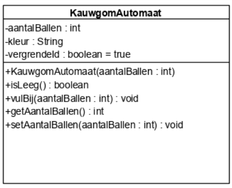

- Via de constructor genaamd `Kauwgomautomaat` kunnen we kauwgomautomaat-objecten instantiëren.
- De constructor heeft 1 parameter `(aantalBallen: int)`. 
	- Via deze parameter kunnen we aangeven hoeveel balletjes er in het nieuw Kauwgomautomaat-object zullen zitten.


## Een extraatje: overloading

- Overloading is een OO concept. 

- Je kan dit hebben **bij methodes én bij constructoren**: meerdere methodes/constructoren **in eenzelfde klasse kunnen dezelfde naam hebben** maar **dan moet de lijst van parameters wel verschillen**.

- Een lijst van parameters kan **verschillend zijn op volgende manieren**:
	- verschillend **aantal** parameters
	- verschillende **datatypes** van parameters
	- verschillende **volgorde van datatypes** van parameters

#### Voorbeeld

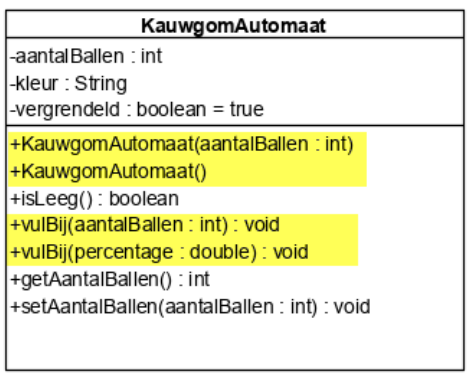

- *2 methodes met de naam* `vulBij`
	- Een kauwgomautomaat-object kan op *2 verschillende manieren bijgevuld worden*. 
		- Als de methode `vulBij` aangeroepen wordt met *een geheel getal als parameter* (bv waarde 50)
			- dan komen er 50 extra balletjes bij de huidige voorraad. 
		- Als de methode `vulBij` aangeroepen wordt een *een kommagetal als parameter* (bv 0.50), 
			- dan wordt de automaat tot de helft gevuld (voor 50%).

```java
KauwgomAutomaat ka2 = new KauwgomAutomaat();

ka2.vulBij(20); //zal als int (aantalBallen) gezien worden
ka2.vulBij(0.50); //zal als double (percentage) gezien worden
```


## Een extraatje: weergave getters en setters in UML

- **Hoe een getter en setter eruit zien, ligt per definitie vast**. 
- Daarom is het **niet altijd zinvol om deze methodes weer te geven in UML**, ze nemen nogal veel plaats in. 
- Maar het is **wel belangrijk om te weten welke getters en setters precies aanwezig zijn** in de code. 
- **Niet elk attribuut moet een getter en setter hebben**.


- **4 Manieren**
	-  Een **pijl naar rechts** (wijst naar het attribuut) 
		- je kan het attribuut een waarde geven, er is een public **setter**

	- Een **pijl naar links** (wijst weg van het attribuut)
		- je kan de waarde van het attribuut opvragen, er is een public **getter**

	- Ook de **combinatie van een pijl naar links én naar rechts** is mogelijk
		- er is dan **zowel een public getter als een public setter**

	- Zelfs een **attribuut zonder pijltjes** is theoretisch mogelijk: 
		- er is **geen public setter en geen public getter**

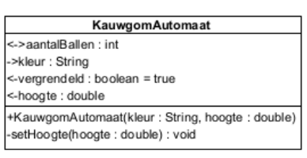

# Implementatie klasse, gedefinieerd in UML

- Eens een klasse gedefinieerd is in UML kunnen we die nu gaan **omzetten in javacode**.

- We vertrekken van onderstaande UML waarin *geen pijltjes* werden gebruikt
	- *alle methodes staan opgesomd*. 

- Van elk onderdeel bespreken we hoe dit omgezet wordt in javacode.

## De klasse

- In UML tekenen we de klasse met behulp van 1 rechthoek. 

- Deze rechthoek **vertalen we naar 1 tekstbestand** met als naam `KlasseNaam.java` met **extensie `.java`**

- **Bevat 2 belangrijke zaken**:
	- **signiatuur**: drie woorden samen vormen de signatuur (=definitie) van de klasse.
		- `public` (access modifier)
			- `public` **klasse is zichtbaar voor alle andere klassen** in de JVM.
			- Zonder access modifier (ook wel _package-private_ genoemd) (gebruiken we nog niet dus minder belangrijk)
				- Dan is de klasse alleen zichtbaar binnen hetzelfde package.
		- `class`
			- **Gereserveerd woord in java om een klasse te definiëren**.
		- `KlasseNaam`
			- **Naam van de klasse**, begint ALTIJD met een hoofdletter
	- **body** `{}`
		- Alles wat verder in de klasse gedefinieerd wordt **komt tussen de openingsaccolade en eindaccolade**  en bevat
			- `attributen`
			- `constructoren`
			- `operaties`

### Syntax

- Bestandsnaam: *KlasseNaam.java*

```java
public class KlasseNaam {

}
```
### Voorbeeld: 

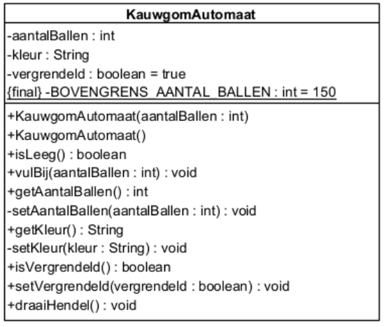

```java
public class KauwgomAutomaat {

}
```


## De attributen

- Als je meerdere attributen van hetzelfde datatype hebt, kan je een verkorte schrijfwijze gebruiken.

```java
private String kleur;
private String model;
```
- kan je noteren als
```java
private String kleur,model;
```

- In de javacode noteer je in de volgende volgorde 
	1. `toegankelijkheid`, 
	2. `datatype` 
	3. **met** `komma’s` **ertussen de namen van de** `attributen` **opsommen**.

- Een attribuut krijgt soms ook de naam instantievariabele
	- Het woord **“instantievariabele”** benadrukt dat je voor elke **instantie** (elk nieuw object) een eigen kopie van de variabele krijgt.
	- Letterlijk betekent dit eigenlijk: een variabele gekend in de volledige instantie. 
	- Elke methode die je hebt in de klasse heeft toegang tot zo’n variabele, de variabele is gekend in elke methode van die klasse.


### visibiliteit

| UML | JAVA      |
| --- | --------- |
| `+` | public    |
| `-` | private   |
| `#` | protected |
### voorbeeld

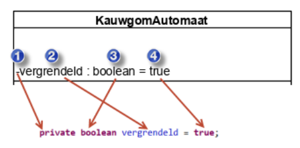

```java
private boolean vergrendeld = true;
```

## De getters en setters

Getters en setters zijn methodes met een specifieke verantwoordelijkheid, die heel vaak voorkomen.
Om de vertaalslag naar javacode te maken, volgen we eigenlijk de algemene regels om een signatuur van een methode om te zetten naar javacode.


### 1. De signatuur van een methode omzetten naar java (geldig voor zowel getter als setter)

| Algemene structuur van de UML                                   | Vertaling in java                                                       |
| --------------------------------------------------------------- | ----------------------------------------------------------------------- |
| toegankelijkheid methodenaam ( parameter:type, … ) : returntype | `toegankelijkheid returntype methodenaam ( type parameternaam, … ) { }` |
- Aandachtspunten bij het vertalen van de signatuur naar javacode:
	- In de UML **staat returntype helemaal achteraan, in javacode komt dit onmiddellijk na de toegankelijkheid**.
	
	- Bij de definitie van een parameter in de **parameterlijst is de volgorde van type en naam in javacode omgekeerd** aan de volgorde in de UML. 
		- Het dubbelpunt zie je niet terugkeren in de javacode.
	
	- De toegankelijkheid van een methode bepaalt wie met de methode aan de slag kan.
		- Toegankelijkheid in UML wordt aangegeven door 
			- **een minteken (-)**: deze methode **kan enkel intern in de klasse gebruikt worden**. 
				- Het minteken wordt vertaald door het woord `private` in javacode.

		- een **plusteken (+)**: deze methode kan **door elk object aangeroepen worden**. 
			- Het plusteken wordt vertaald door het woord `public` in javacode.

	- In de UML vind je enkel de signatuur van een methode. 
		- In de javacode vind je een vertaalslag van die signatuur maar ook de implementatie van de methode zelf. 
		- Dit noemen we **de body van de methode en die staat altijd tussen accoladetekens** ( `{ }` ). 
		- Voor elke accolade-open (` {` ) moet je een een accolade-dicht terugvinden. ( `} `)
### 2. De methode zelf implementeren

- Bij het implementeren van een methode moet je goed weten wat de functionaliteit is van deze methode.

- Wat moet er gebeuren als deze methode aangeroepen wordt?

- Wat is de reactie die je verwacht van deze methode? 
	- Die reactie moet in java instructies omgezet worden.

#### Getter

- Functionaliteit: een **getter geeft de huidige waarde van één attribuut van het object terug**.

```java
public type getNaamVanAttribuut(){
	return naamVanAttribuut;
}
```
##### Voorbeeld

- De attributen zijn reeds gedefinieerd in de klasse.
	- We pikken er een voorbeeld uit: **attribuut** `aantalBallen`. 
		- In de *klasse is dit attribuut overal beschikbaar*. 
		- Dat wil zeggen dat als je in de body van een methode - zoals hier in de getter - wil weten hoeveel balletjes aanwezig zijn in het object dat je dit attribuut kan aanspreken via de naam `aantalBallen`. 
		- De waarde van `aantalBallen` **moet teruggegeven worden in deze methode**. 
		- Om **iets terug te geven** (als antwoord), **gebruiken we in java het woord** `return`. 
		- Als we de instructie `return` tegenkomen
			- verlaten we de methode onmiddellijk
			- de **waarde die na** `return` komt **stuur je als antwoord terug**.

- De volledige instructie ziet eruit als volgt:
```java
	return aantalBallen;
```

- Dan wordt de volledige getter (signatuur + implementatie) als volgt uitgeschreven:

```java
public int getAantalBallen(){
	return aantalBallen;
}
```
#### Setter

- Functionaliteit: een setter **geeft - indien mogelijk - een nieuwe waarde aan één `attribuut` van het object**.

- De **parameter van de methode bevat de nieuwe waarde die we willen toekennen aan het overeenkomstige `attribuut`**.

- **Als een parameter én een attribuut een gelijke naam hebben**
	- Dan **maken we een onderscheid tussen deze twee variabelen door voor het attribuut** `this.` te **gebruiken**. 
	- De betekenis van this. kan je als volgt interpreteren: we nemen de variabele `naamVariablele` van het object zelf
		- **Dit is de eigenschap van het object**.

- Een parameter is maar een waarde die doorgegeven wordt, dit is geen onderdeeltje van het object zelf.

- **Pijltje NAAR het attribuut betekent er is een** `public final setter` voor dit attribuut

- Een toekenning in java ziet er algemeen uit als volgt:

```java
this.naamVanVariabele = naamVanVariabele;
```

- Na het gelijkteken komt de nieuwe waarde die we willen toekennen, dat is de waarde die doorgegeven wordt via de parameter.
##### voorbeeld

- We willen een nieuwe waarde toekennen aan ons attribuut `aantalBallen`.

```java
public void setAantalBallen(int aantalBallen){
this.aantalBallen = aantalBallen;
}
```

### 3. Controles

- De verantwoordelijkheid van een setter is een nieuwe waarde toekennen aan één attribuut, MAAR alleen maar als dit een toegelaten waarde is.

- **In de setter moeten we dus testen of de nieuwe waarde die binnenkomt via de parameter, wel een geldige waarde is**. 
	- Enkel en alleen als het een geldige waarde is zal die waarde toegekend worden aan het attribuut.

- **Om die controles te schrijven kan je alle controlestructuren gebruiken die je leerde kennen in hoofdstuk 2**. 

- **Om te vermijden dat we vaste waarden in de code moeten zetten**
	- maken we gebruik van een zelfgedefinieerde **constante** (**final**) `CONSTANTE_DIE_GEBRUIKT_WORDT_VOOR_CONTROLE`


#### voorbeeld

- Een negatieve waarde voor dit attribuut, heeft helemaal geen betekenis. 
- In het kauwgomautmaat kunnen maximaal 149 balletjes, dan is het volledig gevuld. 
	- Dus alle waarden die groter zijn, kunnen ook niet.

```java
private final static int BOVENGRENS_AANTAL_BALLEN = 150;

private void setAantalBallen(int aantalBallen) {
	if (aantalBallen >= 0 && aantalBallen < BOVENGRENS_AANTAL_BALLEN)
		this.aantalBallen = aantalBallen;
	}
```

### 4. Opgelet met public setter

- Een setter kan afhankelijk van de situatie public of private zijn. 

- Als een setter private is dan kan die setter alleen maar vanuit de klasse zelf aangeroepen worden.
	- **Principle of Encapsulation**

- Dit betekent bijvoorbeeld, dat de constructor van de klasse gebruik kan maken van de setter.

- *Soms is er functionaliteit nodig dat een ander object - van buiten af dus, die setter moet kunnen aanroepen*. 
	- Dan kunnen we die setter niet afschermen, maar moeten we die toegankelijk maken voor het andere object. 
	- Dan wordt de setter bijvoorbeeld public.
	
- **Public setters die ook aangeroepen worden vanuit de constructor kunnen later voor problemen zorgen bij overerving** (zie hoofdstuk 7). 

- Om deze **problemen te voorkomen maken we** een **public setter altijd final**.
	-  `final` **betekent** in Java: “Deze methode mag **niet meer worden overschreven in een subklasse**.”
	- Dan ben je zeker dat de constructor **altijd** zijn eigen code in de setter aanroept

#### voorbeeld

```java
public final void setVergrendeld(boolean vergrendeld) {
	this.vergrendeld = vergrendeld;
}
```


### 5. Voorbeelden

- In de voorbeelden hieronder zie je de methode `isVergrendeld`. 
- De implementatie ziet eruit als de implementatie van een getter, de waarde van het attribuut vergrendeld wordt teruggegeven. 
- De naam van een getter wordt altijd samengesteld door get + naam van het attribuut.
- Op deze regel is **één uitzondering, nl. als het attribuut van het datatype boolean is**. 
	- **Dan wordt in plaats van** `get` **begonnen met** `is`.

```java
public int getAantalBallen() {
	return aantalBallen;
}

private final static int BOVENGRENS_AANTAL_BALLEN = 150;

private void setAantalBallen(int aantalBallen) {
	if (aantalBallen >= 0 && aantalBallen < BOVENGRENS_AANTAL_BALLEN)
	this.aantalBallen = aantalBallen;
}

public String getKleur() {
	return kleur;
}

private void setKleur(String kleur) {
	this.kleur = kleur;
}

public boolean isVergrendeld() {
	return vergrendeld;
}

public final void setVergrendeld(boolean vergrendeld) {
	this.vergrendeld = vergrendeld;
}
```

## De constructoren

- Als je **zelf geen constructor definieert**, is er sowieso een **defaultconstructor** beschikbaar.
	- Dit wil zeggen dat je de constructor zonder parameters kan aanroepen. 
	- Die zal alle attributen instellen op hun defaultwaarde volgens datatype of de initiële waarde die gedefinieerd staat bij de declaratie van het attribuut. 
	- Onthoud dat van zodra er een constructor gedefinieerd wordt, die "automatische" defaultconstructor verdwijnt

- Een **constructor bestaat net zoals methodes uit een signatuur**, vastgelegd in de UML, én een implementatie.

- De implementatie **zorgt ervoor dat er een nieuw object wordt aangemaakt** in een geldige toestand.

- Een **geldige toestand betekent dat elk attribuut een geldige, toegelaten waarde moet krijgen**.
	- Als parameter de controle van de setter niet doorkomt:
		- Het attribuut op een defaultwaarde zal ingesteld worden.
		- De defaultwaarde wordt bepaald door het datatype van het attribuut.

- De **parameters van een constructor dienen om attributen correct te kunnen initialiseren**.

- De constructor met de meeste parameters definiëren en de andere constructors naar laten verwijzen met `this`;
### default waarde datatype

| datatype | default waarde attribuut |
| -------- | ------------------------ |
| boolean  | false                    |
| byte     | 0                        |
| short    | 0                        |
| int      | 0                        |
| long     | 0                        |
| char     | 0                        |
| float    | 0.0                      |
| double   | 0.0                      |
### voorbeeld constructor

```java
public KauwgomAutomaat(int aantalBallen) {
	setAantalBallen(aantalBallen);
	setKleur("rood");
}

public KauwgomAutomaat() {
	this(0);
}
```

## Andere methodes

- Elke methode heeft een signatuur en een implementatie.

- De algemene regel om de signatuur, gedefinieerd in UML, te vertalen naar javacode wordt uitgelegd bij het onderdeel "getters en setters". 
	- Diezelfde regel kan je voor elke andere methode volledig volgen: zie getters en setters

- Om de methode te implementeren moet je heel goed de functionaliteit van de methode kunnen verwoorden. 

- Daarna probeer je die om te zetten naar javacode en daarvoor kan je alle bouwstenen die je zag in hoofdstuk 2 gebruiken.

### voorbeeld

#### Voorbeeld 1

- De methode `isLeeg` moet antwoord geven op de vraag of dit `KauwgomAutomaat`-object leeg is.
- Als die vraag binnenkomt bij het object, dan moet het object eigenlijk alleen maar controleren of zijn attribuut `aantalBallen` gelijk is aan 0 of niet. 
- Het resultaat van deze vergelijking is meteen ook het antwoord dat de methode moet terugsturen.

```java
public boolean isLeeg() {
	return aantalBallen == 0;
}
```
#### Voorbeeld 2

- De methode `vulBij` krijgt een `aantalBallen` door via de parameter. 
- Dit is het `aantalBallen` dat we willen toevoegen aan het object. 
- Het bijvullen kan alleen maar als het kauwgomautomaat NIET vergrendeld is.
- Bijvullen betekent dan dat het doorgegeven aantal bovenop het huidige aantal komt.
- Die som wordt het nieuwe `aantalBallen` in het automaat, tenzij we het maximum overschrijden.
- Als het maximum overschreven zou worden, verandert er niets. 
- Het object wordt niet bijgevuld.
- Deze functionaliteit bekomen we door de setter aan te roepen - deze controleert al op die maximumgrens - en we geven de som van het huidige `aantalBallen` met de extra ballen die toegevoegd zullen worden door.

```java
public void vulBij(int aantalBallen) {
	if (!vergrendeld && aantalBallen >=0)
	setAantalBallen(this.aantalBallen + aantalBallen);
}
```

#### Voorbeeld 3

De methode draaiHendel zal wanneer het kauwgomautomaat NIET vergrendeld is én er nog ballen zijn (dus niet leeg) een balletje uit het automaat halen.

```java
public void draaiHendel(){
	if(!vergrendeld && !isLeeg())
	aantalBallen--;
}
```

## Voorbeeld UML met pijltjes bij attributen en bijhorende code

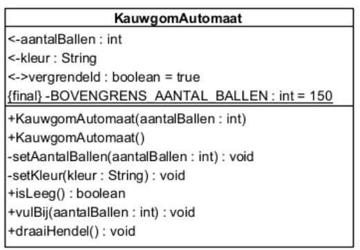

```java
public class KauwgomAutomaat {

    // --------------------------------------------------
    // 1. CONSTANTEN
    // --------------------------------------------------
    private static final int BOVENGRENS_AANTAL_BALLEN = 150;

    // --------------------------------------------------
    // 2. ATTRIBUTEN
    // --------------------------------------------------
    private int aantalBallen;
    private String kleur;
    private boolean vergrendeld = true;

    // --------------------------------------------------
    // 3. CONSTRUCTORS
    // --------------------------------------------------
    public KauwgomAutomaat(int aantalBallen) {
        setAantalBallen(aantalBallen);
        setKleur("rood");
    }

    public KauwgomAutomaat() {
        this(0);
    }

    // --------------------------------------------------
    // 4. GETTERS & SETTERS
    // --------------------------------------------------
    public int getAantalBallen() {
        return aantalBallen;
    }

    /**
     * Setter is private, want we willen dit enkel vanuit
     * de klasse zelf wijzigen (o.a. via de constructor).
     */
    private void setAantalBallen(int aantalBallen) {
        if (aantalBallen >= 0 && aantalBallen < BOVENGRENS_AANTAL_BALLEN) {
            this.aantalBallen = aantalBallen;
        }
    }

    public String getKleur() {
        return kleur;
    }

    private void setKleur(String kleur) {
        this.kleur = kleur;
    }

    public boolean isVergrendeld() {
        return vergrendeld;
    }

    /**
     * Deze setter is public en final om te voorkomen dat
     * een subklasse deze methode kan overschrijven,
     * wat problemen kan geven als de constructor deze ook oproept.
     */
    public final void setVergrendeld(boolean vergrendeld) {
        this.vergrendeld = vergrendeld;
    }

    // --------------------------------------------------
    // 5. OVERIGE METHODEN
    // --------------------------------------------------
    public boolean isLeeg() {
        return aantalBallen == 0;
    }

    public void vulBij(int aantalBallen) {
        if (!vergrendeld && aantalBallen >= 0) {
            setAantalBallen(this.aantalBallen + aantalBallen);
        }
    }

    public void draaiHendel() {
        if (!vergrendeld && !isLeeg()) {
            aantalBallen--;
        }
    }

}
```

# Bouwen van een applicatie m.b.v. die domeinklasse

- Een applicatie bouwen met behulp van die domeinklasse betekent eigenlijk dat we een uitvoerbaar programma (=applicatie) zullen bouwen.
- hierbij zullen we gebruik maken van objecten van de domeinklasse `KauwgomAutomaat`

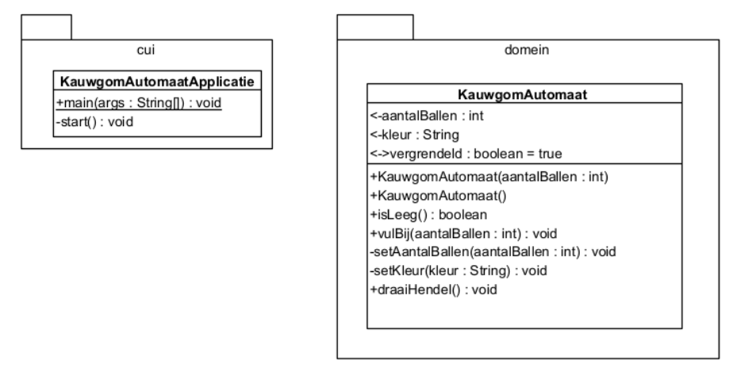

## UML van de applicatie

- In deze applicatie hebben we nu 2 klassen
	- de **klasse** `KauwgomAutomaat` 
	- maar aangezien we ook een uitvoerbare applicatie nodig hebben, hebben we ook een **klasse** met een `main`-methode nodig.

- De klasse `KauwgomAutomaatApplicatie` bevat 
	- de flow van ons programma 
		- zal de nodige objecten aanmaken 
		- gegevens afdrukken op het scherm zodat we iets te zien krijgen

- **Om structuur in onze applicatie te stoppen gaan ze elke klasse in een aparte package plaatsen**. 
	- Een **package is een groepering van klassen met gelijkaardige functionaliteiten**.
	- De **naam van een package wordt in java altijd met kleine letters** geschreven.

- De twee packages die hier gebruikt worden zijn `cui` en `domein`.

	- `cui` staat voor console user interface. 
		- Deze package verzamelt klassen die "**communiceren**" met de gebruiker.
		- In ons concrete geval hier bestaat deze communicatie enkel uit gegevens afdrukken op het scherm.
		- Wat op het scherm afgedrukt wordt, komt in de console (cfr schermonderdeel in Eclipse). 
		- Naast een console user interface heb je bv. ook een grafische user interface.
		- Hier hoort `KauwgomAutomaatApplicatie` thuis
	
	- De package `domein` zal de business logica van onze applicatie bevatten.
		- Later komen we daar zeker nog op terug
		- hier hoort dus onze domeinklasse `KauwgomAutomaat` thuis.

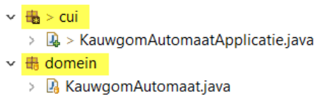

## Implementatie van de domeinklasse KauwgomAutomaat

- De code van deze klasse werd al volledig besproken in punt 5 van dit hoofdstuk. 
- Maar doordat de klasse nu in **de package domein geplaatst wordt, vind je nog 1 extra instructie in deze klasse**.

```java
package domein;
```

- **Deze lijn code is de allereerste instructie die je terugvindt in de code**, nog vóór de definitie van de klasse. 
- Let er ook op dat **ook deze instructie afgesloten wordt met een puntkomma**.

- De volledige code van de klasse `KauwgomAutomaat` ziet er dus uit als volgt:

```java
package domein;

public class KauwgomAutomaat {

    private static final int BOVENGRENS_AANTAL_BALLEN = 150;

    private int aantalBallen;
    private String kleur;
    private boolean vergrendeld = true;

    public KauwgomAutomaat(int aantalBallen) {
        setAantalBallen(aantalBallen);
        setKleur("rood");
    }

    public KauwgomAutomaat() {
        this(0);
    }

    public int getAantalBallen() {
        return aantalBallen;
    }

    private void setAantalBallen(int aantalBallen) {
        if (aantalBallen >= 0 && aantalBallen < BOVENGRENS_AANTAL_BALLEN) {
            this.aantalBallen = aantalBallen;
        }
    }

    public String getKleur() {
        return kleur;
    }

    private void setKleur(String kleur) {
        this.kleur = kleur;
    }

    public boolean isVergrendeld() {
        return vergrendeld;
    }

    public final void setVergrendeld(boolean vergrendeld) {
        this.vergrendeld = vergrendeld;
    }

    public boolean isLeeg() {
        return aantalBallen == 0;
    }

    public void vulBij(int aantalBallen) {
        if (!vergrendeld && aantalBallen >= 0) {
            setAantalBallen(this.aantalBallen + aantalBallen);
        }
    }

    public void draaiHendel() {
        if (!vergrendeld && !isLeeg()) {
            aantalBallen--;
        }
    }
}

```

## Testen van de domeinklasse

- Bij het implementeren van een applicatie **werken we eerst de domeinklasse uit en daarna de applicatieklasse**.
- Eens je de code van die **domeinklasse** afgewerkt hebt, wil je uiteraard graag **testen**
	- of die code werkt
	- of je nergens foutjes gemaakt hebt bij het implementeren.
- Aangezien we deze klasse niet kunnen uitvoeren - er is GEEN mainmethode - kunnen we niet zien of alles naar behoren werkt. 
- Om zeker te zijn dat alle functionaliteit in de domeinklasse correct werkt, gebruiken we een **klasse "`test`"**.

- **JUnit 5 is een testframework voor java-ontwikkelaars**. Daar maken we gebruik van.

- Per domeinklasse die getest moet worden heb je een testklasse. 
	- Deze worden allemaal verzameld in de package `testen`.
	- Om **gebruik te kunnen maken van dit testframework voegen we ook een extra bibliotheek (JUnit5) toe aan het project**.

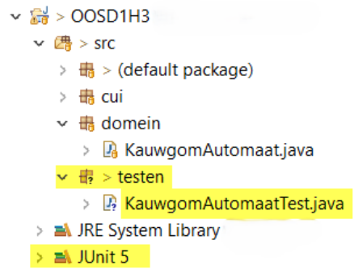

- **Als alle testen groen kleuren, weet je dat de domeinklasse volledig werkt. Dan kan je starten aan de applicatieklasse**.

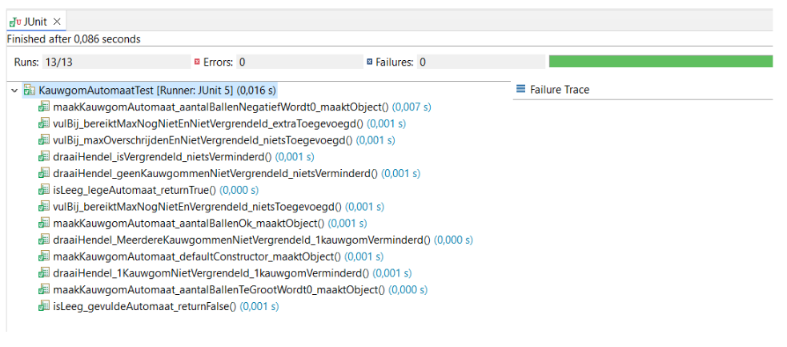

## Implementatie van de applicatieklasse KauwgomAutomaatApplicatie

### Functionaliteit van de applicatie

- Maak 2 kauwgomautomaten aan: de ene automaat is een rode kauwgomautomaat die momenteel nog leeg is. De andere kauwgomautomaat is ook rood maar is al onmiddellijk gevuld met 50 balletjes.
- Druk van beide kauwgomautomaten de kleur én het aantal balletjes af.
- Ontgrendel de eerste kauwgomautomaat.
- Vul die bij met 20 balletjes.
- Vergrendel de kauwgomautomaat opnieuw.
- Druk van beide kauwgomautomaten de kleur én het aantal balletjes af.
- Vul diezelfde kauwgomautomaat nog eens bij met 75 balletjes (in vergrendelde toestand).
- Druk van beide kauwgomautomaten de kleur én het aantal balletjes af. Wat stel je vast?
- Draai aan de hendel van de eerste kauwgomautomaat.
- Druk van de eerste kauwgomautomaat het aantal balletjes af. Wat stel je vast?
- Ontgrendel de eerste kauwgomautomaat.
- Draai aan de hendel van de eerste kauwgomautomaat.
- Druk van de eerste kauwgomautomaat het aantal balletjes af. Wat stel je vast?

### Referentievariabele

Om goed te begrijpen wat een referentievariabele eigenlijk is, kijken we eerst nog eens naar het begrip variabele.

Declaratie van een variabele = het reserveren van een plekje in het geheugen, je geeft een naam aan het plekje en in Java leg je vast welk soort data je kan bewaren met dat plekje.

**Voorbeeld 1: variabele van een primitief datatype**  
Eens we dat plekje hebben in het geheugen, kunnen we nu iets bewaren in deze variabele. Via deze variabele kunnen we nu "werken" met deze waarde. In het geval van een getal, kan je bijvoorbeeld een berekening uitvoeren:

```java
getal *= 2;
```


**Voorbeeld 2: variabele voor een object (= referentievariabele)**  
We hebben nu dus ook een plekje in het geheugen waarmee we iets kunnen bewaren. Dit plekje kan nu verwijzen naar een `KauwgomAutomaat`-object.

Aan de rechterzijde van de toekenning zie je dat de constructor aangeroepen wordt voorafgegaan door het woord `new`. Nu wordt dus een object aangemaakt. In dat object (voorgesteld door de ovaal) zitten alle attributen met hun waarde. De toekenning zorgt ervoor dat ons gedeclareerde plekje in het geheugen verwijst (refereert) naar het object, ergens anders in het geheugen. Vandaar dat we spreken over een referentievariabele.

Via deze referentievariabele kunnen we nu praten/communiceren met het object. We noteren dat met de puntnotatie:

```java
boolean status = ka1.isVergrendeld();
```

### Applicatieklasse

```java
package cui;
import domein.KauwgomAutomaat;

public class KauwgomAutomaatApplicatie {
    public static void main(String[] args) { ①
        KauwgomAutomaatApplicatie kaa = new KauwgomAutomaatApplicatie();
        kaa.start();
    }

    private void start() {
        // maken van 2 objecten KauwgomAutomaat
        KauwgomAutomaat ka1 = new KauwgomAutomaat(); ②
        KauwgomAutomaat ka2 = new KauwgomAutomaat(50); ③

        // afdrukken van kleur en aantal balletjes ④
        System.out.printf("De eerste kauwgomautomaat is %s van kleur en bevat %d balletjes.%n",
                          ka1.getKleur(), ka1.getAantalBallen());
        System.out.printf("De tweede kauwgomautomaat is %s van kleur en bevat %d balletjes.%n",
                          ka2.getKleur(), ka2.getAantalBallen());

        // ontgrendelen
        ka1.setVergrendeld(false); ⑤

        // vullen
        ka1.vulBij(20); ⑥

        // vergrendelen
        ka1.setVergrendeld(true); ⑦

        // afdrukken van kleur en aantal balletjes
        System.out.printf("De eerste kauwgomautomaat is %s van kleur en bevat %d balletjes.%n",
                          ka1.getKleur(), ka1.getAantalBallen());
        System.out.printf("De tweede kauwgomautomaat is %s van kleur en bevat %d balletjes.%n",
                          ka2.getKleur(), ka2.getAantalBallen());

        // vullen
        ka1.vulBij(75); ⑧

        // afdrukken van kleur en aantal balletjes
        System.out.printf("De eerste kauwgomautomaat is %s van kleur en bevat %d balletjes.%n",
                          ka1.getKleur(), ka1.getAantalBallen()); ⑨
        System.out.printf("De tweede kauwgomautomaat is %s van kleur en bevat %d balletjes.%n",
                          ka2.getKleur(), ka2.getAantalBallen());

        // draai hendel
        ka1.draaiHendel(); ⑩

        // afdrukken van aantal balletjes
        System.out.printf("De eerste kauwgomautomaat bevat na draaien aan de hendel %d balletjes.%n",
                          ka1.getAantalBallen()); ⑪

        // ontgrendelen
        ka1.setVergrendeld(false); ⑫

        // draai hendel
        ka1.draaiHendel();

        // afdrukken van aantal balletjes
        System.out.printf("De eerste kauwgomautomaat bevat na draaien aan de hendel én ontgrendelen %d balletjes.%n",
                          ka1.getAantalBallen()); ⑬
    }
}
```


1. Bij het opstarten van een applicatie wordt altijd gezocht naar die speciale `main`-methode. Alle functionaliteit die we willen uitwerken komt dus in die `main`-methode te staan.
   
2. Allereerst willen we een object maken dat rood is en leeg. Hiervoor hebben we een default constructor (constructor zonder parameters) gemaakt in onze domeinklasse. Dus daar willen we nu gebruik van maken. Via de defaultconstructor maken we een nieuw object aan en we kennen dit toe aan de referentievariabele `ka1`.
   
3. We maken nog een tweede object van `KauwgomAutomaat`. Hier is de vraag om ervoor te zorgen dat er direct 50 balletjes voorradig zijn, daarom maken we gebruik van de constructor met 1 parameter. De waarde 50 wordt doorgegeven als concrete waarde voor de parameter, de kleur wordt terug automatisch ingesteld op "rood". Dit tweede object houden we bij met behulp van de referentievariabele `ka2`.
   
4. De kleur en het aantal balletjes van elk object drukken we af op het scherm. De instructies in Java om af te drukken werden vroeger al besproken. We kiezen hier voor de `printf`-methode. De waarden van het attribuut `kleur` en het attribuut `aantalBallen` zitten in de twee objecten. Om aan die waarden te geraken zullen we moeten communiceren met deze objecten. Dat gebeurt via de referentievariabele. Met de puntnotatie kunnen we toegankelijke methodes via de referentievariabele aanroepen. Aangezien we de waarde van attributen willen kennen, zullen we de bijhorende getters gebruiken. Bijvoorbeeld: `ka1.getKleur()`. Deze getter heeft als returntype een `String`. Dus je krijgt een stuk tekst terug als antwoord op de vraag. Dat stukje tekst wordt dan via de `printf`-methode netjes op het scherm afgedrukt.
   
5. Om een kauwgomautomaat te ontgrendelen moeten we een nieuwe waarde kunnen geven aan het attribuut `vergrendeld` dat in het object aanwezig is. Hiervoor is in de domeinklasse een public setter voorzien. Via de parameter van die setter kunnen we een nieuwe waarde doorgeven. Om die setter aan te roepen werken we weer via de referentievariabele en de puntnotatie. Op deze manier kunnen we communiceren met het object.
   
6. Om een kauwgomautomaat bij te vullen vinden we ook een methode in de klasse `KauwgomAutomaat`. Als we een object hebben van de klasse kunnen we dan ook die methode aanroepen. Dus vanuit de applicatie roepen we via de referentievariabele de methode `vulBij` aan. Deze methode heeft 1 parameter. Als we de methode aanroepen, moeten we een waarde doorgeven voor die parameter (een getal). Als deze instructie uitgevoerd wordt, doorlopen we de implementatie van `vulBij` in de klasse `KauwgomAutomaat`.
   
7. Via de referentievariabele `ka1` roepen we de methode `setVergrendeld` aan en we geven als waarde voor de parameter `true` door. Op deze manier wordt de kauwgomautomaat terug vergrendeld. Als we daarna terug de kleur en het `aantalBallen` afdrukken, zien we inderdaad dat bij de eerste kauwgomautomaat balletjes zijn bijgekomen, de tweede kauwgomautomaat is niet gewijzigd.
   
8. Op dezelfde manier proberen we nu nog eens extra balletjes toe te voegen aan de kauwgomautomaat. Maar momenteel is deze vergrendeld. Dus er zou niets mogen bijkomen…
   
9. Bij het afdrukken van het `aantalBallen` van beide kauwgomautomaten zien we inderdaad dat er geen balletjes toegevoegd werden bij de laatste keer bijvullen.
   
10. Via de referentievariabele `ka1` roepen we de methode `draaiHendel` aan.

11. Bij het afdrukken van het `aantalBallen` van de eerste kauwgomautomaat zien we dat er geen balletjes verdwenen zijn; dit omdat de automaat vergrendeld is.

12. We ontgrendelen de eerste automaat en draaien vervolgens nog eens aan de hendel.

13. Bij het afdrukken van het `aantalBallen` van de eerste kauwgomautomaat zien we dat er nu wel een balletje verdwenen is.


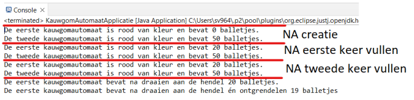