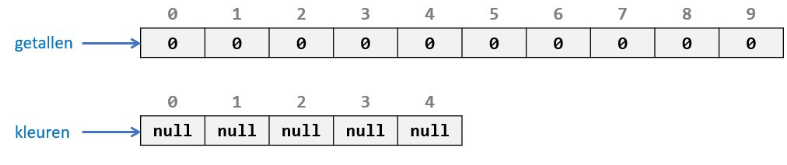
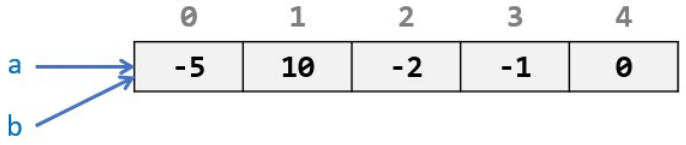
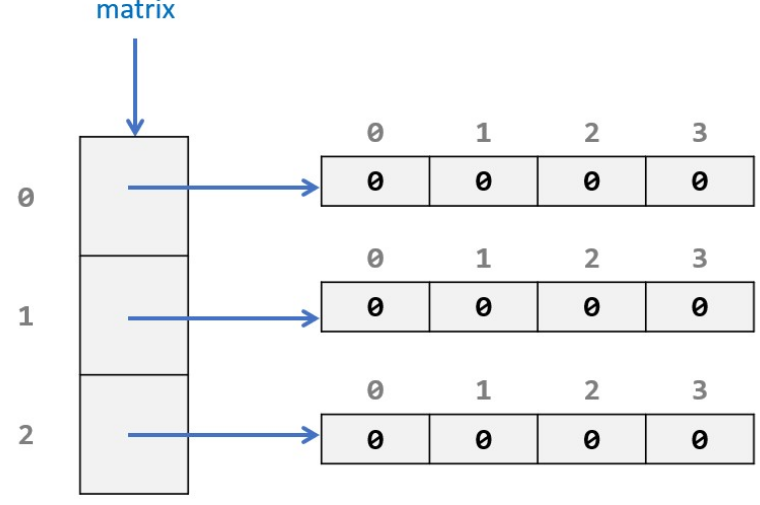
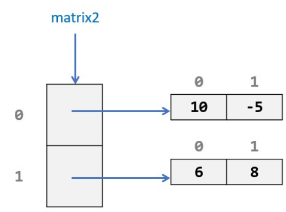

# Doelstellingen

- een **eendimensionale** array **te declareren en te initialiseren** in Java
- met een **eendimensionale array te werken** in Java
- een **enhanced for-statement** te gebruiken in Java
  
- een t**weedimensionale array te declareren en te initialiseren** in Java
- met een **tweedimensionale array te werken** in Java
  
- het **verschil tussen een ArrayList en een array** te kennen
- een **ArrayList te declareren en te initialiseren** in Java
- met een **ArrayList te werken** in Java

# Inleiding

- Bij het ontwikkelen van software krijgen we echter dikwijls te maken met groepen, verzamelingen, van gegevens.

- In dit hoofdstuk maken we kennis met datastructuren waarin meer dan één gegeven kan bewaard worden. 
- Alle gegevens binnen de verzamelingen die we behandelen zijn homogeen: ze zijn allemaal van hetzelfde type. 
- Zo gaan bijvoorbeeld alle elementen in een verzameling 
	- van hetzelfde primitieve type zijn
	- of zullen alle elementen referenties zijn naar objecten van éénzelfde klasse.

# Arrays

- **Een `array` is een referentie naar een `container`**, **die een verzameling van gelijk getypeerde gegevens bevat**. 

- **De container heeft een vaste grootte**. 

- De **afzonderlijke gegevens in de array noemen we `elementen`**. 

- **Elk element kan benaderd worden via zijn positie in de container**, deze positie noemen we de `index` van het element.

## Declaratie & instantiatie

### Declaratie

- Om een array te declareren zetten we ná het datatype van de elementen rechte haakjes: `[]`

```java
int[] getallen; // de variabele getallen kunnen we gebruiken om een container te maken waarin we meerdere integers kunnen bijhouden
```


### Instantiatie

- **Een array is een verwijzing naar een object** (een container) die de verzameling aan gegevens zal bevatten.
	- Bij **enkel declaratie is de array variabele een referentie variabele**.
	
- Het **object** die de verzameling met gegevens zal bevatten **moeten we instantiëren**.
	- We kunnen hiervoor g**ebruik maken van de** `new` **operator**
	- **Bij deze instantiatie moet je de grootte van de verzameling vastleggen**
		- Hiervoor gebruiken we weer rechte haakjes `[]`
		- waartussen we nu het aantal elementen specificeren

- **Na instantiatie bevat de container direct het gevraagde aantal elementen** (variabelen) 
	- **Elke variabele werd hierbij geïnitialiseerd op zijn default waarde**.

- Aparte declaratie en initialisatie
```java
int[] getallen; // Declaratie
getallen = new int[10]; // Initialisatie: via de variabele getallen hebben we toegang tot een verzameling van 10 int variabelen
```

- declaratie en initialisatie gecombineerd
```java
String[] kleuren = new String[5]; // Declaratie en initialisatie: via de variabele kleuren hebben we toegang tot een verzameling van 5 String variabelen
```

#### default waarde datatype

| datatype | default waarde attribuut |
| -------- | ------------------------ |
| boolean  | false                    |
| byte     | 0                        |
| short    | 0                        |
| int      | 0                        |
| long     | 0                        |
| char     | 0                        |
| float    | 0.0                      |
| double   | 0.0                      |
| String   | null                     |

#### index

- De elementen in de container zijn geordend.
- Elk element een volgnummer, een positie. 
- Dit is de index en deze start steeds vanaf 0.



## Werken met arrays

### Index en meer rechte haakjes…

- Om **één specifiek element uit een array te halen** maken we gebruik van
	- de **`naam` van de array variabele**
	- **gevolgd door rechte haakjes** `[]` **waartussen we de** `index` **van het gewenste element** plaatsen.
		- De index die we tussen de rechte haakjes plaatsen **mag ook een expressie zijn met een int resultaat**.
		- De **index begint met** index`[0]`
			- Merk op dat we dikwijls een offset van 1 moeten gebruiken indien we willen communiceren over de elementen in een array. 
				- In natuurlijke taal praten we over het eerste, het tweede, … element in een geordende verzameling
				- terwijl dit in de array elementen zijn met index 0, index 1, …

```java
System.out.printf("Het vierde getal in de array is %d.", getallen[3]);
// Uitvoer:
// Het vierde getal in de array is 0.
```


```java
int index = 3;
System.out.printf("Het %d-de element in de array is %d.", index + 1, getallen[index]);
```


### assignment

- De elementen van een array zijn volwaardige variabelen. 
- Alles wat we reeds leerden in vorige hoofdstukken in verband met variabelen kunnen we nu dus ook toepassen op elementen van een array.

```java
getallen[3] = 20;
```

- de array variabele zelf werkelijk een referentie bevat naar de verzameling en dat het dus ook mogelijk is om met die referentie te werken

```java
int[] a = {-5, 10, -2, -1, 0};
int[] b = a;
```




### length

- Het **bereik van de index**
	- de **kleinst mogelijke index** die we kunnen gebruiken is `0` 
	- de **grootst mogelijke index** steeds gelijk is aan `het aantal elementen in de array - 1`
		- het aantal elementen in de array - 1 drukken we uit met `array.lenth - 1`

- **Het aantal elementen dat een array bevat kan je steeds achterhalen via de `length` property**.
	- **dit is een property, je maakt geen gebruik van ronde haakjes**
	- geldige indexen voor een array liggen in het `interval [0, array.length -1]`
	- Om **het aantal karakters in een String te bepalen gebruik je de methode `length()`**.
		-  **dit is een methode aanroep, je moet gebruik maken van ronde haakjes**

#### Voorbeeld

```java
private void toonGetallen() {

	SecureRandom sr = new SecureRandom();
	int[] getallen;
	
	if (sr.nextBoolean())
		getallen = new int[] { -10, -30, 2, 20, 0, 30, 0, 0, 0, 70 };
	else
		getallen = new int[] { 12, 8, 20 };
	System.out.printf("De array bevat %d elementen:%n", getallen.length);
	for (int index = 0; index < getallen.length; index++) {
		System.out.printf("- op index %d zit element %d.%n", index, getallen[index]);
	}
}
```

Door secure random kunnen we 2 outputs hebben:

- Output 1 bij `sr.nextBoolean() = true`:
```
De array bevat 10 elementen:
- op index 0 zit element -10.
- op index 1 zit element -30.
- op index 2 zit element 2.
- op index 3 zit element 20.
- op index 4 zit element 0.
- op index 5 zit element 30.
- op index 6 zit element 0.
- op index 7 zit element 0.
- op index 8 zit element 0.
- op index 9 zit element 70.
```

- Output 2 bij `sr.nextBoolean() = false`
```
De array bevat 3 elementen:
- op index 0 zit element 12.
- op index 1 zit element 8.
- op index 2 zit element 20.
```

### De klassieke for-lus en de enhanced for-lus

#### Bij een klasieke `for-lus`

- klassieke for-lus geeft je **meer controle**

- Moeten we om de array te doorlopen
	1. **een teller** (genaamd index) initialiseren op 0
	2. bij **elke iteratie met 1 verhogen**
	3. bij **elke iteratie testen of die kleiner is dan de lengte van de array**

- We kunnen hier ook een variatie op maken 
	- bv: starten vanaf `index[3]`
	- bv: grotere stappen nemen
	- bv: eerder stoppen

- **elementen van de array waarover je itereert wel wijzigen**

```java
double[] getallen = { 23.12, 2.56, 88, 97.4 };
double som = 0;

for (int index = 0; index < getallen.length; index++) {
	som += getallen[index];
}

System.out.printf("De som is %.3f", som); // De som is 211,080
```

#### Bij een enhanced `for-lus`

-  De enhanced for-lus laat ons toe om op een eenvoudige, simpele manier over een array te itereren.
		  (KISS-principe: Keep It Short & Simple)

- Hier kunnen we het bijhouden van de index aan de enhanced for-lus overlaten
	1. **declareren een `variabele`** die telkens een copy van een element van de array zal bevatten
	2. na de `:` **geven we de naam van de `array` mee** die we willen itereren 
		- De lus **wordt voor elk element** van de array **uitgevoerd**. 
		- In de body van de lus bevat de variabele getal telkens een copy van een element van de array 
			- Bij de eerste iteratie is dat een copy van het element op index 0
			- bij de tweede iteratie een copy van het element op index 1
			- enzoverder…

- in de body van de enhanced for-lus heb je **geen toegang tot de index van het 'huidig' element**
	- indien je die index nodig hebt in de body zal je toch liever een klassieke for-lus willen gebruiken

- **elementen van de array waarover je itereert niet wijzigen** bij enhanced for-lus
	- in de body beschik je in de lus 
		- variabele enkel over een copy van een element uit de array
		- niet het element zelf

```java
double[] getallen = { 23.12, 2.56, 88, 97.4 };
double som = 0;

for (double getal : getallen) {
	som += getal;
}

System.out.printf("De som is %.3f", som); // De som is 211,080
```

## Enkele uitgewerkte voorbeelden


### Voorbeeld – Histogram

In dit voorbeeld gaan we de verdeling van examenresultaten grafisch weergeven aan de hand van
een staafdiagram. We vertrekken van een array die gehele waarden bevat. Elke waarde in die array
stelt het aantal studenten voor die een resultaat behaalde in een bepaald interval. Op index 0
vinden we het aantal studenten die een resultaat in het interval `[0, 9]` behaalden, op index 1
vinden we het aantal studenten die een resultaat in het interval `[10, 19]` behaalden, en dit gaat
zo verder tot we uiteindelijk op de laatste index het aantal studenten vinden die het maximum
behaalden (de laatste index is een uitzondering daar het niet over een interval maar over 1 enkel
resultaat, het maximum, gaat).

#### Voorbeeld voor array met verdeling

```java
int[] verdeling = {5, 8, 2};
````

**Gewenste uitvoer**:

```
Verdeling examenresultaten:
00-09: *****
10-19: ********
1020: **
```

#### Voorbeeld voor array met verdeling

```java
int[] verdeling = {8, 0, 6, 7, 11, 9, 13, 5, 17, 2, 1};
```

**Gewenste uitvoer**:

```
Verdeling examenresultaten:
00-09: ********
10-19:
20-29: ******
30-39: *******
40-49: ***********
50-59: *********
60-69: *************
70-79: *****
80-89: *****************
90-99: **
100: *
```

#### Het programma

```java
public class Staafdiagram {
    public static void main(String[] args) {
        new Staafdiagram().toonStaafdiagram();
    }

    private void toonStaafdiagram() {
        int[] verdeling = { 8, 0, 6, 7, 11, 9, 13, 5, 17, 2, 1 };
        System.out.println("Verdeling examenresultaten:");

        for (int index = 0; index < verdeling.length; index++) { ①
            if (index == verdeling.length - 1) ②
                System.out.printf("%5d: ", index * 10);
            else
                System.out.printf("%02d-%02d: ", index * 10, index * 10 + 9);

            tekenStaafje(verdeling[index]); ③
            System.out.println();
        }
    }

    private void tekenStaafje(int lengte) {
        for (int sterretje = 1; sterretje <= lengte; sterretje++) {
            System.out.print("*");
        }
    }
}
```

① Voor elk element in de array moeten we een lijn van het staafdiagram genereren.  
② De laatste index (die we kennen via de `length` property) krijgt een speciale behandeling, want deze stelt geen interval voor.  
③ Aan de methode `tekenStaafje` geven we het aantal sterretjes dat moet worden afgedrukt. Dit is het aantal studenten en zit vervat in het element dat op de huidige index zit.

---

### Voorbeeld – Enquête

In dit voorbeeld gaan we de resultaten van een tevredenheidsenquête verwerken. Voor deze enquête gaven een aantal scholieren een score van **1** ("slecht") tot **5** ("super") op de kwaliteit van de schoolmaaltijden. De scores zitten in een array en de bedoeling van dit programma is dat we alle scores gaan samenvatten.

#### Voorbeeld scores

```java
int[] scores = { 5, 2, 5, 4, 3, 5, 2, 1, 5, 5, 1, 4, 3, 3, 4, 5, 5, 4, 2 };
```

**Voorbeeld uitvoer**:

```
Score    Aantal
1        2
2        3
3        3
4        4
5        7
Totaal aantal antwoorden: 19
```

#### Het programma

```java
public class Enquete {
    public static void main(String args[]) {
        new Enquete().verwerkEnquete();
    }

    private void verwerkEnquete() {
        int[] scores = { 5, 2, 5, 4, 3, 5, 2, 1, 5, 5, 1, 4, 3, 3, 4, 5, 5, 4, 2 };
        int[] resultaten = new int[5]; ①

        for (int score : scores) { ②
            resultaten[score - 1]++;
        }

        System.out.printf("%8s%8s%n", "Score", "Aantal");

        for (int resultaat = 0; resultaat < resultaten.length; resultaat++) {
            System.out.printf("%8d%8d%n", resultaat + 1, resultaten[resultaat]); ③
        }

        System.out.printf("Totaal aantal antwoorden: %d%n", scores.length); ④
    }
}
```

① Er zijn 5 mogelijke scores (1 - 5), voor elke mogelijke score houden we het aantal keer bij dat de score werd gegeven. Daarom instantiëren we een array met 5 `int`-elementen. De indices in deze array lopen van 0 t.e.m. 4. Alle elementen in deze array staan automatisch op de defaultwaarde 0.  
② Voor elke gegeven `score` wordt het juiste element in de array met 1 verhoogd. Op index 0 vinden we dus het aantal keer dat score 1 werd gegeven, op index 1 het aantal keer dat score 2 werd gegeven, enzovoort.  
③ We moeten er rekening mee houden dat er een verschil van 1 zit tussen de index en de gegeven score.  
④ Het totaal aantal antwoorden is gelijk aan het aantal elementen in de array `scores`.
# ArrayList

- Een `ArrayList` **bevat net zoals een array een geordende verzameling elementen**. 

- Elk **element in de verzameling zit ook gepositioneerd op een zero-based index**. 

- De **grootte van de verzameling is dynamisch**! 

- Het **aantal elementen in de verzameling zal at run-time kunnen wijzigen**.

## Declaratie & instantiatie

### Import

- Om gebruik te kunnen maken van deze datastructuur in een programma moeten we expliciet het type ArrayList importeren.
- `ArrayList` is immers een onderdeel is van het **Collections framework** van Java
	- ArrayList is een voorbeeld van een List-datastructuur. 
	- Het Collections framework bevat echter ook nog andere List-structuren en om een grote mate van flexibiliteit in te bouwen in onze software gaan we bij de declaratie liever gewoon aangeven dat we een `List` willen gebruiken, daarom moeten we deze ook importeren.

- Bovenaan het bestand met onze code zetten we dan ook volgend import statement:
```java
import java.util.ArrayList;
import java.util.List;
```

#### software framework

- In het algemeen is een software framework als het ware een bibliotheek waarin bepaalde klassen, datatypes, reeds uitgewerkt zijn. 
- Wij kunnen deze uitgewerkte klassen gebruiken door die te ontlenen bij het framework. 
- In Java termen zeggen we dat we dergelijke klassen importeren om ze te kunnen gebruiken
- Arrays maken geen onderdeel uit van het Collections framework, ze zitten standaard in de Java taal ingebakken.

### Declaratie

- Bij de declaratie zullen we, net zoals bij arrays, **moeten aangeven wat het type is van de elementen die in de verzameling zullen zitten**.
- Dit gebeurt **via de diamond notation**: 
	- het type zetten we tussen kleiner dan en groter dan tekens: `<type>`.
- Bij declaratie gaan we ons nog niet vastpinnen op een specifieke List-structuur door `List` te gebruiken

- Gebruik **bij primitieve datatypes een wrapperklasse als data type**
	-  `int` → `Integer`
	- `double` → `Double`
	- `boolean` → `Boolean`
	- enzovoort...

```java
List<String> benodigdheden; // benodigdheden is een referentie naar een container die meerdere Strings zal kunnen bevatten
```

### Instantiatie

- Via instantiatie **gaan we de container aanmaken**.
- In tegenstelling tot het instantiëren van een array hoeven we **hierbij nu geen grootte te specificeren**.
- Het **resultaat zal een lege container zijn**, een verzameling die geen elementen bevat. 
- Hoewel je **de diamond notatie ook bij instantiatie moet gebruiken hoef je het datatype niet te herhalen**.
- Bij de instantiatie **moeten we aangeven dat we een** `ArrayList` **willen gebruiken**


```java
List<String> benodigdheden; //Declaratie
benodigdheden = new ArrayList<>(); //Instantiatie
```

- Kan ook in 1 stap

```java
List<String> benodigdheden = new ArrayList<>();
// list<type>    naam      = new ArrayList<>();
//      Declaratie                Instantiatie
```

### Voorbeeld

```java
import java.util.ArrayList;
import java.util.List;

public class BasisArrayList {
	public static void main(String[] args) {
		List<String> benodigdheden = new ArrayList<>();
	}
}
```

## Werken met ArrayLists

### Elementen toevoegen - `add`

- Om een **element toe te voegen aan de een ArrayList maken we gebruik van de** `add` **methode**

#### Steeds achteraan toevoegen

- De verzameling benodigdheden bevat nu het element hamer op index 0.
	- de add methode een element steeds achteraan de lijst toevoegt

```java
benodigdheden.add("hamer");
benodigdheden.add("plank");
benodigdheden.add("nagel");
```

#### Toevoegen met index locatie

- **add methode waarbij we de index voor het nieuwe element specificeren**.

- De **item wordt tussen de anderen items geplaatst**
	- alles wat een hogere index heeft zal 1 indexplaats omhoog gaan

- We moeten **voorzichtig** omspringen met deze overload van de add
		- **methode want de index moet binnen de grenzen** `[0, aantal elementen in lijst]` **liggen** willen we een IndexOutOfBoundsException vermijden

```java
benodigdheden.add(1, "tang");
```

### Aantal elementen - `size` & `isEmpty`

#### size

- De `size` methode retourneert het aantal elementen in de ArrayList. 
	- Voor een lege lijst zal deze methode dus 0 retourneren.

```java
System.out.printf("We hebben %d zaken nodig...", benodigdheden.size());
// Uitvoer:
// We hebben 4 zaken nodig...
```
#### isEmpty

- Om te testen of een lijst leeg is maken we gebruik van de `isEmpty` methode.

```java
if (benodigdheden.isEmpty())
	System.out.println("We hebben niets nodig...");
else
	System.out.printf("We hebben %d zaken nodig...", benodigdheden.size());
```

### Elementen ophalen - `get`

- Om een element op te halen uit een ArrayList moet je de index van het gewenste element doorgeven aan de `get` methode.
- Het is belangrijk dat we een geldige index doorgeven aan de get methode. 
	- Bij een ongeldige index zal een IndexOutOfBoundsException geworpen worden.

```java
String benodigdheid = benodigdheden.get(2);
System.out.println("We hebben een " + benodigdheid + " nodig.");

// Uitvoer:
// We hebben een plank nodig. (index plaats 2 is het 3de item)
```

### Elementen wijzigen - `set`

- Om een element in de lijst te vervangen kunnen we de set methode gebruiken. 
- We moeten 
	- de index van het element die we wensen te vervangen doorgeven
	- samen met de nieuwe waarde voor het element

```java
benodigdheden.set(2, "balk");
```

- de set methode ook een returnwaarde heeft, namelijk het element die werd vervangen

```java
String oud = benodigdheden.set(2, "stok");
System.out.printf("We hebben niet langer een %s nodig. We gaan een %s gebruiken.",oud, benodigdheden.get(2));

// Uitvoer:
// We hebben niet langer een balk nodig. We gaan een stok gebruiken.
```

### Elementen verwijderen - `remove`

- Een laatste cruciale methode, remove, **laat toe om een element uit een lijst te verwijderen**. 

```java
benodigdheden.remove(2);
```

- 2 methodes
	- Met index
	- Met waarde

- Op deze manier **zal een ArrayList dus krimpen**.
- retourneert deze vorm van de `remove` methode het element dat werd verwijderd uit de lijst.

```java
String verwijderd = benodigdheden.remove(2);
System.out.printf("De lijst van benodighdheden bevat niet langer %s...",verwijderd);

// Uitvoer:
// De lijst van benodighdheden bevat niet langer stok...
```


```java
//Dit zal niet verwijderd worden omdat dit niet bestaat in onze array en de if functie zal niet uitgevoerd worden
if (benodigdheden.remove("onbestaandItem")) 
System.out.println("We hebben een onbestaandItem verwijderd.");

//Dit zal wel verwijderd worden omdat het wel bestaat in onze array en daardoor geeft dit true en zal de if functie uitgevoerd worden
if (benodigdheden.remove("tang"))
System.out.println("We hebben een tang verwijderd.");

// Uitvoer:
// We hebben een tang verwijderd.
```


### Testen of een element aanwezig is in de lijst - `contains`

- Met **de boolse methode** `contains` **kan je testen of een bepaald element al dan niet aanwezig is** in een lijst.

```java
if (benodigdheden.contains("tank")) //Testen of aanwezig is (aanwezig geeft true, niet aanwezig geeft false)
System.out.println("We hebben een tank!");

if (!benodigdheden.contains("nagel")) //Testen of niet aanwezig is (niet aanwezig geeft true, aanwezig geeft false) Let op ! in negatie
System.out.println("We hebben geen nagel!.");

// Uitvoer:
//
```

### De index van een element ophalen - `indexOf`

- `indexOf` **methode kan je de index van een element ophalen**. 
- De methode doorzoekt de lijst van **voren naar achteren**. 
- De index van het **eerste voorkomen van het element wordt geretourneerd**.
- Indien het **element niet in de lijst voorkomt dan zal deze methode `-1` retourneren**.
- Er is een **analoge methode** `lastIndexOf` die de lijst doorzoekt **van achteren naar voren**.

```java
System.out.printf("%d%n", benodigdheden.indexOf('onbestaandItem'));
System.out.printf("%d%n", benodigdheden.indexOf('nagel'));

// Uitvoer:
// -1
// 1
```


## Voorbeeld Temperaturen

### Introductie

In dit uitgewerkt voorbeeld bekijken we een applicatie die toelaat dat een gebruiker voor een aantal  
opeenvolgende dagen een temperatuur (uitgedrukt als een kommagetal) kan ingeven. De gebruiker  
signaleert het einde van de invoer met de ingave van de sentinelwaarde **-100**. Nadien worden enkele  
statistieken in verband met de ingegeven temperaturen getoond. Hierbij zullen we kennis maken met  
nog enkele handige **List**-methodes die we hierboven nog niet behandelden.

Vooraleer we starten moeten we even stilstaan bij het datatype van de elementen in een **List**.  
Dit is dus het type dat we in de **diamond** zetten.

> **Het datatype van de elementen in een List moet een referentietype zijn.**  
> *Het is niet mogelijk om elementen van primitieve datatypes in een List te stoppen.*

---

### Wrapper klassen

In Java heeft elk primitief type een overeenkomstige **wrapper class**. Een wrapper class laat toe  
om objecten te maken die een primitief type 'bevatten'.

Hoewel het niet mogelijk is om bijvoorbeeld `List<double>` te schrijven:

```java
List<double> temperaturen; // Niet geldig!!!
````

kunnen we wel gebruik maken van de wrapperklasse **Double**:

```java
List<Double> temperaturen; // OK
```

Hieronder zie je de wrapperklassen voor elk primitieve type:

|**Primitief type**|**Wrapper class**|
|---|---|
|`byte`|`Byte`|
|`short`|`Short`|
|`int`|`Integer`|
|`long`|`Long`|
|`float`|`Float`|
|`double`|`Double`|
|`boolean`|`Boolean`|
|`char`|`Character`|

Op deze manier kunnen we nu dus eender welke `List` maken. Voor een `List` waarin we elementen  
van een primitief type willen bijhouden, mogen we niet vergeten de **naam van de wrapperklasse**  
te gebruiken in de **diamond**, in plaats van de naam van het primitief type.

Veel meer hoeven we voorlopig niet te weten over de wrapperklassen, want de overstap van de  
waarde van een primitief type naar een object van zijn wrapperclass, en omgekeerd, gebeurt in Java  
**automatisch**.

> We noemen dit mechanisme:
> 
> - **autoboxing** – automatische conversie van een primitief type naar een object van zijn  
>     corresponderende wrapperclass
> - **unboxing** – automatische conversie van een object van een wrapperclass naar zijn  
>     corresponderende primitief type

---

### Uitwerking

We leggen de focus terug op onze **temperatuurapplicatie**. Laat ons beginnen met de gewenste  
uitvoer van het programma te bekijken.

**Voorbeeld uitvoer**:

```
Geef temperatuur in voor dag 1 > 13,5
Geef temperatuur in voor dag 2 > 12,6
Geef temperatuur in voor dag 3 > 11,5
Geef temperatuur in voor dag 4 > 11,8
Geef temperatuur in voor dag 5 > 12
Geef temperatuur in voor dag 6 > 12,3
Geef temperatuur in voor dag 7 > 12,3
Geef temperatuur in voor dag 8 > -100      ①

Overzicht temperaturen per dag voor 7 dagen ②
Dag 1: 13,5 graden
Dag 2: 12,6 graden
Dag 3: 11,5 graden
Dag 4: 11,8 graden
Dag 5: 12,0 graden
Dag 6: 12,3 graden
Dag 7: 12,3 graden

Er werden geen vriestemperaturen opgemeten.       ③
Dag 1 was de warmste dag met 13,5 graden.         ④
Werd er een temperatuur van 20,0 graden opgemeten? nee  ⑤
```

1. **(-100)** – de sentinelwaarde
2. Er wordt een overzicht per dag afgedrukt
3. Er wordt vermeld of er al dan niet vriestemperaturen werden opgemeten (temperaturen ≤ 0)
4. Er wordt vermeld welke dag de warmste dag was en welke temperatuur toen werd bereikt
5. Er wordt vermeld of in de metingen een temperatuur van 20 voorkomt

---

#### De domeinklasse `TemperatuurStatistiek`

**Declaratie van de verzameling temperaturen**

```java
import java.util.ArrayList;
import java.util.List;

public class TemperatuurStatistiek {
    private List<Double> temperaturen = new ArrayList<>(); ①
    // ...
}
```

① De klasse **TemperatuurStatistiek** heeft 1 field `temperaturen`, dat de verzameling  
temperaturen bevat en automatisch wordt geïnitialiseerd als een lege lijst.

**Een temperatuur toevoegen aan `temperaturen`**

```java
public void voegTemperatuurToe(double temperatuur) {
    temperaturen.add(temperatuur); ①
}
```

① Java zal via **autoboxing** automatisch de `double` omzetten naar een **`Double`**-object bij het  
aanroepen van de methode `add`.

**Bepalen of er temperaturen ≤ 0 zitten in `temperaturen`**

```java
public boolean bevatVriestemperaturen() { ①
    for (double t : temperaturen) { ②
        if (t <= 0)
            return true;
    }
    return false;
}
```

1. Er wordt gebruikgemaakt van de **enhanced for loop** om de lijst te overlopen.
2. De lusvariabele `t` is van het primitieve type `double`; **unboxing** gebeurt automatisch.

**De hoogste temperatuur in `temperaturen` vinden**

```java
public double geefHoogsteTemperatuur() { ①
    double warmsteTemperatuur = temperaturen.getFirst(); ②

    for (double t : temperaturen) {
        if (t > warmsteTemperatuur)
            warmsteTemperatuur = t;
    }
    return warmsteTemperatuur;
}
```

1. Deze methode retourneert de hoogste temperatuur uit de lijst `temperaturen`.
2. `temperaturen.getFirst()` maakt de code duidelijker (i.p.v. `temperaturen.get(0)`). Idem voor  
    `temperaturen.getLast()` i.p.v. `temperaturen.get(temperaturen.size() - 1)`.

**Het volgnummer van de warmste dag bepalen**

```java
public int geefWarmsteDag() {
    return temperaturen.indexOf(geefHoogsteTemperatuur()) + 1; ①
}
```

1. In de Java API-docs staat wat `indexOf` doet; op index 0 zit de temperatuur voor dag 1.

**Bouwen van een `String` met het dag-aan-dag-overzicht van temperaturen**

```java
public String toString() {
    int aantalDagen = temperaturen.size(); ①
    String resultaat = String.format("Overzicht temperaturen per dag voor %d dag%s%n",
                                     aantalDagen, aantalDagen > 1 ? "en" : "");

    for (int i = 0; i < aantalDagen; i++) { ②
        resultaat += String.format("Dag %d: %.1f graden%n", i + 1, temperaturen.get(i));
    }
    return resultaat;
}
```

1. Het aantal elementen in de lijst is het aantal dagen waarvoor temperaturen werden ingegeven.
2. In een klassieke for-lus halen we met `temperaturen.get(i)` de temperatuur op voor dag `i + 1`.  
    Opnieuw zal Java via **unboxing** de waarde voor ons naar een primitieve `double` omzetten.

---

#### De applicatie

```java
public static void main(String[] args) {
    new TemperatuurApp().leesTemperaturenEnToonStatistieken();
}

private void leesTemperaturenEnToonStatistieken() {
    TemperatuurStatistiek ts = new TemperatuurStatistiek(); ①

    // Inlezen van temperaturen tot sentinel -100
    int dag = 1;
    double temperatuur = geefTemperatuur(dag++);
    while (temperatuur != -100) {
        ts.voegTemperatuurToe(temperatuur); ②
        temperatuur = geefTemperatuur(dag++);
    }

    // Bevragen van ts en alle resultaten tonen
    System.out.println(ts.toString());
    System.out.printf("%nEr werden %svriestemperaturen opgemeten.%n",
                      ts.bevatVriestemperaturen() ? "" : "geen ");
    System.out.printf("Dag %d was de warmste dag met %.1f graden.%n",
                      ts.geefWarmsteDag(), ts.geefHoogsteTemperatuur());

    double gezochteTemperatuur = 20;
    System.out.printf("Werd er een temperatuur van %.1f graden opgemeten? %s%n",
                      gezochteTemperatuur,
                      ts.isGemeten(gezochteTemperatuur) ? "ja" : "nee",
                      gezochteTemperatuur);
}

private double geefTemperatuur(int dag) { ③
    System.out.printf("Geef temperatuur in voor dag %d > ", dag);
    return invoer.nextDouble();
}
```

1. Er wordt een instantie van `TemperatuurStatistiek` (`ts`) aangemaakt.
2. Elke ingelezen temperatuur wordt toegevoegd aan `ts`.
3. Een hulpmethode voor het inlezen van de temperatuur met vermelding van de dag.

---

## Voorbeeld: Pak Speelkaarten Maken en Uitdelen

In deze case study maken we een pak van 52 speelkaarten en geven we twee spelers elk 8 kaarten  
uit het pak. De kaarten in de handen van de spelers worden afgedrukt in de console.

Het **DCD** (Domein Class Diagram) van de domeinklassen:

```
DeckOfCards   ---- contains ---->   Card
```

De pijl tussen **DeckOfCards** en **Card** noemen we een associatie. In Java betekent dit dat  
`DeckOfCards` een verzameling `Card`-objecten bevat, vertaald als:

```java
private List<Card> deck;
```

in de klasse `DeckOfCards`.

- **Card** stelt één speelkaart voor. Een kaart heeft:
    
    - `face`: Ace, Two, Three, Four, Five, Six, Seven, Eight, Nine, Ten, Jack, Queen, King
    - `suit`: Hearts, Diamonds, Clubs, Spades
- **DeckOfCards** stelt een pak kaarten voor. Wanneer een `DeckOfCards` wordt aangemaakt, bevat  
    dit pak 52 `Card`-objecten in willekeurige volgorde. Telkens een `Card` wordt uitgedeeld via de  
    methode `deal`, verdwijnt deze uit het pak kaarten. Aangezien het aantal kaarten in een  
    `DeckOfCards` doorheen de tijd zal variëren, worden de kaarten bijgehouden in een **List**.
    

---

### De klasse `Card`

```java
package domein;

public class Card {              ①
    private final String face;
    private final String suit;

    public Card(String face, String suit) {
        this.face = face;
        this.suit = suit;
    }                            ②

    @Override
    public String toString() {
        return String.format("%s of %s", face, suit);
    }
}
```

1. Declaratie van 2 `final` fields: de `face` en `suit` van een `Card` zijn na creatie onveranderlijk.
2. De methode `toString` retourneert de tekstweergave van een `Card`, bijvoorbeeld `"Queen of Spades"`.

---

### De klasse `DeckOfCards`

```java
package domein;

import java.security.SecureRandom;
import java.util.ArrayList;
import java.util.List;

public class DeckOfCards {
    private List<Card> cards;                    ①
    private SecureRandom random = new SecureRandom();

    public DeckOfCards() {
        String[] faces = { "Ace", "Two", "Three", "Four", "Five", "Six",
                            "Seven", "Eight", "Nine", "Ten", "Jack",
                            "Queen", "King" };
        String[] suits = { "Hearts", "Diamonds", "Clubs", "Spades" };

        cards = new ArrayList<>();              ③

        for (String face : faces)
            for (String suit : suits)
                cards.add(new Card(face, suit)); ④

        shuffle();
    }

    private void shuffle() {                     ⑤
        for (int index = 0; index < cards.size(); index++) {     ⑥
            int indexToSwap = random.nextInt(cards.size());      ⑦

            Card temp = cards.get(index);                       ⑧
            cards.set(index, cards.get(indexToSwap));
            cards.set(indexToSwap, temp);
        }
    }

    public int giveNumberOfCards() {             ⑨
        return cards.size();
    }

    public Card dealCard() {                     ⑩
        if (!cards.isEmpty()) {
            return cards.removeFirst();          ⑪
        }
        return null;                             ⑫
    }
}
```

1. `cards` is een `List<Card>`.
2. We declareren twee hulp-arrays: `faces` (13 mogelijke waarden) en `suits` (4 mogelijke kleuren).
3. We instantiëren `cards` als een lege lijst.
4. We maken alle mogelijke combinaties van `face` en `suit`, en voegen ze toe aan de lijst `cards`.  
    Daarna roepen we `shuffle()` aan.
5. De methode `shuffle` gebruikt een algoritme om alle kaarten door elkaar te schudden.
6. We doorlopen alle kaarten in de stapel.
7. `indexToSwap` wordt een willekeurig getal in `[0, cards.size())`.
8. We wisselen de kaarten op posities `index` en `indexToSwap` via een hulpvariabele `temp`.
9. `giveNumberOfCards()` retourneert het aantal kaarten in deze `DeckOfCards`.
10. `dealCard()` verwijdert en retourneert een kaart uit `cards`.
11. `removeFirst()` verwijdert en retourneert het eerste element van de lijst.
12. Als er geen kaarten meer zijn, retourneren we `null`.

---

### De applicatieklasse

```java
package cui;

import java.util.ArrayList;
import java.util.List;
import domein.Card;
import domein.DeckOfCards;

public class DeckOfCardsApplication {

    public static void main(String args[]) {
        new DeckOfCardsApplication().makeDeckAndGiveCards();
    }

    private void makeDeckAndGiveCards() {
        DeckOfCards deck = new DeckOfCards(); ①
        System.out.printf("Before dealing: the fresh deck of cards contains %d cards.%n",
                          deck.giveNumberOfCards());

        List<Card> handPlayer1 = new ArrayList<>(); ②
        List<Card> handPlayer2 = new ArrayList<>();

        for (int i = 0; i < 8; i++) { ③
            handPlayer1.add(deck.dealCard());
            handPlayer2.add(deck.dealCard());
        }

        showHand("Player 1", handPlayer1);
        showHand("Player 2", handPlayer2);

        System.out.printf("%nAfter dealing: the deck of cards now contains %d cards.%n",
                          deck.giveNumberOfCards());
    }

    private void showHand(String playerName, List<Card> cards) {
        System.out.printf("%nHand of %S%n", playerName);
        for (Card card : cards) {
            System.out.printf("- %s%n", card);
        }
    }
}
```

1. Een object van de klasse `DeckOfCards` wordt aangemaakt, we kunnen hiermee communiceren via de  
    publieke methodes in `DeckOfCards`.
2. Elke speler krijgt een aantal kaarten; die kaarten worden opgeslagen in een `List<Card>`.
3. We geven elke speler om beurten een kaart, totdat iedere speler 8 kaarten heeft.

---

### Voorbeeld uitvoer

```
Before dealing: the fresh deck of cards contains 52 cards.

Hand of PLAYER 1
- Four of Clubs
- Five of Hearts
- Nine of Spades
- Nine of Hearts
- Four of Spades
- Eight of Hearts
- Two of Clubs
- Jack of Spades

Hand of PLAYER 2
- Ace of Hearts
- Ten of Clubs
- Three of Clubs
- Two of Hearts
- Eight of Diamonds
- Nine of Clubs
- Jack of Hearts
- Six of Hearts

After dealing: the deck of cards now contains 36 cards.
```

# Tweedimensionale arrays

## Definitie

- **Multidimensionale arrays zijn geneste arrays**. 

- Het zijn **arrays die elementen hebben die op hun beurt weer arrays zijn**. 
	- Zo is een tweedimensionale array een array van arrays. 
	- Een driedimensionele array is een array van twee-dimensionele arrays. 
	- En zo kunnen we verder gaan…

- Het is een conventie om in een tweedimensionale array te verwijzen naar de eerste dimensie als rijen en de tweede dimensie als kolommen
## Declaratie en initialisatie

### Declaratie

- Om een tweedimensionale array te declareren maken we gebruik van dubbele vierkante haakjes.

```java
int[][] matrix;
```

### initialisatie

- Tijdens instantiatie kunnen we nu een invulling geven aan beide dimensies.

```java
//Volgende initialisatie maakt een matrix van 3 rijen en 4 kolommen.

int[][] matrix;
matrix = new int[3][4];
```


### declaratie en initialisatie in 1 keer

```java
//maakt een matrix van 3 rijen en 4 kolommen.

int[][] matrix = new int[3][4];
```

- Net zoals we expliciet waarden konden opgeven bij declaratie en initialisatie van een ééndimensionale arrays kunnen we dit ook doen voor tweedimensionale arrays.

```java
int[][] matrix2 = { { 10, -5 }, { 6, 8 } };
```




- Zonder expliciet de referenties te tonen ziet onze matrix2 er als volgt uit.
	- **“Zonder expliciet de referenties te tonen”** betekent dus: _we tekenen het als één blokje met rijen en kolommen_, in plaats van te tekenen dat `matrix2` een array van **verwijzingen** is naar twee aparte arrays.

|       | kolom 0 | kolom 1 |
| ----- | ------- | ------- |
| rij 0 | 10      | -5      |
| rij 1 | 6       | 8       |

## Werken met tweedimensionale arrays

Hiervoor zetten we de rij- en kolom index apart tussen rechte haakjes, na de naam van de variabele.

|       | kolom 0       | kolom 1       | kolom 2       | kolom 3       |
|-------|---------------|---------------|---------------|---------------|
| rij 0 | matrix[0][0]  | matrix[0][1]  | matrix[0][2]  | matrix[0][3]  |
| rij 1 | matrix[1][0]  | matrix[1][1]  | matrix[1][2]  | matrix[1][3]  |
| rij 2 | matrix[2][0]  | matrix[2][1]  | matrix[2][2]  | matrix[2][3]  |
### Voorbeeld 1

```java
matrix[0][1] = 21; // 0-de rij, 1-ste kolom
matrix[0][0] = 55; // 0-de rij, 0-de kolom
matrix[1][1] = 88; // 1-ste rij, 1-ste kolom
matrix[2][3] = -9; // 2-de rij, 3-de kolom
```

resultaat:

|     | 0   | 1   | 2   | 3   |
| --- | --- | --- | --- | --- |
| 0   | 55  | 21  | 0   | 0   |
| 1   | 0   | 88  | 0   | 0   |
| 2   | 0   | 0   | 0   | -9  |
### Voorbeeld 2

```java
int[] rij= matrix[2];
for (int kolom = 0; kolom < rij.length; kolom++){
	rij[kolom] = 44;
}
```

resultaat:

|     | 0   | 1   | 2   | 3   |
| --- | --- | --- | --- | --- |
| 0   | 55  | 21  | 0   | 0   |
| 1   | 0   | 88  | 0   | 0   |
| 2   | 0   | 0   | 0   | -9  |
| 3   | 44  | 44  | 44  | 44  |

## Jagged arrays

- Met jagged arrays is het ook mogelijk om tweedimensionale arrays te maken waarbij niet elke rij evenveel kolommen telt.


- In onderstaand voorbeeld maken we een tweedimensionale array waarbij de eerste rij 5 kolommen en de tweede rij 10 kolommen bevat:

```java
int[][] jagged1 = new int[2][];      //①
jagged1[0] = new int[5];            //②
jagged1[1] = new int[10];           //③
````

1. De array `jagged1` krijgt 2 “rijen”, maar de kolomdimensie kreeg geen waarde. De rijen zijn daarom **default** ingesteld op `null`.
2. De eerste rij wordt een array van 5 `int`s, dus we hebben 5 kolommen in de eerste rij.
3. De tweede rij wordt een array van 10 `int`s, dus we hebben 10 kolommen in de tweede rij.

We kunnen **jagged arrays** ook meteen met waarden initialiseren:

```java
int[][] jagged2 = { { 11, 22, 33 }, { -2, -5 }, { 4, 4, 4, 4 } };
```

Bij dergelijke arrays moeten we heel voorzichtig omgaan met de indices:

```java
int el1 = jagged2[0][3];   // el1 krijgt de waarde 33
int el2 = jagged2[1][3];   // ArrayIndexOutOfBoundsException!!!
```

---

## Nog enkele voorbeeldjes

### Afdrukken tweedimensionale array

In onderstaand fragment wordt de inhoud van een tweedimensionale array **rij per rij** afgedrukt:

```java
package cui;

public class TweedimensionaleArraysVoorbeeld1 {
    public static void main(String args[]) {
        new TweedimensionaleArraysVoorbeeld1().maakEnToonEenTweedimensionaleArray();
    }

    private void maakEnToonEenTweedimensionaleArray() {
        int[][] jagged2 = { { 11, 22, 33 }, { -2, -5 }, { 4, 4, 4, 4 } };
        System.out.println("De waarden in de array rij per rij:\n");

        String uitvoer = "";
        for (int[] rij : jagged2) {                   //①
            for (int element : rij) {                //②
                uitvoer += String.format("%8d", element);
            }
            uitvoer += "%n";
        }
        System.out.printf(uitvoer);
    }
}
```

1. **Buitenste lus**: de tweedimensionale array is opgebouwd uit rijen. De variabele `rij` zal telkens een rij van de tweedimensionale array `jagged2` bevatten; het **type** van de lusvariabele is dus `int[]`.
2. **Geneste lus**: binnen een rij zitten de losse gehele getallen (`int`). De lusvariabele is van het type `int`.

**Voorbeelduitvoer**:

```
De waarden in de array rij per rij:

      11  22  33
      -2  -5
       4   4   4   4
```

### Opvullen tweedimensionale array

In volgend voorbeeld wordt een array geïnitialiseerd. Elk element krijgt een waarde die **gelijk is aan de som van zijn rij- en kolomindex**.

```java
package cui;

public class TweedimensionaleArraysVoorbeeld2 {
    public static void main(String args[]) {
        new TweedimensionaleArraysVoorbeeld2().vulTweedimensionaleArrayOp();
    }

    private void vulTweedimensionaleArrayOp() {
        int[][] jagged1 = new int[4][];
        jagged1[0] = new int[5];
        jagged1[1] = new int[5];
        jagged1[2] = new int[7];
        jagged1[3] = new int[2];

        for (int rij = 0; rij < jagged1.length; rij++) {         //①
            for (int kolom = 0; kolom < jagged1[rij].length; kolom++) { //②
                jagged1[rij][kolom] = rij + kolom;
            }
        }
    }
}
```

1. **Buitenste lus**: de variabele `rij` wordt gebruikt om te itereren over de rijen; de eindconditie is `jagged1.length`.
2. **Geneste lus**: de variabele `kolom` wordt gebruikt om te itereren over de kolommen in de huidige rij; de eindconditie is `jagged1[rij].length`.

Als we de array `jagged1` volgens het eerste voorbeeld afdrukken, krijgen we bijvoorbeeld:

```
De waarden in de array rij per rij:

       0  1  2  3  4
       1  2  3  4  5
       2  3  4  5  6  7  8
       3  4
```

# Extra’s

## Declaratie van een array

Bij de declaratie van een array mag je er ook voor kiezen om de rechte haken **na de arrayvariabele** te zetten in plaats van na het type:

```java
// int[] getallen = new int[10];
int getallen[] = new int[10];
```

Deze vorm komt minder vaak voor, maar het kan handig zijn als je **arrays en gewone variabelen** van hetzelfde type in één keer wilt declareren en eventueel instantiëren:

```java
int eenGetal = 88, getallen[] = new int[10];
```

---

## Give me a break…

Via het `break`-statement kun je vroegtijdig **uit een lus springen**. Dit statement kun je gebruiken binnen elke lusstructuur in Java. Zodra een `break`-statement wordt uitgevoerd, stopt de iteratie en gaat het programma door met de eerstvolgende instructie **na** de lus.

**Voorbeeld**: een `ArrayList<Integer>` overlopen om de index te vinden van het eerste getal groter dan 10.

```java
package cui;

import java.util.ArrayList;
import java.util.List;

public class ArrayListBreakDemo {
    public static void main(String[] args) {
        new ArrayListBreakDemo().toonBreakStatement();
    }

    private void toonBreakStatement() {
        List<Integer> integerList = new ArrayList<>();
        integerList.add(5);
        integerList.add(8);
        integerList.add(12);
        integerList.add(20);
        integerList.add(3);

        int indexEersteGetalGroterDan10 = 0;
        for (int i : integerList) {
            if (i > 10) {      //①
                break;        //②
            }
            indexEersteGetalGroterDan10++;
        }

        if (indexEersteGetalGroterDan10 != integerList.size()) {
            System.out.printf("Het eerste element groter dan 10 zit op index %d",
                              indexEersteGetalGroterDan10);
        } else {
            System.out.println("De lijst bevat geen element groter dan 10");
        }
    }
}
```

1. Zodra een getal groter dan 10 wordt gevonden, hoeven we niet meer verder te zoeken.
2. De lus wordt niet verder uitgevoerd. Het programma gaat verder met het `if`-statement **na** de lus en drukt het resultaat af.
