[Bijhorende powerpoint](./attachments/OOSD1_SlidesH5.ppsx)
#  Doelstellingen


- om **alle onderdelen** van een DCD correct te benoemen  
- om **de betekenis** van een DCD te begrijpen  
- om **een DCD op te bouwen** op iteratieve wijze met behulp van 3 GRASP-patronen: *controller*, *creator* en *expert*  
- om **een systeemoperatie** te definiëren met de correcte verantwoordelijkheid (*doing*/*knowing*)  
- om de systeemoperaties op te splitsen in **deelverantwoordelijkheden** die op het DCD kunnen geplaatst worden  
- om **een DCD om te zetten naar Java-code**  

# Inleiding

- Software ontwikkelen verloopt via een iteratief proces. 
- In elke iteratie worden een aantal fases doorlopen die voorgesteld worden door de figuur hieronder.

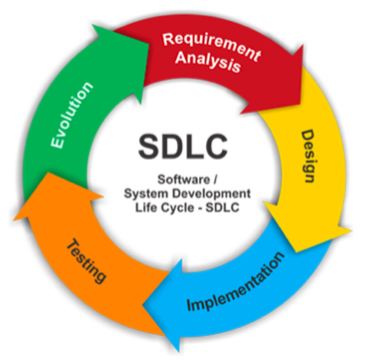


## Requirement Analysis

- We starten bij de *“Requirement Analysis”*. 
- **Goed begrijpen wat de klant precies wil en goede afspraken maken met die klant zijn hier super belangrijk**. 
- In het opleidingsonderdeel **Software Analysis** leer je hier heel wat over.

## Design, Implementation en Testing

- De volgende drie fases *Design*, *Implementation* en *Testing* komen alle drie aan bod in het opleidingsonderdeel **Object Oriented Software Development I**.  

- In de **vorige hoofdstukken hebben we ons vooral gefocust op het onderdeel** *Implementation*. 
	- We hebben geleerd **eenvoudige functionaliteit te vertalen naar Java-instructies**. 
 
- In dit hoofdstuk zullen we ons nu concentreren op het *Design*.
	- Dit is de **fase tussen de analyse en de implementatie**. 
	
- Uit de analysefase heb je geleerd wat je klant wil en dat heb je vertaald in een aantal producten: 
		- **UCD** (= use case diagram)
		- use cases
		- domeinmodel
		- SSD en eventueel bijhorende OC’s. 
	- Op basis van deze diagrammen zullen we verder gaan om een ontwerp te maken. 
	- Het is belangrijk dat dit ontwerp goed aansluit op de analysefase.

* In die **ontwerpfase wordt normaal gezien eerst beslist welke programmeertaal/programmeertalen gebruikt worden**.
	* Maar in dit opleidingsonderdeel moet deze keuze niet gemaakt worden
		* er zal steeds **Java** gebruikt worden. 

* Wij zullen een **gedetailleerd ontwerpklassendiagram uitwerken** 
	* dit klassendiagram is dan het startpunt van de volgende fase: 
		* dat klassendiagram moet dan **geïmplementeerd** worden.

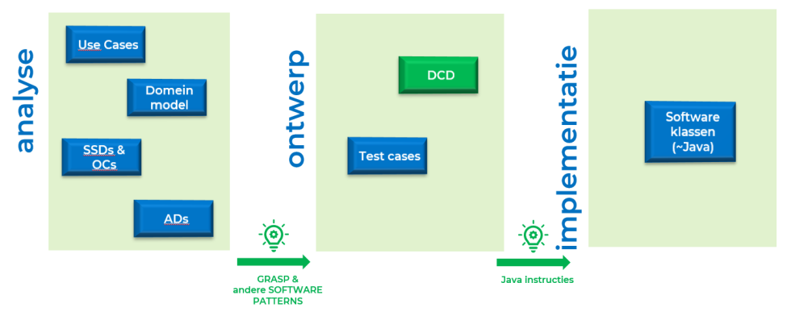
# Ontwerpklassendiagram

### Inleiding

Een **ontwerpklassendiagram** (Design Class Diagram, DCD) is een essentieel onderdeel van het ontwerpproces in softwareontwikkeling. Het biedt een gedetailleerde weergave van de klassen binnen een systeem, inclusief hun attributen, methoden en de relaties tussen deze klassen. Dit diagram speelt een cruciale rol in het vertalen van de analysefase naar een daadwerkelijke implementatie in Java.

### Verschil tussen Analyse- en Ontwerpniveau

Bij het overzetten van een klassendiagram van analyseniveau naar ontwerpniveau worden er extra details toegevoegd. Terwijl een domeinmodel op analyseniveau zich richt op de conceptuele structuur zonder specifieke datatypes, bevat een DCD op ontwerpniveau gedetailleerde informatie zoals datatypes, constructors, methodesignaturen en meer specifieke associaties.

### Context

Om de verschillende onderdelen van een DCD te begrijpen, is het belangrijk om te werken binnen een specifieke context. Deze context biedt een kader waarin de klassen en hun onderlinge relaties worden gemodelleerd, waardoor een helder beeld ontstaat van het te ontwikkelen systeem.

### DCD (Design Class Diagram)

#### Soorten UML-diagrammen

**UML (Unified Modeling Language)** onderscheidt twee hoofdtypen diagrammen:

1. **Structuurdiagrammen**: Modelleren de statische structuur van een systeem.
    - **Statische Structuurdiagrammen**: Bevatten onderdelen van het systeem op verschillende abstractieniveaus, zoals het domeinmodel en het DCD.
2. **Gedragsdiagrammen**: Modelleren het gedrag van een systeem.
    - **Dynamische Structuurdiagrammen**: Beschrijven de gedragingen en veranderingen binnen het systeem over tijd, zoals System Sequence Diagrams (SSD) en Activity Diagrams.

#### Kenmerken van een DCD

- **Structuurmodellering**: Een DCD toont de statische structuur van het systeem door de klassen en hun onderlinge relaties te beschrijven.
- **Klassen en Relaties**: Meerdere klassen worden weergegeven met hun attributen en methoden, evenals de associaties tussen deze klassen.
- **Implementatiebasis**: Het DCD dient als basis voor de implementatiefase, waarin de gevisualiseerde klassen worden omgezet naar daadwerkelijke Java-code.

### Klassen in een DCD

#### Definitie van Klassen

Een klasse in een DCD vertegenwoordigt een blauwdruk voor objecten binnen het systeem. Elke klasse bevat:

- **Attributen**: Eigenschappen die de staat van een object beschrijven.
- **Constructors**: Methoden voor het initialiseren van objecten.
- **Methoden**: Gedragsfuncties die de functionaliteit van de klasse definiëren.

#### Associaties tussen Klassen

**Associaties** geven de relaties tussen klassen aan en beschrijven hoe objecten van verschillende klassen met elkaar verbonden zijn. Een associatie kan de richting en multipliciteit van de relatie specificeren, evenals andere eigenschappen zoals visibiliteit en navigeerbaarheid.

### Preciseren van een Associatie

Om een associatie volledig te begrijpen, moeten de volgende aspecten worden gespecificeerd:

1. **Rollen**: De twee uiteinden van de associatie, die aangeven hoe de betrokken klassen elkaar benaderen.
    
2. **Multipliciteit**: Geeft aan hoeveel instanties van een klasse deelnemen aan de relatie.
    
    - **Symbooloverzicht**:
        
| Symbool  | Omschrijving                                    |
|----------|------------------------------------------------|
| `*`      | Meerdere                                       |
| `1`      | Exact één                                      |
| `0..1`   | Maximaal één, maar mogelijk geen               |
| `1..*`   | Meerdere, maar minimaal één                    |
| `n`      | Exact n (waarbij n een positief geheel getal is) |
| `n..m`   | Minimaal n en maximaal m                        |
| `0..*`   | Komt overeen met `*`                           |

        
3. **Naamgeving**: De namen die worden gebruikt om de gerelateerde objecten aan te spreken binnen de associatie.
    
4. **Visibiliteit**: Bepaalt of de relatie publiekelijk toegankelijk is (`public`) of beperkt tot binnen de klasse (`private`). In dit geval is de visibiliteit altijd `private`.
    
5. **Navigeerbaarheid**: Geeft aan welke kant van de associatie navigeerbaar is, d.w.z., vanuit welke klasse de relatie kan worden gevolgd.
    

### Navigeerbaarheid van Associaties

- **Enkelzijdige associatie**: Alleen één van de klassen kan de associatie navigeren, aangegeven door een pijltje.
- **Dubbelzijdige associatie**: Beide klassen kunnen de associatie navigeren, zonder pijltjes maar met gespecificeerde rollen aan beide zijden.

### Van DCD naar Java-code

#### Equivalente Klassen

Elke klasse in een DCD heeft een overeenkomstige klasse in Java. De volgende aspecten moeten exact overeenkomen:

- **Naam van de Klasse**: De naam in het DCD moet hetzelfde zijn als in de Java-klasse.
- **Attributen**: De attributen moeten identiek zijn in naam en datatype.
- **Constructors en Methodesignaturen**: De signatuur van constructors en methoden moet overeenkomen, inclusief parameters en returntypes.
- **Implementatie**: In Java moeten constructors en methoden een daadwerkelijke implementatie bevatten.

#### Attributen en Associaties in Java

- **UML-associaties** worden in Java gemodelleerd als attributen.
    - **Niet-navigeerbare rol**: Geen attribuut wordt toegevoegd.
    - **Navigeerbare rol**: Een attribuut wordt toegevoegd met de naam, visibiliteit en type zoals gespecificeerd in de associatie.
    - **Multipliciteit > 1**: Het attribuuttype wordt een verzameling (bijvoorbeeld `List<>`).

#### Attribuutvoorstelling

Voor attributen van primitieve en voorgedefinieerde types wordt de **attribuutvoorstelling** gebruikt in het DCD. Voor relaties tussen zelfgedefinieerde types (onze klassen) worden **associaties** gebruikt. Het is belangrijk om attributen van zelfgedefinieerde types niet als attributen van primitieve types te modelleren, omdat dit het visuele verband en de multipliciteit verstoort.

### Aandachtspunten bij de Implementatie

- **Encapsulatie**: Attributen zijn altijd `private` en toegankelijk via publieke methoden. Dit zorgt ervoor dat de interne staat van objecten alleen via goed gedefinieerde interfaces kan worden gemanipuleerd.
- **Consistentie**: Zorg ervoor dat alle aspecten van het DCD correct worden overgenomen in de Java-implementatie, inclusief naamgeving, types en visibiliteit.
- **Verlies van Semantiek**: Bij het direct modelleren van relaties als attributen kunnen belangrijke semantische informatie verloren gaan, zoals multipliciteit en navigatie. Daarom wordt aangeraden om associaties expliciet te modelleren in plaats van alleen attributen te gebruiken.

## Conclusie

In dit gedeelte hebben we de basisprincipes van het ontwerpklassendiagram (DCD) besproken binnen het iteratieve softwareontwikkelingsproces. We hebben de verschillen tussen analyse- en ontwerpniveau benadrukt, de structuur en kenmerken van een DCD uitgelegd, en de manier waarop associaties worden gepreciseerd en gemodelleerd. Daarnaast hebben we de overgang van een DCD naar Java-code behandeld, met aandacht voor belangrijke implementatieaspecten zoals encapsulatie en het behoud van semantische informatie.

In de volgende secties zullen we verder ingaan op de specifieke onderdelen van een DCD, de betekenis ervan, en hoe deze iteratief kunnen worden opgebouwd met behulp van GRASP-patronen zoals controller, creator en expert. Daarnaast zullen we bespreken hoe systeemoperaties correct gedefinieerd en opgesplitst kunnen worden in deelverantwoordelijkheden binnen het DCD, en uiteindelijk hoe het DCD efficiënt kan worden omgezet naar Java-code.
# Het ontwerp: klassendiagram opbouwen


Uitstekend, laten we verder gaan met het verwerken van het volgende deel van het hoofdstuk "Ontwikkel een applicatie". We zullen de inhoud structureren en verduidelijken, waarbij we ervoor zorgen dat alle doelstellingen worden behandeld zonder het gebruik van voorbeelden.

## Het ontwerp: klassendiagram opbouwen

Objectgeoriënteerd ontwerpen is het proces van het bouwen van een **systeem van objecten** die met elkaar interageren, met als doel het oplossen van een softwareprobleem. Dit proces is essentieel voor het creëren van een robuuste en onderhoudbare applicatie.

### Fasen van Ontwerp

#### Einde van de Analysefase

Aan het einde van de analysefase hebben we de volgende artefacten ontwikkeld:

- **Use Cases**: Beschrijvingen van interacties tussen gebruikers en het systeem.
- **Activity Diagrams (AD)**: Diagrammen die de stroom van activiteiten binnen het systeem weergeven.
- **Domeinmodel**: Een model dat de kernconcepten en relaties binnen het toepassingsgebied van de software definieert.
- **Systeemsequentiediagrammen (SSD)**: Diagrammen die de interacties en volgorde van gebeurtenissen binnen het systeem beschrijven.
- **Operation Contracts (OC’s)** (optioneel): Specificaties die de voorwaarden en resultaten van systeemoperaties definiëren.

#### Ontwerpfase

Het doel van de ontwerpfase is het maken van **een klassendiagram** dat objecten, hun structuur en interacties weergeeft. Dit diagram dient als blauwdruk voor de implementatie en zorgt ervoor dat het ontwerp aansluit op de bevindingen uit de analysefase.

### Responsibility Driven Design (RDD)

#### Aanpak

**Responsibility Driven Design (RDD)** wordt toegepast om tot een klassendiagram te komen. Hierbij worden objecten geïdentificeerd met specifieke **verantwoordelijkheden** die **samenwerken** om de gewenste functionaliteit te realiseren. Elk object speelt een specifieke **rol** met bepaalde verantwoordelijkheden, wat bijdraagt aan een duidelijke en onderhoudbare architectuur.

#### Verantwoordelijkheden

Verantwoordelijkheden binnen RDD worden onderverdeeld in twee categorieën:

1. **KNOWING-verantwoordelijkheden**
    
    - **Definitie**: Verantwoordelijkheden die betrekking hebben op het kennen en teruggeven van informatie.
    - **Eigenschappen**:
        - Het object weet van zijn eigen toestand via privé-geëncapsuleerde attributen.
        - Het object kent gerelateerde objecten binnen het systeem.
        - Het object kan informatie berekenen of afleiden op basis van zijn gegevens.
2. **DOING-verantwoordelijkheden**
    
    - **Definitie**: Verantwoordelijkheden die betrekking hebben op het uitvoeren van acties.
    - **Eigenschappen**:
        - Het object kan zelf acties uitvoeren.
        - Het object kan acties initiëren in andere objecten.
        - Het object kan activiteiten in andere objecten coördineren.

### GRASP (General Responsibility Assignment Software Patterns)

#### Gebruik van GRASP

**GRASP** biedt richtlijnen voor het toekennen van verantwoordelijkheden aan objecten binnen een systeem. Deze patronen helpen bij het creëren van een gebalanceerde en efficiënte objectstructuur, wat bijdraagt aan de kwaliteit en onderhoudbaarheid van de software.

#### GRASP Patronen

Er zijn **drie hoofdpatronen** binnen GRASP die centraal staan in dit ontwerpproces:

1. **Controller**
    
    - Verantwoordelijk voor het afhandelen van systeemgebeurtenissen en het coördineren van acties binnen het systeem.
2. **Expert**
    
    - Verantwoordelijk voor het kennen en beheren van relevante informatie binnen het systeem.
3. **Creator**
    
    - Verantwoordelijk voor het aanmaken van nieuwe objecten binnen het systeem.

### Stappenplan: RDD en GRASP in Actie

Om een effectief klassendiagram op te bouwen, volgen we een systematische aanpak waarbij RDD en GRASP worden geïntegreerd:

1. **DOING / KNOWING**
    
    - Bepaal de verantwoordelijkheden van elke systeemoperatie zoals beschreven in de SSD. Dit helpt bij het identificeren welke objecten welke taken moeten uitvoeren.
2. **Bepaal Methode**
    
    - Definieer een methode voor elke verantwoordelijkheid. Methoden die DOING-verantwoordelijkheden hebben, moeten altijd een returntype `void` hebben, omdat ze acties uitvoeren zonder een direct resultaat terug te geven.
3. **Opsplitsen in Deelverantwoordelijkheden**
    
    - Splits de verantwoordelijkheden op en wijs ze toe aan geschikte klassen binnen het DCD. Dit zorgt voor een duidelijke scheiding van taken en bevordert de cohesie binnen de klassen.

### Einddoel

Het einddoel van dit ontwerpproces is de **iteratieve opbouw** van het ontwerpklassendiagram (DCD). Dit gebeurt door elke use case en elk SSD te doorlopen, waarbij het DCD voortdurend wordt verfijnd en uitgebreid. Deze iteratieve aanpak zorgt ervoor dat het ontwerp steeds verder wordt verfijnd en dat het systeem geleidelijk aan robuuster en beter gestructureerd wordt.

## Conclusie

In dit gedeelte hebben we het proces van het opbouwen van een ontwerpklassendiagram (DCD) binnen het objectgeoriënteerde ontwerpproces besproken. We hebben de fasen van het ontwerp geïdentificeerd, de principes van Responsibility Driven Design (RDD) uitgelegd, en de toepassing van GRASP-patronen behandeld. Daarnaast hebben we een stappenplan gepresenteerd voor het toekennen van verantwoordelijkheden en het iteratief ontwikkelen van het DCD. Deze systematische en gestructureerde aanpak vormt de basis voor het ontwikkelen van een robuust en goed ontworpen softwaresysteem dat voldoet aan de gestelde eisen en verwachtingen.

In de volgende secties zullen we verder ingaan op de specifieke onderdelen van een DCD, de betekenis ervan, en hoe deze iteratief kunnen worden opgebouwd met behulp van GRASP-patronen zoals controller, creator en expert. Daarnaast zullen we bespreken hoe systeemoperaties correct gedefinieerd en opgesplitst kunnen worden in deelverantwoordelijkheden binnen het DCD, en uiteindelijk hoe het DCD efficiënt kan worden omgezet naar Java-code.

# DCD ontwikkelen a.d.h.v. GRASP: Dobbelspel – Iteratie 1 “Speel spel”

## Inleiding

- We hernemen het voorbeeld van het dobbelspel, gekend uit het opleidingsonderdeel Software Analysis.

- We starten met een 1ste iteratie. 
	- We pikken er de use case "Speel spel" uit in een vereenvoudigde vorm. 
	- Een aantal moeilijkheden werden achterwege gelaten, later nemen we die dan weer op.
	
- Open deze [pagina](./attachments/CaseDobbelspel.pdf) en bekijk de producten uit de analysefase bij iteratie 1. 
	- Deze producten zijn het startpunt om het ontwerp op te bouwen. 
	- Van hieruit starten we met het zonet besproken stappenplan.

### Een eenvoudige use case…
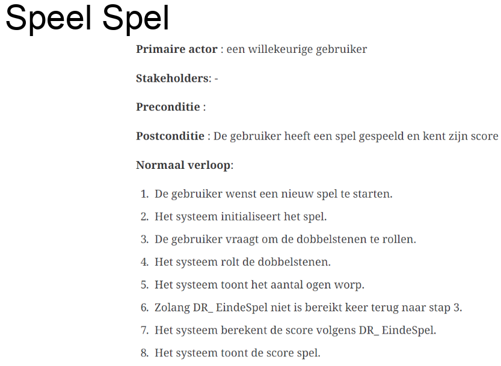

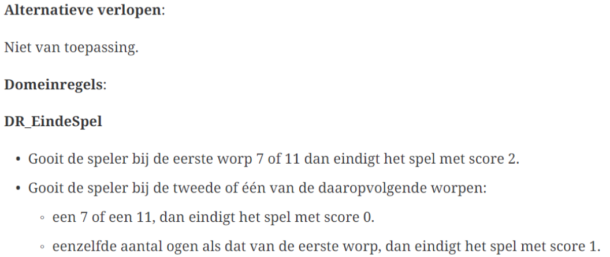

### Resultaat analyse

#### SSD

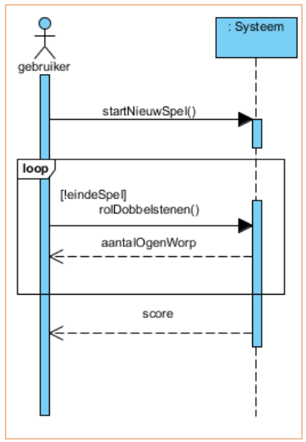
#### Domeinmodel

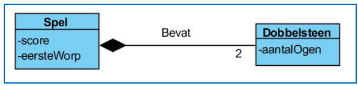
#### OC's

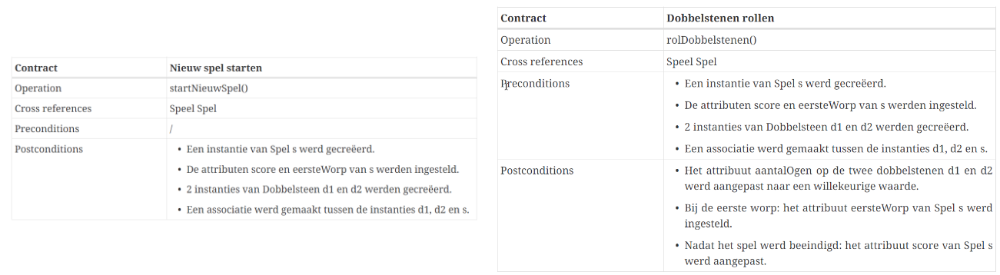
## Stappenplan uitwerken voor systeemoperatie 1

>- **We beginnen met de eerste systeemoperatie.**

- Wat is een systeemoperatie precies?
	- Een systeemoperatie is de boodschap die op een pijl op het SSD staat en die pijl loopt van actor naar het systeem.

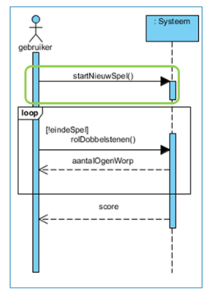


### Stap 1: DOING/KNOWING

**Stap 1**: Vertrek van het SSD en bepaal voor elke systeemoperatie de *doing* en/of *knowing* verantwoordelijkheden.

1. **startNieuwSpel()** – *DOING*?  
   - Als er een OC (Operation Contract) is, duidt dit op een *doing*-verantwoordelijkheid.  
   - Er is **wel** een OC voor deze systeemoperatie, dus er **is** een doing-verantwoordelijkheid.

2. **startNieuwSpel()** – *KNOWING*?  
   - Als er een (return)pijl is op het SSD, duidt dat op een *knowing*-verantwoordelijkheid.  
   - We zien **geen** terugkeerpijl voor `startNieuwSpel()`.  
   - Dus **geen** knowing-verantwoordelijkheid.

**Besluit**: `startNieuwSpel()` heeft **enkel** een *DOING*-verantwoordelijkheid.

### Stap 2: Bepaal methode

**Stap 2**: Definieer voor elke verantwoordelijkheid uit stap 1 een methode.

Omdat `startNieuwSpel()` *één* verantwoordelijkheid heeft (DOING), definiëren we **één** methode.

- **Naam**: de naam van de systeemoperatie op het SSD (startNieuwSpel) is vaak herbruikbaar.  
	- Als er op het SSD (systeemsequentiediagram) een naam staat voor de systeemoperatie (zoals `startNieuwSpel`), en die naam past perfect bij wat de methode moet doen, kun je die naam **hergebruiken**.
	- Als de systeemoperatie niet helemaal beschrijft wat je uiteindelijk met de methode wilt doen, kies je een **betere, betekenisvollere naam**.

- **Parameters**: op het SSD zijn er geen parameters, dus hier ook niet.  
	- Staat er op het SSD dat er parameters worden meegegeven? Bijvoorbeeld `startNieuwSpel(spelersnaam)`. Dan zal je methode ook die parameter(s) nodig hebben, om verder te kunnen werken.
	- Als er geen parameters op het SSD staan en de methode ze **niet** nodig heeft, dan voorzie je dus **geen** parameters in de definitie.

- **Returntype**: voor een DOING is dat **altijd** `void`.
	- Omdat het in deze stap over een _DOING_-verantwoordelijkheid gaat (een “actie” die iets verandert in het systeem, zoals het creëren van objecten), heeft deze methode in Java altijd `void` als returntype.
	- _Doing_ betekent immers: “Voer een actie uit; pas iets aan.” Er komt geen waarde als ‘antwoord’ terug naar wie de methode opriep.


**BESLUIT**: de nieuwe methode heet `startNieuwSpel(): void`.

### Stap 3: Opsplitsen in deelverantwoordelijkheden

>- **Splits de verantwoordelijkheid op in kleine deelverantwoordelijkheden en plaats ze in een gepaste klasse op het DCD.**

#### Stap 3A: Controller pattern toepassen

##### Patroon 1: Controller

- **Naam** **:**    
	- Controller

- **Probleem** **:**
    - Welk is het eerste object, achter de User Interface, dat verantwoordelijk is voor het ontvangen en coördineren van een systeemoperatie?

- **Oplossing** **:**
    - Ken de verantwoordelijkheid toe aan een klasse die het volledige systeem representeert, een Controller klasse

###### Achtergrond:

- In hoofdstuk 3 leerden we al dat klassen gegroepeerd worden in packages. 
	- We leerden 2 packages kennen:
		- `presentatie`: ui (user interface) 
			- Hier komen alle klassen die verantwoordelijk zijn voor de communicatie met de gebruiker. 
			- We spreken over invoer en uitvoer.
		- `domein`: Hier komen alle klassen die de kern, de business logica, van de applicatie bevatten.


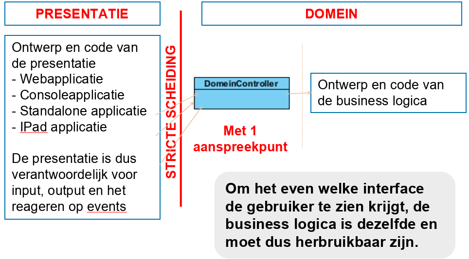


###### Onthoud:

- **Controller** verleent toegang tot de domeinobjecten.
    
- Ze **ontvangt** en **coördineert** systeemoperaties.  
	- **Ontvangt** 
		- DomeinController is het enige aanspreekpunt van de domeinlaag
		- lagen zijn strikt gescheiden
	- **Coördineert**    
		- DomeinController (of DC) spreekt dan de correcte domeinobjecten aan.
		- DC bevat minstens 1 domeinobject = het centrale domeinobject
	    - DC kan ook andere objecten of tussentoestanden bijhouden (zie later)


##### Uitwerken

>- We passen dit nu concreet toe voor `startNieuwSpel()`.

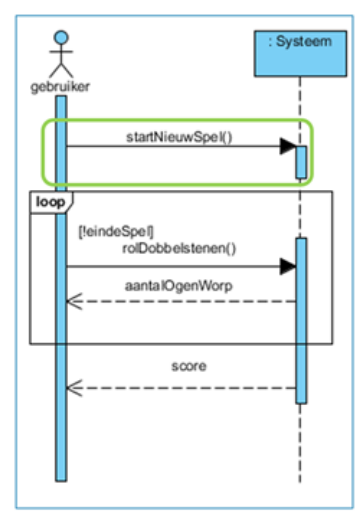

- Dat wil dus zeggen dat de actor, de gebruiker van je applicatie ergens *via het scherm aangeeft dat hij een nieuw spel wil starten*. 
	- Dat kan via het klikken op een knop, iets selecteren op het scherm, ergens het woord "NIEUW" typen…
	- Dus de gebruiker communiceert: "Ik wil een nieuw spel starten."
		- Deze *communicatie wordt in één van de klassen uit de ui opgevangen en dan moeten we naar de business logica kunnen gaan om effectief een nieuw spel te creëeren*.


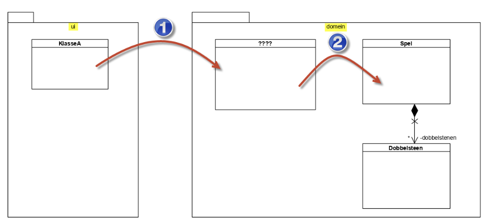

- Het **controller patroon zegt dat we deze taak moeten geven aan een controllerklasse**, 
	- **een klasse die alles wat naar het domein, met de business logica, gaat coördineert**. 
	- Deze klasse wordt **DomeinController** genoemd.


>- Gevolg van het toepassen van het Controller patroon
	- We hebben nood aan een controllerklasse die de toegang regelt tot het domein. 
	- De nieuwe systeemoperatie hoort thuis in die controllerklasse.

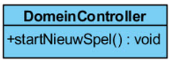

#### Stap 3B: Deelverantwoordelijkheden toekennen aan de juiste klassen


##### Welke deelverantwoordelijkheden?
    
- Bij `DOING`:
    - **Bekijk** `OC`.
    - *Moet DomeinController tussentoestanden bijhouden?*
	    - Een tussentoestand = informatie nodig om volgende systeemoperaties te kunnen uitvoeren
		    - Precondities in OC of info die geretourneerd wordt in knowing methodes -> kunnen wijzen op een bij te houden tussentoestand
- Bij `KNOWING`: zie verder

##### Het OC voor de huidige systeemoperatie ziet er zo uit:

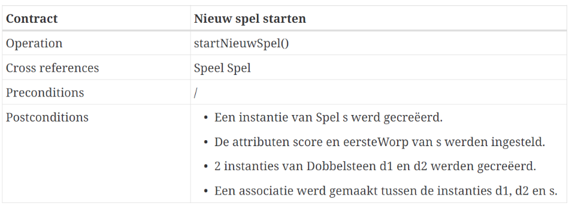

  - Concreet betekent dit:  
    1. Het starten van een nieuw spel bevat het maken van een nieuw spelobject en twee nieuwe dobbelsteenobjecten met de gevraagde attributen en onderlinge associaties. 
	    - Deze informatie halen we uit het OC.

    2. Deze objecten moeten ook bewaard worden, want dan willen we in een volgende stap het spel spelen en gooien met de dobbelstenen.

- **We beginnen met het eerste punt uit het OC.**  
	- We willen een nieuw objecten maken, nl. een spelobject.  
	- Wie is hiervoor verantwoordelijk?  
	- Het uitdelen van die verantwoordelijkheid moeten we verantwoorden met een GRASP patroon. 
	- We kennen het Controller patroon reeds. 
		- Vertelt dit patroon iets over wie verantwoordelijk is voor het maken van een nieuw object? 
			- Nee, dus er is nood aan een nieuw patroon…

- 1ste item uit OC : Een instantie van Spel s werd gecreëerd.
	    - Welke klasse is nu verantwoordelijk voor de creatie van het Spel object?

##### Patroon 2: Creator

- **Naam:**
    - Creator

- **Probleem:**
    - Wie is er verantwoordelijk voor het aanmaken van nieuwe instanties van een klasse?

- **Oplossing:**
    - Ken de verantwoordelijkheid om instanties van klasse A te creëren toe aan klasse B, wanneer 1 of meer van de volgende gelden:
	    - B bevat instanties van A (associatie: bevat, heeft)
	    - B is een aggregatie of een compositie van A
	    - B gebruikt A intensief
	    - B bevat de data om A te initialiseren
###### Achtergrond

- **Wat doet het?**
	- Het **Creator**-principe stelt dat een klasse verantwoordelijk moet zijn voor het creëren van objecten van andere klassen die aan bepaalde voorwaarden voldoen. 
	- Dit principe helpt om te bepalen wie verantwoordelijk is voor het creëren van nieuwe instanties van andere klassen, zodat het systeem efficiënt en georganiseerd blijft.


-  **Voorbeeld:**
	- Stel dat je een systeem hebt waarbij "Bestellingen" meerdere "Producten" bevatten. 
	- Het **Creator**-principe zou betekenen 
		- dat de **Bestelling**-klasse verantwoordelijk is voor het aanmaken van de **Product**-objecten, 
		- omdat de **Bestelling** de verzameling van producten beheert.

	- **In de praktijk:**
		- Als een **Winkel**-klasse producten verkoopt en een **Bestelling** moet maken, 
			- zou de **Winkel**-klasse volgens het **Creator**-principe de verantwoordelijkheid krijgen om nieuwe **Bestelling**-objecten te creëren, 
			- omdat de winkel de context heeft van de bestelling (de producten die gekocht worden, het klantgedrag, enzovoorts).


###### Wanneer gebruik je Creator?

- De klasse is verantwoordelijk voor het creëren van objecten wanneer:
    - Het object verantwoordelijk is voor het beheren van de nieuw te creëren objecten.
    - De klasse sterk verbonden is met de te creëren objecten.
    - Het object zelf een verzameling van de te creëren objecten is.

##### Uitwerken: punt 1

- **Creator**  
	- Om een Spelobject te kunnen maken, hebben we zeker deze klasse nodig op het DCD.  
	- Via het domeinmodel - uit de analysefase - hebben we al zicht op deze klasse. 
		- Neem die klasse zoals voorgesteld in het domeinmodel over op het DCD en vul voor elk attribuut het datatype aan. 
		- Als je op het domeinmodel ook al associaties vindt tussen bestaande klassen op het DCD 
			- kan je die overnemen
			- weliswaar zonder extra informatie (associatienaam, rolnamen, multipliciteit,…).  

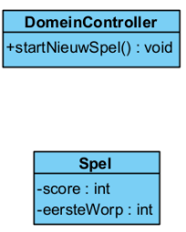

  - **Om een Spelobject te kunnen maken**, hebben we niet alleen de *klasse nodig* op het DCD. 
	  - Deze klasse moet ook *een manier bevatten om een instantie aan te maken*: *een constructor.*
	  - Momenteel bevat Spel nog geen constructor, dus deze moet toegevoegd worden.  
		
		  - Als je een nieuwe methode nodig hebt, denk je altijd aan
			  - **Naam**:
				  - een goede, betekenisvolle naam, 
				  - welke parameters je nodig hebt en welk returntype je nodig hebt.  
				  - In hoofdstuk 3 zagen we dat de naam van de constructor vast ligt,
					  - nl. de naam van de klasse waarin de constructor staat. 
					  - Je moet dus zelf geen naam verzinnen. 
					  - *De constructor noemt Spel*.  
				
		    - Heeft de constructor **parameters** nodig? 
			    - Parameters bij een constructor dienen altijd om ervoor te zorgen dat een object in een geldige toestand kan aangemaakt worden. 
			    - Als we het hebben over een geldige toestand, spreken we over de attributen en hun actuele waarde. 
			    - Als een nieuw object gemaakt wordt van Spel dan moeten de attributen score en eersteWorp dus een geldige initiële waarde krijgen. 
			    - Kan Spel zelf een correcte defaultwaarde bepalen of moet dat van buitenaf doorgestuurd worden via een parameter? 
				    - Spel zal het zelf bepalen, 
					    - het heeft geen waarden van buitenaf nodig om dit te doen. 
					    - *Dat wil zeggen dat de constructor geen parameters zal hebben.  *
		
		    - Over het **returntype** moet je hier niet nadenken. *Een constructor heeft geen returntype.*

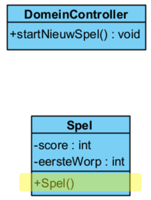

- **Nu de constructor is toegevoegd, moet nu bekeken worden wie de verantwoordelijkheid heeft om deze op te roepen.**  
	- Daarvoor maken we gebruik van het Creator pattern.  


- **Ook dit patroon is weer heel algemeen beschreven. We passen het concreet toe op ons probleem:**
	- We willen een object van Spel maken en zoeken dus een klasse die verantwoordelijk is om een object van Spel te maken. 
		- Klasse A uit de algemene omschrijving is klasse Spel. 
		- En we gaan op zoek naar de juiste klasse B die het spel zal aanmaken.  
			- Waar zoeken we precies die klasse B?  
			    - Kijk eerst op het DCD of daar geen klassen zijn die in aanmerking komen.  
			    - In tweede instantie kan het domeinmodel een inspiratiebron zijn voor een geschikte klasse…  
			    - Mogelijks maak je gewoon een nieuwe klasse, die een duidelijke rol en verantwoordelijkheid krijgt.  
  
			  - Heel concreet, we zoeken een klasse B waarvoor geldt:  
			    - B bevat instanties van Spel (associatie: bevat, heeft)  
			    - B is een aggregatie of een compositie van Spel  
			    - B gebruikt Spel intensief  
			    - B bevat de data om Spel te initialiseren

- **Wij zoeken eerst op het DCD.**  

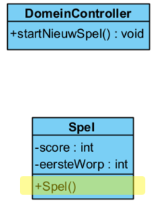

 - **We overlopen met de 2 klassen die op het DCD staan, de vier zinnen**.  
	  - Spel zelf komt zeker al niet in aanmerking.  
	  - Zou DomeinController wel kunnnen onze klasse B zijn?  
		  - DomeinController bevat geen instanties van Spel.  
		  - DomeinController is geen aggregatie of compositie van Spel.  
		  - Gebruikt DomeinController Spel intensief?  
 
		  - In het patroon Controller zag we dat de DomeinController minstens 1 domeinobject moet bevatten,
			  - nl. het object dat een centrale rol speelt binnen het domein. 
			  - Via dat object kunnen dan methodes uit het domein aangesproken worden. 
			  - We noemen dat object ook wel het centrale domeinobject. 
			  - In het dobbelsteenspel is het zeker dat het object van klasse Spel deze rol vervult. 
			  - Alles draait om spel, het spelen van dat spel. 
			  - De DomeinController maakt altijd intensief gebruik van het centrale domeinobject. 
			  - Dus is de klasse DomeinController een goede keuze voor onze klasse B. 
			  - De DomeinController is verantwoordelijk om een object van klasse Spel aan te maken.

- **We kunnen het geheel dus als volgt zien:**
	- Vanuit de user interface is er een klasse - het doet er niet toe welke - die de systeemoperatie `startNieuwSpel` via een object van de DomeinController aanroept.  
	- Vanuit die methode `startNieuwSpel` kunnen we onmiddellijk een object van Spel aanmaken, want de DomeinController is verantwoordelijk om het object aan te maken. 
	- Dus vanuit `startNieuwSpel` in de DomeinController wordt de constructor uit de klasse Spel aangeroepen.  

- **Eens dat Spel-object gemaakt is, moeten we het ergens bijhouden/bewaren.**  
  - De bedoeling is dat dit object dan nog kan gebruikt worden om het spel te spelen (vervolg van de use case).  
  - Wie is daarvoor verantwoordelijk?  
  - Via het controller patroon hebben we ontdekt dat de DomeinController intensief gebruik zal maken van dit Spelobject, aangezien dit object het centrale domeinobject is. Dit wil zeggen dat de DomeinController dit object moet bijhouden.  
  - Om iets te bewaren wat je later nodig hebt, heb je attributen nodig. Dat wil zeggen dat de DomeinController het Spelobject moet bijhouden in een attribuut.  
  - **Let op:**  
    - Een attribuut die een object is van een klasse die ook op het DCD staat, stel je voor als een associatie op het DCD. Dan is het visueel heel snel duidelijk dat er een relatie is tussen deze objecten.  
    - De navigeerbaarheid toont aan dat het de DomeinController is die het Spelobject bijhoudt.  
    - Aan de navigeerbare zijde van een associatie moet je telkens rolnaam, toegankelijkheid en multipliciteit aanvullen. We hebben hier maximaal 1 Spelobject, attributen worden altijd afgeschermd van de buitenwereld en de rolnaam `spel` laat duidelijk zien wat dit attribuut voorstelt.

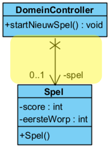


##### Uitwerken: punt 2

- **We hebben nu 1 punt vanuit het OC afgewerkt: er werd een object van Spel gemaakt.**  
	- Belangrijk is nu dat ook de 3 andere punten nog gerealiseerd worden.  
	- Tijd om punt 2 te bekijken: De attributen `score` en `eersteWorp` van s werden ingesteld.  
	- We denken opnieuw na wie hiervoor verantwoordelijk is. 
		- De verantwoodelijkheid om de attributen een correcte startwaarde te geven is altijd voor de constructor. 
		- Spel bevat een constructor waarin dit zal gebeuren, 
			- *dus voor punt 2 hoeven geen aanpassingen gemaakt te worden op het DCD*.


##### Uitwerken punt 3

- **Vervolgens bekijken we punt 3: 2 instanties van Dobbelsteen d1 en d2 werden gecreëerd.**  
	- Ook hier bepalen we wie daarvoor verantwoordelijk is? 
		- Op basis van welk GRASP patroon kan je die verantwoordelijkheid toekennen?  

	- Het gaat terug over het creëren van nieuwe objecten, 
		- dat wil zeggen dat het CREATOR patroon ons weer zal helpen om de verantwoordelijke te bepalen. 
		- Maar voor we dat kunnen doen, moeten we er eerst voor zorgen 
			- dat het DCD de klasse bevat 
			- én het mogelijk is om hiervan een instantie aan te maken.  

    1. **Is de klasse al aanwezig op het DCD?**  
       - Nee → Voeg de klasse over vanop het domeinmodel met zijn attributen en associaties.  
       - Dobbelsteen heeft 1 attribuut: `aantalOgen`, hiervoor bepalen we het datatype en voegen dit toe.  
       - Op het domeinmodel staat een associatie tussen Spel en Dobbelsteen, deze nemen we over zonder extra informatie.  
    2. **Heeft de klasse een constructor met de juiste parameters?**  
       - Nee → voeg de constructor toe.  
       - De naam van de constructor ligt vast, er is geen returntype en ook hier hebben we geen nood aan parameters. De constructor van Dobbelsteen zelf zal intern regelen op welke waarde het attribuut `aantalOgen` initieel best ingesteld wordt. Dit moet niet van buitenaf doorgegeven worden via een parameter. Dobbelsteen is hier zelf verantwoordelijk voor.  

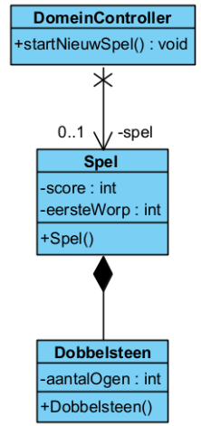

 **Wie is verantwoordelijk om de constructor op te roepen?**  
       - We passen terug het Creator patroon zo concreet mogelijk toe.  
       - We zoeken een klasse B waarvoor geldt:  
         - B bevat instanties van Dobbelsteen (associatie: bevat, heeft)  
         - B is een aggregatie of een compositie van Dobbelsteen  
         - B gebruikt Dobbelsteen intensief  
         - B bevat de data om Dobbelsteen te initialiseren

- **Om die klasse B te zoeken, kijken we eerst weer naar het DCD.**  
	- Op het DCD vinden we snel een antwoord. 
		- Spel is een compositie van Dobbelsteenobjecten,
			- dus zal Spel verantwoordelijk zijn om Dobbelsteenobjecten aan te maken.  

	- Op het moment dat het Spelobject gecreëerd wordt, dus m.a.w. als de constructor van Spel aangeroepen wordt, 
		- zal dat Spelobject op zijn beurt de Dobbelsteenobjecten moeten aanmaken. 
		- Die dobbelsteenobjecten kunnen aangemaakt worden door de constructor aan te roepen.  
  
- **Het Spelobject maakt dus 2 Dobbelsteenobjecten, door 2 keer die constructor aan te roepen.** 
	- Uiteraard is het ook belangrijk dat deze objecten bijgehouden worden 
		- om later het spel te kunnen spelen, om met de dobbelstenen te kunnen gooien.  
	
	- Vanop het domeinmodel kregen we een compositie mee tussen Spel en Dobbelsteen. 
		- Deze compositie drukt uit dat er een relatie is tussen de objecten. 
			- Spel heeft 2 onderdelen, nl. 2 Dobbelsteenobjecten. 
			- Die kunnen niet bestaan zonder het Spelobject. 
			- Het Spelobject maakt de Dobbelsteenobjecten en houdt ze ook bij.
			- Stel dat om één of andere reden het Spelobject verdwijnt, 
				- dan zullen die Dobbelsteenobjecten ook verdwijnen.
			
		- Op het DCD zie je dus hoe deze compositie (= hele sterke vorm van een associatie) verder aangevuld wordt.


##### Uitwerken punt 4
- **Als laatste bekijken we punt 4 in het OC: Een associatie werd gemaakt tussen de instanties d1, d2 en s.**  
	- *Deze associatie staat al op het DCD, dus we hoeven geen verdere aanpassingen te maken voor dit punt uit het OC*.


##### Eindconclusie uitwerking punt 1, 2, 3 en 4

- **Op deze manier is het uitwerken, het ontwerpen van de allereerste systeemoperatie een feit.**  
  - Bij deze DOING verantwoordelijkheid moest het volgende gebeuren:
    1. Overloop de postcondities in het OC. Dit vormen de deeltaken.  
       - Spelobject is gemaakt.  
       - Dobbelsteenobjecten zijn gemaakt.  
       - Spel- en Dobbelsteenobjecten zijn met elkaar geassocieerd.  
    2. Moet de DomeinController tussentoestanden bijhouden?  
       - De DomeinController houdt het Spelobject, als centraal domeinobject bij.  
       - Het Spelobject houdt op zijn beurt de Dobbelsteenobjecten bij.  
       - Alles wat we gerealiseerd hebben in deze systeemoperatie wordt dus bijgehouden en kunnen we in het vervolg van de use case nog gebruiken.

Na deze eerste systeemoperatie ziet het DCD er zo uit:

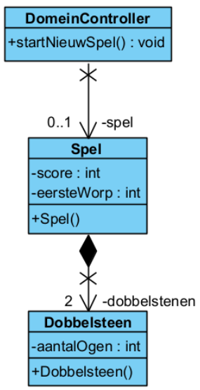

## Stappenplan uitwerken voor systeemoperatie 2

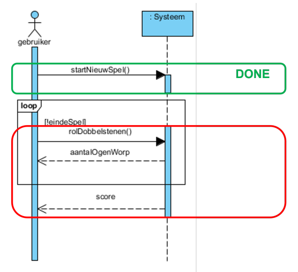

- We hebben nu een klassendiagram opgebouwd voor de eerste systeemoperatie vanop het SSD. 
- Wij kijken nu vervolgens naar de 2de systeemoperatie en herhalen dezelfde stappen.

### Stap 1: DOING/KNOWING
  - *Stap 1: Vertrek van het SSD en bepaal voor elke systeemoperatie de doing en/of knowing verantwoordelijkheden.*  
  - De tweede systeemoperatie **rolDobbelstenen** omvat 3 pijlen op het SSD en heeft een bijhorend OC. Deze informatie gebruiken we om te bepalen of deze systeemoperatie DOING en/of KNOWING verantwoordelijkheid heeft.  

  1. **Heeft rolDobbelstenen een DOING verantwoordelijkheid?**  
     - **Algemene regel DOING**  
       1. Als er een OC is, dan is er DOING-verantwoordelijkheid.  
       2. Als deze systeemoperatie functionaliteit bevat waarbij een domeinobject moet bijgehouden worden, dan is er DOING-verantwoordelijkheid.  
     - **Toepassing op rolDobbelstenen**  
       1. Is er een OC voor deze systeemoperatie? Ja.  
          - → dus er is een DOING-verantwoordelijkheid.  

  2. **Heeft rolDobbelstenen een KNOWING verantwoordelijkheid?**  
     - **Algemene regel KNOWING**  
       - Als de systeemoperatie op het SSD een returnpijl heeft, dan is er een KNOWING-verantwoordelijkheid.  
     - **Toepassing op rolDobbelstenen**  
       - Op het SSD zien we 2 terugkeerpijlen die horen bij rolDobbelstenen.  
       - → Er is dus ook KNOWING-verantwoordelijkheid.

  - **BESLUIT**: rolDobbelstenen heeft een DOING en KNOWING-verantwoordelijkheid.  

### Stap 2 voor DOING-verantwoordelijkheid: Bepaal methode
  - *Stap 2: Definieer voor elke verantwoordelijkheid uit stap 1 een methode.*  
  - In de vorige stap vonden we twee verschillende verantwoordelijkheden (DOING en KNOWING). Dat betekent dat we in stap 2 minstens twee verschillende methodes moeten definiëren.  
  - Overloop nu de verantwoordelijkheden en begin eerst met de DOING-verantwoordelijkheid, gevolgd door de KNOWING-verantwoordelijkheid. Zo volg je ook de tijdsindicatie van het SSD (de pijl die hoger staat, gebeurt eerst).  
  - **We beginnen met een definitie van een methode voor de DOING-verantwoordelijkheid.** Denk weer aan een betekenisvolle naam, juiste parameters en een goed returntype!  
    - **Naam**: rolDobbelstenen (vat perfect de functionaliteit beschreven in het OC samen)  
    - **Parameters**: geen op het SSD, dus ook hier geen  
    - **Returntype**: `void` (altijd zo bij DOING)  
  - De methode die we straks zullen toevoegen op het DCD zal er dus zo uitzien:  
    - `rolDobbelstenen(): void`  

### Stap 3A voor rolDobbelstenen(): Controller pattern toepassen
  - *Stap 3: Splits de verantwoordelijkheid op in kleine deelverantwoordelijkheden en plaats die in een gepaste klasse op het DCD.*  
  - Allereerst moet deze verantwoordelijkheid een plaats krijgen op het DCD. Aan welke klasse zullen we de verantwoordelijkheid geven?  
  - `rolDobbelstenen` is een systeemoperatie. Volgens het Controller-patroon is de **DomeinController** verantwoordelijk voor het ontvangen van deze systeemoperatie.  

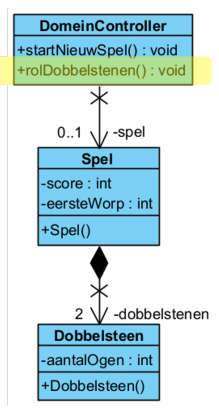
### Stap 3B voor rolDobbelstenen(): Deelverantwoordelijkheden toekennen aan de juiste klassen
  - Deze systeemoperatie moeten we nu verdelen in deelverantwoordelijkheden en telkens bekijken aan welke klasse we die kunnen uitdelen op basis van een GRASP-patroon.  
  - **Het OC voor deze systeemoperatie ziet er zo uit:**  

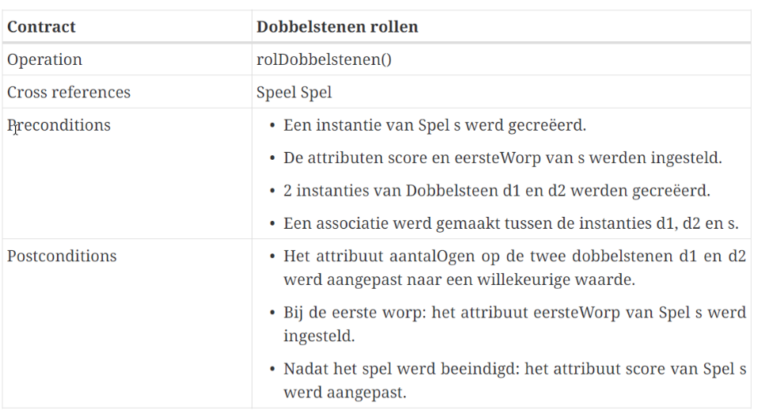

- 1ste item uit OC : Het attribuut `aantalOgen` van dobbelstenen `d1` en `d2` werd aangepast naar een willekeurige waarde.
	   - Wie is daarvoor verantwoordelijk?  
		   - Welk patroon kennen we dat iets vertelt over het toekennen van een nieuwe waarde aan een attribuut van een bestaand object? 
			   - Controller? Nee. 
			   - Creator? Nee. 
			   - We hebben dus nood aan een nieuw patroon: 
				   - **Expert**.  
#### Patroon 3: Expert
- **Naam:**
    - Information expert, of kortweg, Expert

- **Probleem:**
    - Wat is het algemeen principe dat we kunnen hanteren voor het toekennen van verantwoordelijkheden aan objecten?

- **Oplossing:**
    - Ken de verantwoordelijkheid toe aan de Information Expert -  dit is de klasse die alle informatie, nodig om de verantwoordelijkheid te realiseren, heeft.

#### Uitwerking

##### Uitwerking: punt 1

  - **We moeten dus weer op zoek naar de juiste klasse.**  
    - Kijk eerst op het DCD of daar geen klassen zijn die in aanmerking komen…  
    - In tweede instantie kan het domeinmodel een inspiratiebron zijn voor een geschikte klasse…  
    - Mogelijks maak je gewoon een nieuwe klasse, die een duidelijke rol en verantwoordelijkheid krijgt.  

  - **Welke klasse heeft alle informatie om een nieuwe randomwaarde te kunnen toekennen aan de 2 dobbelsteenobjecten? Welke (bijkomende) informatie heb je precies nodig?**  
    - Om een randomwaarde te bepalen hebben we geen extra informatie nodig.  
    - We hebben het attribuut `aantalOgen` nodig, dit is een eigenschap van de bestaande objecten van Dobbelsteen.  
    - We hebben de beide Dobbelsteenobjecten nodig, die zijn gekend door Spel: de navigeerbare associatie stelt een attribuut voor!  
    - En wie kent het Spelobject dan? De DomeinController.  

  - **We vormen nu als het ware een ketting**:  
    1. Applicatie →  
    2. DomeinController →  
    3. Spel →  
    4. Dobbelsteenobjecten  

    - **Deze opsomming kan je zien als een ketting van deelverantwoordelijkheden**.
	     - We krijgen telkens een methode om een deelverantwoordelijkheid te realiseren:  
     
	    1. De systeemoperatie `rolDobbelstenen()` van de klasse DomeinController wordt aangeroepen door de applicatie. 
		    - Deze systeemoperatie kreeg al een plaats in de klasse DomeinController.  

	    2. De DomeinController kent het Spelobject en kan dus iets vragen/delegeren aan dat Spelobject. 
		    - De DomeinController kan de taak zelf niet vervullen, 
			    - heeft niet genoeg informatie daarvoor,
			    - dus delegeert naar Spel en daarvoor definiëren we een nieuwe methode. 
				    - *De* **naam** `rolDobbelstenen` *blijft nog steeds een goede betekenisvolle naam*
				    - *er is geen* **parameter**
				    - *het blijft een doing-verantwoordelijkheid, dus het* **returntype** *is* `void`.  

	    3. Het Spelobject op zijn beurt kent de twee dobbelsteenobjecten en kan iets delegeren aan die objecten.
		    - Spel is expert van die 2 Dobbelsteenobjecten en kan zo een methode aanroepen op die twee objecten. 
		    - Op die manier delegeert Spel verder naar Dobbelsteen.  
			    - De methode die aangeroepen wordt op zo’n Dobbelsteenobject… hoe zou die best gedefinieerd worden? 
				    - Een betekenisvolle **naam** is bijvoorbeeld `rol`. 
				    - Aan één object van Dobbelsteen per keer vraag je om te rollen. 
				    - *Spel hoeft geen informatie door te geven aan Dobbelsteen opdat die zijn taak zou kunnen doen, dus we hebben geen* **parameters** nodig. 
				    - Het **returntype** is `void`.  

	    4. De dobbelsteenobjecten zelf kennen hun eigen attribuut en kunnen het een nieuwe waarde toekennen. 
		    - In de methode `rol` van Dobbelsteen hebben we nu alle noodzakelijke informatie om effectief deze verantwoordelijkheid af te werken. 
		    - Er is geen hulp meer nodig van andere objecten. 
		    - Er kan hier een randomwaarde gegenereerd worden én toegekend worden aan het attribuut `aantalOgen`. 
		    - *Dobbelsteen is expert van zijn eigen attribuut*.  

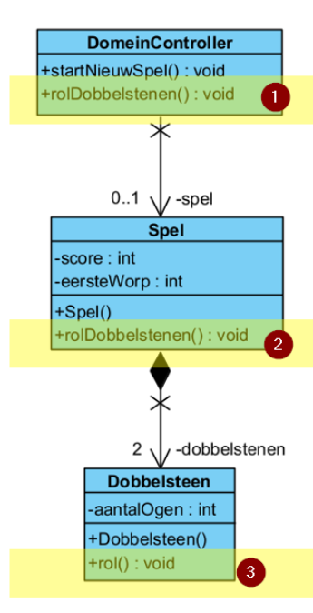

  - **Samengevat**:  
    - Systeemoperatie `rolDobbelstenen` komt in **DomeinController** (*CONTROLLER*).  
    - DomeinController is **EXPERT** van Spel en kan alleen maar delegeren door de methode `rolDobbelstenen` van Spel aan te roepen.  
    - Spel is **EXPERT** van Dobbelsteenobjecten en kan alleen maar delegeren door de methode `rol` van Dobbelsteen aan te roepen. Dit wordt op beide objecten één keer aangeroepen.  
    - Dobbelsteen is **EXPERT** van zijn eigen attribuut `aantalOgen` en kan het perfect een nieuwe randomwaarde toekennen.  

  - Daarmee is het ontwerp van de DOING-verantwoordelijkheid nog niet helemaal afgewerkt. Enkel het eerste punt van het OC is afgewerkt.  

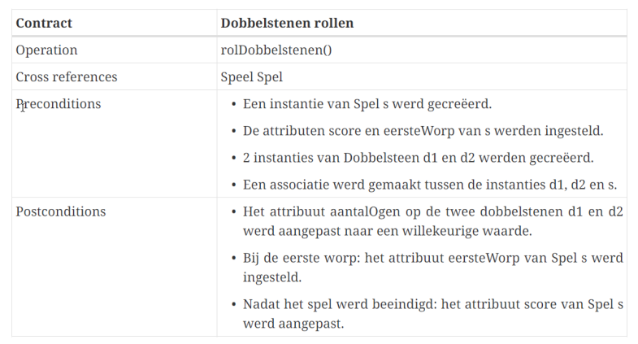
##### Uitwerking: punt 2

  - **We bekijken het tweede punt**: het attribuut `eersteWorp` van Spel `s` werd ingesteld bij de eerste worp.  
    - Wie is daarvoor verantwoordelijk? Welk patroon kunnen we hier gebruiken?  
    - Enkel EXPERT komt in aanmerking, het gaat niet over systeemoperaties en we maken geen nieuwe objecten. Dus dan denken we als volgt: welke informatie is nodig om deze verantwoordelijkheid te realiseren? En wie is expert van die informatie?  

    - **De functionaliteit die verwezenlijkt moet worden**:  
      - Het attribuut `eersteWorp` krijgt een nieuwe waarde.  
      - Op voorwaarde dat we de eerste keer rollen met de dobbelstenen.  

    - **Welke informatie is dus nodig?**  
      - Het attribuut `eersteWorp`.  
      - Eerste keer rollen? Bij de creatie van het Spel-object krijgt het attribuut `eersteWorp` de defaultwaarde 0. 0 kan nooit gerold worden met de dobbelstenen. Als we dus rollen en `eersteWorp` is nog 0, dan is dat de allereerste worp. Dus de huidige waarde van `eersteWorp` is belangrijk.  
      - De nieuwe waarde die we willen toekennen. Bij het rollen zal het attribuut `aantalOgen` van beide dobbelstenen een nieuwe waarde krijgen. De som van het `aantalOgen` van die dobbelstenen is de waarde van de nieuwe worp.  

    - **Wie is expert waarvan?**  
      - Dobbelsteen is EXPERT van attribuut `aantalOgen`.  
      - Spel is EXPERT van de twee dobbelstenen (we moeten de som kunnen maken).  
      - Spel is EXPERT van attribuut `eersteWorp`.  
      - DomeinController is EXPERT van spel.  

    - Het is belangrijk dat, nadat Spel heeft gevraagd aan de dobbelstenen om te rollen, de waarde van `aantalOgen` wordt opgevraagd van beide dobbelstenen, en dat de som ervan gemaakt wordt. Als de huidige waarde van `eersteWorp` 0 is, wordt bovendien die som ook toegekend aan `eersteWorp` 
    
    (enkel dan was het de eerste keer rollen).  

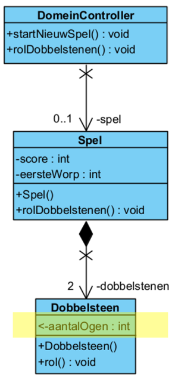

   - `rolDobbelstenen` in Spel is een methode die we al hadden. Qua functionaliteit hadden we daarin enkel het delegeren naar beide Dobbelsteenobjecten om te rollen.  
      - Nu gaan we direct daarna:  
        1. Beide dobbelsteenobjecten vragen wat de waarde is van `aantalOgen`. Om een waarde van een attribuut op te vragen, gebruiken we altijd een getter.  
        2. `eersteWorp` controleren op waarde 0, nieuwe waarde worp instellen voor `eersteWorp`. Spel is EXPERT voor deze zaken en kan deze taak perfect afhandelen in `rolDobbelstenen()`.  

   - Daarmee is ook het tweede punt van het OC uitgewerkt.  

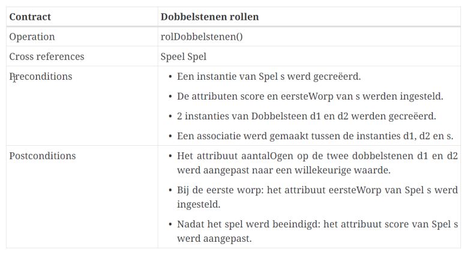

##### Uitwerking: punt 3

  - **We ronden dit stukje af met het realiseren van het derde punt**: attribuut `score` van Spel aanpassen (indien nodig).  
    - Het GRASP-patroon **EXPERT** zal ons helpen om te bepalen wie welke verantwoordelijkheid precies kan opnemen om `score` in te stellen.  

    - **Welke informatie hebben we hiervoor nodig?**  
      - Het attribuut `score` van klasse Spel.  

      - De nieuwe waarde waarop het ingesteld moet worden. Deze waarde wordt bepaald door een domeinregel:  
        - Gooit de speler bij de eerste worp 7 of 11 dan eindigt het spel met score 2.  
        - Gooit de speler bij de tweede of één van de daaropvolgende worpen:  
          - een 7 of een 11, dan eindigt het spel met score 0.  
          - eenzelfde aantal ogen als dat van de eerste worp, dan eindigt het spel met score 1.  

      - We hebben dus volgens de domeinregel nood aan de waarde van de **huidige worp** en de waarde van de **eerste worp**. 
	      - Dus we hebben opnieuw nood aan de som van `aantalOgen` van beide dobbelstenen 
	      - en aan de waarde van `eersteWorp`, attribuut van `score`.  

    - Om te weten of we de eerste keer rollen, moeten we net vóórdat de eerste worp bepaald wordt de `score` kunnen instellen. 
	    - Eens `eersteWorp` gewijzigd is, kunnen we niet meer achterhalen of we nu bezig zijn met de eerste worp of een volgende. 
	    - Maar als we net voor dat moment de `score` bepalen, dan is Spel EXPERT van de nodige info.  

    - In de methode `rolDobbelstenen` hadden we al volgende functionaliteit bedacht:  
	      1. Delegeren naar beide Dobbelsteenobjecten om te rollen.  
	      2. Ophalen van `aantalOgen` van beide dobbelstenen en som bepalen.  
	      3. De eerste worp bepalen.  

    - Net vóór dat laatste puntje zouden we dus de `score` moeten bepalen. 
	    - Spel heeft net de som bepaald (=ogen van de worp). 
		    - Waardoor we de `score` nu kunnen bepalen, op basis van ogen van de worp (som berekend in punt 2) 
		    - en het attribuut `eersteWorp`. 
		- Alle nodige info is aanwezig om die `score` te berekenen.  

    - Daarmee zijn alle punten van het OC afgewerkt en krijgen we deze functionaliteit in `rolDobbelstenen`:  
      1. Delegeren naar beide Dobbelsteenobjecten om te rollen.  
      2. Ophalen van `aantalOgen` van beide dobbelstenen en som bepalen.  
      3. Score bepalen.  
      4. De eerste worp bepalen.  

##### Eindconclusie uitwerking punt 1, 2 en 3

- Wat hebben we gerealiseerd:  
      - Nieuwe waarden op `aantalOgen` van de Dobbelsteenobjecten.  
      - Nieuwe waarde van `score` en `eersteWorp`.  
      - Dit zijn attributen van het Spelobject. Kunnen we deze informatie verliezen? Nee, de waarde van attributen zit opgeslagen in een object. De dobbelsteenobjecten worden al bewaard door Spel, het Spelobject wordt al bewaard door de DomeinController.  

- **De DOING-methode `rolDobbelstenen` is helemaal uitgewerkt.**  
      - De tweede systeemoperatie vanop het SSD hadden we opgesplitst in DOING en KNOWING. De eerste methode (DOING) is volledig ontworpen, het "plan" (=DCD) ligt klaar om geïmplementeerd te worden (zie stap 6. *Van DCD naar Java*).

### Stap 2 voor KNOWING-verantwoordelijkheid: Bepaal methode

  - Dan kijken we nu naar de KNOWING-verantwoordelijkheid, ook daar moeten we 1 of meerdere methodes voor definiëren.  
  - *Stap 2: Definieer voor elke verantwoordelijkheid uit stap 1 een methode.*  
  - Op het SSD staan 2 terugkeerpijlen: `aantalOgenWorp` en `score`. Als de gegevens die opgesomd staan op de pijlen samenhoren, kan je 1 methode definiëren. Hoort het niet echt samen dan maak je beter meerdere methodes.  
  - In dit concrete geval ga je telkens je werpt het `aantalOgenWorp` teruggeven en `score` geef je helemaal op het eind maar 1 keer terug. We kunnen het beter opsplitsen in 2 methodes.  

  - **De eerste methode** moet dus het aantal ogen van de worp teruggeven:  
    - **Naam**: `geefAantalOgenWorp` zou een goede naam kunnen zijn.  
    - **Parameters**: geen  
    - **Returntype**: als je het returntype niet goed kunt vastleggen, probeer je je heel concreet voor te stellen wat zou kunnen terugkeren. Hier gaat het over het aantal ogen van de worp. Mogelijk waarden kunnen zijn: 2, 7, 12, 8, enz… Dit zijn gehele getallen, dus het returntype zal `int` zijn.  

  - **De tweede methode** moet de score teruggeven:  
    - **Naam**: `geefScore`  
    - **Parameters**: geen. De score wordt bepaald in het systeem. Er moet geen informatie van buitenaf in het systeem gebracht worden om die score te kunnen bepalen.  
    - **Returntype**: de score kan zijn 0, 1 of 2 (zie domeinregel). Dus ook hier weer kunnen we het type `int` gebruiken.  

  - **36Samengevat**: 3 systeemoperaties  
    1. `rolDobbelstenen(): void` (DOING, al uitgewerkt op DCD)  
    2. `geefAantalOgenWorp(): int` (KNOWING)  
    3. `geefScore(): int` (KNOWING)  

### Stap 3A voor geefAantalOgenWorp(): Controller pattern toepassen

  - Een KNOWING-methode geeft informatie vanuit het systeem terug aan de user interface.  
  - De systeemoperatie zelf krijgt uiteraard terug een plaats in de klasse **DomeinController**. We baseren ons hiervoor op het GRASP-patroon CONTROLLER.  
  - De DomeinController moet dus de gevraagde gegevens kunnen teruggeven aan de user interface. Om dit mogelijk te maken, voegen we `geefAantalOgenWorp()` toe aan de DomeinController.  

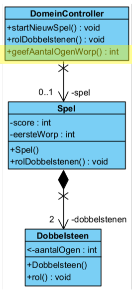
### Stap 3B voor geefAantalOgenWorp(): Deelverantwoordelijkheden toekennen aan de juiste klassen

  - Bij het ontwerpen van een KNOWING-methode gaan we, na het toevoegen aan de DomeinController, telkens op zoek naar waar de gevraagde informatie precies gevonden kan worden. Wie is expert van die informatie? Als de informatie niet bij de DomeinController zit, moeten we die informatie op één of andere manier, door het volgen van een ketting, bij de DomeinController krijgen.  
  - **Voor `geefAantalOgenWorp()` vragen we ons dus af**: "Welke informatie hebben we nodig?"  
    - De som van het `aantalOgen` van beide dobbelstenen.  

  - **Waar bevindt die informatie zich in het systeem?**  
    - Een **Dobbelsteenobject** is expert van zijn attribuut `aantalOgen`.  
    - Het **Spelobject** is expert van de 2 Dobbelsteenobjecten.  
    - De **DomeinController** is expert van het Spelobject.  

  
    - User interface → (1) → DomeinController → (2) → Spel → (3) → Dobbelsteenobjecten 

		1. Vanuit de user interface wordt de vraag gesteld om het aantal ogen van de worp te geven, 
			  - met andere woorden de systeemoperatie `geefAantalOgenWorp` wordt aangeroepen.

		2. De DomeinController zelf heeft niet de nodige informatie om direct antwoord te kunnen geven op deze vraag. 
			- Het DomeinControllerobject moet beroep doen op andere objecten om aan deze gegevens te geraken. 
			- Aangezien hij expert is van het Spelobject, 
				- delegeert de DomeinController en vraagt dus aan het Spelobject wat het aantal ogen is van de worp.  
			     - Die vraag stellen zorgt voor een nieuwe methode in Spel. `geefAantalOgenWorp` is opnieuw een goede naam. 
			     - Als antwoord terug verwachten we een geheel getal, dus het returntype is `int`.

		3. Spel heeft ook niet onmiddellijk antwoord op die vraag en moet ook beroep doen op andere objecten om de juiste informatie te bekomen.
			- Spel is expert van de 2 Dobbelsteenobjecten en vraagt aan beide objecten de waarde van hun attribuut `aantalOgen`. 
			- Hiervoor is al een getter gedefinieerd.  
			
	- Eens beide objecten antwoord gegeven hebben, kan Spel de beide getallen optellen en op dat moment heeft 
		- Spel nu de nodige informatie om dan een antwoord terug te kunnen sturen naar de DomeinController.  

  - Probeer deze weg goed in je hoofd te volgen a.d.h.v. het DCD.  

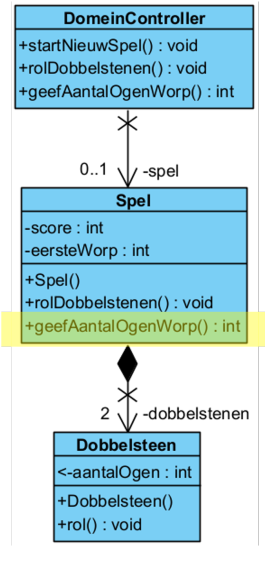
### Stap 3A voor geefScore(): Controller pattern toepassen)

  - Dan hebben we ook nog `geefScore(): int`, de tweede KNOWING-systeemoperatie.  
  - Ook deze methode voegen we eerst toe aan de DomeinController voordat we verder kijken wie expert is over deze informatie.  

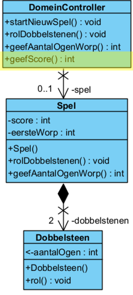
### Stap 3B voor `geefScore()`: Deelverantwoordelijkheden toekennen aan de juiste klassen

  - Welke informatie hebben we nodig? De **score**. Wie is daar expert van? Spel, en de DomeinController is op zijn beurt expert van het Spelobject.  
  - De systeemoperatie `geefScore()` wordt aangeroepen. DomeinController kent geen score, dus moet rekenen op de hulp van een ander object. DomeinController is expert van Spel en vraagt aan Spel de score. `score` is een attribuut van Spel, vandaar dat de score met een getter wordt opgevraagd.  
  - Spel kan onmiddellijk een antwoord terugsturen naar de DomeinController. Op zijn beurt heeft hij nu het antwoord om terug te sturen naar de user interface.  

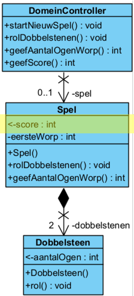

  - **Daarmee zijn we op het eind van het ontwerp van die 2de systeemoperatie op het DCD.**  
    - Maar voor we het DCD kunnen omzetten in code, moeten we controleren of alle onderdelen op het SSD zijn verwerkt in het DCD.


## Stappenplan uitwerken voor stopvoorwaarde van de loop

  - We hebben nu een klassendiagram opgebouwd voor de twee systeemoperaties vanop het SSD.  
  - Het SSD is echter nog niet volledig verwerkt. We zien nog een loop met stopvoorwaarde op het SSD. Ook hiervoor moet bekeken worden of er methodes moeten worden toegevoegd aan het DCD.  

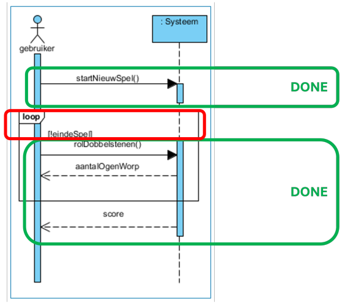

  - **De loop op het SSD** heeft een "stopvoorwaarde", die vertelt ons **hoeveel keer** de communicatie in het frame herhaald wordt. Deze stopvoorwaarde kan twee vormen aannemen:  
    - **Gestuurd door de actor**: bijvoorbeeld zolang de speler wenst te spelen.  
    - **Gestuurd door het systeem**: zolang niet op het einde van het spel.  
  - In dit voorbeeld wordt het aantal keer dat je kan herhalen **gestuurd door het systeem**, of met andere woorden door de businesslogica in het domein. De domeinregels bepalen wanneer we op het einde van het spel zijn.  
  - Dat wil zeggen dat deze stopvoorwaarde ook een **systeemoperatie** oplevert. Vanuit de user interface moet namelijk aan het systeem gevraagd worden of we op het eind van het spel zijn of niet. Dus van deze systeemoperatie moet ook een ontwerp gemaakt worden.

  - **Als er voor de stopvoorwaarde** te bepalen **geen** informatie nodig is uit het domein, hoef je **geen** aanpassingen te doen aan het ontwerp.  
  - Als er voor de stopvoorwaarde **wel** informatie nodig is uit het domein, moet je **wel** aanpassingen doen aan het ontwerp.

### Stap 1: DOING/KNOWING

  - *Stap 1: Vertrek van het SSD en bepaal voor elke systeemoperatie de doing en/of knowing verantwoordelijkheden.*  
  - We willen vragen aan het systeem of het einde van het spel bereikt is of niet, we willen dus **informatie** krijgen. Dit is een typische KNOWING-verantwoordelijkheid.  
  - Is er ook een DOING-verantwoordelijkheid? Nee, er verandert geen enkel object (anders zou er een OC zijn!), en er hoeven bij het stellen van deze vraag geen extra tussentoestanden bijgehouden te worden.  
  - Dus **geen** DOING.

### Stap 2: Bepaal methode

  - Een **betekenisvolle naam**: `isEindeSpel`. De naam van een methode waarop het antwoord ja/nee (of true/false) is, begint heel vaak met het woord `is`.  
  - **Parameters**: nee, vanuit de user interface moet geen info doorgegeven worden aan het systeem om het antwoord te kunnen formuleren. Alle info is reeds aanwezig in het systeem om het antwoord te kunnen “berekenen”.  
  - **Returntype**: `boolean`, als er slechts twee antwoorden mogelijk zijn, is het een goede gewoonte om `boolean` te gebruiken.  
  - Op het DCD plaatsen we in stap 3A deze methode: `isEindeSpel(): boolean`.
### Stap 3A: Controller pattern toepassen

  - Wie is verantwoordelijk voor het ontvangen van de nieuwe systeemoperatie?  
  - **CONTROLLER** zegt dat de **DomeinController** hiervoor verantwoordelijk is.

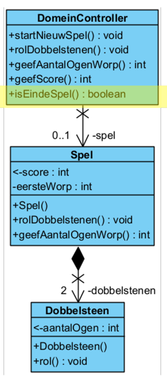
### Stap 3B: Deelverantwoordelijkheden toekennen aan de juiste klassen

  - De **DomeinController** krijgt dus de vraag binnen of we op het eind van het spel zitten of niet. Maar ons DomeinController-object **weet** dit niet. Er zal dus hulp nodig zijn van andere objecten.  
  - Wie weet of we op het einde van het spel zitten? Wie is **EXPERT** van deze informatie?  
  - Als de `score` van het Spelobject 0, 1 of 2 is, dan zijn we op het einde van het spel (zie domeinregel). Elke keer na het rollen wordt dit nagekeken en wordt `score` correct aangepast indien nodig. Dat wil dus zeggen dat we a.d.h.v. de waarde van `score` kunnen beslissen of we aan het eind van het spel zitten. Het Spelobject is **EXPERT** van zijn eigen attribuut `score`. Aan Spel kan dus gevraagd worden of we op het eind zitten of niet.  
  - Wie kan dat vragen aan Spel? Wie is **EXPERT** van het Spelobject? De DomeinController, via de navigeerbare associatie.  
  - Als de vraag dus binnenkomt bij de DomeinController, kan deze op zijn beurt gewoon de vraag delegeren naar Spel. Spel heeft geen hulp meer nodig van andere objecten om een antwoord te formuleren op deze vraag. A.d.h.v. zijn attribuut `score`, kan hij direct een antwoord terugsturen naar de DomeinController.

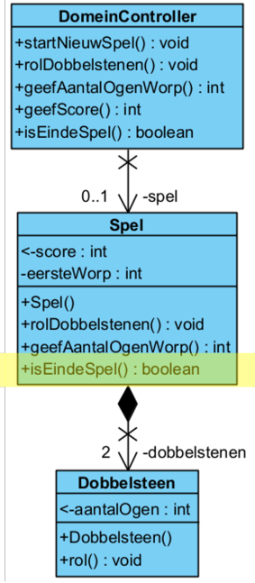

- **Aangezien we** het volledige SSD met alle bijhorende OC’s hebben verwerkt **én** er geen alternatieve verlopen zijn bij deze use case, is het ontwerp van de eerste iteratie **klaar**.

# Van DCD naar Java

- We zetten **DCD** (Domain Class Diagram (**software klassendiagram**)) naar **Java** **software klassen**

## De basis: klasse, attribuut en methode definiëren

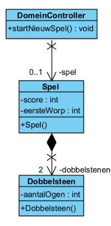

  - Het ontwerp van deze systeemoperatie levert ons een DCD op. 
	  - Dit DCD kunnen we nu omzetten naar Javacode.
	      
  - Op ons DCD staan 3 klassen. Denk eraan dat deze drie klassen in de package `domein` komen te staan.  

  - Vanuit hoofdstuk 3 hebben we onderstaande code al onder de knie:

    ```java
    package domein;
    public class DomeinController {
        public void startNieuwSpel() {
        }
    }
    ```

    ```java
    package domein;
    public class Spel {
        private int score;
        private int eersteWorp;

        public Spel() {
        }
    }
    ```

    ```java
    package domein;
    public class Dobbelsteen {
        private int aantalOgen;

        public Dobbelsteen() {
        }
    }
    ```

  - **Wat ontbreekt nog in deze code?**  
    - Vertaling van de navigeerbare associaties in Java  
    - Implementatie van de systeemoperatie  
    - Implementatie van de 2 constructoren  

## Associaties, delegeren, constructor en List  

  **DomeinController**  
  ```java
  package domein;
  public class DomeinController {
      private Spel spel;                // ①

      public void startNieuwSpel() {
          setSpel(new Spel());         // ②
      }

      private void setSpel(Spel spel) {
          this.spel = spel;            // ③
      }
  }
```

1. Dit is de implementatie van de navigeerbare associatie tussen `DomeinController` en `Spel`. De DomeinController kent maximaal 1 object van klasse `Spel`. In de klasse `DomeinController` komt dus een extra attribuut dat maximaal 1 `Spel`-object kan bijhouden. Het datatype van dat attribuut is dus `Spel`, de naam van het attribuut komt overeen met de rolnaam vanop het DCD. Let op: attributen worden altijd afgeschermd. Vergeet dus niet het woord `private`.
    
2. We implementeren de systeemoperatie. Om te weten welke code we moeten schrijven, is het belangrijk om goed te kunnen verwoorden wat de precieze functionaliteit is van de methode. Daarover is al nagedacht bij het ontwerp. De DomeinController krijgt hier de verantwoordelijkheid om een `Spel`-object aan te maken en ook bij te houden.
    
    - Om een Spelobject aan te maken roepen we de constructor aan van `Spel`.
    - Om dat Spelobject bij te houden hebben we een attribuut, dus het nieuw aangemaakte object moet toegekend worden aan het attribuut `spel`.
    - Dat gebeurt via een setter. De code hier is een korte notatie voor:
        
        ```java
        Spel spelletje = new Spel();
        setSpel(spelletje);
        ```
        
    - Het is dus niet nodig om een nieuwe variabele te declareren om dat object even bij te houden; je kunt het gecreëerde object onmiddellijk doorgeven aan de setter.
3. Om het attribuut `spel` een waarde toe te kennen, is er een setter toegevoegd aan de klasse. Let erop dat je zoveel mogelijk setters afschermt, tenzij het ontwerp uitwijst dat dit niet mogelijk is.
    

**Spel**

```java
package domein;
import java.util.ArrayList;
import java.util.List;

public class Spel {
    private int score;
    private int eersteWorp;
    private List<Dobbelsteen> dobbelstenen;   // ①

    public Spel() {
        setScore(-1);                        // ②
        setEersteWorp(0);
        dobbelstenen = new ArrayList<>();    // ③
        for (int i = 1; i <= 2; i++)          // ④
            dobbelstenen.add(new Dobbelsteen());
    }

    private void setEersteWorp(int eersteWorp) {
        if ((eersteWorp > 1 && eersteWorp < 13) || eersteWorp == 0)
            this.eersteWorp = eersteWorp;
    }

    private void setScore(int score) {
        if (score >= -1 && score < 3)
            this.score = score;
    }
}
```

1. Het Spelobject kent exact 2 objecten van de klasse `Dobbelsteen`. In de klasse `Spel` komt dus een attribuut dat meerdere objecten van `Dobbelsteen` kan bijhouden. We zagen eerder in dit hoofdstuk dat er twee mogelijke notaties zijn qua datatype: `Dobbelsteen[]` of `List<Dobbelsteen>`. We kiezen hier voor de tweede soort verzameling, `List<Dobbelsteen>`. (In volgende hoofdstukken komen verschillende soorten verzamelingen nog aan bod.) Neem ook de gegevens van de associatie over om het attribuut te definiëren: het minteken wordt `private`, de rolnaam neem je over als naam, en de keus van datatype is zojuist besproken. Om `List` te kunnen gebruiken, moeten we een extra `import`-regel toevoegen aan onze code:
    
    ```java
    import java.util.List;
    ```
    
2. Bij de implementatie van een constructor moet je er altijd voor zorgen dat alle attributen correct geïnitialiseerd zijn.
    
    - `score`: geef het een waarde naar keuze die geen eindscore (0, 1 of 2) is, want die heeft een speciale betekenis.
    - `eersteWorp`: geef het een waarde die niet gerold kan worden.
    - Beide attributen kan je instellen via een private setter. Ze hebben maar een bepaalde range van waarden die toegelaten zijn. Controleer hierop in de setter.
3. Met deze instructie initialiseren we het attribuut `dobbelstenen`. Dat wil eigenlijk zeggen dat we hier een lege verzameling aanmaken. Deze verzameling kan `Dobbelsteen`-objecten bevatten, maar in eerste instantie is ze dus leeg.
    
    - Het is belangrijk om eerst een verzameling objecten aan te maken, enkel dan kan de verzameling in een volgende stap opgevuld worden.
    - Die lege verzameling is een nieuw object dat je maakt. We gebruiken de constructor van de klasse `ArrayList`, voorafgegaan door het woord `new`. We gebruiken de constructor zonder parameters. Let op de tekens `<>`. Later in de opleiding wordt de betekenis hiervan nog duidelijker.
4. Bij het ontwerp hadden we vastgelegd dat Spel verantwoordelijk was voor het creëren van 2 `Dobbelsteen`-objecten en ze ook bij te houden.
    
    - Een dobbelsteenobject aanmaken en het toevoegen aan de verzameling (= bijhouden), dat geheel wordt twee keer herhaald. Daar gebruiken we een tellergestuurde lus voor.
    - Een `Dobbelsteen`-object wordt aangemaakt door de constructor aan te roepen:
        
        ```java
        new Dobbelsteen()
        ```
        
    - Dat object wordt onmiddellijk bewaard in de verzameling. Om een object toe te voegen aan een ArrayList-object, moet je **communiceren** met dat object. Via de puntnotatie roep je de methode `add` aan en je geeft het object dat in de verzameling moet komen door als parameter. Let op: als je in de declaratie van de variabele zei dat het een verzameling is van `Dobbelsteen`-objecten, dan kan je alleen maar `Dobbelsteen`-objecten toevoegen. Als je een ander type object probeert toe te voegen (bv. een stukje tekst), krijg je een compilatiefout.

**Dobbelsteen**

```java
package domein;
public class Dobbelsteen {
    private int aantalOgen;

    public Dobbelsteen() {
        setAantalOgen(1);      // ①
    }

    private void setAantalOgen(int aantalOgen) {
        if (aantalOgen > 0 && aantalOgen < 7)
            this.aantalOgen = aantalOgen;
    }
}
```

1. In de constructor van `Dobbelsteen` initialiseren we het enige attribuut dat de klasse rijk is, nl. `aantalOgen`. Hier werd gekozen om het telkens op 1 in te stellen. 1 is een waarde uit het toegelaten interval [1,6]. Je zou ook code kunnen schrijven die een willekeurige waarde kiest uit dit interval om toe te kennen aan `aantalOgen`. De waarde toekennen aan het attribuut gebeurt opnieuw via een private setter. Die private setter controleert of de waarde inderdaad tot het juiste interval behoort.


## Volledig ontwerp implementeren
    
   - Na die eerste DOING-verantwoordelijkheid van de eerste systeemoperatie, zijn we verder gegaan met ontwerpen. Bij de tweede systeemoperatie hadden we 3 nieuwe systeemoperaties gedefinieerd en ook verder ontworpen.
   - We bekijken hieronder de implementatie hiervan.
    
   **DomeinController**
    
   ```java
    package domein;
    public class DomeinController {
        private Spel spel;
    
        public void startNieuwSpel() {
            setSpel(new Spel());
        }
    
        public void rolDobbelstenen() {             // ①
            spel.rolDobbelstenen();
        }
    
        public int geefAantalOgenWorp() {           // ②
            return spel.geefAantalOgenWorp();
        }
    
        public int geefScore() {                    // ③
            return spel.getScore();
        }
    
        public boolean isEindeSpel(){               // ④
            return spel.isEindeSpel();
        }
    
        private void setSpel(Spel spel) {
            this.spel = spel;
        }
    }
    ```
    
   1. We implementeren de DOING-verantwoordelijkheid van de 2de systeemoperatie. Bij het ontwerp hebben we nagedacht over de correcte definitie van de methode. Deze nemen we exact over in de code. De DomeinController is expert van het spelobject en delegeert dan het rollen van de dobbelstenen verder aan `spel`. Delegeren is opnieuw communiceren met het object. Dan doen we via de puntnotatie:
        
        ```java
        referentievariabele . methodenaam ( //concrete waarden voor parameters );
        ```
        
        Onze referentievariabele is het spelobject, het attribuut `spel`. We roepen de methode `rolDobbelstenen` aan. Deze heeft geen parameters, dus we moeten geen concrete waarden doorgeven.
        
   2. We implementeren de KNOWING-verantwoordelijkheid `geefAantalOgenWorp`. De DomeinController heeft niet de nodige informatie om een antwoord te formuleren op de vraag. Hij delegeert naar het Spelobject. Hij vraagt de informatie op bij `spel` en geeft het antwoord dat het Spelobject hem geeft dan terug als antwoord. Dat doen we met het statement `return`. Let ook hier weer op het gebruik van de puntnotatie om te communiceren met `spel`.
        
   3. De implementatie van de KNOWING-verantwoordelijkheid `geefScore` is volledig gelijkaardig aan die van `geefAantalOgenWorp` (zie puntje 2).
        
   4. De DomeinController delegeert naar `spel` en stuurt het antwoord dat hij terugkrijgt van `spel` terug naar de user interface. Ook deze code is gelijkaardig aan de KNOWING van `geefAantalOgenWorp` (zie puntje 2).
        
    
   **Spel**
    
   ```java
    package domein;
    import java.util.ArrayList;
    import java.util.List;
    
    public class Spel {
        private int score;
        private int eersteWorp;
        private List<Dobbelsteen> dobbelstenen;
    
        public Spel() {
            setScore(-1);
            setEersteWorp(0);
            dobbelstenen = new ArrayList<>();
            for (int i = 1; i <= 2; i++)
                dobbelstenen.add(new Dobbelsteen());
        }
    
        public void rolDobbelstenen() {               // ①
            int aantalOgenHuidigeWorp = 0;
            for (Dobbelsteen d : dobbelstenen) {
                d.rol();
                aantalOgenHuidigeWorp += d.getAantalOgen();
            }
            bepaalScore(aantalOgenHuidigeWorp);
            bepaalEersteWorp(aantalOgenHuidigeWorp);
        }
    
        private void bepaalEersteWorp(int aantalOgenWorp) {   // ②
            if (eersteWorp == 0) {
                setEersteWorp(aantalOgenWorp);
            }
        }
    
        private void bepaalScore(int aantalOgenWorp) {        // ③
            if (eersteWorp == 0 && (aantalOgenWorp == 7 || aantalOgenWorp == 11))
                setScore(2);
            else if (aantalOgenWorp == 7 || aantalOgenWorp == 11)
                setScore(0);
            else if (aantalOgenWorp == eersteWorp)
                setScore(1);
        }
    
        public int geefAantalOgenWorp() {                    // ④
            int aantalOgenHuidigeWorp = 0;
            for (Dobbelsteen d : dobbelstenen) {
                aantalOgenHuidigeWorp += d.getAantalOgen();
            }
            return aantalOgenHuidigeWorp;
        }
    
        private void setEersteWorp(int eersteWorp) {
            if ((eersteWorp > 1 && eersteWorp < 13) || eersteWorp == 0)
                this.eersteWorp = eersteWorp;
        }
    
        private void setScore(int score) {
            if (score >= -1 && score < 3)
                this.score = score;
        }
    
        public int getScore() {                              // ⑤
            return score;
        }
    
        public boolean isEindeSpel(){                        // ⑥
            return (score >= 0 && score <= 2);
        }
    }
    ```
    
   1. We implementeren de ontworpen functionaliteit in `rolDobbelstenen` in de klasse `Spel`.
        
        - **Overzicht functionaliteit**:
            1. Delegeren naar beide `Dobbelsteen`-objecten om te rollen
            2. Ophalen van `aantalOgen` van beide dobbelstenen en som bepalen
            3. Bepalen van de score
            4. Bepalen van de eerste worp
        - We willen eerst de 2 dobbelsteenobjecten laten rollen. Dit kan door te **communiceren** met beide objecten. We hebben 1 referentievariabele: de verzameling waar de dobbelsteenobjecten in zitten. We overlopen dus alle objecten in de verzameling met een enhanced for-lus.


        - **Gebruik van enhanced for**
            - Als je alle objecten van een verzameling overlopen wilt, gebruik je een enhanced for.
                
            - De verzameling objecten die we hier willen overlopen is `dobbelstenen`.
                
            - Voor elk `Dobbelsteen`-object in de verzameling ga je:
                
                1. rollen
                2. aantal ogen opvragen
            - Je declareert een referentievariabele, hier `Dobbelsteen d`. Bij de eerste iteratie verwijst `d` naar het eerste object, bij de volgende iteratie verwijst `d` naar het volgende, enzovoort, tot alle objecten zijn overlopen.
                
                ```java
                for (Dobbelsteen d : dobbelstenen) {
                    d.rol();
                    aantalOgenHuidigeWorp += d.getAantalOgen();
                }
                ```
            - De algemene schrijfwijze van een enhanced for is:
                ```java
                for ( declaratieVariabele : verzameling ) {
                    //…
                }
                ```


        - Zodra we gerold hebben met een dobbelsteen, kunnen we de nieuwe waarde opvragen van `aantalOgen` op dat dobbelsteenobject via de getter. Zo berekenen we de som van het `aantalOgen` op alle dobbelstenen.
        - Daarna moeten `score` en `eersteWorp` ingesteld worden. 
	        - Als dit allemaal in de methode `rolDobbelstenen` komt, wordt deze erg groot. 
	        - Om dit te vermijden, plaatsen we de logica voor het bepalen van de score en de eerste worp in 2 aparte private methodes: `bepaalScore` en `bepaalEersteWorp`. Let op de volgorde: **eerst** `bepaalScore` en **daarna** `bepaalEersteWorp`.

```jav
methodenaam ( indien nodig concrete waarden voor parameters ) ;
```

- Je kan dit volledig vergelijken met het aanroepen van een setter vanuit de constructor.

- De beide hulpmethodes hebben informatie nodig uit `rolDobbelstenen`, namelijk het aantal ogen van de worp. 
	- We moeten er dus telkens 1 parameter aan toevoegen die deze waarde doorgeeft. 
	- Zorg dat het datatype van wat je doorgeeft overeenkomt met hoe die parameter gedefinieerd werd.
	- De variabele `aantalOgenHuidigeWorp` is een int, dus die waarde kan je inderdaad doorgeven.


  2. De private hulpmethode `bepaalEersteWorp` ontvangt via de parameter hoeveel er zonet geworpen werd met de beide dobbelstenen.
        
        - Je kunt de functionaliteit zo beschrijven:
            - ALS het de eerste keer werpen is (eersteWorp == 0)
                - DAN stellen we het attribuut `eersteWorp` in op de waarde van de parameter
            - ANDERS doen we niets.

        - Gebruik de controlestructuren uit hoofdstuk 2 om dit te vertalen naar Java.

 3. De methode `bepaalScore` zet de domeinregel i.v.m. de score om in Javacode. In de domeinregel worden 3 gevallen beschreven (score = 0, 1, of 2). Via selectiestructuren testen we in welk geval we ons bevinden en stellen dan de score in door de setter aan te roepen.
        
  4. De methode `geefAantalOgenWorp` geeft als antwoord de som terug van het aantal ogen dat nu op beide dobbelstenen staat. Bij het ontwerp zagen we dat Spel nog moet delegeren naar `Dobbelsteen`. Spel is Expert van de beide dobbelsteenobjecten en gaat dus via de puntnotatie communiceren met deze objecten. We vragen het `aantalOgen` op via de getter en tellen die waarden op. Dat is dan het antwoord van de methode.
        
  5. De DomeinController kan via deze getter de `score` opvragen. Een getter heeft nooit “speciale” code; de code ziet er altijd identiek uit en kan eigenlijk automatisch gegenereerd worden in Eclipse.
        
  6. Spel controleert of `score` de waarde 0, 1 of 2 heeft. Enkel dan hebben we het einde van het spel bereikt.
        
- **Tip**: De voorwaarde waarop gecontroleerd wordt, levert een `true` of `false` op. Geef die gewoon terug. Dus dit is voldoende:
```java
return (score >= 0 && score <= 2);
```
- Je hoeft geen `if/else`-structuur te gebruiken.


   **Dobbelsteen**
    
   ```java
    package domein;
    import java.security.SecureRandom;
    
    public class Dobbelsteen {
        private int aantalOgen;
        private SecureRandom sr;                  // ①
    
        public Dobbelsteen() {
            setAantalOgen(1);
            sr = new SecureRandom();             // ①
        }
    
        public void rol() {
            setAantalOgen(1 + sr.nextInt(6));    // ①
        }
    
        private void setAantalOgen(int aantalOgen) {
            if (aantalOgen > 0 && aantalOgen < 7)
                this.aantalOgen = aantalOgen;
        }
    
        public int getAantalOgen() {            // ②
            return aantalOgen;
        }
    }
    ```
    
  1. In de methode `rol` willen we een nieuwe waarde toekennen aan het attribuut `aantalOgen`. De nieuwe waarde is een willekeurige waarde uit het interval [1–6].
        
        - In Java kan je willekeurige getallen genereren via een object van de klasse `SecureRandom` (package `java.security.SecureRandom`). Maak hiervan eerst een object aan door de default constructor aan te roepen.
        - Het object houden we bij als attribuut, zodat er een uniforme verdeling is (de kans dat 1 uitkomt is even groot als 2, enz.). Als we telkens bij het rollen een nieuw `SecureRandom`-object zouden aanmaken, is de kans groter dat de verdeling niet uniform is.
        - Die willekeurige waarde krijg je door de methode `nextInt` aan te roepen. Deze methode heeft 1 parameter: met de waarde 6 geef je aan dat je een getal wilt krijgen uit 6 verschillende mogelijkheden ([0–5]). Omdat je met een dobbelsteen geen 0 kunt gooien, tellen we er 1 bij op, zodat het interval [1–6] ontstaat.
  2. Getter van het attribuut `aantalOgen`.


## Uitvoerbare applicatie

- **Op deze manier** hebben we de ontworpen domeinklassen volledig geïmplementeerd.  
  - Wat kunnen we hiermee nu doen? De klassen zijn niet uitvoerbaar, we hebben nu dus een echte uitvoerbare klasse nodig, d.w.z. een klasse met een `main`-methode.  
  - In deze klasse vinden we:
    - **Aanmaken van exact 1 object** van de `DomeinController` (nodig als aanspreekpunt voor de domeinlaag).  
    - **Aanroepen van systeemoperaties** via het `DomeinController`-object. Zo wordt de businesslogica, die we geïmplementeerd hebben, uitgevoerd.  
    - **Invoer- en uitvoerinstructies**. In deze applicatie worden enkel uitvoerinstructies gebruikt: we drukken een aantal zaken af op het scherm.

```java
package cui;

import domein.DomeinController;

public class DobbelsteenApplicatie {
    public static void main(String[] args) {
        new DobbelsteenApplicatie().speelSpel();
    }

    private void speelSpel() {
        // creatie aanspreekpunt domeinlaag
        DomeinController dc = new DomeinController();
        dc.startNieuwSpel();

        while (!dc.isEindeSpel()) {
            dc.rolDobbelstenen();
            System.out.printf("Aantal ogen van de worp: %d.%n", dc.geefAantalOgenWorp());
        }

        System.out.printf("Score: %d.%n", dc.geefScore());
    }
}
````

- **Belangrijk**
    - Er is een belangrijk verband tussen deze applicatie en het SSD.
    - Kijk goed op het SSD naar de opeenvolgende pijlen en vergelijk die met het aanroepen van de systeemoperaties in de applicatie (Java-code).
    - De flow die je grafisch ziet op het SSD, lees je ook in de Javacode van de applicatie.

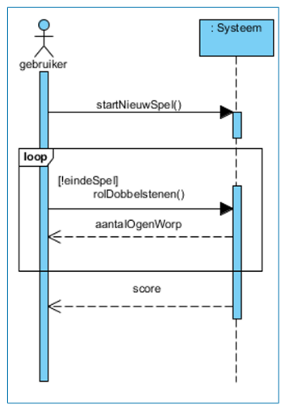
# DCD: ontwerp aanpassen met _private_ methodes

- Tijdens het implementeren van het ontwerp hebben we verschillende **private** methodes toegevoegd om de code overzichtelijker en herbruikbaarder te maken.
- Methodes toevoegen in de code om de code beter te maken is toegestaan, maar zet deze methodes dan wel `private`.
- Het is **wel belangrijk** om het DCD daarna te **updaten**. Door de private methodes ook toe te voegen aan het DCD, zorgen we ervoor dat het ontwerp en de implementatie op één lijn blijven.


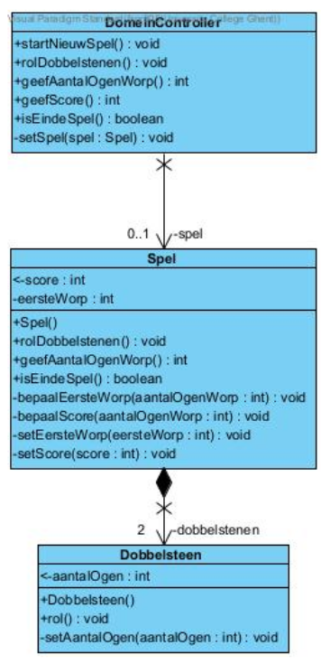
# Dobbelspel – Iteratie 2 – _Registreer_

- We hebben nu de eerste iteratie (normaal verloop van de eerste use case) volledig afgewerkt: zowel ontwerp als implementatie.
- Als we voor een bepaalde iteratie alle stappen doorlopen hebben (_analyse_, _ontwerp_, _implementatie_, _testen_ – zie later), dan kunnen we starten aan een tweede iteratie. 
	- De 2de iteratie kan een alternatief verloop zijn van de eerste use case (als deze een eigen SSD heeft). In dit geval is de 2de iteratie de 2de use case "**Registreer**".

- _Open deze pagina_ en bekijk de producten uit de analysefase bij iteratie 2 (use case **Registreer**). Van hieruit starten we opnieuw met de ontwerpfase.

## Stappenplan voor systeemoperatie 1

- De analysefase van iteratie 2 is afgerond, we hebben alle nodige producten. We starten aan het ontwerp

- We doorlopen opnieuw het 3-stappenplan voor elke systeemoperatie, te beginnen met de eerste: `startRegistratie()`.

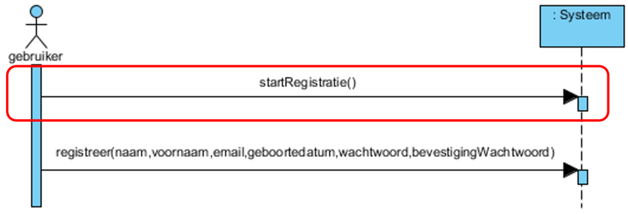
### Stap 1: DOING/KNOWING

> _Stap 1: Vertrek van het SSD en bepaal voor elke systeemoperatie de doing en/of knowing verantwoordelijkheden._

1. **Heeft `startRegistratie()` een DOING-verantwoordelijkheid?**
    
>    - **Algemene regel DOING**
        1. Als er een OC is, dan is er DOING-verantwoordelijkheid.
        2. Als de systeemoperatie functionaliteit bevat waarbij een domeinobject moet bijgehouden worden, dan is er DOING-verantwoordelijkheid.

  - **We passen deze regel toe voor `startRegistratie()`**
        1. Is er een OC voor deze systeemoperatie? Nee → maar daaruit kan je nog niet met 100% zekerheid besluiten dat er geen DOING-verantwoordelijkheid is!
        2. Moet er in de systeemoperatie iets gebeuren waarbij een domeinobject wordt bijgehouden?
            - Daarvoor moet je eerst goed weten wat deze systeemoperatie precies doet. 
	        - De werking staat beschreven in de use case. Je zoekt het blokje op waarmee deze systeemoperatie overeenkomt (zie lessen analyse). 
	        - Formuleer dan in eigen woorden wat er moet gebeuren.
 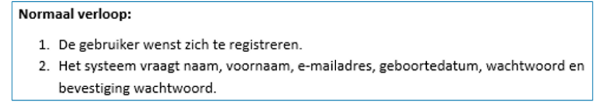
            - De gebruiker klikt ergens op het scherm om te laten weten dat hij wil registreren. 
	            - We krijgen dan een scherm te zien waar alle nodige gegevens ingevuld kunnen worden.
            - Moet hier iets **bewaard** worden? 
	            - Nee, want momenteel is er nog niets ingegeven, we hebben nog geen gegevens om te bewaren. 
	            - Er wordt enkel een scherm gemaakt waarop de gegevens dan kunnen worden ingevuld. 
	            - Dit is een verantwoordelijkheid die volledig door de user interface wordt afgehandeld (puur invoer/uitvoer).
            - → Dat wil zeggen dat er **geen** DOING-verantwoordelijkheid is.
2. **Heeft `startRegistratie()` een KNOWING-verantwoordelijkheid?**
    
>    - **Algemene regel KNOWING**
        - Als de systeemoperatie op het SSD een returnpijl heeft, is er een KNOWING-verantwoordelijkheid.

  - **We passen deze regel toe voor `startRegistratie()`**
        - Op het SSD zien we geen terugkeerpijl die hoort bij `startRegistratie`.
        - → Er is dus **geen** KNOWING-verantwoordelijkheid.

- **BESLUIT stap 1**: `startRegistratie()` heeft geen DOING- of KNOWING-verantwoordelijkheid.

### Stap 2: Bepaal methode

- De systeemoperatie heeft geen doing en geen knowing. We moeten **geen systeemoperatie** definiëren.

### Stap 3: Opsplitsen in deelverantwoordelijkheden

- Als er **geen** systeemoperatie is, kan er ook niets aangevuld worden op het DCD. We moeten geen ontwerp vervolledigen hier.


>- **Besluit**: die eerste systeemoperatie levert niets op voor het ontwerp. Er komt niets extra op het DCD (het klassendiagram van de package `domein`). Er moet dus ook niets extra geïmplementeerd worden in het domein.

> **Let op**: In de package van de user interface (dus onze applicatie) moet er wél functionaliteit uitgewerkt worden, zodat de gebruiker alle gegevens kan ingeven via het scherm.

## Stappenplan voor systeemoperatie 2

- We nemen dan de volgende systeemoperatie vanop het SSD, nl. `registreer(...)`. We doorlopen opnieuw het 3-stappenplan.

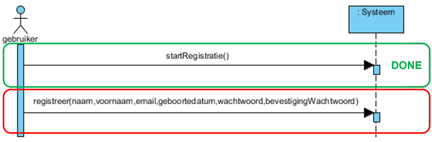

### Stap 1: DOING/KNOWING

- Er is een bijhorend **OC**, dus zeker DOING-verantwoordelijkheid.
- Er is geen terugkeerpijl, dus geen KNOWING-verantwoordelijkheid.

### Stap 2: Bepaal methode

- **Betekenisvolle naam**: In deze methode zal er een **speler** geregistreerd worden. Dit wil zeggen dat we met alle gegevens die we krijgen een `Speler`-object zullen maken en dat ergens bewaren. Dan is de speler geregistreerd. De naam `registreer` dekt de lading van de methode.
    
- **Parameters**: op het SSD zien we een hele reeks van parameters staan. Die nemen we over. Om een speler te kunnen registreren, hebben we inderdaad al die data nodig. Vergeet niet voor elke parameter het datatype te bepalen.
    
- **Returntype**: `void`. Nooit aan twijfelen! Een DOING-verantwoordelijkheid heeft altijd `void` als returntype.
    
- **Systeemoperatie**:
    
    ```java
    registreer(
      naam:String,
      voornaam:String,
      email:String,
      geboorteDatum:LocalDate,
      wachtwoord:String,
      bevestigingWachtwoord:String
    ): void
    ```
    

### Stap 3A: Controller pattern toepassen

- We beginnen met de systeemoperatie een plek te geven op het DCD. Volgens het **CONTROLLER**-patroon is de **DomeinController** hiervoor verantwoordelijk.

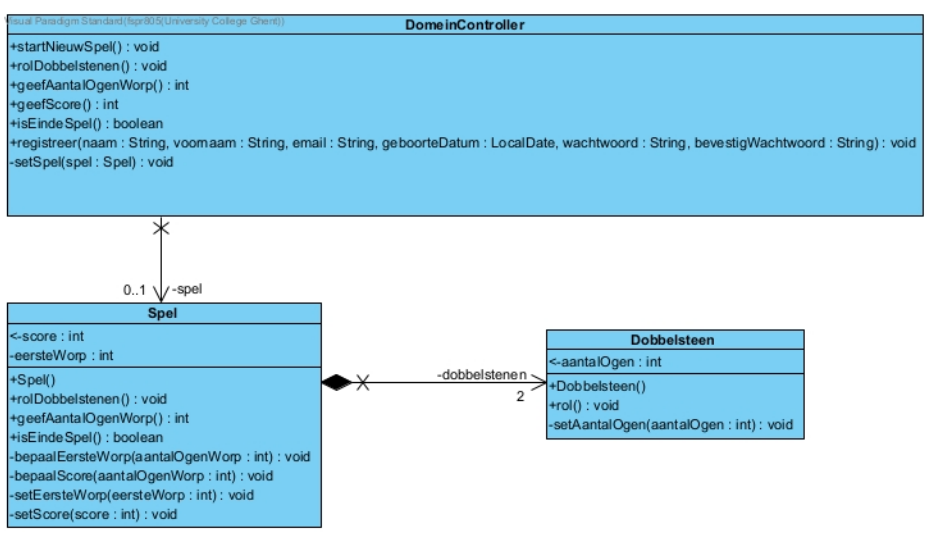
### 8.2.4. Stap 3B: Deelverantwoordelijkheden toekennen aan de juiste klassen

- Bij een DOING-verantwoordelijkheid moeten we alles realiseren wat in het OC beschreven staat, en we denken na of de DomeinController iets moet bewaren. We overlopen eerst het **OC**:

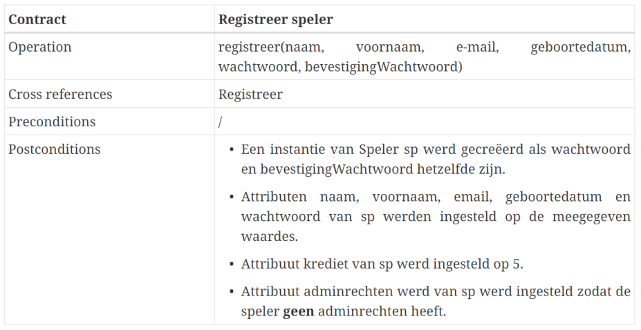

 - Zoals we in de eerste postconditie zien, moet een object van **Speler** gecreëerd worden. Telkens een nieuw object gemaakt wordt, kunnen we een beroep doen op het GRASP-patroon **CREATOR**.

- **Voor** we bepalen wie verantwoordelijk is om het object van `Speler` aan te maken, plaatsen we allereerst de klasse `Speler` op het DCD. Het domeinmodel is onze inspiratiebron. We nemen de klasse over vanop het domeinmodel en plaatsen bij elk attribuut een correct datatype. Als we zien dat op het domeinmodel ook associaties zijn tussen `Speler` en andere klassen die al op het DCD staan, kunnen we die overnemen (zonder details). In dit concrete geval zijn er geen associaties over te nemen.

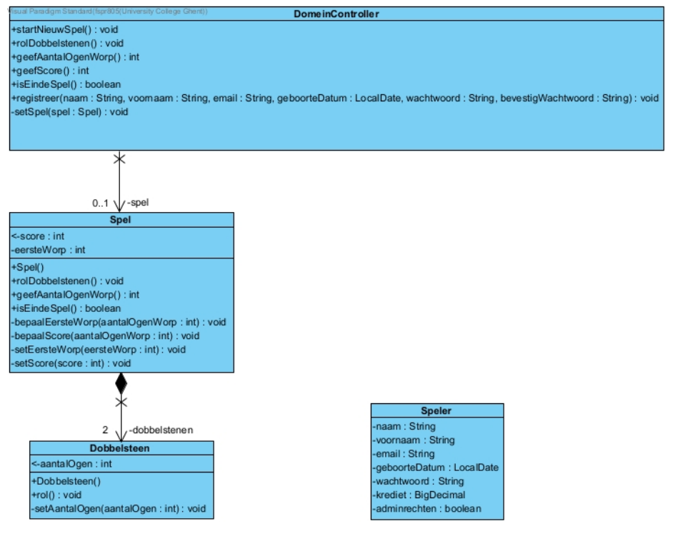

- Eens de klasse aanwezig is op het DCD, kunnen we nog niet zoeken naar de verantwoordelijke voor het aanmaken, want we moeten eerst zorgen dat we het object **kunnen** aanmaken. Daarvoor is een constructor nodig.
    
- We kijken of `Speler` al een constructor bevat met de juiste parameters. Standaard heeft elke klasse de defaultconstructor, maar is die voldoende in dit geval?
    
    1. De DomeinController krijgt vanuit de user interface een waarde door voor `naam`, `voornaam`, `email`, `geboorteDatum`, `wachtwoord`, `bevestigingWachtwoord`.
    2. `wachtwoord` en `bevestigingWachtwoord` moeten gecontroleerd worden.
    3. De waarden voor de attributen `naam`, `voornaam`, `email`, `geboorteDatum` en `wachtwoord` moeten de meegegeven waarde krijgen.
    4. `krediet` en `adminrechten` krijgen een vaste startwaarde (het OC zegt dat een speler automatisch een krediet van €5 krijgt en geen adminrechten).

- Dan heeft `Speler` dus een **constructor met parameters** nodig!
	  - Welke parameters? Die voor naam, voornaam, email, geboorteDatum, wachtwoord en bevestigingWachtwoord.
	  - Voor attributen `krediet` en `adminrechten` is geen parameter nodig, omdat deze beide een vaste waarde krijgen bij het aanmaken van een `Speler`.

- Zodra we in `Speler` deze constructor toevoegen, krijgen we dit op het DCD.

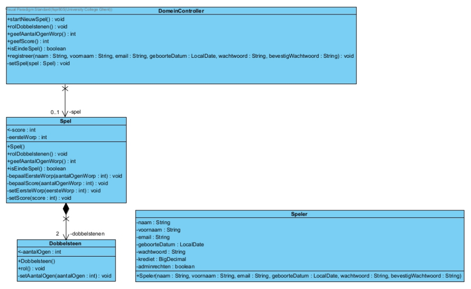

- **Nu** is nog de vraag wie de constructor zal **oproepen** en het bijhorende nieuwe object zal bijhouden. We zoeken eerst via **CREATOR** een klasse die geschikt is om een object van `Speler` te maken. We kijken op het reeds bestaande DCD:
    
    - Vinden we een klasse die voldoet aan (minstens) één van de volgende regels?
        1. Een klasse bevat instanties van `Speler` (associatie: bevat, heeft)
        2. Een klasse is een aggregatie of compositie van `Speler`
        3. Een klasse gebruikt `Speler` intensief
        4. Een klasse bevat de data om `Speler` te initialiseren

    - Aangezien er geen associaties te zien zijn bij klasse `Speler`, kunnen de eerste twee regels geen antwoord opleveren.
	    - Het intensief gebruiken van een klasse passen we toe bij het centrale domeinobject, wat hier niet het geval is. 
	    - Dan is er nog de vraag: Is er eventueel een klasse die de nodige data bevat om een `Speler`-object aan te maken?
        
    - De **DomeinController** krijgt vanuit de user interface een waarde door voor:
		    - `naam`
		    - `voornaam`
		    - `email`
		    - `geboorteDatum`
		    - `wachtwoord`
		    - `bevestigingWachtwoord`
	    - Dus DomeinController heeft alle nodige data om een `Speler`-object te maken. **CREATOR** bepaalt dus dat de DomeinController het object zal aanmaken.
        
- Voor het aanmaken van het object hoeven we geen verdere aanpassingen te doen aan het DCD, maar **eens** het object aangemaakt is, moet het ergens naartoe.
    
    - Wie zal het bijhouden? 
	    - Dit is niet de taak van de DomeinController, want `Speler` is niet het centrale domeinobject. 
	    - Duizenden spelers kunnen zich registreren;
		    - er moet een specifieke klasse zijn die de verantwoordelijkheid krijgt om al deze spelers bij te houden.
		    - Deze klasse staat nog niet op het huidige DCD en ook niet op het domeinmodel. Dan moeten we speciaal een nieuwe klasse creëren, een **REPOSITORY**-klasse.

> **Een repository-klasse** is verantwoordelijk voor het beheer van een bepaald soort objecten.  
> Dat betekent:
> 
> 1. het bijhouden van alle objecten,
> 2. het wijzigen van objecten,
> 3. het zoeken van objecten die aan bepaalde voorwaarden voldoen,
> 4. het verwijderen van dergelijke objecten.

- Omdat onze repositoryklasse spelerobjecten zal beheren, noemen we de klasse `SpelerRepository`. We voegen deze klasse toe aan het DCD.
    
- **Op het DCD** tekenen we ook een associatie tussen `SpelerRepository` en de klasse `Speler`, want de `SpelerRepository` zal `Speler`-objecten bijhouden. Net zoals bij elke andere associatie op het DCD moeten we nadenken over:
    
    1. de navigeerbaarheid (alleen `SpelerRepository` moet zijn spelers kennen; `Speler` hoeft niet te weten tot welke repository hij behoort),
    2. de multipliciteit (`SpelerRepository` bevat 0..* spelers),
    3. de visibiliteit (steeds `private`),
    4. de naam (bijv. `spelers`).
- Als we deze associatie toevoegen, krijgen we het resultaat hieronder.

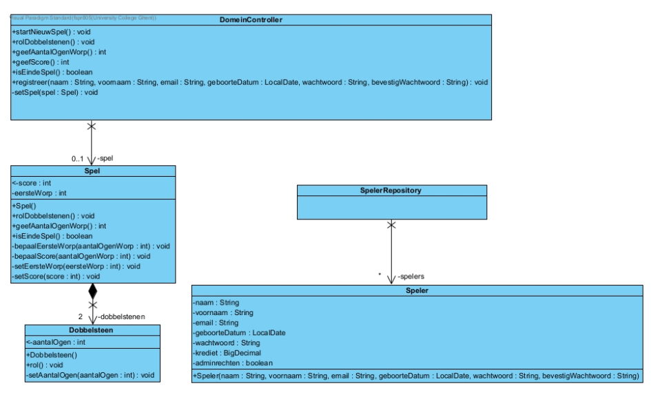

  - Het `Speler`-object dat de DomeinController zonet heeft gemaakt, moet dus bij de `SpelerRepository` terechtkomen, zodat die het object kan bijhouden in de associatie “spelers”.
  - Maar het `Speler`-object is **aangemaakt door** de DomeinController. De DomeinController zal het object dus moeten doorgeven aan de `SpelerRepository`. Dat vereist dat de DomeinController de `SpelerRepository` **kent** (= associatie) en dan het object aanspreekt (= een methode aanroept) waarbij hij via een parameter het gecreëerde `Speler`-object kan doorgeven.

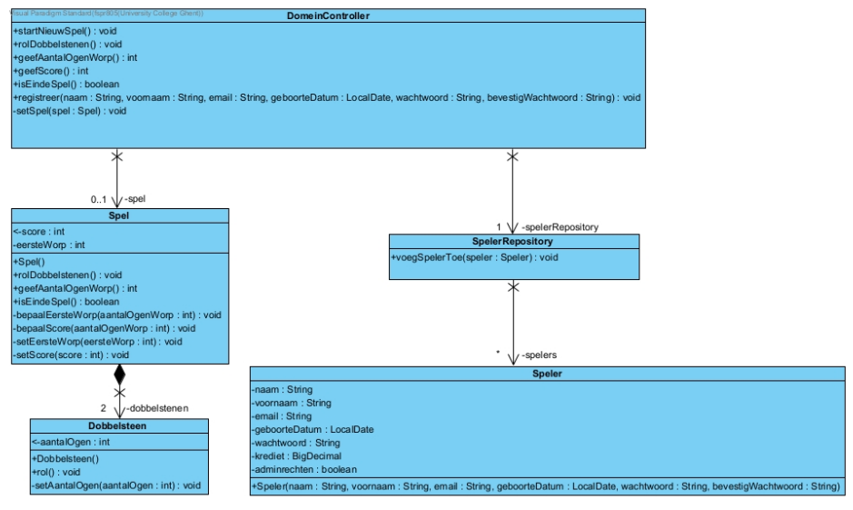

- **Het aanmaken** van het Repository-object (hier `spelerRepository`) 
	- gebeurt steeds in de constructor van de DomeinController. 
	- Het is niet verkeerd om deze (default) constructor ook op het DCD te zetten.
    
- **Het ontwerp hierboven** is ook juist:
    
    - Elke klasse die geen expliciete constructor bevat, heeft immers een default constructor.
    - Bij de implementatie moet je er dan aan denken dat je in deze default constructor code schrijft, namelijk de creatie van de repository:
    
    ```java
    public DomeinController() {
        spelerRepository = new SpelerRepository();
    }
    ```


### Domeinregels bij systeemoperatie `registreer`
  - We gaan verder met het ontwerpen van de DOING-verantwoordelijkheid van de systeemoperatie `registreer(...)`.  
  - Het OC hebben we nu uitgewerkt, maar ook de validatie en domeinregels kunnen impact hebben op het domein. We bekijken hoe deze regels het ontwerp beïnvloeden.

  **DR-Speler**  
  - In de use case zien we bij DR-Speler de volgende domeinregels:

    1. **Regel 1: Verplichte velden**  
       - De attributen `naam`, `voornaam`, `e-mailadres`, `geboortedatum` en `wachtwoord` van `Speler` moeten een waarde krijgen.  
       - *Wie is verantwoordelijk voor deze controle?*  
         - `Controller` vertelt ons niets over controleren van waarden; `Creator` evenmin.  
         - Dat wil zeggen dat alleen **EXPERT** ons kan helpen. Wie heeft de nodige informatie om deze controle uit te voeren? De klasse `Speler` is sowieso EXPERT van zijn eigen attributen.  
         - De constructor moet ervoor zorgen dat de attributen de correcte waarde krijgen; dit kan rechtstreeks in de constructor of via een setter. De controle van de meegegeven waarde moet dan ook in de constructor/setter gebeuren.  
         - Op het ontwerp mogen we al een setter plaatsen om de controle te doen, maar dit *hoeft niet*; aangezien de controle maar één keer gebeurt, kan het ook in de constructor zelf.  
 
    >     Tijdens het programmeren wordt wel sterk aangeraden om hiervoor een **private** setter toe te voegen. Maar dat **hoeft** de ontwerper niet te beslissen; dit kan door de programmeur besloten worden.

    2. **Regel 2: Het wachtwoord moet voldoen aan een aantal vormvereisten.**  
       - Het wachtwoord is een attribuut van `Speler`. Ook hier gaat het over **een waarde toekennen** aan een attribuut; de klasse is EXPERT van dat attribuut.  
       - De controle wordt opnieuw in de constructor of de setter van het attribuut geïmplementeerd.

    3. **Regel 3: Vormvereisten voor e-mailadres én e-mailadres moet uniek zijn.**  
       - Het e-mailadres moet een correcte waarde toegekend krijgen. Net als bij de vorige regels bepaalt **EXPERT** (`Speler`) dat de controle in de constructor of setter van het attribuut e-mailadres gebeurt.  
       - Verder moet het e-mailadres **uniek** zijn.  
         - *Wie beschikt over de nodige informatie om deze controle te kunnen uitvoeren?*  
         - `Speler` zelf is EXPERT van het attribuut e-mailadres, maar kent alleen de waarde van zijn eigen e-mailadres. We hebben de **e-mailadressen van alle spelers** nodig om de controle te kunnen uitvoeren.  
         - De **SpelerRepository** is EXPERT van alle spelerobjecten en kan dus alle e-mailadressen vergelijken.  
         - We hadden in een vorige stap de methode `voegToe(speler:Speler):void` al toegevoegd aan de klasse `SpelerRepository`. Hierin voegen we het `Speler`-object toe aan de lijst, maar **eerst** controleren we of het e-mailadres uniek is. De SpelerRepository is EXPERT van de spelers, dus kan deze controle uitvoeren.

    4. **Regel 4: De speler moet minstens 18 jaar zijn.**  
       - De geboortedatum is een attribuut van `Speler`. Deze geboortedatum zal gebruikt worden om de leeftijd te controleren. Ook hier gaat het dus over **een waarde toekennen** aan een attribuut, waarbij de klasse EXPERT is van dat attribuut.  
       - De controle wordt in de constructor of de setter van dat attribuut uitgevoerd.

> **Het ontwerp verandert niet** (geen nieuwe methodes op het DCD), maar in **bestaande** methodes voegen we extra implementatie toe.

## Alternatieve verlopen
  - Vergeet bij het ontwerpen niet te kijken naar de alternatieve scenario’s van de use case. Deze kunnen het ontwerp ook nog beïnvloeden.

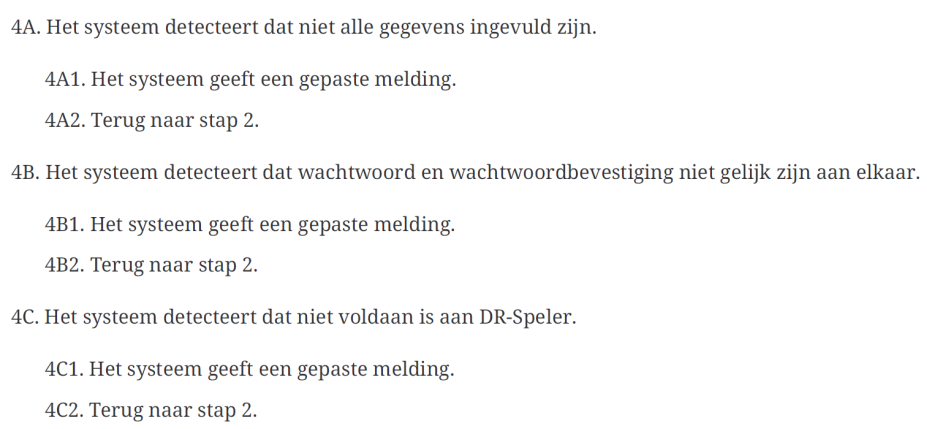

  **Scenario 4A**  
  - Deze controle is anders dan de controle in de domeinregel. Hier wordt specifiek gekeken of alle invoervelden een waarde bevatten, dus ook de bevestiging van het wachtwoord.  
  - Aangezien dit over controle van invoervelden gaat, zijn er **geen** aanpassingen aan het DCD nodig. Deze controle wordt volledig door de applicatie (UI) afgehandeld.

  **Scenario 4B**  
  - Om te bepalen wie de controle van het wachtwoord en de bijhorende bevestiging uitvoert, zoeken we naar de expert. Over de bevestiging is niemand echt EXPERT, maar `Speler` is EXPERT over het wachtwoord.  
  - De controle of beide waarden (wachtwoord / wachtwoordbevestiging) hetzelfde zijn, wordt dus best in `Speler` uitgevoerd. Dit is ook de reden waarom `bevestigingWachtwoord` een parameter is van de constructor.  
  - Als beide waarden niet identiek zijn, komt er een foutmelding op het scherm. Er is opnieuw **geen** wijziging aan het ontwerp.  

 > - *Tip*: Aan de kant van de user interface (voor de data doorgestuurd wordt naar het domein) kan ook een controle ingebouwd worden om wachtwoord en -bevestiging te vergelijken. Dit zorgt voor meer gebruiksvriendelijkheid, maar **alle** domeinregels moeten sowieso ook in het domein worden afgedwongen (anders is het domein niet stabiel).

  **Scenario 4C**  
  - De domeinregel is al uitgewerkt: bij het aanroepen van de constructor worden de nodige controles gedaan (eventueel in een setter), en bij het toevoegen van het `Speler`-object aan de lijst met spelers in de `SpelerRepository` wordt nagegaan of er nog geen speler is met hetzelfde e-mailadres.  
  - Mocht één van die controles falen, dan verschijnt een foutmelding op het scherm. Die foutmelding **beïnvloedt het ontwerp niet**. Geen enkele bestaande methode wijzigt van signatuur, er komt geen nieuwe methode bij op het DCD.  
  - In Java bestaat er een techniek met “gooien van Exceptions” om een foutmelding te tonen. Dit heeft geen invloed op de naam, parameterlijst en returntype van de methode.

---

# Dobbelspel – Iteratie 3 – Meld Aan
  - We gaan verder met het ontwerp en starten een nieuwe iteratie. 
	  - De derde iteratie behandelt de use case **Meld aan**. 
	  - Bekijk [hier](./attachments/CaseDobbelspel.pdf) de eindproducten uit de analysefase.  
	
  - Eens de analysefase doorlopen is voor deze use case, kan ook het ontwerp starten.

 ## Systeemoperatie 1: `startAanmelden`

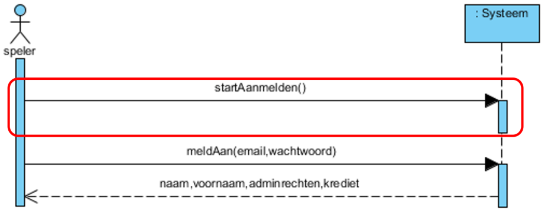

  - We volgen het stappenplan om te zien welke aanpassingen nodig zijn aan het DCD.  

  **Stap 1: DOING/KNOWING**  
  - De eerste systeemoperatie vanop het SSD, `startAanmelden`, heeft geen doing of knowing-verantwoordelijkheid. 
	  - Er is geen terugkeerpijl, geen OC’s en er wordt geen tussentoestand opgeslagen.  

  - Er moet niets gebeuren in het domein, eigenlijk is de enige functionaliteit “spring naar het aanmeldscherm”. 
	  - Dit is niet de verantwoordelijkheid van de DomeinController.  
	  - Dit levert geen systeemoperatie op in de DomeinController. Er verandert niets aan het DCD. 
	  - We hoeven de andere stappen niet te bekijken.

## Systeemoperatie 2: `meldAan`
  
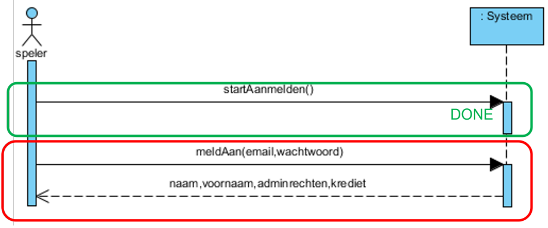

*Dan bekijken we het ontwerp van de 2de systeemoperatie.*
### Stap 1: DOING/KNOWING
  - Er is een **terugkeerpijl**, dus zeker *knowing*-verantwoordelijkheid.  
  - Is er ook een *doing*-verantwoordelijkheid? 
	  - Er is geen OC, maar daaruit kun je niets besluiten.  
  - Qua functionaliteit: het systeem moet weten wie zich precies aanmeldt, want die persoon gaat later een spel spelen. 
	  - Dus de aangemelde persoon moet gekend en **bewaard** worden in het systeem. 
	  - Dat is typisch een *doing*-verantwoordelijkheid die niet in een OC staat. 

> **Besluit**: er is zowel DOING- als KNOWING-verantwoordelijkheid.

### Stap 2: Bepaal methode
  - DOING: `meldAan(email:String, wachtwoord:String):void`  
  - KNOWING: `geefSpeler():???`  
    - We bekijken even het returntype van de knowing-verantwoordelijkheid. 
	    - Alle gegevens die teruggegeven moeten worden, staan op de terugkeerpijl op het SSD. 
		- Die gegevens zijn allemaal attributen van **1** `Speler`-object, nl. de aangemelde speler. 
		- Deze gegevens horen dus bij elkaar.  
		- We definiëren 1 knowing systeemoperatie.

    - Een methode kan maar 1 returntype hebben. 
	    - We willen echter verschillende stukjes info teruggeven. 
	    - In hoofdstuk 3 zagen we dat we een **verzameling** (List `<>`, array `[]`, …) kunnen gebruiken als de data allemaal van hetzelfde type is.  

	-  Een simpele List of array is dus niet ideaal want je kan maar   soort data groeperen in een verzameling.
		- Hier hebben we o.a. 
			- `String` (naam, voornaam), 
			- `boolean` (adminrechten)
			- `BigDecimal` (krediet). 
		- Een simpele List of array is dus niet ideaal.  

   >**Waarom kunnen we niet gewoon het `Speler`-object teruggeven (bijv. `geefSpeler(): Speler`)?**
   >
   >- **1. DomeinController zorgt voor een strikte scheiding**  
  - Een van de belangrijkste taken van de `DomeinController` is om te zorgen dat het **domein** en de **user interface** strikt gescheiden blijven.  
  >- Dit betekent:
    - Geen UI-objecten in het domein.  
    - Geen domeinobjecten rechtstreeks in de UI.
>
>
>- **2. Publieke methode = zichtbaar in de UI**  
  - Als het returntype van een **systeemoperatie** (een publieke methode in de `DomeinController`) een domeinobject is, dan komt dit domeinobject **automatisch** in de UI terecht.  
  >- De UI roept immers deze systeemoperatie aan.
>
>- **3. Domeinobjecten in de UI zijn verboden**  
  >- Als de UI een domeinobject heeft (bijv. `Speler`), kan het publiek toegankelijke methodes van dat object aanroepen zonder de bijhorende domeinlogica (en domeincontroles) die normaal via de `DomeinController` gaan.  
  - Bijvoorbeeld: de UI zou rechtstreeks de constructor van `Speler` kunnen oproepen, waardoor de controle op uniek e-mailadres (in `SpelerRepository`) omzeild wordt.
>
>- **4. Alle communicatie via `DomeinController`**  
  - Om te voorkomen dat controles in het domein worden overgeslagen, moet alle communicatie met het domein via de `DomeinController` lopen.  
  >- Zo ben je zeker dat altijd de correcte methodes in het domein worden opgeroepen.
>
>- **5. Gegevens vertalen in toegelaten data**  
  - In plaats van het hele `Speler`-object door te sturen, haalt de `DomeinController` de benodigde gegevens (losse data) uit het domeinobject en stuurt **die** door.  
  >- Met andere woorden: de `DomeinController` **vertaalt** de domeindata naar **toegelaten data** (bijv. een *DTO*, primitives, of andere voorgestructureerde vormen).  
  - Op die manier blijft het domein beschermd en kunnen alle benodigde checks en logica veilig via de `DomeinController` lopen.
>


- *DTO* (Data Transfer Object) is de oplossing. 
	- Met **JDK 14** kun je een `record` gebruiken als DTO.  
	- In deze `record` (bv. `SpelerDTO`) plaatsen we alleen de waarden van de attributen, maar geen methodes. 
	- Zo kan de UI geen domeinmethodes aanroepen.  

>- Om verschillende types van data die samenhoren door te geven van de domeinlaag naar de applicatielaag dan doen we dit altijd via een DTO. 
>- Zo is er geen risico dat de applicatie methodes oproept uit het domein die eigenlijk niet toegestaan zijn.

#### Hoe maak je een DTO aan en gebruik je het in Java?

1. **DTO definiëren als `record`**  
   ```java
   package dtos;                   // ①
   import java.math.BigDecimal;

   public record SpelerDTO(String naam, String voornaam, BigDecimal krediet,boolean adminrechten) 
   {}                            // ②
```

- **①**: We groeperen al onze DTO’s in een aparte package, bijvoorbeeld `dtos`.
- **②**: Door na `public` het keyword `record` te gebruiken in plaats van `class`, definiëren we `SpelerDTO` als een _record_.

> **Wat is een record?**  
> Bij runtime genereert Java automatisch een klasse met een publieke constructor en private attributen. De waarden van de attributen kun je opvragen via methodes gelijkend op getters. Deze methodes dragen dezelfde naam als het attribuut: `naam()`, `voornaam()`, `krediet()` en `adminrechten()`.

2. **DTO aanmaken**
    
    - Je maakt een DTO-object aan zoals elk ander Java-object, door de constructor aan te roepen:
        
        ```java
        // Voorbeeld
        new SpelerDTO(
            speler.getNaam(),
            speler.getVoornaam(),
            speler.getKrediet(),
            speler.isAdminrechten()
        );
        ```
        
    - Let op dat je de constructor niet zelf hoeft te schrijven in een record. Java genereert automatisch een constructor met dezelfde volgorde en types als de gedefinieerde attributen.
3. **DTO gebruiken in je applicatie**
    
    - Stel dat je via de DomeinController een `SpelerDTO`-object terugkrijgt:
        
        ```java
        SpelerDTO spelerDTO = dc.geefSpeler();
        ```
        
    - Om de waarden uit dit `SpelerDTO`-object te halen, roep je simpelweg de _automatisch gegenereerde_ methodes aan (ze dragen dezelfde naam als het attribuut):
        
        ```java
        System.out.printf(
            "De speler met naam: %s %s heeft %s adminrechten en %.2f krediet",
            spelerDTO.voornaam(),
            spelerDTO.naam(),
            spelerDTO.adminrechten() ? "WEL" : "GEEN",
            spelerDTO.krediet()
        );
        ```
        
4. **Voordeel van een DTO**
    
    - Door **alle** benodigde informatie (bijv. `naam`, `voornaam`, `adminrechten`, `krediet`) in één object te verzamelen, kun je deze data in één keer **terugsturen** naar de applicatie.
    - Je hoeft dus geen losse waardes (bijv. een `List<String>` voor alleen namen of conversies van booleans/BigDecimals naar `String`) door te geven.
    - Een _record_ (DTO) geeft je bovendien de garantie dat de UI alleen **data** kan opvragen en niet zomaar methods van het domeinobject kan aanroepen. Dit helpt bij de **scheiding** tussen domein en user interface.


- Zo hebben we voor de 2 verantwoordelijkheden:
    - DOING: `meldAan(email:String, wachtwoord:String):void`
    - KNOWING: `geefSpeler():SpelerDTO`

> **Methodes in de DomeinController die data teruggeven aan de UI** (publieke methodes) hebben als returntype:
> 
> 1. een primitief type;
> 2. een type van een voorgedefinieerde Java klasse (een klasse die je dus niet zelf hebt gedefinieerd, bijvoorbeeld String of LocalDate);
> 3. een DTO;
> 4. of een verzameling (List/array) van één van bovenstaande opties.
>
>De attributen van een DTO mogen ook alleen als type 1 van de opties uit debovenstaande lijst bevatten.
>

### Stap 3A voor DOING: Controller pattern toepassen

- We werken eerst de DOING-verantwoordelijkheid uit (die op het SSD bovenaan staat).
- Op basis van _CONTROLLER_ krijgt deze systeemoperatie een plek in de klasse `DomeinController` op het DCD.

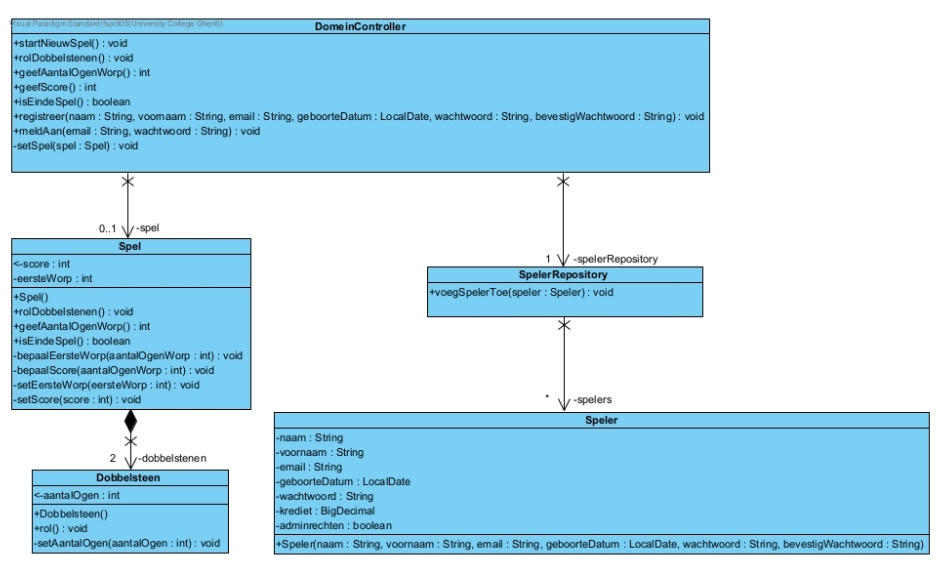
### Stap 3B voor DOING: Deelverantwoordelijkheden toekennen aan de juiste klassen

- We overlopen het OC → er is geen. Dus dat is snel klaar.
- We denken na of de **DomeinController** iets moet bijhouden: ja! We willen met deze methode bijhouden wie zich precies heeft aangemeld.
- Het systeem kent vele `Speler`-objecten, maar eentje daarvan is speciaal de aangemelde speler. Is dat de taak van de DomeinController? Ja, **CONTROLLER** zegt dat deze klasse verantwoordelijk is voor tussentijdse resultaten die later nodig zijn.
- Qua functionaliteit: We moeten het ene `Speler`-object vinden dat overeenkomt met `e-mailadres + wachtwoord` en dit object bewaren in de DomeinController.
- _Wie is expert?_ De `SpelerRepository` is EXPERT van alle spelerobjecten en kan in zijn lijst zoeken naar het juiste object. De DomeinController is EXPERT van het `SpelerRepository`-object.
- Van `meldAan(...)`:
    1. **DomeinController** → roept methodes op de `SpelerRepository` aan, want hij heeft een referentie naar de repository.
    2. De `SpelerRepository` zoekt en vindt het object, en stuurt het terug.
    3. De DomeinController bewaart dit ene object in zichzelf (extra associatie om het object te bewaren).

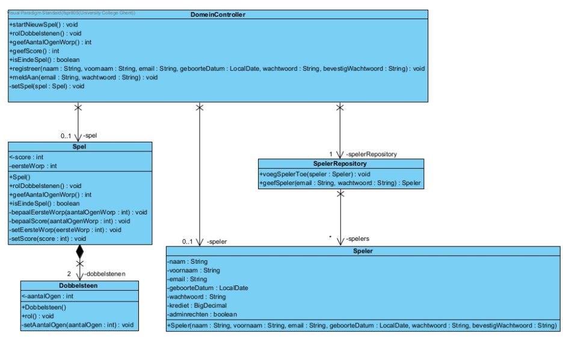
### Stap 3A voor KNOWING: Controller pattern toepassen

- Dan de KNOWING-verantwoordelijkheid: `geefSpeler():SpelerDTO`.
- We voegen deze toe aan de DomeinController in het DCD (volgens CONTROLLER).


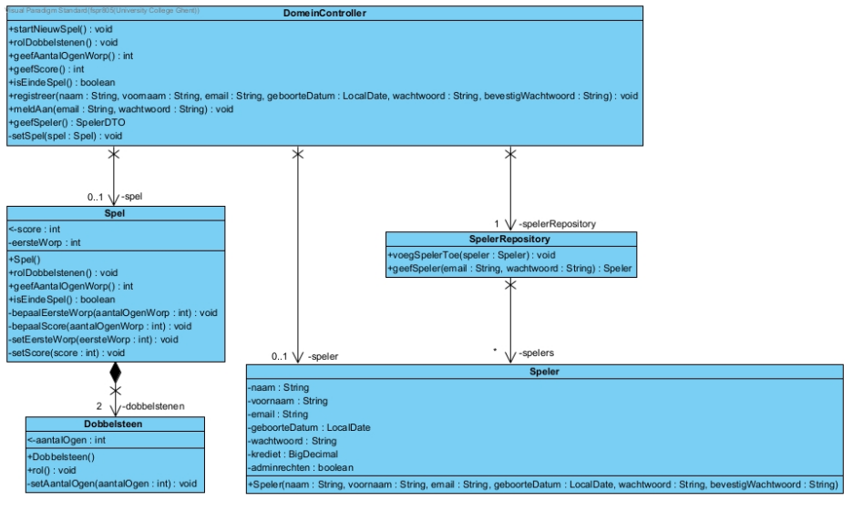
### Stap 3B voor KNOWING: Deelverantwoordelijkheden toekennen aan de juiste klassen

- We willen gegevens van de _aangemelde speler_ teruggeven. Volgens _EXPERT_ kijken we waar de nodige informatie zit. Dat is in het object van de aangemelde speler (naam, voornaam, krediet, adminrechten). De DomeinController is expert van de **aangemelde speler**.
- Dus in `geefSpeler()`, de DomeinController kan direct zijn attribuut `speler` aanspreken en via getters de data ophalen. Daarna stopt hij die data in een `SpelerDTO`. Deze DTO stuurt hij als antwoord terug.

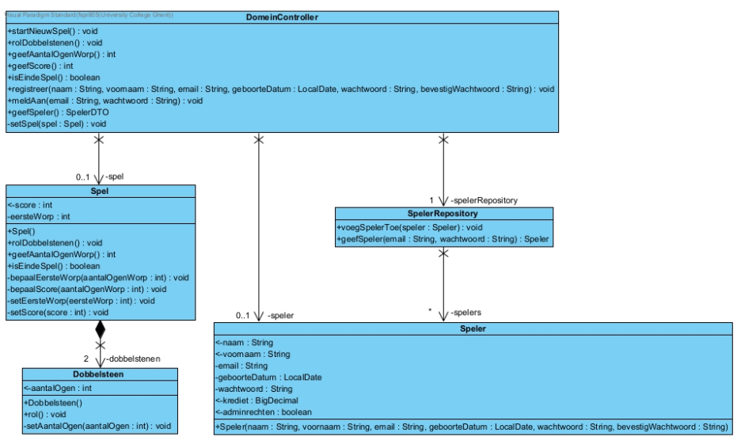
# Samenvatting
    
## Stap 1: DOING/KNOWING
    
>  - _Stap 1: Vertrek van het SSD en bepaal voor elke systeemoperatie (ook uit loop of alternatief verloop) de doing- en/of knowing-verantwoordelijkheden._

   - **DOING** = object(en) aanmaken/bijhouden/verwijderen of waarde(n) aanpassen.
        - _Algemene regel_:
            1. Als er een OC is, dan is er DOING-verantwoordelijkheid.
            2. Als de systeemoperatie functionaliteit bevat waarbij een domeinobject moet bijgehouden worden, is er DOING-verantwoordelijkheid.


   - **KNOWING** = waarde(n) teruggeven.
        - _Algemene regel_:
            1. Als de systeemoperatie op het SSD een returnpijl heeft, is er KNOWING-verantwoordelijkheid.
                
            2. Bij loop of alternatief verloop: als er data moet worden teruggegeven uit het domein, is er KNOWING-verantwoordelijkheid.

>
>		    1. Een systeemoperatie kan 0, 1 of **meerdere** verantwoordelijkheden hebben.
>		    2. Eén verantwoordelijkheid kan nooit tegelijk DOING én KNOWING zijn.
>		    3. Als er **geen** DOING of KNOWING-verantwoordelijkheid is,
>			    - zorgt de systeemoperatie **niet** voor een methode op het DCD. 
>			    - Geen aanpassingen in het domein dus. 
>			    - Die systeemoperatie zorgt alleen voor wijzigingen in de applicatie.
 >   
    
## Stap 2: Bepaal methode
    
>- _Stap 2: Definieer voor elke verantwoordelijkheid uit stap 1 een methode._
        
  - De definitie van een methode bevat:
        
       1. een betekenisvolle **naam**
       2. eventuele **parameters**
       3. een **returntype**
       
| **DOING**      |                                                                                                                                                                                     |
| -------------- | ----------------------------------------------------------------------------------------------------------------------------------------------------------------------------------- |
| **naam**       | Moet betekenisvol zijn. Dekt de naam van het SSD de functionaliteit? Zo ja, hergebruik die naam. Anders bedenk je een nieuwe naam die overeenkomt met de benodigde functionaliteit. |
| **parameters** | Optioneel, alleen als nodig voor deze methode. Staan er op het SSD parameters? Bepaal of deze methode ze echt nodig heeft. Bepaal ook het datatype.                                 |
| **returntype** | `void`                                                                                                                                                                              |

| **KNOWING**    |                                                                                                                                                                                                     |
| -------------- | --------------------------------------------------------------------------------------------------------------------------------------------------------------------------------------------------- |
| **naam**       | Moet betekenisvol zijn. Dekt de naam van het SSD de functionaliteit? Zo ja, hergebruik die naam. Anders bedenk je een nieuwe naam die overeenkomt met de benodigde functionaliteit.                 |
| **parameters** | Optioneel, alleen als nodig voor deze methode.                                                                                                                                                      |
| **returntype** | Bepaal het meest passende datatype voor de terug te geven waarde. _Opletten bij meerdere waardes_: - Allemaal hetzelfde datatype? _Array of List_ - Verschillende datatypes? _Groeperen in een DTO_ |

    
> **Methodes in de DomeinController** die gegevens retourneren naar de UI (publieke methodes) hebben als returntype:
   > 
   > - een primitief type
   > - een voorgedefinieerde Java-klasse (bv. `String`, `LocalDate`)
   > - een **DTO**
   > - of een verzameling (_Array_, _List_, …) van 1 van deze opties. 
   > 
 > De attributen van een DTO mogen ook alleen 1 van de bovenstaande opties als type bevatten.
    
## Stap 3: Opsplitsen in deelverantwoordelijkheden
    
>- _Stap 3: Splits de verantwoordelijkheid op in kleine deelverantwoordelijkheden en plaats ze in een gepaste klasse op het DCD._
    
### Stap 3A: Controller pattern toepassen
    
1. Voeg indien nodig de klasse `DomeinController` toe aan het DCD.
2. Voeg de methode uit stap 2 toe aan de `DomeinController`.
    
### Stap 3B: Deelverantwoordelijkheden toekennen aan de juiste klassen m.b.v. Creator en/of Expert**
    
#### Creator pattern
        
- _Moet er een instantie van een klasse aangemaakt worden?_

	1. **Is de klasse al op het DCD?**
            - Zo nee: neem de klasse over van het domeinmodel en vul bij elk attribuut het datatype in. Neem eventuele associaties over zonder extra info (nog geen associatienaam, rolnamen, multipliciteit).
    2. **Heeft de klasse een constructor met de juiste parameters?**
            - Zo nee: voeg de constructor toe, met de nodige parameters (incl. datatypes) om de instantie correct te kunnen aanmaken.
    3. **Bepaal welke klasse** de constructor zal oproepen en in welke methode dit gebeurt.
            - Bestaat die methode nog niet? Voeg deze toe (eventueel met parameters).
    4. **Bepaal wie** het nieuwe object zal bijhouden.
            - Was er een associatie op het domeinmodel die je eerder overnam? Werk die verder uit (navigeerbaarheid, visibiliteit, naam, multipliciteit).
            - Heb je geen associatie overgenomen in stap 1?  
                  a. Bepaal wie de instantie bijhoudt.  
              b. Voeg een associatie toe tussen deze klassen.  
              c. Werk deze associatie volledig uit: navigeerbaarheid, visibiliteit, naam, multipliciteit.
#### Expert pattern
        
>- _Wie is verantwoordelijk om een bepaalde actie uit te voeren?_
   >         
   >- **Ken** de verantwoordelijkheid toe aan de Information Expert, de klasse die alle benodigde info heeft om de verantwoordelijkheid te realiseren.
            
   1. Kijk eerst op het DCD of daar klassen zijn die in aanmerking komen.
        - Zo ja: voeg de methode aan deze klasse toe.
  2. In tweede instantie kan het domeinmodel inspiratie geven voor een geschikte klasse.
        - Zo ja: Voeg de klasse toe aan het DCD, denk na over associaties voor je de methode toevoegt.
  3. Mogelijks maak je een nieuwe klasse met een duidelijke rol en verantwoordelijkheid (denk weer aan associaties).

		
- **Eens je de klasse hebt gevonden die EXPERT is** over alle info om de verantwoordelijkheid te realiseren, 
	- controleer je of de `DomeinController` expert is over **die** klasse. Alleen dan kan de DomeinController de net toegevoegde methode aanroepen.    
 - Is de DomeinController **geen** expert? 
	 - Ga dan op zoek naar de “ketting” tussen de DomeinController en de klasse en voeg bij elke stap in de ketting een methode toe.