# Doelstellingen

- De vier pijlers van objectoriëntatie te herkennen, te kunnen benoemen en verklaren
- Overerving en polymorfisme herkennen, kunnen definiëren, kunnen toepassen en implementeren
- Het nut en de kracht van overerving en polymorfisme kunnen toelichten
- De toegangsclausule protected kunnen gebruiken en implementeren
- De constructor in een subklasse kunnen implementeren
- De klasse Object en haar methodes kunnen gebruiken
# Inleiding

- In dit hoofdstuk behandelen we de uitbreiding van de domeinlaag met sub- en superklasses, die zowel abstract als concreet kunnen zijn. 
- We introduceren **polymorfisme**, wat letterlijk "veelvormigheid" betekent en verwijst naar het vermogen van objecten om verschillende vormen aan te nemen. 
- Door deze concepten goed te begrijpen en toe te passen, leggen we de basis voor een volledig objectgeoriënteerd programma.

# De 4 pijlers van OO

- Object georiënteerd ontwerpen/programmeren steunt op 4 grote pijlers

| Nr  | Nederlandstalige term | Engelstalige term |
| --- | --------------------- | ----------------- |
| 1   | inkapseling           | encapsulation     |
| 2   | abstractie            | abstraction       |
| 3   | overerving            | inheritance       |
| 4   | polymorfisme          | polymorfism       |

## Inkapseling

- **Het wijzigen van de interne opbouw van een abstract datatype mag weinig of géén invloed hebben op de rest van de programmatuur**.
- Inkapseling wordt gebruikt voor Abstractie (om onbelangrijke implementatie details te verbergen voor andere objecten).

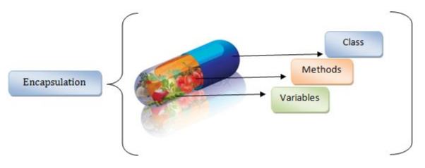
### Hoe wordt dit gerealiseerd?

- De methodes die manipulaties uitvoeren op de attributen worden bij elkaar geplaatst en gekoppeld aan dat type (= black box of object).
- Met andere woorden, de implementatiedetails zitten verborgen in het object zelf.

## Abstractie

- Abstractie houdt in dat alleen de noodzakelijke eigenschappen en gedragingen van een object zichtbaar zijn, terwijl irrelevante details verborgen blijven. 
- Dit vermindert complexiteit en verhoogt efficiëntie.

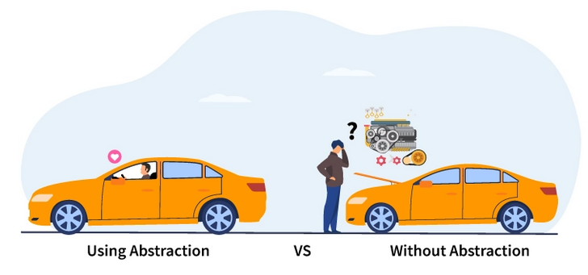
### Hoe  wordt dit gerealiseerd?

- Zo bevat elke klasse attributen (instantievariabelen) én een aantal methodes die de attributen kunnen manipuleren/gebruiken. 
- Een klasse is een specificatie voor objecten. 
- Een object is een instantie van een klasse die gemaakt is volgens deze specificatie.

BESLUIT: de focus in Java ligt op het maken van objecten ipv op het schrijven van methodes zoals in procedurele programmeertalen.
## Overerving

- Overerving maakt hergebruik van software mogelijk door nieuwe klassen te creëren die eigenschappen en methoden van bestaande klassen overnemen en uitbreiden.

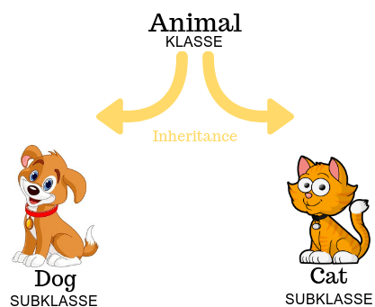

### Hoe  wordt dit gerealiseerd?

- nieuwe klassen worden gecreëerd vertrekkende van bestaande klassen, 
	- waarbij de attributen en methodes worden geërfd van de superklasse
	- uitgebreid met nieuwe mogelijkheden (Polymorfisme)
	- de nieuwe klasse is een subklasse
## Polymorfisme

- Polymorfisme maakt systemen **eenvoudig uitbreidbaar** zonder veel wijzigingen, 
	- doordat nieuwe klassen kunnen worden toegevoegd aan een hiërarchie zonder de generieke delen van het programma aan te passen. 
	- Alleen specifieke delen die met de nieuwe klasse te maken hebben, moeten worden gewijzigd.

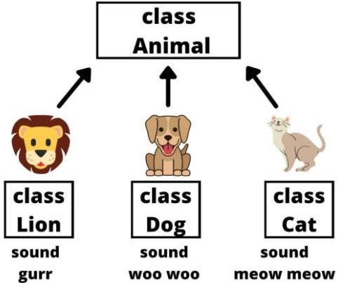

### Hoe  wordt dit gerealiseerd?

- Klassen die nog niet bestaan tijdens de ontwikkeling van het programma kunnen
	- mits kleine of geen wijzigingen 
	- toegevoegd worden aan het generieke deel van het programma 
	- op voorwaarde dat deze klassen deel uitmaken van de hiërarchie.

- De enige delen van het programma die gewijzigd of uitgebreid moeten worden zijn:
	- deze die rechtstreeks te maken hebben met de specifieke klasse die toegevoegd wordt.


# Meer over overerving

## Terminologie

- **Instanties (objecten)**: Concrete objecten van een klasse.
- **Subklassen**: Nieuwe klassen die eigenschappen en methoden van een bestaande klasse overnemen.
- **Klassen kunnen**:
    - **Concreet** zijn, met instanties van de klasse.
    - **Abstract** zijn, zonder instanties.
    - **Interface-klassen** zijn, die enkel operaties beschrijven zonder implementatie.

## Voorbeeld: Honden en Katten

### Klasses `Hond` en `Kat`

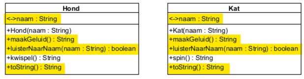

- Beide klassen bevatten dezelfde attributen zoals `naam` 
-  Beide klassen bevatten dezelfde methoden zoals `getNaam()`, `setNaam()`, en `maakGeluid()`.

- In de Java-code merken we op dat deze methodes meestal ook dezelfde implementatie hebben.
	- Alleen bij maakGeluid is dat niet zo.
		- **Specifieke implementaties**:
		    - `Hond`: `maakGeluid()` retourneert "waf waf".
		    - `Kat`: `maakGeluid()` retourneert "miauw".

```java
public class Hond {
    private String naam;
    
    public Hond(String naam) {
        setNaam(naam);
    }

    public String getNaam() {
        return naam;
    }

    public final void setNaam(String naam) {
        this.naam = naam;
    }

    public String maakGeluid() {
        return "waf waf";
    }
    
    public String toString() {
        return String.format("%s met naam %s", this.getClass().getSimpleName(), naam);
    }
}
```

```java
public class Kat {
    private String naam;
    
    public Kat(String naam) {
        setNaam(naam);
    }

    public String getNaam() {
        return naam;
    }

    public final void setNaam(String naam) {
        this.naam = naam;
    }

    public String maakGeluid() {
        return "miauw";
    }

    public String toString() {
        return String.format("%s met naam %s", this.getClass().getSimpleName(), naam);
    }
}
```

### Generalisatie

- **Generalisatie**: Vermijd dubbele code door een **superklasse** `Huisdier` te maken **die gemeenschappelijke attributen en methoden bevat**.

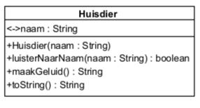

```java
public class Huisdier { //extends Object
    private String naam;
    
    public Huisdier(String naam) {
        setNaam(naam);
    }

    public String getNaam() {
        return naam;
    }

    public final void setNaam(String naam) {
        this.naam = naam;
    }

    public boolean luisterNaarNaam(String naam) {
        return naam.equals(this.naam);
    }

    public String toString() {
        return String.format("%s met naam %s", this.getClass().getSimpleName(), naam);
    }
}
```

#### Aandacht:

- Elke klasse erft standaard van `Object` als er geen expliciete `extends` is opgegeven. 
	- Hierdoor heeft elke klasse toegang tot de methoden van de klasse `Object`, zoals `toString()`, `equals()`, en `getClass()`.

- Het is belangrijk dat een constructor geen overridden methoden aanroept voordat het object volledig is geïnitialiseerd. 
	- Dit voorkomt fouten wanneer in een overridden methode attributen van de subklasse nog niet zijn ingesteld.

- Setters worden bij voorkeur `private` gemaakt of als `public final` gedeclareerd. 
	- Dit voorkomt dat ze per ongeluk worden overschreven in subklassen en waarborgt de juiste werking van de klasse. 
	- Hetzelfde geldt voor `private` en `static` methoden, die impliciet `final` zijn.

- Subklassen hebben geen toegang tot `private` methoden en attributen van de superklasse. 
	- Toegang kan worden verkregen via public of protected methoden.

- De `toString()` methode, die standaard wordt geërfd van `Object`, wordt gebruikt om een tekstuele weergave van een object te krijgen. 
	- Dit is handig voor debugging of het afdrukken van objecten. 
	- De methode kan worden overschreven om een gepersonaliseerde representatie van het object te bieden.

- In de `toString()` methode kan `getClass().getSimpleName()` worden gebruikt om de naam van de klasse van het object dynamisch op te halen, 
	- wat nuttig is voor het verkrijgen van de naam zonder de package.

### Overridden methoden

- **Overridden methoden** zijn methoden in een subklasse die een methode uit de superklasse vervangen of herdefiniëren. 
	- Dit betekent dat de subklasse zijn eigen implementatie biedt voor een methode die al bestaat in de superklasse. 
	- Dit wordt gedaan door de methode in de subklasse dezelfde naam, parameterlijst en returntype te geven als de methode in de superklasse.

**Voorbeeld**

```java
// Superklasse
public class Dier {
    public String maakGeluid() {
        return "Geluid van een dier";
    }
}

// Subklasse
public class Hond extends Dier {
    @Override
    public String maakGeluid() {
        return "Waf Waf";
    }
}
```
### Overerving

- **Overerving** laat een subklasse toe om de toestand (attributen) en gedrag (methoden) van de superklasse over te nemen.

	- Overerven is een "is-een"-relatie

	- Een subklasse erft van zijn superklasse (Java: keyword `extends`).

	- Een subklasse erft van zijn superklasse
		- de toestand (= de verzameling van attributen)
		- de associaties
		- het gedrag (= de verzameling van methodes)

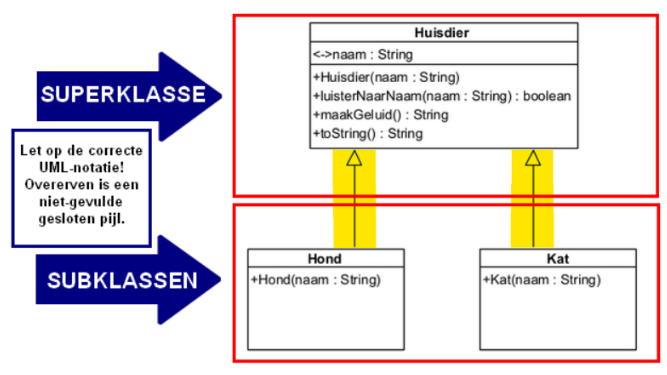

```java
public class Hond extends Huisdier {
    public Hond(String naam) {
        super(naam);
    }
}
```

### Toegangsrechten

- Subklassen hebben toegang tot **public** en **protected** attributen en methoden van de superklasse, maar niet tot **private**.

| Symbool UML | Keyword Java | Betekenis                                 |
| ----------- | ------------ | ----------------------------------------- |
| `-`         | private      | nergens zichtbaar in de buitenwereld      |
| `+`         | public       | overal zichtbaar in de buitenwereld       |
| `#`         | protected    | zichtbaar voor subklassen en package      |
| `~`         | (geen)       | zichtbaar voor alle klassen in de package |
- Het **`super`** keyword wordt gebruikt om methoden van de superklasse aan te roepen.

**voorbeeld**
```java
// Superklasse
public class Dier {
    public String maakGeluid() {
        return "Geluid van een dier";
    }
}

// Subklasse
public class Hond extends Dier {
    @Override
    public String maakGeluid() {
        // Gebruik de superklasse versie van de methode
        String geluidVanDier = super.maakGeluid();
        return geluidVanDier + " en Waf Waf";
    }
}
```

**Uitleg voorbeeld:**

- In de **`Hond`** **subklasse wordt de** `maakGeluid()` **methode overschreven** (`@Override`).
- Binnen de **`Hond`** **klasse roept de** **`super.maakGeluid()`** de versie van de `maakGeluid()` **methode aan die in de** **`Dier`** **superklasse gedefinieerd is**.
- De **`super.maakGeluid()`** **geeft de tekst "Geluid van een dier" terug**, en vervolgens voegt de `Hond` subklasse daar de tekst "en Waf Waf" aan toe.

### Uitbreiding en Specialisatie

- **Uitbreiding**: Voeg nieuwe methoden of attributen toe aan de subklasse.
- **Specialisatie**: Pas de methoden van de superklasse aan (overriding).

```java
@Override
public String maakGeluid() {
    return "waf waf " + super.maakGeluid();
}
```

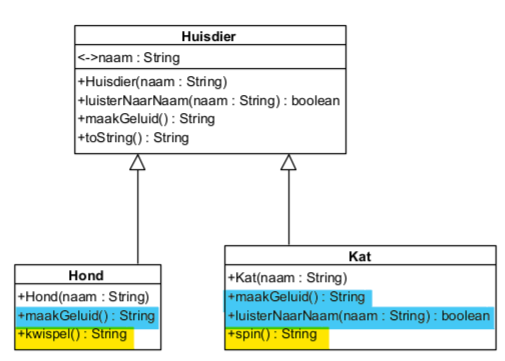
### Een Kleine Applicatie

- Maak een applicatie die objecten van de superklasse `Huisdier` en de subklassen `Kat` en `Hond` aanmaakt en hun gedrag toont.

```java
public class HuisdierApplicatieMetOvererving {
    public static void main(String[] args) {
        Huisdier hd = new Huisdier("Nijntje");
        Kat k = new Kat("Musti");
        Hond h = new Hond("Rintje");
        
        System.out.println(hd);
        System.out.println(k);
        System.out.println(h);
    }
}
```

### Gebruik van `super`

- Gebruik **`super`** om expliciet naar de methoden van de superklasse te verwijzen, bijvoorbeeld in methoden die worden overschreven.

```java
@Override
public String maakGeluid() {
    return String.format("waf waf%s", super.maakGeluid());
}
```

### Meer dan Eén Niveau van Overerving

- **Meer-niveau-overerving**: Subklassen kunnen verder afstammen van andere subklassen, waardoor een hiërarchie van klassen ontstaat.

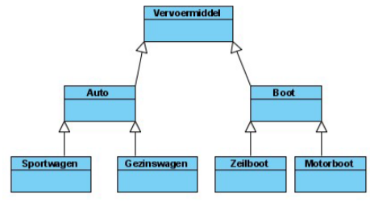
## De Klasse `Object`

- **`Object`** is de superklasse van alle klassen in Java en biedt **basismethoden** zoals:

	- We gebruiken de methode `equals` 
		- om 2 objecten inhoudelijk met elkaar te vergelijken. 
		- De klasse String overschrijft (overrides) deze methode.

	- De methode `getClass` (in combinatie met getSimpleName) 
		- waarmee je de klasse kunt opvragenwaartoe het object behoort.

	-  De methode `toString` die een tekstuele weergave van het object teruggeeft.


| Modifier and Type  | Method                             | Description                                                                                              |
|--------------------|------------------------------------|----------------------------------------------------------------------------------------------------------|
| `protected Object` | `clone()`                          | Creates and returns a copy of this object.                                                               |
| `boolean`          | `equals(Object obj)`               | Indicates whether some other object is "equal to" this one.                                              |
| `protected void`   | `finalize()`                       | Deprecated. The finalization mechanism is inherently problematic.                                        |
| `Class<?>`         | `getClass()`                       | Returns the runtime class of this Object.                                                                |
| `int`              | `hashCode()`                       | Returns a hash code value for the object.                                                                |
| `void`             | `notify()`                         | Wakes up a single thread that is waiting on this object's monitor.                                       |
| `void`             | `notifyAll()`                      | Wakes up all threads that are waiting on this object's monitor.                                          |
| `String`           | `toString()`                       | Returns a string representation of the object.                                                           |
| `void`             | `wait()`                           | Causes the current thread to wait until it is awakened, typically by being notified or interrupted.      |
| `void`             | `wait(long timeoutMillis)`         | Causes the current thread to wait until it is awakened, typically by being notified or interrupted, or until a certain amount of real time has elapsed. |
| `void`             | `wait(long timeoutMillis, int nanos)` | Causes the current thread to wait until it is awakened, typically by being notified or interrupted, or until a certain amount of real time has elapsed. |

# Meer over polymorfisme

## Wat is Polymorfisme?

- Polymorfisme verwijst naar het vermogen van een object om vele vormen aan te nemen. 
	- In Java betekent dit dat een object, afhankelijk van zijn werkelijke type, verschillende gedragingen kan vertonen.

### Voorbeeld:

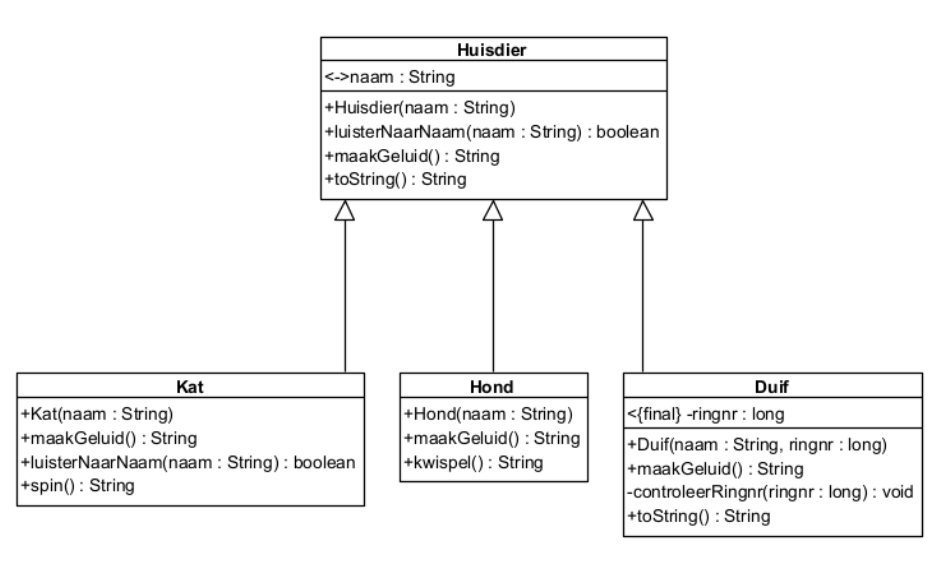

- **Superklasse `Huisdier`** en *subklassen* **`Kat`**, **`Hond`**, en **`Duif`**.
- Door polymorfisme kunnen we verschillende objecten van subklassen toewijzen aan een **`Huisdier`** referentie.

```java
Huisdier dierVanEls = new Kat("Musti");
```

Hier kan **`dierVanEls`** als een `Huisdier` worden behandeld, maar het object is een `Kat`.

## Gebruik van Polymorfisme

- In Java zijn er twee types van polymorfisme:
	- **static of compile-time polymorfisme**
	- **dynamic of runtime polymorfisme**

### Methodes en Referenties:

Wanneer we een methode aanroepen op een object, wordt afhankelijk van het werkelijke object (bijv. `Kat` of `Hond`) de juiste versie van de methode uitgevoerd.

**Codevoorbeeld:**

```java
Huisdier dierVanEls = new Kat("Musti");
System.out.println(dierVanEls.maakGeluid()); // Geeft "miauw" terug, omdat dierVanEls een Kat is.
```

### Static vs. Dynamic Polymorfisme

#### Static Binding (Compile-time):

   - De methode wordt gekozen op basis van de referentie (de klasse van de referentie, niet het object).
   - Voornamelijk gebruikt bij **method overloading**.

```java
class Printer {
    public void print(String text) {
        System.out.println("Print String: " + text);
    }
    
    public void print(int number) {
        System.out.println("Print Integer: " + number);
    }
}

public class StaticBindingExample {
    public static void main(String[] args) {
        Printer printer = new Printer();
        
        printer.print("Hello, World!");  // Static binding (compile-time)
        printer.print(42);               // Static binding (compile-time)
    }
}
```

#### Dynamic Binding (Runtime):

- De werkelijke klasse van het object wordt gebruikt om de juiste methode te vinden.
- Dit is de kracht van polymorfisme, waarbij de methode afhankelijk is van het werkelijke objecttype.

```java
class Animal {
    public void makeSound() {
        System.out.println("Animal makes a sound");
    }
}

class Dog extends Animal {
    @Override
    public void makeSound() {
        System.out.println("Dog barks");
    }
}

class Cat extends Animal {
    @Override
    public void makeSound() {
        System.out.println("Cat meows");
    }
}

public class DynamicBindingExample {
    public static void main(String[] args) {
        Animal animal1 = new Dog();  // animal1 verwijst naar een Dog-object
        Animal animal2 = new Cat();  // animal2 verwijst naar een Cat-object
        
        animal1.makeSound();  // Dynamic binding (runtime)
        animal2.makeSound();  // Dynamic binding (runtime)
    }
}
```


### Casting en `instanceof`

#### Downcasting

- **Downcasting** is het omzetten van een referentie naar een subklasse, zodat je toegang hebt tot specifieke methoden van de subklasse.
	- Dit betekent dat je een object van een superklasse (bijvoorbeeld `Huisdier`) naar een object van een subklasse (bijvoorbeeld `Kat`) cast, 
		- zodat je toegang krijgt tot de specifieke methoden van de subklasse.

**Voorbeeld**
```java
Huisdier dierVanEls = new Kat("Musti");
Kat katVanEls = (Kat) dierVanEls;  // Downcast naar Kat
System.out.println(katVanEls.spin());  // Specifieke methode van Kat
```

##### Wat gebeurt er in het bovenstaande voorbeeld?

1. **`dierVanEls`** is van het type `Huisdier`, maar het wijst naar een object van de klasse `Kat` (een subklasse van `Huisdier`).
2. **Downcasting** betekent hier dat we expliciet zeggen dat **`dierVanEls`** een `Kat` is, door `(Kat)` ervoor te zetten.
3. Na de downcast kunnen we **de methoden van de `Kat` klasse** aanroepen, zoals `spin()`, omdat we het object nu behandelen als een `Kat`, niet als een `Huisdier`.

#### instanceof

- Het **`instanceof`** keyword wordt gebruikt om te controleren of een object een bepaalde subklasse is, wat helpt bij veilige casting.

**Voorbeeld**
```java
if (dierVanEls instanceof Kat katVanEls) {
    System.out.println(katVanEls.spin());
} else {
    System.out.println("Dit dier kan niet spinnen!");
}
```

##### Wat gebeurt er in dit voorbeeld?

1. **`instanceof`** controleert of `dierVanEls` daadwerkelijk een `Kat` is.
2. Als de controle **waar** is (dus als `dierVanEls` een `Kat` is), wordt de code binnen het `if` blok uitgevoerd, en kunnen we `spin()` aanroepen.
3. Als de controle **niet waar** is (bijvoorbeeld als het een `Hond` of een ander `Huisdier` is), wordt de code binnen het `else` blok uitgevoerd.

## Waarom Polymorfisme?

- Dankzij polymorfisme wordt de code eenvoudiger.
- Polymorfisme maakt je code flexibeler en uitbreidbaar.
- Het stelt je in staat om dezelfde interface (methode) te gebruiken voor verschillende objecten die verschillende implementaties kunnen hebben.
- Dankzij polymorfisme kunnen we objecten dynamisch behandelen op basis van hun werkelijke type, wat de leesbaarheid en onderhoudbaarheid van je code vergroot.


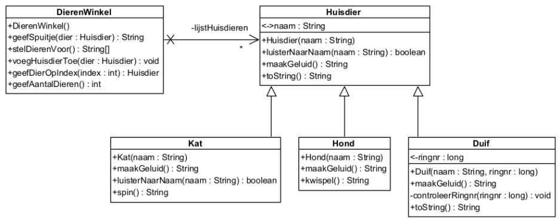

## De code wordt eenvoudiger door polymorfisme

- Je kunt verschillende objecten in dezelfde lijst beheren door ze als de superklasse (`Huisdier`) te behandelen.

```java
private List<Huisdier> lijstHuisdieren;
```


## Polymorfisme in Parameters en Returntypes: Vermijdt herhaling

- **Polymorfisme in parameters**: Je kunt een methode definiëren die elke klasse uit de hiërarchie als parameter accepteert. De methode kiest vervolgens de juiste uitvoering van de methode, afhankelijk van het type van het object dat wordt doorgegeven.

**Voorbeeld**:

```java
public String geefSpuitje(Huisdier dier) {
    return String.format("Awwwwww... dat doet pijn! %s", dier.maakGeluid());
}
```

- De `geefSpuitje` methode accepteert een `Huisdier` object als parameter, maar de specifieke `maakGeluid` methode die wordt uitgevoerd, komt uit de subklasse van het object (bijv. `Kat`, `Hond`).
    
- **Polymorfisme in returntypes**: Je kunt ook polymorfisme gebruiken in returntypes, zodat een methode een object van de superklasse kan retourneren, dat een instantie van een subklasse kan zijn.
    

**Voorbeeld**:

```java
public Huisdier geefDierOpIndex(int index) {
    return lijstHuisdieren.get(index);
}
```

- De `geefDierOpIndex` methode retourneert een `Huisdier`, maar het werkelijke object kan een `Kat`, `Hond`, of `Duif` zijn, afhankelijk van wat er in de lijst is opgeslagen.
## Een polymorfe hiërarchie is gemakkelijk uitbreidbaar

- Nieuwe subklassen kunnen eenvoudig worden toegevoegd zonder bestaande code te wijzigen.

```java
public class Hamster extends Huisdier {
    public Hamster(String naam) {
        super(naam);
    }
}
```

4. **Toepassing in de praktijk**: Je kunt bijvoorbeeld een lijst van verschillende huisdieren beheren en de juiste methode aanroepen afhankelijk van het objecttype.


## Toegepast op het voorbeeld

- In dit voorbeeld wordt een klasse **DierenWinkel** geïntroduceerd, die verschillende methodes bevat die we eerder hebben besproken, met de toevoeging van **`geefAantalDieren`**.


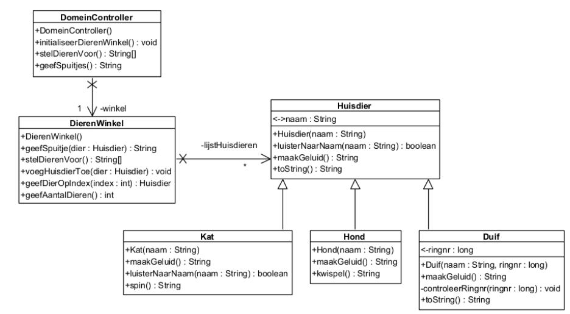


### Methode `geefAantalDieren`

- Deze methode retourneert het aantal dieren in de winkel.

```java
public int geefAantalDieren() {
    return lijstHuisdieren.size();
}
```

### DomeinController

- De **DomeinController** bevat de logica om met de **DierenWinkel** te communiceren. 

- De methodes binnen de controller worden gebruikt om
	- dieren toe te voegen
	- dieren voor te stellen
	- acties zoals het toedienen van spuitjes uit te voeren.

```java
package domein;

import java.security.SecureRandom;

public class DomeinController {
    private DierenWinkel winkel;
    private SecureRandom random = new SecureRandom();

    // Constructor voor DomeinController
    public DomeinController() {
        winkel = new DierenWinkel();  // Maak DierenWinkel aan
    }

    // Initialiseer de winkel met dieren
    public void initialiseerDierenWinkel() {
        Duif duif1 = new Duif("Blauwe geschelpte", 20180000001L);
        winkel.voegHuisdierToe(duif1);
        Kat kat1 = new Kat("Minoe");
        winkel.voegHuisdierToe(kat1);
        // Voeg meer dieren toe...
    }

    // Voorstel van alle dieren in de winkel
    public String[] stelDierenVoor() {
        return winkel.stelDierenVoor();
    }

    // Geven van spuitjes aan willekeurige dieren
    public String geefSpuitjes() {
        String uitvoer = "";
        for (int i = 0; i < 3; i++) {
            int aantalDieren = winkel.geefAantalDieren();
            int randomIndex = random.nextInt(aantalDieren);
            Huisdier patient = winkel.geefDierOpIndex(randomIndex);
            uitvoer += String.format("%s%n", winkel.geefSpuitje(patient));
        }
        return uitvoer;
    }
}
```

### Gebruik in een Applicatie

Een eenvoudige applicatie die de **DomeinController** gebruikt om dieren toe te voegen, deze voor te stellen en spuitjes toe te dienen.

```java
package cui;

import domein.DomeinController;

public class HuisdierApplicatieMetPolymorfisme {
    public static void main(String[] args) {
        HuisdierApplicatieMetPolymorfisme app = new HuisdierApplicatieMetPolymorfisme();
        app.doeIetsMetHuisdieren();
    }

    private void doeIetsMetHuisdieren() {
        DomeinController dc = new DomeinController(); // Maak DomeinController-object
        dc.initialiseerDierenWinkel(); // Initialiseer dierenwinkel

        String[] overzicht = dc.stelDierenVoor(); // Verkrijg een lijst van dieren
        for (String eenDier : overzicht) {
            System.out.println(eenDier); // Print elk dier
        }
        System.out.println();

        System.out.println(dc.geefSpuitjes()); // Geef 3 spuitjes aan willekeurige dieren
    }
}
```

### Andere voorbeelden van polymorfisme

##### 5.4.1. Vierhoeken

- De superklasse **Vierhoek** heeft subklassen zoals 
	- **Rechthoek**
	- **Vierkant**
	- **Parallellogram**
	- etc.

- Elke subklasse implementeert de methodes **`teken()`**, **`berekenOppervlakte()`**, en **`berekenOmtrek()`** op een eigen manier.


##### 5.4.2. Rekeningen

- De superklasse **Rekening** heeft subklassen zoals 
	- **SpaarRekening** 
	- **ZichtRekening**
 
- die hebben specifieke implementaties voor de methode **`haalAf()`**, afhankelijk van hun type.

```java
public class Rekening {
    public void haalAf(double bedrag) {
        // Algemeen bedrag afhalen
    }
}

public class SpaarRekening extends Rekening {
    public void haalAf(double bedrag) {
        // Spaarrekening specifieke implementatie
    }
}

public class ZichtRekening extends Rekening {
    public void haalAf(double bedrag) {
        // Zichtrekening specifieke implementatie
    }
}
```

### Samenvatting

- **Polymorfisme** maakt het mogelijk om dezelfde methode voor verschillende subtypes te gebruiken, wat de code eenvoudiger en flexibeler maakt.
- Methodes en parameters kunnen polymorf worden gedefinieerd, zodat ze voor verschillende subtypes kunnen werken.
- **Polymorfisme** helpt bij het uitbreiden van klassenhiërarchieën, zonder bestaande code aan te passen, zoals het toevoegen van een nieuwe **Hamster** in de dierenwinkel zonder de bestaande code te beïnvloeden.

# Drielagenmodel

- Het **drielagenmodel** scheidt de applicatie in drie lagen: presentatielaag, domeinlaag en persistentielaag. 
- Dit zorgt voor duidelijk afgebakende verantwoordelijkheden, verhoogt de herbruikbaarheid, maakt de applicatie uitbreidbaar en vereenvoudigt het onderhoud. 
- De lagen communiceren via gecontroleerde interfaces, met de DomeinController als schakel tussen de gebruikersinterface en de applicatielogica.

## Waarom drie lagen?

- Een goede applicatie moet
	- voldoen aan de verwachtingen
	- herbruikbare onderdelen bevatten
	- uitbreidbaar zijn
	- onderhoudbaar zijn
	- performant zijn
	- stabiel functioneren en bug vrij zijn
	- gebruiksvriendelijk en veilig zijn

- Bij slecht ontwerp kunnen applicaties onbruikbaar worden, 
	- zoals in het voorbeeld van een kubusvormige doosapplicatie die eerst als consoleapplicatie werd gemaakt, maar later herzien moest worden om een GUI te ondersteunen. 

- Het is belangrijk om duidelijke verantwoordelijkheden in klassen te verdelen om spaghetticode te voorkomen en het ontwerp robuuster te maken.

## Welke zijn de drie lagen?

- In objectgeoriënteerde softwarearchitectuur worden klassen verdeeld in drie lagen:

>
	- **Presentatielaag**: *Klassen die de communicatie met de gebruiker verzorgen* (`invoer en uitvoer`).
	- **Domeinlaag**: *Klassen die de logica van de applicatie bevatten* (`verwerking van gegevens`).
	- **Persistentielaag**: *Klassen die de communicatie met de databank verzorgen* (`data-opslag`).
>

- Elke laag komt overeen met een package in het Java-project. 

- Het scheiden van deze verantwoordelijkheden zorgt ervoor dat de logica van de applicatie eenvoudig kan worden aangepast zonder dat andere lagen beïnvloed worden
	- bijvoorbeeld door de GUI in plaats van een consoleapplicatie te gebruiken.

- **Belangrijk**
	-  GEEN in- en uitvoer in de domeinklasse
	- GEEN logica in de applicatie
## Wat hoort waar en hoe communiceren de lagen met elkaar?

- Om *een project op een gestructureerde manier te starten en te laten draaien*, gebruiken we vaak een **StartUp** klasse die de main-methode bevat. 

- Deze klasse *maakt een object van de eerste UI-klasse* en *geeft* een **DomeinController** *door om het systeem te besturen*.

### De presentatielaag

- De ui kan een consoleapplicatie (`cui`) of een grafische applicatie (`gui`) zijn.

- De presentatielaag is verantwoordelijk voor het tonen van gegevens aan de gebruiker en het verzamelen van invoer. 
- Het maakt gebruik van de **DomeinController** om gegevens op te vragen uit de domeinlaag en door te geven aan de gebruiker. 
- Gegevens die van de gebruiker worden ingevoerd, worden via de DomeinController naar de domeinlaag gestuurd voor verwerking.

- **Belangrijk**: Gegevens uit de database mogen niet rechtstreeks vanuit de presentatielaag worden geraadpleegd. Alle communicatie naar de persistentielaag gebeurt via de domeinlaag.

### De domeinlaag

- Bevat de `Klassen` en `Domeincontroller`

- De domeinlaag bevat de logica van de applicatie en wordt bestuurd door de **DomeinController**. 
- De controller ontvangt aanvragen van de gebruikersinterface en verwerkt deze door de juiste domeinklassen aan te roepen. 
- Als de applicatie groeit, kunnen extra **UseCaseControllers** worden toegevoegd om de operaties per use case te organiseren.

- De domeinlaag kan ook communiceren met de persistentielaag om gegevens op te halen of op te slaan.

### De persistentielaag

- Bevat `Mapperklassen`

- De persistentielaag zorgt voor de koppeling tussen de applicatie en de databank. 
- Aangezien de databank werkt met data en niet met objecten, is het de taak van deze laag om de **Object Relational Mapping (ORM)** uit te voeren. 
- Dit betekent dat de objecten uit de applicatie worden omgezet naar databankrecords en vice versa.

- Er kunnen **Mapperklassen** worden gebruikt 
	- die verantwoordelijk zijn voor het uitvoeren van CRUD-operaties op de databank en voor het omzetten van applicatie-objecten naar databanktypes.
		- Create: opslaan van nieuwe gegevens in de database
		- Read: ophalen van gegevens uit de database
		- Update: opslaan van gewijzigde gegevens in de database
		- Delete: verwijderen van 1 of meerdere records uit database

#### Probleem met de object-relational gap

- De "object-relational gap" verwijst naar de verschillen tussen de objectgeoriënteerde en relationele datamodellen, zoals datatypes, associaties en de manier waarop relaties worden beheerd. 
	- Deze kloof kan worden gedicht met behulp van ORM-tools zoals Hibernate of JPA
	- Maar kan ook handmatig worden geïmplementeerd via **Mapperklassen** die de conversie van objecten naar de databank en terug regelen.

