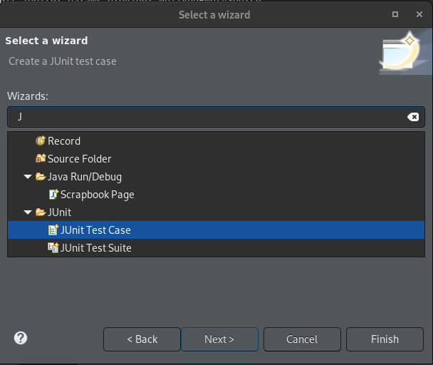

# Testklasse aanmaken

- Maak pakage `testen` aan
- Hier in maak je een *testklasse*
- Naam van de testklasse is *KlassenaamTest.class* (steeds de naam van de klasse met Test aan toegevoegd)




We weten niet in welke volgorde de testen worden uitgevoerd

nooit een berekening in testmethode plaatsen

1. Constructor testen

# import

Zal vanzelf gebeuren of kan je met rechter muisklik automatisch laten toevoegen, LET OP, steeds `org.junit.jupiter` zodat het Junit 5 is.

```java
import org.junit.jupiter.api.Test;
import org.junit.jupiter.params.ParameterizedTest;
import org.junit.jupiter.params.provider.EmptySource;
import org.junit.jupiter.params.provider.NullAndEmptySource;
import org.junit.jupiter.params.provider.NullSource;
import org.junit.jupiter.params.provider.ValueSource;

import domein.Bestelling;
```
 Importeer ook je klasse

# Naamgeving van de test

Een goede naam voor een test methode bestaat uit *3 delen*
	1. de **naam van de methode** die zal getest worden voor een constructor kiezen we “maak” gevolgd door de naam van de constructor
	1. een **omschrijving van de test case**
	2. een **omschrijving van het verwachte resultaat** van de test

# Volgorde in een testklasse

1. Aanmaken van CONSTANTEN
2. Aanmaken van het object
3. Aanmaken van @Before
4. Testen van Constructor
5. Testen van Gedrag
# Soorten testen

## @ BeforeEach

Code om uit te voeren voor elke test, bijvoorbeeld *om de klasse al aan te maken*.

```java
@BeforeEach
public void before() {
	zichtrekening = new Zichtrekening();
}
```

Bij het *aanmaken van de klasse* **vergeet deze niet te initialiseren:** `private Zichtrekening zichtrekening;`

```java
class ZichtrekeningTest {
 
	private Zichtrekening zichtrekening;
	
	@BeforeEach
	public void before() {
		zichtrekening = new Zichtrekening();
	}
}
```
## @Test

### assertEquals
```java
@Test
void maakBestelling_GeldigAantal_MaakBestelling() {
	Bestelling bestelling = new Bestelling(5);
	assertEquals(5, bestelling.getAantal());
}
```

- Het eerste is het te verwachten resultaat, tweede is wat ik terug krijg van het programma, de volgorde is belangrijk voor de foutboodschap

### assertTrue

Voor boolean test

```java
@Test
void geeftRechtOpKorting_BestellingMetRechtOpKorting_RetourneertTrue() {
	Bestelling bestelling = new Bestelling(7);
	assertTrue(bestelling.geeftRechtOpKorting());
}
```
### assertFalse

Voor boolean test

```java
@Test
void geeftRechtOpKorting_BestellingNetNietGrootGenoegVoorRechtOpKorting_RetourneertFalse() {
	Bestelling bestelling = new Bestelling(4);
	assertFalse(bestelling.geeftRechtOpKorting());
}
```

### assertThrows

Verwachte resultaat: IllegalArgumentException

```java
@Test
void maakBestelling_AantalTeKlein_WerptException() {
	assertThrows(IllegalArgumentException.class, () -> new Bestelling(-5));
}
```

### assertDoesNotThrow

- Als we onze constructor *niet kunnen testen met een AssertEquals en een getter* kan een **assertDoesNotThrow** *voor een oplossing zorgen*.

```java
@ParameterizedTest
@ValueSource(strings = {"0123", "9876", "4567"})
void maakKluisZonderExeption(String code) {
	assertDoesNotThrow(() ->new Kluis(code)); //omdat we niet kunnen controleren met getter, testen we of er geen exeption is.
}
```
## @ParameterizedTest

- Voor het testen van meerdere waarden

- *ValeuSource kan slechts argument aan van een* **primitief Datatype** *of* **String**

	- int-> ints
	- double -> doubles 
	- String -> Strings

```java
@ParameterizedTest
@ValueSource(ints = {-5,20,0,11}) //Zal elke keer opnieuw een object aanmaken (4 keer)
	void maakBestelling_OngeldigeWaarden(int aantal) {
	assertThrows(IllegalArgumentException.class, () -> new Bestelling(aantal));
}
```

### Lege waarden testen

```java
//bij opsomming van strings
@NullAndEmptySource //null en lege string
@NullSource //null
@EmptySource //lege string
```
## Aandachtspunten

- We maken nooit testklassen met bewerkingen!
- We testen maar 1 ding tegelijk!

### Gebruik constanten!

```java
private static final int CAPACITEIT = 250;
private static final int MIN_CAPACITEIT = 100; //grenzen ook in constanten zetten
private static final int MAX_CAPACITEIT = 2000; //grenzen ook in constanten zetten
```

### Equivalentiepartities (EP)

Equivalentiepartities is letterlijk een test.

- Een *geldige EP* is een EP waarvoor je een normaal gedrag van een methode verwacht.
- Een *ongeldige EP* is een EP waarvoor je geen normaal gedrag van een methode verwacht, dit betekent dat de methode een exception zal werpen.

### Boundary Values (BV)

- Een boundary value is een waarde die zich aan de grens van een equivalentie partitie bevindt.
# Voorbeeld van een testklasse

## Voorbeeld 1

```java
package testen;

import static org.junit.jupiter.api.Assertions.*;

import org.junit.jupiter.api.Test;
import org.junit.jupiter.params.ParameterizedTest;
import org.junit.jupiter.params.provider.EmptySource;
import org.junit.jupiter.params.provider.NullAndEmptySource;
import org.junit.jupiter.params.provider.NullSource;
import org.junit.jupiter.params.provider.ValueSource;

import domein.Bestelling;

class BestellingTest {


	@ParameterizedTest
	@ValueSource(ints = {5, 1, 10})
	void maakBestelling_GeldigAantal_MaakBestelling(int aantal) {
		assertEquals(aantal, new Bestelling(aantal).getAantal());
	}
	
	@Test
	void maakBestelling_GeldigAantal_MaakBestelling() {
		Bestelling bestelling = new Bestelling(5);
		assertEquals(5, bestelling.getAantal());
	}
	
	@Test
	void maakBestelling_KleinstToegelatenAantal_MaakBestelling() {
		Bestelling bestelling = new Bestelling(1);
		assertEquals(1, bestelling.getAantal());
	}
	
	@Test
	void maakBestelling_GrootstToegelatenAantal_MaakBestelling() {
		Bestelling bestelling = new Bestelling(10);
		assertEquals(10, bestelling.getAantal());
	}
	
	@ParameterizedTest
	@ValueSource(ints = {-5,20,0,11})
		void maakBestelling_OngeldigeWaarden(int aantal) {
		assertThrows(IllegalArgumentException.class, () -> new Bestelling(aantal));
	}
	
	@Test
	void maakBestelling_AantalTeKlein_WerptException() {
		assertThrows(IllegalArgumentException.class, () -> new Bestelling(-5));
	}
	
	@Test
	void maakBestelling_AantalTeGroot_WerptException() {
		assertThrows(IllegalArgumentException.class, () -> new Bestelling(20));
	}
	
	@Test
	void maakBestelling_AantalNetTeKlein_WerptException() {
		assertThrows(IllegalArgumentException.class, () -> new Bestelling(0));
	}
	
	@Test
	void maakBestelling_AantalNetTeGroot_WerptException() {
		assertThrows(IllegalArgumentException.class,() -> new Bestelling(11));
	}
	
	@Test
	void geeftRechtOpKorting_BestellingMetRechtOpKorting_RetourneertTrue() {
		Bestelling bestelling = new Bestelling(7);
		assertTrue(bestelling.geeftRechtOpKorting());
	}
	
	@Test
	void geeftRechtOpKorting_BestellingNetGrootGenoegVoorRechtOpKorting_RetourneertTrue() {
		Bestelling bestelling = new Bestelling(5);
		assertTrue(bestelling.geeftRechtOpKorting());
	}*/
	
	@ParameterizedTest
	@ValueSource(ints = {7,5})
	void geeftRechtOpKorting_BestellingMetRechtOpKorting_RetourneertTrue(int aantal) {
		Bestelling bestelling = new Bestelling(aantal);
		assertTrue(bestelling.geeftRechtOpKorting());
	}
	
	@ParameterizedTest
	@ValueSource(ints = {2,4})
	void geeftRechtOpKorting_BestellingZonderRechtOpKorting_RetourneertFalse(int aantal) {
		Bestelling bestelling = new Bestelling(aantal);
		assertFalse(bestelling.geeftRechtOpKorting());
	}

}
```


## Voorbeeld 2

```java
package testen;

import static org.junit.Assert.assertThrows;
import static org.junit.jupiter.api.Assertions.*;

import java.math.BigDecimal;
import org.junit.jupiter.api.BeforeEach;
import org.junit.jupiter.api.Test;
import org.junit.jupiter.params.ParameterizedTest;
import org.junit.jupiter.params.provider.NullAndEmptySource;
import org.junit.jupiter.params.provider.ValueSource;

import domein.Zichtrekening;

class ZichtrekeningTest {
 
	private Zichtrekening zichtrekening;
	
	@BeforeEach
	public void before() {
		zichtrekening = new Zichtrekening();
	}
	
	//Constructor test
	@Test
	void maakZichtrekeningHeeftSaldoNul() {
		assertEquals(BigDecimal.ZERO, zichtrekening.getSaldo());
	}
	
	//Gedrag test
	@Test
	void stortBedragIsCorrecteSaldo() {
		zichtrekening.stort(BigDecimal.valueOf(10));
		zichtrekening.stort(BigDecimal.valueOf(22.5));
		assertEquals(BigDecimal.valueOf(32.5), zichtrekening.getSaldo());
	}
	
	@Test
	void stortBedragIsCorrecteSaldoGrenswaarden() {
		zichtrekening.stort(BigDecimal.valueOf(10));
		zichtrekening.stort(BigDecimal.valueOf(0.5));
		assertEquals(BigDecimal.valueOf(10.5), zichtrekening.getSaldo());	
	}

  

}

```

## Voorbeeld 3

```java
package testen;

import org.junit.jupiter.api.Test;
import org.junit.jupiter.params.ParameterizedTest;
import org.junit.jupiter.params.provider.NullAndEmptySource;
import org.junit.jupiter.params.provider.ValueSource;

import static org.junit.jupiter.api.Assertions.*;

import org.junit.jupiter.api.BeforeEach;

import domein.Kluis;

class KluisTest {
	
	/*
	12		//te klein
	123		//te groot
	4567891 //te groot
	12345	//grens te groot
	55		//4 dezelfde
	1A23	//
	5555
	12b3
	12*3
	12 3
	12 34
	
	 * 
	 */
	
	private static final String TESTCODE = "1234";

	private Kluis kluis;
	
	@BeforeEach
	public void before() {
		kluis = new Kluis(TESTCODE);
	}
	
	//constructortest
	
	@ParameterizedTest
	@ValueSource(strings = {"0123", "9876", "4567"})
	void maakKluisZonderExeption(String code)
	{
		assertDoesNotThrow(() ->new Kluis(code)); //omdat we niet kunnen controleren met getter, testen we of er geen exeption is.
	}
	
	@ParameterizedTest
	@NullAndEmptySource
	@ValueSource(strings = {"12345","test", "12A3","12*3","0000","12 3","    ","12 34"})
	void maakKluisMetExeption(String code)
	{
		assertThrows(IllegalArgumentException.class, 
				() -> new Kluis(code));
	}
	
//gedragtest
	
	@Test
	void maakKluisTestValideerJuist()
	{
		assertTrue(kluis.valideerCode(TESTCODE));
	}
	
	@ParameterizedTest
	@NullAndEmptySource
	@ValueSource(strings = {"0234", "    ", "4567","abcd","12345"})
	void maakKluisTestValideerFout(String code)
	{
		assertFalse(kluis.valideerCode(code));
	}
	
}

```

# Op examen

## Volgorde van testen

1. Altijd eerst goede constructor testen
	- Grenzen (Max en Minimum in een constante)
	- Willekeurige waarden
2. Slechte constructor testen
	- Grenzen (Max en Minimum in een constante)
	- Willekeurige waarden
3. Goed gedrag testen
	- Grenzen (Max en Minimum in een constante)
	- Willekeurige waarden
4. Slecht gedrag testen
	- Grenzen (Max en Minimum in een constante)
	- Willekeurige waarden

