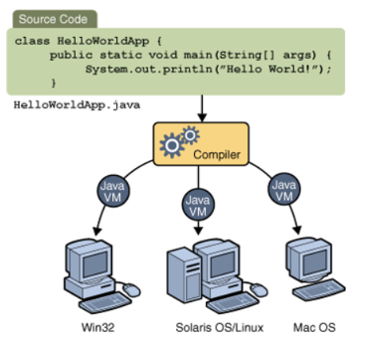
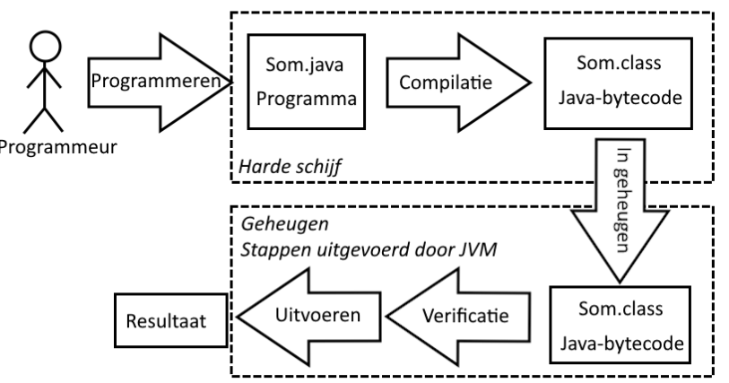
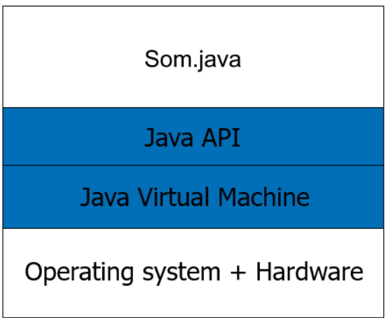

#Samenvatting #Java #HoGent #toegepasteinformatica #OOSD

Lesgever: [Irina Malfait](irina.malfait@hogent.be)

# H1 Introductie Java-applicaties

## Geschiedenis

- 1991 ontworpen door Sun Microsystems
- 1993 release van Mosaic browser (ontwerpers herschreven de compiler (C -> Java))
- 1994 Release webrunner (eerste op Java gebaseerde browser (Dit bleek samen met de gratis verspreiding een succesverhaal te zijn!))
- voor 1995 had bijna niemand ervan gehoord

## Java-bytecode

Gezien een processor enkel zijn eigen specifieke machinecode begrijpt, die onleesbaar is voor de mens (0 en 1), moeten we een programma schrijven in een *hogere programmeertaal* (Cobol, Java,Pascal, ...). 

Een *compiler* (vertaler) zal het programma omzetten naar een specifieke machinecode.
Omdat de vertaler kan vertalen naar verschillende soorten machinecode, zal het programma *platformafhankelijk* zijn (platform = combinatie van een bepaald type processor met een bepaald besturingssysteem).

### Oplossing die men in Java toepast:

1. Elk Java-programma wordt door een compiler vertaald naar een soort *TUSSENTAAL(= Java-bytecode)*, die betrekkelijk dicht tegen machinecode aanleunt.
2. De tussentaal wordt dan verder vertaald voor een specifieke processor, door een programma genaamd de *JAVA VIRTUAL MACHINE (JVM)*. Een JVM is een tamelijk klein programma (256Kb), vermits het vertalen niet zo’n grote klus is want Java-bytecode is een kleine taal (weinig keywords).





## Java-applicaties

### Eigenschappen

1. *een applicatie is een Java-programma*, net als de programma’s op je eigen computer (vb. Word, tekenprogramma,...)
2. *een applicatie wordt bewaard en uitgevoerd op lokale PC*
3. *een applicatie is uitvoerbaar op elke PC mits JVM* (geen webbrowser nodig, zoals bij een JAVA-applet)
4. *een applicatie kan bestanden op schijf maken, lezen en verwijderen*


### Eerste voorbeeld

```java

packagecui;//een project delen we op in packages, voorlopig enkel cui = console-user-interface

importjava.lang.*;//mag weggelaten worden, want wordt als enige package uit de Java-API automatisch geïmporteerd

publicclassSomextendsObject// extends Object mag ook weggelaten worden gezien ELKE klasse in Java erft van Object, de moederklasse

{
	publicstaticvoidmain(String[]args)
	{
		intx=2,y=3,som;
		som=x*x+y*y;System.out.println("Som = "+som);
	}
}

```

Uitvoer:

Som = 13

### De 5 fasen




1. *Met een editor het java-programma intypen en bewaren met extensie .java* → **Som.java**
2. *Het programma compileren met het commando javac.* Het resultaat is een file met de extensie.class (= *bytecode*). → **javac Som.java → geeft Som.class**
3. *Het programma (de .class-file) wordt geladen in het geheugen.*
4. *De bytecode wordt geverifieerd* (om te kijken of de .class-files geldige java bytecode bevatten).
5. *Het programma wordt uitgevoerd, door gebruik te maken van de Java-vertaler (JVM), via het commando java* → **java Som**

#### JIT compilatie

Java-applicaties worden door een compiler vertaald naar bytecode voor de JVM. De eerste JVM’s voerden deze bytecode uit door middel van pure interpretatie ("live" vertalen en uitvoeren). Omdat deze methode langzaam was ging men gebruikmaken van *JIT-compilatie (Just in Time)*, een vorm van compilatie die plaatsvindt tijdens de uitvoering van een computerprogramma.


### Het java platform




  
*Java Runtime Environment (=JRE)*  is een combinatie van de JVM met de Java API.


### Wat heb je nodig

1. *een editor*, bijv. Notepad, Wordpad of Textpad (Textpad)
2. *een compiler*
3. een Java Virtual Machine Compiler + JVM = *Java Development Kit* [(JDK)]([Content Server Error (oracle.com)](https://www.oracle.com/technetwork/java/javase/downloads/index.html))

### Integrated Development Environment

#### Een IDE bevat:

1. *Code editor* (maakt gebruikt van JDK)
2. *Compiler, linker*
3. *Debugger*
4. *Helpfuncties*⇒ de ontwikkelingstijd voor het schrijven van een programma wordt sterk gereduceerd.

IDE’s: [NetBeans](http://netbeans.org/), [Eclipse](http://eclipse.org/), [JBuilder](http://www.borland.com/jbuilder), [IntelliJ IDEA](http://www.jetbrains.com/idea), [JDeveloper](https://www.oracle.com/application-development/technologies/jdeveloper.html), ..


## Uitvoerstatements in een Java-applicatie

### print, println en printf: een zin afdrukken
WAT INKORTEN EN AFWERKEN
```java
/* Welcome1.java
Een eerste programma in Java. */

package cui;

public class VoorbeeldUitvoer { //start klasse (gevolgd door naam vanm klasse)
 
	public static void main(String[] args) { //start methode (naam methode start steeds met kleine letter)

	/* print println printf
	
	\ = start van een gereserveerd teken
	\n = nieuwe lijn
	\t = tab
	\\ = om een backslash in mijn text te zetten
	\r = terug te keren naar het begin van de huidige regel, zonder naar een nieuwe regel te gaan (wordt weinig gebrµikt
	
	*/
	
	System.out.println("Dit is een voorbeeld ");
	//Sytem.out = scherm / .println() = methode
	//System is een naam van een klasse (standaard geintergreede klasse)
	
	System.out.print("\n");
	// System.out.print("\n"); is zelfde als System.out.println();
	
	System.out.println("Dit is een tweede voorbeeld ");
	
	System.out.print("Geef een getal:");
	//wordt gebruikt voor invoer te vragen aan de gebruiker
	
	System.out.println();
	//geeft ook een lege nieuwe lijn
	
	System.out.println("Dit is regel 1\nDit is regel 2\tmet een tab ruimte");
	
	System.out.println("het netwerk adres voor Samba is: \\192.168.0.120\\");
	//om een backslash te gebruiken
	
	System.out.println("\"Dit is een zin in dubbele accolades\"");
	//om een dubbele quote te gebruiken
	
	int getal1 = 10; //initialisatie van een integer
	
	int getal2 = 55;
	
	//slecht:
	System.out.println("Het resultaat is: " + getal1 + " en getal: " + getal2);
	//Niet goede methode !!!!!!!!!!!!!!!!
	
	//Correct manier: (juiste syntax)
	//System.out.printf("Resultaat is %d en tweede resultaat is %d%n", args);
	System.out.printf("Resultaat is %d en tweede resultaat is %d%n", getal1 , getal2);
	// printf is voor print met argumenten (variabelen meegeven)
	// %d is voor digit / %n is voor nieuwe lijn
	//waarom is dat betere, geeft dit als mogelijkheid
	
	String toekomst = String.format("Resultaat is %d en tweede resultaat is %d%n", getal1 , getal2);
	
	System.out.println(toekomst);
	
	/* Bij gebruik van printf of gebruik van argumenten
	
	%n = nieuwe lijn
	%d = uitschrijven van digit (argument)
	%s = uitscrhijven van een string (argument)
	%S = uitscrhijven van een string maar alles met HOOFDLETTERS (argument)
	%f = is voor een double (kan je voor alles gebruiken, niet gewenst)
	%o = is voor octaal stelsel (Zet automatisch om naar Octaal)
	%x of %X = is voor Hexadecimaal (zet automatisch om naar Hexadecimaal)
	%% = als je wilt het teken % tonen moet je 2 % plaatsen
	
	* */
	
	String woord = "Voorbeeld";
	
	System.out.printf("Text is %s%nText in hoofdletters %S%n", woord, woord);
	//vergeet niet steed je argumenten voor %s of %S (zoals hier woord)
	
	double decGetal = 5.2368;
	
	System.out.printf("Resultaat is %f%n", decGetal);
	// %f is weergeven van een double in argument
	
	System.out.printf("De prijs is %.2f%n", decGetal); //Afronden %.2f (2cijfers na de komma)
	System.out.printf("%d%n", 26);
	System.out.printf("%d%n", +26);
	System.out.printf("%d%n", -26);
	System.out.printf("%o%n", 26);
	System.out.printf("%x%n", 26);
	System.out.printf("%X%n", 26);
	
	// %getald (%4d) reserveeerd aantal plaatsen
	System.out.printf("%4d%n", 1);
	System.out.printf("%4d%n", 12);
	System.out.printf("%4d%n", 123);
	System.out.printf("%4d%n", 1234);
	System.out.printf("%4d%n%n", 12345); // getal is te groot
	System.out.printf("%4d%n", -1);
	System.out.printf("%4d%n", -12);
	System.out.printf("%4d%n", -123);
	System.out.printf("%4d%n", -1234); // getal is te groot
	System.out.printf("%4d%n", -12345); // getal is te groot
	System.out.printf("%-4d%-4d%n", 1,2); // - voor %4d telt hij de plaatsen aan de andere kant
	
	System.out.print("Downloaden: 50%\r");
	System.out.print("Downloaden: 100%\n");
	System.out.print("Hello World\n");
	System.out.print("Hello\rWorld\n");
	
	//****Rekenvoerige bewerkingen******
	
	int res = getal1 + getal2 * 2;
	
	// volgorde van bewerking!! eerst haakjes dan exponenten en wortels dan * en / dan + en -
	}//einde methode
}// einde klasse
```


## Invoer- en uitvoerstatements in een Java-applicatie
NOG AFWERKEN
```java
/* Welcome1.java
Een eerste programma in Java. */


package cui;

import java.util.Scanner;

public class VoorbeeldInvoer {

	public static void main(String[] args) {
	
	//Klasse scanner
	//Creatie van een object "scanner" van de klasse Scanner
	//Aanmaken van een inputscanner (aanmaken van een object met de naam "scanner") = aanmaak object "new Scanner(System.in) (system.in is het inlezen van toetsenbord)
	Scanner scanner = new Scanner(System.in);
	
	///initialisatie van variabelen
	int getal1, getal2, som;
	
	//INVOER
	
	System.out.print("geef eerste getal: ");
	getal1 = scanner.nextInt(); //nextInt() method in Java is used to read the next token of the input as an integer. When using a Scanner
	System.out.print("geef tweede getal: ");
	getal2 = scanner.nextInt();
	
	//Verwerking
	
	som = getal1 + getal2;
	
	//Uitvoer
	
	System.out.printf("de som is %d%n", som);
	
	//Andere voorbeelden
	
	double decGetal;
	System.out.print("Geef decimaal getal : ");
	decGetal = scanner.nextDouble();
	System.out.printf("Decimaal getal is %.2f%n", decGetal);
	String woord, zin;
	System.out.print("Geef een woord : ");
	woord = scanner.next(); //next() is voor een woord input (deze zal aalles vanaf een spatie niet mee registreren)
	//deze zal nextLine() of next() overslaan, vaak interesanter om nextLine() te gebruiken in plaats van next()
	scanner.nextLine();//Dit typen we omdat we hierboven next() gebruiken maar deze nextline() zan niet worden uitgevoerd
	System.out.print("Geen een zin : ");
	zin = scanner.nextLine(); //nextLine() is voor een zin input tot de return
	System.out.printf("woord = %s%nzin = %s%n", woord, zin);
	
	//Rekenkundige bewerkingen
	
	// + - * / %
	/*
	
	+ optellen
	- afterkken
	* vermenigvuldigen
	/ resultaat van een deling met enkel een geheel getal als resultaat (bij integers)
	% geeft rest van een breuk als een integer
	
	*/
	
	int getal3 = 7;
	int getal4 = 5;
	int deling = getal3 / getal4;
	System.out.printf("resultaat %d / %d is %d%n",getal3, getal4, deling);
	int rest = getal3 % getal4;
	System.out.printf("resultaat %d %% %d is %d%n",getal3, getal4, rest);
	
	double delingDec, decGetal2 = 7.23
	//double / int of omgekeerd ==> double
	
	delingDec = decGetal2 / getal4;
	System.out.printf("resultaat %.1f / %d is %.1f%n",decGetal2, getal4, delingDec);
	delingDec = 1.0 + 7 / 5; //dit geeft geen 2.4 maar 2.0 want hij intrepreteerd 7 en 5 als in omdat er geen komma staat
	delingDec = 7 / 5; //resultaat geeft 1 niet tegenstaande delingDec een Double is, dit komt omdat 7 en 5 als int wordt geintreperteerd
	}
}
```

# Loops

## FOR loop

Een for-lus wordt gebruikt om een reeks instructies herhaaldelijk uit te voeren. Het wordt gebruikt wanneer je een bepaald stuk code een vast aantal keren wilt herhalen.
Een for-lus is als het ware "gemaakt" om een herhaling met een teller te implementeren.

```java

for(int i=1; i <= 5 ; i++ ) { //eerst i initialiseren ; voorwaarde om de lus nog eens uit te voeren ; hoeveel gaat er bij i bij
	System.out.printf("geef getal %d: ",i);// i leeft enkel in de for blok en kan je er niet buiten gebruiken
	getal = scanner.nextInt();
	som += getal; //som = som + getal
}

System.out.printf("De som van de 5 getallen is: %d%n", som);
//variabele getal kan niet afgedrukt of uitgelezen worden, wanneer een lege variabele enkel waarde krijgt in de lus, ook niet na de lus (oplossing deze variabele bij initialisatie een waarde geven)

//i = 10; //geeft compileerfout, i wordt uit het geheugen geschrapt na de For loop

```

## WHILE loop

EEN WHILE LUS GEBRUIKEN ALS WE WETEN ALS DE LUS VOOR UITVOER AL MOET KUNNEN GEANNULEERD WORDEN

```java
package cui;
import java.util.Scanner;

public class VoorbeeldWhile {

	public static void main(String[] args) {
	new VoorbeeldWhile().voorbeeld();
	}
	
	//EEN WHILE LUS GEBRUIKEN ALS WE WETEN ALS DE LUS VOOR UITVOER AL MOET KUNNEN GEANNULEERD WORDEN
	//werk stap per stap, maak eerst hoofd methode en vul dan stap per stap de andere methodes in
	
	//slechte code omdat er een herhaling in zit
	private void voorbeeld() {
	//getallen ingeven, stoppen door 0
	//som van de ingegeven getallen (stopwaarde in de verwerking)
	Scanner scanner = new Scanner(System.in);
	int som = 0;
	int getal;
	//INVOER
	System.out.print("Geef een getal (stoppen = 0): ");
	getal = scanner.nextInt(); //we beginnen met invoer omdat de user moet kunnen annuleren
	//while (voorwaarde)
	// verschillend van de stopwaarde (getal != 0)
		while (getal != 0) { //0,1 of meedere keren
		//VERWERKING
			som += getal;
		//INVOER
			System.out.print("Geef een getal (stoppen = 0): "); //2regels herhaling, dit kunnen we in een method steken
			getal = scanner.nextInt();
		}
	System.out.printf("de som is %d%n", som);
	}

//DRY = DONT REPEAT YOURSELF (herhaal nooit code!!!)

	private void voorbeeld() { //oplossing zonder herhaling dankzij een methode aan te maken
	//getallen ingeven, stoppen door 0
	//som vzn de ingegeven getallen (stopwaarde in de verwerking)
		int som = 0;
		int getal;
	//INVOER //we beginnen met invoer omdat de user moet kunnen annuleren
	//Invoer gaan we vanaf nu appart opvragen
		getal = geefGetal(); //variabele = methode(); //Onze invoer gaat steeds met methode doen
	//while (voorwaarde)
	// verschillend van de stopwaarde (getal != 0)
		while (getal != 0) { //0,1 of meedere keren
		//VERWERKING
			som += getal;
		//INVOER
			getal = geefGetal(); //variabele = methode();
		}
	//UITVOER
		System.out.printf("de som is %d%n", som);
	}
	//aanmaak eigen methode
	//private=eigen methode //int ipv void omdat de methode een integer moet terug geven
	private int geefGetal() { //de haakjes dienen als we iets moeten meegeven met de methode
		Scanner scanner = new Scanner(System.in);//scanner hier omdat we de scanner enkel in geefGetal Methode gebruiken
		System.out.print("Geef een getal (stoppen = 0): ");
		return scanner.nextInt(); //return is om een waarde terug te geven uit mijn methode na het uitvoeren van de methode
	}

}

//NOG EEN MOOI VOORBEELD IS OEFENING10 (samen in de klas gemaakt)
```

# Do While

```java
private int geefGetal(int teller) {//teller is onze i die we meegegeven hebben bij het oproepen van de methode
	Scanner scanner = new Scanner(System.in);
	int getal;
	do {
		System.out.printf("Geef een getal %d tussen 1 en 10, grenzen inbegrepen: ",teller);
		getal = scanner.nextInt();
		//nodige voorwaarde: getal >= 1 && getal <= 10
		//}while(!(getal >= 1 && getal <= 10)); is wel juist maar niet leesbaar genoeg
	}while(getal < 1 || getal > 10); //we draaien alles om om geen niet voorwaarde te hebben (is makkelijker om te redeneren)
	return getal;
}
```

