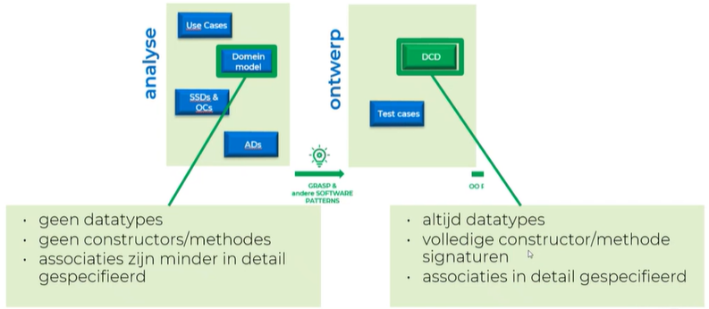
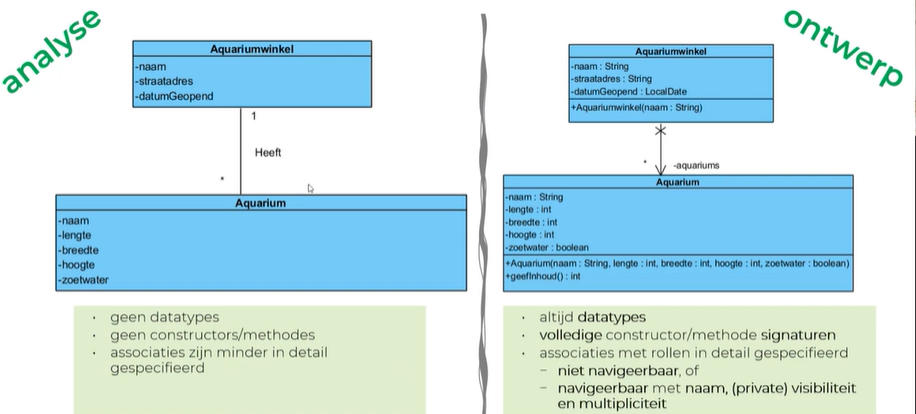
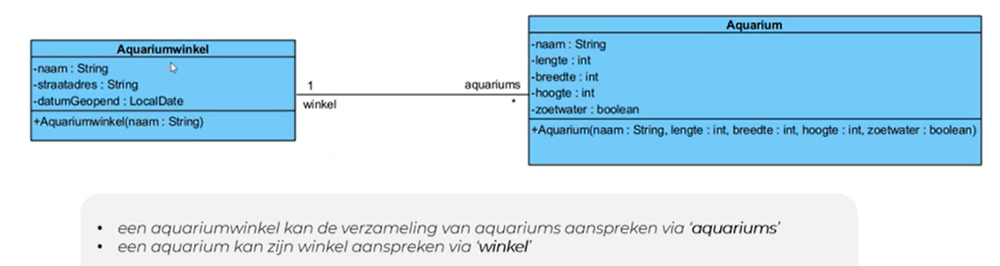
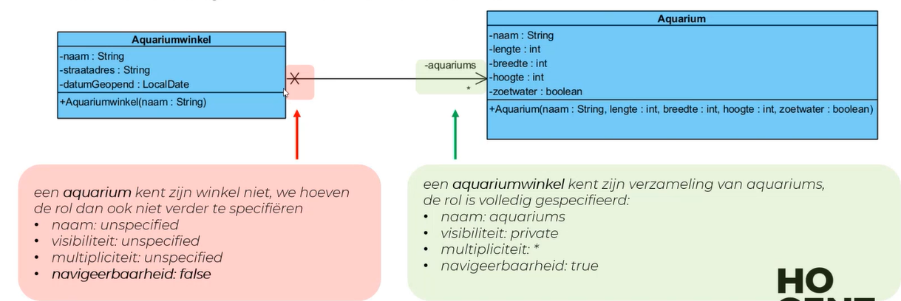
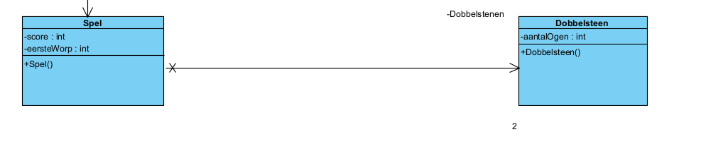
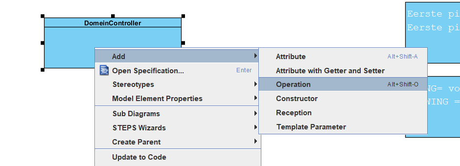
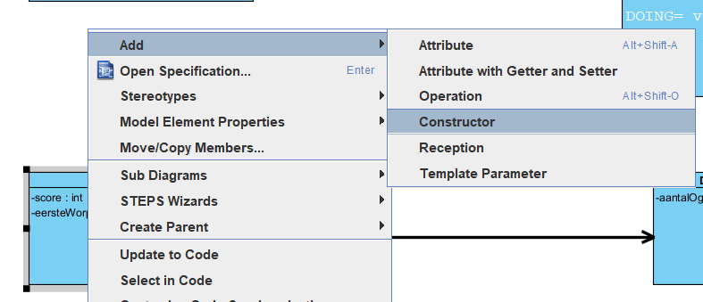
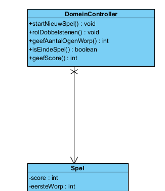
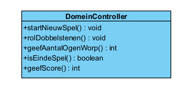

#Samenvatting #Java #HoGent #toegepasteinformatica #OOSD

Lesgever: [Irina Malfait](irina.malfait@hogent.be)

# H1 Introductie Java-applicaties

## Geschiedenis

- 1991 ontworpen door Sun Microsystems
- 1993 release van Mosaic browser (ontwerpers herschreven de compiler (C -> Java))
- 1994 Release webrunner (eerste op Java gebaseerde browser (Dit bleek samen met de gratis verspreiding een succesverhaal te zijn!))
- voor 1995 had bijna niemand ervan gehoord

## Java-bytecode

Gezien een processor enkel zijn eigen specifieke machinecode begrijpt, die onleesbaar is voor de mens (0 en 1), moeten we een programma schrijven in een *hogere programmeertaal* (Cobol, Java,Pascal, ...). 

Een *compiler* (vertaler) zal het programma omzetten naar een specifieke machinecode.
Omdat de vertaler kan vertalen naar verschillende soorten machinecode, zal het programma *platformafhankelijk* zijn (platform = combinatie van een bepaald type processor met een bepaald besturingssysteem).

### Oplossing die men in Java toepast:

1. Elk Java-programma wordt door een compiler vertaald naar een soort *TUSSENTAAL(= Java-bytecode)*, die betrekkelijk dicht tegen machinecode aanleunt.
2. De tussentaal wordt dan verder vertaald voor een specifieke processor, door een programma genaamd de *JAVA VIRTUAL MACHINE (JVM)*. Een JVM is een tamelijk klein programma (256Kb), vermits het vertalen niet zo’n grote klus is want Java-bytecode is een kleine taal (weinig keywords).


## Java-applicaties

### Eigenschappen

1. *een applicatie is een Java-programma*, net als de programma’s op je eigen computer (vb. Word, tekenprogramma,...)
2. *een applicatie wordt bewaard en uitgevoerd op lokale PC*
3. *een applicatie is uitvoerbaar op elke PC mits JVM* (geen webbrowser nodig, zoals bij een JAVA-applet)
4. *een applicatie kan bestanden op schijf maken, lezen en verwijderen*


### Eerste voorbeeld

```java

packagecui;//een project delen we op in packages, voorlopig enkel cui = console-user-interface

importjava.lang.*;//mag weggelaten worden, want wordt als enige package uit de Java-API automatisch geïmporteerd

publicclassSomextendsObject// extends Object mag ook weggelaten worden gezien ELKE klasse in Java erft van Object, de moederklasse

{
	publicstaticvoidmain(String[]args)
	{
		intx=2,y=3,som;
		som=x*x+y*y;System.out.println("Som = "+som);
	}
}

```

Uitvoer:

Som = 13

### De 5 fasen


1. *Met een editor het java-programma intypen en bewaren met extensie .java* → **Som.java**
2. *Het programma compileren met het commando javac.* Het resultaat is een file met de extensie.class (= *bytecode*). → **javac Som.java → geeft Som.class**
3. *Het programma (de .class-file) wordt geladen in het geheugen.*
4. *De bytecode wordt geverifieerd* (om te kijken of de .class-files geldige java bytecode bevatten).
5. *Het programma wordt uitgevoerd, door gebruik te maken van de Java-vertaler (JVM), via het commando java* → **java Som**

#### JIT compilatie

Java-applicaties worden door een compiler vertaald naar bytecode voor de JVM. De eerste JVM’s voerden deze bytecode uit door middel van pure interpretatie ("live" vertalen en uitvoeren). Omdat deze methode langzaam was ging men gebruikmaken van *JIT-compilatie (Just in Time)*, een vorm van compilatie die plaatsvindt tijdens de uitvoering van een computerprogramma.


### Het java platform


  
*Java Runtime Environment (=JRE)*  is een combinatie van de JVM met de Java API.


### Wat heb je nodig

1. *een editor*, bijv. Notepad, Wordpad of Textpad (Textpad)
2. *een compiler*
3. een Java Virtual Machine Compiler + JVM = *Java Development Kit* [(JDK)]([Content Server Error (oracle.com)](https://www.oracle.com/technetwork/java/javase/downloads/index.html))

### Integrated Development Environment

#### Een IDE bevat:

1. *Code editor* (maakt gebruikt van JDK)
2. *Compiler, linker*
3. *Debugger*
4. *Helpfuncties*⇒ de ontwikkelingstijd voor het schrijven van een programma wordt sterk gereduceerd.

IDE’s: [NetBeans](http://netbeans.org/), [Eclipse](http://eclipse.org/), [JBuilder](http://www.borland.com/jbuilder), [IntelliJ IDEA](http://www.jetbrains.com/idea), [JDeveloper](https://www.oracle.com/application-development/technologies/jdeveloper.html), ..

## Encapsulatie en Modulariteit

### Encapsulatie

Encapsulatie is een kernprincipe van objectgeoriënteerd programmeren (OOP) en betekent simpelweg dat je de interne details van een object verbergt voor de buitenwereld. Het doel is om de toegang tot de data (attributen) te beperken en gecontroleerde toegang te bieden via methoden. Het idee is dat objecten zelf verantwoordelijk zijn voor hun eigen staat en gedrag, en dat externe code alleen via de door het object aangeboden interface (meestal via **getters** en **setters**) toegang heeft.

In de context van jouw `Pennenzak`-klasse:

- **Attributen** zoals `lengte`, `kleur`, en `open` zijn privé (`private`), wat betekent dat andere klassen niet rechtstreeks toegang hebben tot deze variabelen.
- Toegang tot deze attributen wordt geboden via **getters** en **setters**:
    - Een getter zoals `getLengte()` geeft de waarde van het attribuut terug.
    - Een setter zoals `setKleur(String kleur)` laat de buitenwereld toe de waarde van `kleur` aan te passen, maar het bevat ook logica om te voorkomen dat er een `null` of lege waarde wordt ingesteld.

#### Waarom encapsulatie gebruiken?

- **Beveiliging en integriteit van data**: De klasse bepaalt hoe zijn interne gegevens kunnen worden gewijzigd, en voorkomt dat externe code de gegevens op een ongepaste manier manipuleert.
- **Modulariteit**: Wijzigingen aan de interne implementatie van een object kunnen gebeuren zonder dat andere delen van de code worden beïnvloed, zolang de interface (de methoden) hetzelfde blijft.

### Modulariteit

Modulariteit betekent het opdelen van een programma in zelfstandige, herbruikbare eenheden of modules. Elke module (bijv. een klasse of methode) heeft een specifieke verantwoordelijkheid en kan onafhankelijk van andere modules werken.

In de context van jouw `Pennenzak`-klasse:

- De klasse `Pennenzak` is een zelfstandige module die de verantwoordelijkheid heeft om objecten te creëren die een pennenzak voorstellen. Deze module bevat zowel de eigenschappen (attributen) als het gedrag (methoden) van een pennenzak.
- Binnen deze klasse is er een duidelijke **scheiding van verantwoordelijkheden**:
    - Attributen beheren de staat van het object (zoals `kleur` en `lengte`).
    - Methoden bieden de mogelijkheid om deze staat te wijzigen (zoals `setKleur()`) en om gedrag uit te voeren (zoals `maakOpen()`).

#### Waarom modulariteit gebruiken?

- **Herbruikbaarheid**: Een klasse zoals `Pennenzak` kan hergebruikt worden in andere programma's of delen van een systeem zonder afhankelijk te zijn van andere klassen.
- **Onderhoudbaarheid**: Omdat elke module onafhankelijk werkt, kan een wijziging in de implementatie van één module (bijvoorbeeld als je besluit om de validatie van `kleur` te veranderen) gedaan worden zonder dat je andere delen van het programma hoeft te wijzigen.
- **Duidelijkheid en overzicht**: Modulariteit zorgt ervoor dat een programma opgesplitst wordt in kleine, overzichtelijke onderdelen. Dit maakt het makkelijker om de code te begrijpen en te debuggen.

---

### Samenwerking van encapsulatie en modulariteit

Encapsulatie en modulariteit werken samen om robuuste en flexibele software te maken:

- **Encapsulatie** beschermt de interne details van een module (zoals een klasse) en dwingt gebruikers om via een gecontroleerde interface toegang te krijgen.
- **Modulariteit** zorgt ervoor dat een systeem uit losse bouwstenen bestaat, die onafhankelijk werken maar ook kunnen samenwerken. Elke module kan zijn eigen intern mechanisme encapsuleren.

Bijvoorbeeld, als je in je programma nog een andere klasse zou hebben, zoals een `Tas`-klasse, die ook een module is, zou deze kunnen samenwerken met de `Pennenzak`-klasse zonder te hoeven weten hoe de `Pennenzak` intern werkt. Ze zouden alleen communiceren via hun publieke methoden (de interfaces die ze bieden).

#### Voorbeeld:

Als je in de toekomst besluit dat de lengte van een pennenzak niet langer een integer moet zijn, maar een speciaal type lengte (bijv. `LengthUnit`), dan zou je alleen de interne implementatie van `Pennenzak` hoeven te wijzigen, zolang de publieke interface van de getters en setters hetzelfde blijft. Andere delen van het systeem blijven gewoon werken, dankzij encapsulatie en modulariteit.
## Uitvoerstatements in een Java-applicatie

### print, println en printf: een zin afdrukken
WAT INKORTEN EN AFWERKEN
```java
/* Welcome1.java
Een eerste programma in Java. */

package cui;

public class VoorbeeldUitvoer { //start klasse (gevolgd door naam vanm klasse)
 
	public static void main(String[] args) { //start methode (naam methode start steeds met kleine letter)

	/* print println printf
	
	\ = start van een gereserveerd teken
	\n = nieuwe lijn
	\t = tab
	\\ = om een backslash in mijn text te zetten
	\r = terug te keren naar het begin van de huidige regel, zonder naar een nieuwe regel te gaan (wordt weinig gebrµikt
	
	*/
	
	System.out.println("Dit is een voorbeeld ");
	//Sytem.out = scherm / .println() = methode
	//System is een naam van een klasse (standaard geintergreede klasse)
	
	System.out.print("\n");
	// System.out.print("\n"); is zelfde als System.out.println();
	
	System.out.println("Dit is een tweede voorbeeld ");
	
	System.out.print("Geef een getal:");
	//wordt gebruikt voor invoer te vragen aan de gebruiker
	
	System.out.println();
	//geeft ook een lege nieuwe lijn
	
	System.out.println("Dit is regel 1\nDit is regel 2\tmet een tab ruimte");
	
	System.out.println("het netwerk adres voor Samba is: \\192.168.0.120\\");
	//om een backslash te gebruiken
	
	System.out.println("\"Dit is een zin in dubbele accolades\"");
	//om een dubbele quote te gebruiken
	
	int getal1 = 10; //initialisatie van een integer
	
	int getal2 = 55;
	
	//slecht:
	System.out.println("Het resultaat is: " + getal1 + " en getal: " + getal2);
	//Niet goede methode !!!!!!!!!!!!!!!!
	
	//Correct manier: (juiste syntax)
	//System.out.printf("Resultaat is %d en tweede resultaat is %d%n", args);
	System.out.printf("Resultaat is %d en tweede resultaat is %d%n", getal1 , getal2);
	// printf is voor print met argumenten (variabelen meegeven)
	// %d is voor digit / %n is voor nieuwe lijn
	//waarom is dat betere, geeft dit als mogelijkheid
	
	String toekomst = String.format("Resultaat is %d en tweede resultaat is %d%n", getal1 , getal2);
	
	System.out.println(toekomst);
	
	/* Bij gebruik van printf of gebruik van argumenten
	
	%n = nieuwe lijn
	%d = uitschrijven van digit (argument)
	%s = uitscrhijven van een string (argument)
	%S = uitscrhijven van een string maar alles met HOOFDLETTERS (argument)
	%f = is voor een double (kan je voor alles gebruiken, niet gewenst)
	%o = is voor octaal stelsel (Zet automatisch om naar Octaal)
	%x of %X = is voor Hexadecimaal (zet automatisch om naar Hexadecimaal)
	%% = als je wilt het teken % tonen moet je 2 % plaatsen
	
	* */
	
	String woord = "Voorbeeld";
	
	System.out.printf("Text is %s%nText in hoofdletters %S%n", woord, woord);
	//vergeet niet steed je argumenten voor %s of %S (zoals hier woord)
	
	double decGetal = 5.2368;
	
	System.out.printf("Resultaat is %f%n", decGetal);
	// %f is weergeven van een double in argument
	
	System.out.printf("De prijs is %.2f%n", decGetal); //Afronden %.2f (2cijfers na de komma)
	System.out.printf("%d%n", 26);
	System.out.printf("%d%n", +26);
	System.out.printf("%d%n", -26);
	System.out.printf("%o%n", 26);
	System.out.printf("%x%n", 26);
	System.out.printf("%X%n", 26);
	
	// %getald (%4d) reserveeerd aantal plaatsen
	System.out.printf("%4d%n", 1);
	System.out.printf("%4d%n", 12);
	System.out.printf("%4d%n", 123);
	System.out.printf("%4d%n", 1234);
	System.out.printf("%4d%n%n", 12345); // getal is te groot
	System.out.printf("%4d%n", -1);
	System.out.printf("%4d%n", -12);
	System.out.printf("%4d%n", -123);
	System.out.printf("%4d%n", -1234); // getal is te groot
	System.out.printf("%4d%n", -12345); // getal is te groot
	System.out.printf("%-4d%-4d%n", 1,2); // - voor %4d telt hij de plaatsen aan de andere kant
	
	System.out.print("Downloaden: 50%\r");
	System.out.print("Downloaden: 100%\n");
	System.out.print("Hello World\n");
	System.out.print("Hello\rWorld\n");
	
	//****Rekenvoerige bewerkingen******
	
	int res = getal1 + getal2 * 2;
	
	// volgorde van bewerking!! eerst haakjes dan exponenten en wortels dan * en / dan + en -
	}//einde methode
}// einde klasse
```


## Invoer- en uitvoerstatements in een Java-applicatie
NOG AFWERKEN
```java
/* Welcome1.java
Een eerste programma in Java. */


package cui;

import java.util.Scanner;

public class VoorbeeldInvoer {

	public static void main(String[] args) {
	
	//Klasse scanner
	//Creatie van een object "scanner" van de klasse Scanner
	//Aanmaken van een inputscanner (aanmaken van een object met de naam "scanner") = aanmaak object "new Scanner(System.in) (system.in is het inlezen van toetsenbord)
	Scanner scanner = new Scanner(System.in);
	
	///initialisatie van variabelen
	int getal1, getal2, som;
	
	//INVOER
	
	System.out.print("geef eerste getal: ");
	getal1 = scanner.nextInt(); //nextInt() method in Java is used to read the next token of the input as an integer. When using a Scanner
	System.out.print("geef tweede getal: ");
	getal2 = scanner.nextInt();
	
	//Verwerking
	
	som = getal1 + getal2;
	
	//Uitvoer
	
	System.out.printf("de som is %d%n", som);
	
	//Andere voorbeelden
	
	double decGetal;
	System.out.print("Geef decimaal getal : ");
	decGetal = scanner.nextDouble();
	System.out.printf("Decimaal getal is %.2f%n", decGetal);
	String woord, zin;
	System.out.print("Geef een woord : ");
	woord = scanner.next(); //next() is voor een woord input (deze zal aalles vanaf een spatie niet mee registreren)
	//deze zal nextLine() of next() overslaan, vaak interesanter om nextLine() te gebruiken in plaats van next()
	scanner.nextLine();//Dit typen we omdat we hierboven next() gebruiken maar deze nextline() zan niet worden uitgevoerd
	System.out.print("Geen een zin : ");
	zin = scanner.nextLine(); //nextLine() is voor een zin input tot de return
	System.out.printf("woord = %s%nzin = %s%n", woord, zin);
	
	//Rekenkundige bewerkingen
	
	// + - * / %
	/*
	
	+ optellen
	- afterkken
	* vermenigvuldigen
	/ resultaat van een deling met enkel een geheel getal als resultaat (bij integers)
	% geeft rest van een breuk als een integer
	
	*/
	
	int getal3 = 7;
	int getal4 = 5;
	int deling = getal3 / getal4;
	System.out.printf("resultaat %d / %d is %d%n",getal3, getal4, deling);
	int rest = getal3 % getal4;
	System.out.printf("resultaat %d %% %d is %d%n",getal3, getal4, rest);
	
	double delingDec, decGetal2 = 7.23
	//double / int of omgekeerd ==> double
	
	delingDec = decGetal2 / getal4;
	System.out.printf("resultaat %.1f / %d is %.1f%n",decGetal2, getal4, delingDec);
	delingDec = 1.0 + 7 / 5; //dit geeft geen 2.4 maar 2.0 want hij intrepreteerd 7 en 5 als in omdat er geen komma staat
	delingDec = 7 / 5; //resultaat geeft 1 niet tegenstaande delingDec een Double is, dit komt omdat 7 en 5 als int wordt geintreperteerd
	}
}
```

# Loops

## FOR loop

Een for-lus wordt gebruikt om een reeks instructies herhaaldelijk uit te voeren. Het wordt gebruikt wanneer je een bepaald stuk code een vast aantal keren wilt herhalen.
Een for-lus is als het ware "gemaakt" om een herhaling met een teller te implementeren.

```java

for(int i=1; i <= 5 ; i++ ) { //eerst i initialiseren ; voorwaarde om de lus nog eens uit te voeren ; hoeveel gaat er bij i bij
	System.out.printf("geef getal %d: ",i);// i leeft enkel in de for blok en kan je er niet buiten gebruiken
	getal = scanner.nextInt();
	som += getal; //som = som + getal
}

System.out.printf("De som van de 5 getallen is: %d%n", som);
//variabele getal kan niet afgedrukt of uitgelezen worden, wanneer een lege variabele enkel waarde krijgt in de lus, ook niet na de lus (oplossing deze variabele bij initialisatie een waarde geven)

//i = 10; //geeft compileerfout, i wordt uit het geheugen geschrapt na de For loop

```

## WHILE loop

EEN WHILE LUS GEBRUIKEN ALS WE WETEN ALS DE LUS VOOR UITVOER AL MOET KUNNEN GEANNULEERD WORDEN

```java
package cui;
import java.util.Scanner;

public class VoorbeeldWhile {

	public static void main(String[] args) {
	new VoorbeeldWhile().voorbeeld();
	}
	
	//EEN WHILE LUS GEBRUIKEN ALS WE WETEN ALS DE LUS VOOR UITVOER AL MOET KUNNEN GEANNULEERD WORDEN
	//werk stap per stap, maak eerst hoofd methode en vul dan stap per stap de andere methodes in
	
	//slechte code omdat er een herhaling in zit
	private void voorbeeld() {
	//getallen ingeven, stoppen door 0
	//som van de ingegeven getallen (stopwaarde in de verwerking)
	Scanner scanner = new Scanner(System.in);
	int som = 0;
	int getal;
	//INVOER
	System.out.print("Geef een getal (stoppen = 0): ");
	getal = scanner.nextInt(); //we beginnen met invoer omdat de user moet kunnen annuleren
	//while (voorwaarde)
	// verschillend van de stopwaarde (getal != 0)
		while (getal != 0) { //0,1 of meedere keren
		//VERWERKING
			som += getal;
		//INVOER
			System.out.print("Geef een getal (stoppen = 0): "); //2regels herhaling, dit kunnen we in een method steken
			getal = scanner.nextInt();
		}
	System.out.printf("de som is %d%n", som);
	}

//DRY = DONT REPEAT YOURSELF (herhaal nooit code!!!)

	private void voorbeeld() { //oplossing zonder herhaling dankzij een methode aan te maken
	//getallen ingeven, stoppen door 0
	//som vzn de ingegeven getallen (stopwaarde in de verwerking)
		int som = 0;
		int getal;
	//INVOER //we beginnen met invoer omdat de user moet kunnen annuleren
	//Invoer gaan we vanaf nu appart opvragen
		getal = geefGetal(); //variabele = methode(); //Onze invoer gaat steeds met methode doen
	//while (voorwaarde)
	// verschillend van de stopwaarde (getal != 0)
		while (getal != 0) { //0,1 of meedere keren
		//VERWERKING
			som += getal;
		//INVOER
			getal = geefGetal(); //variabele = methode();
		}
	//UITVOER
		System.out.printf("de som is %d%n", som);
	}
	//aanmaak eigen methode
	//private=eigen methode //int ipv void omdat de methode een integer moet terug geven
	private int geefGetal() { //de haakjes dienen als we iets moeten meegeven met de methode
		Scanner scanner = new Scanner(System.in);//scanner hier omdat we de scanner enkel in geefGetal Methode gebruiken
		System.out.print("Geef een getal (stoppen = 0): ");
		return scanner.nextInt(); //return is om een waarde terug te geven uit mijn methode na het uitvoeren van de methode
	}

}

//NOG EEN MOOI VOORBEELD IS OEFENING10 (samen in de klas gemaakt)
```

## Do While

```java
private int geefGetal(int teller) {//teller is onze i die we meegegeven hebben bij het oproepen van de methode
	Scanner scanner = new Scanner(System.in);
	int getal;
	do {
		System.out.printf("Geef een getal %d tussen 1 en 10, grenzen inbegrepen: ",teller);
		getal = scanner.nextInt();
		//nodige voorwaarde: getal >= 1 && getal <= 10
		//}while(!(getal >= 1 && getal <= 10)); is wel juist maar niet leesbaar genoeg
	}while(getal < 1 || getal > 10); //we draaien alles om om geen niet voorwaarde te hebben (is makkelijker om te redeneren)
	return getal;
}
```

# Klassen aanmaken voor objecten
### Bevat:
- **Constanten** zorgen voor vaste waarden die door de hele klasse heen consistent blijven.
- **Attributen** beschrijven de eigenschappen van een object en zijn vaak privé voor gegevensbescherming.
- **Constructors** initialiseren objecten en kunnen worden gechained om duplicatie te verminderen.
- **Setters** zorgen ervoor dat gegevens correct worden ingesteld en kunnen validatie bevatten.
- **Getters** bieden toegang tot de attributen van een object.
- **Gedrag** in een klasse komt tot uiting in methoden die acties uitvoeren, zoals `maakOpen()`
### Waar plaatsen?
- Domein package
## Attributen
**Wat zijn attributen?** Attributen (ook wel velden of instance variables genoemd) zijn de eigenschappen van een object. In dit geval zijn het de eigenschappen van de `Pennenzak`-klasse: `lengte`, `kleur` en `open`.

Attributen zijn hier als `private` gedefinieerd, wat betekent dat ze alleen toegankelijk zijn binnen de klasse zelf. Dit principe heet **encapsulatie** en is een kernconcept van objectgeoriënteerd programmeren.

**Waarom `private`?**

- **Gegevensverhulling**: Door attributen privé te maken, kunnen andere klassen de interne status van een object niet zomaar wijzigen, waardoor je de controle hebt over hoe de data wordt gelezen of aangepast. Wijzigingen worden alleen toegelaten via methoden zoals `setters` en `getters`.
- **Validatie**: Je kunt voorwaarden toevoegen aan setters, zoals in `setKleur()` en `setLengte()`, om ervoor te zorgen dat alleen geldige waarden worden ingevoerd.
## Constructors
**Wat is een constructor?** Een constructor is een speciale methode die wordt aangeroepen wanneer een object van een klasse wordt gemaakt. De constructor initialiseert de objectattributen.

**In de `Pennenzak`-klasse zijn er drie constructors:**

### **Volledige constructor**: Deze constructor neemt zowel kleur als lengte als argumenten.
```java
public Pennenzak(String kleur, int lengte) {     
	setKleur(kleur);     
	setLengte(lengte); 
}
```    

### **Constructor met één parameter**: Deze neemt alleen de lengte en stelt de kleur in op de standaardkleur blauw.
```java
public Pennenzak(int lengte) {     
	this("blauw", lengte); 
}
```
 Hier zien we het concept van **constructor chaining**, waarbij de ene constructor de andere aanroept om herhaling van code te voorkomen.
    
### **Default constructor**: Als er geen waarden worden opgegeven, worden de standaardkleur en standaardlengte gebruikt.
```java
public Pennenzak() {     
	this(DEFAULT_KLEUR, DEFAULT_LENGTE); 
}
```

**Waarom constructor chaining gebruiken?**
- Het vermindert duplicatie en maakt de code onderhoudbaarder. Als de logica in de constructor verandert, hoef je het maar op één plek te wijzigen.
## Setters
**Wat zijn setters?** Setters zijn methoden die gebruikt worden om de waarde van een attribuut te wijzigen. Ze bieden controle over hoe gegevens worden ingesteld. In het geval van de `Pennenzak`-klasse hebben we setters voor `kleur` en `lengte`.

- **Voorbeeld:**
```java
public final void setKleur(String kleur) {
	if (kleur != null && !kleur.isBlank()) {
	    this.kleur = kleur;     
	} 
}
```
Hier wordt gecontroleerd of de opgegeven kleur niet `null` is en of het geen lege string is (met de `isBlank()`-methode).
    
- **Private setters:** Sommige setters, zoals `setLengte()`, zijn privé:
    
```java
private void setLengte(int lengte) {
	this.lengte = (lengte <= 0) ? 10 : lengte; 
}
```
Deze setter is privé omdat de lengte van de pennenzak niet zomaar moet kunnen worden aangepast door externe code. Hier wordt ook gebruikgemaakt van een **ternary operator** om ervoor te zorgen dat de lengte niet negatief is.

## Getters
- **Wat zijn getters?** Getters zijn methoden die gebruikt worden om de waarde van een attribuut terug te geven. In de `Pennenzak`-klasse zijn er getters voor `lengte`, `kleur` en `open`.
    
    - **Voorbeeld:**
```java
public int getLengte() {
	return this.lengte; 
}
```
   Deze methode retourneert de huidige waarde van `lengte`.
    
Voor een boolean attribuut gebruiken we vaak de prefix **`is`** in plaats van `get`:
```java
public boolean isOpen() {
	return this.open; 
}
```
  Dit is een conventie in Java voor boolean-getters.
## Gedrag
- **Wat is gedrag in een klasse?** Naast setters en getters bevat een klasse ook methoden die bepaalde acties uitvoeren. In de `Pennenzak`-klasse hebben we bijvoorbeeld de methode `maakOpen()`:
```java
public void maakOpen() {
	this.open = true; 
}
```   
   Deze methode verandert de status van de pennenzak naar "open". Er is geen return-waarde (vandaar `void`), omdat het doel van de methode is om de toestand van het object te wijzigen.

**Waarom methoden voor gedrag?**
- Methoden zoals `maakOpen()` encapsuleren specifieke acties die een object kan uitvoeren. Dit bevordert **modulariteit** en **herbruikbaarheid** van code.
## Voorbeeld:

### voorbeeld klasse "Pennenzak"
```java
package domein;

public class Pennenzak {
//CONSTANTEN 
//**********
	//Deze moeten op klassenniveau zijn om ze te kunnen gebruiken in constructors
	private static final int DEFAULT_LENGTE = 10;
	private static final String DEFAULT_KLEUR = "blauw";

//ATTRIBUTEN
//**********	
	//we beginnen de eigenschappen van de klasse (Attributen met een correct naam)
	//Alle data (attributen) moet verborgen zijn buiten onze klasse, met andere woorden ALTIJD "private" 

	//alle attributen krijgen een beginwaarde
	private int lengte; //heeft standaard getal "0" bij initialisatie, is nooit leeg
	private String kleur; //String heeft standaard waarde "null"
	private boolean open; //boolean heeft de standaard waarde "false"

	//indien je geen constructor creërt, dan krijg je een default constructor (= bevat geen argumenten)
	//schrijf je 1 constructor dan valt de "gratis" defaultconstructor weg
	
//**CONSTRUCTORS**
//1STE CONSTRUCTOR
//****************
	//Constructor, zodat andere klasse een object kunnen creëren van pannenzak
	//buitenwereld kan schrijven p = new pennenzak();

	public Pennenzak(String kleur, int lengte) {//1ste constructor //buiten wereld kan al oproepen: p = new Pennenzak("blauw,15);
	//constructor is altijd de naam van zijn klasse
	//is een methode zonder void, zonder return-type
	//wijzigen van een attribuut is met set en eerste letter is een hoofdletter! setKleur setLengte

		setKleur(kleur);
		setLengte(lengte);

	//we schrijven dit in slechts 1 constructor uit , degenen met de meeste argumenten
	}

	public Pennenzak(int lengte) { //2de constructor ==> defaultwaarde van kleur is blauw
	
	//slecht want onderstaande 2 lijn zijn een herhaling van inhoud bovenste constructor
		//setKleur("blauw"); //EXAMENVRAAG!!!
		//setLengte(lengte);
	
	//dus we gaan van 1 constructor, het opvragen en naar deze halen
		this("blauw",lengte);
		//met this( , ) roepen we de constructor op met de 2 argumenten
	}

	public Pennenzak() { //Defaultconstructor
		this(DEFAULT_KLEUR,DEFAULT_LENGTE); 
	}

//setters
//*******
	public final void setKleur(String kleur) { //private void setKleur(String kleur2) { (verander kleur2 naar kleur)
	// private hebben we veranderd naar public omdat de kleur waarschijnlijk achteraf moet veranderd worden door de klant
	// we voegen steeds een final toe aan iedere public setter (zie hoofdstuk 7) (iets met exeptions)
	//Tijdelijk tot we exeptions leren
		if (kleur != null && !kleur.isBlank()){//kleur != null (want we willen geen lege waarde krijgen)
		this.kleur = kleur; //hier schrijven we wel de toewijzing, we MOETEN "this." schrijven door zelfde naam
		}
	}

	private void setLengte(int lengte) { //private want de klant zegt dat deze niet meer moet aangepast worden
		//Stel indien correct -> overnemen
		//Indien niet correct -> 10 ==> om op te vangen als het niet correct is
		this.lengte = (lengte <= 0 )? 10: lengte; //ingebouwde if statement
	}

//getters (om data terug te sturen)
//*******

	public int getLengte() {//int want we willen een integer terug geven
	//return lengte;
		return this.lengte; //this. MAG hier gebruikt worden, voor het gemak altijd gebruiken is OK
	}

	public String getKleur() {
		return this.kleur;
	}
// alle attributen behalve een boolean begint met: get
// als je waarde van een boolean wil terug geven begint met: is //bij setters is er geen uitzondering
	public boolean isOpen() {
		return this.open;
	//return open; //mag ook
	}

//gedrag
//******
	public void maakOpen() { //is een void method, geen return type (geeft geen waarde terug)
	this.open = true;
	//open = true; //dit mag ook
	}

}
```


# array

**enhanced for** kan je *enkel array uitlezen*, je kan de array niet meer aanpassen

Verder uitwerken
# SDLC Sofware Development life cycle


### Voorbeeld:

## Analyse fase

- bij OOSD focussen we op ontwerp en implementatie
- Zie software analyse
- Gebruik van Domeinmodel (vergelijkbaar met DCD)
- SSD is Statisch en bevat niet het alternatief verloop
- AD Bevat wel alternatieve verlopen

## Ontwerp
- Maken we gebruik van het DCD
### DCD Design Class Diagram

- Ons complete programma zal in 1 DCD komen
- Dit DCD zal groeien en evolueren
- Testen schrijven is voor hoofdstuk 8
- Werken volgens het Grasp software patronen
- Het kan dat we beginnen programmeren alvorens het DCD volledig af is, dit zullen we merken en zullen het DCD bijsturen (flexibel werken)

#### Onderdelen

##### Klasse

- Atrributen: type (gettters/setters/nvt)
- Constructors

##### Associatie (verband)

= Relatie tussen klassen

- *Lijn*
- *Rollen*:
	- **Multipliciteit** (maak zinnetjes (aantal x is gereleerd aan aantal y))
		  \*  => 0 tot veel, zelfde als 0..\*
		  1 => exact 1
		  0..1 => maximaal 1, maar mogelijks geen
		  1..\* => meerdere, maar minimaal 1
		  n => meerdere zijnde exact n (n stelt een positief geheel getal voor)
		  n..m => meerdere, minimaal n en maximaal m (n en m stelt een positief geheel getal voor)
	* **Naam**
		* hoe we de associatie gaan aanspreken, als het gaat over meerdere dan zal het in meervoud zijn
		* Nooit beginnen met een cijfer
		* Nooit beginnen met een hoofdletter
	
	- **Visibiliteit**
		- Public/private
		- zichtbaar met een - voor de naam voor *private*
		  Enkel klassen verbonden met deze rol kunnen deze aanspreken
		- Is altijd private bij ons
	- **Navigeerbaarheid**
		- We moeten de vraag stellen of een klasse  moet weten dat een andere klasse moet gekend zijn in deze klasse
		- Dit halen we uit de opgave
		- Dit lossen we op door de niet gewenste richting te kortsluiten 
		- Meestal zal dit 1 richting zijn
	
	- De rol voegt de andere klasse toe als een eigenschap, zoals in het voorbeeld is "aquariums" nu een eigenschap van "Aquariumwinkel" (een eigenschap van een zelf gedefinieerd type wordt met een associatie weergegeven )




#### 

CUI/GUI -> interface
domein -> code
persitentie -> database

Domeincontroller = om gui en domein gescheiden te houden (domeincontroller werkt niet zelf), onze façade

Associaties niet letterlijk overnemen van het domeinmodel, altijd afvragen wie heeft wie nodig (hoe gaan we dat oplossen)
#### Stappen
Maak klassen aan



Voeg (klasse) domeincontroller toe

*Zeker kennen*
Eerste pijl in SSD en OC: DOING
Eerste pijl in SSD en geen OC: overslaan

	DOING= void methode
	KNOWING = methode die een waarde teruggeeft

Nooit doings en knowings combineren, want als we een knowing oproepen willen we niet steeds onze doing uitvoeren



Voeg doings toe
Voeg knowings toe
vergeet niet de booleans (van de loop)


##### Voeg constructor toe



Hier default consructor (we hebben deze zoiezo altijd)

#### domeincontroller
### Doemincontroller moet spel kennen (dus associatie leggen)




#### voorbeeld


We werken steeds met een domeincontroller


#### Doing/ knowing

DOING= void methode
KNOWING = methode die een waarde teruggeeft


DOING = void methode, zal een verwerking uitvoeren waardoor
de waarde van attrubuut/attributen zal wijzigen.
	1 uitzondering: volle lijn geefXXX met een argument gevolgd door <---------- (dan is het een knowing)

KNOWING: gaat NOOIT een waarde van een attribuut wijzigen, 
geeft enkel een waarde terug.

**NOOIT DOING en KNOWING samenzetten**. Waarom? 
Je mag meerdere keren een waarde opvragen en NIET dat er telkens een verwerking mag uitgevoerd worden.


#### 3 ontwerp patronen (te kennen en kunnen uitleggen)
##### 4.2. GRASP

Eerste pijl in SSD en OC: DOING
Eerste pijl in SSD en geen OC: overslaan

----------

GRASP patronen beschrijven de fundamentele principes voor het toekennen van verantwoordelijkheden aan objecten

In H5 zullen we 3 GRASP patronen bespreken: controller, creator en expert.

5.1.3.1. Stap 3A: Controller pattern toepassen

----------------------------------------------

##### Naam patroon: CONTROLLER
5.1.3.2. Stap 3B: Deelverantwoordelijkheden toekennen aan de juiste klassen

Controller (GRASP): DomeinController is de controller van Grasp

DomeinController is de creator (GRASP) om een spel te creëren
(omdat DC bevat een spel), Spel is de creator van de dobbelstenen

rolDobbelstenen van DC: Spel is de expert (rolDobbelstenen(): void), 
Dobbelsteen is de expert (rol(): void), attribuut aantalOgen is de expert.

  Deze geeft gewoon gewoon door, hier zit geen klasse in.
  We noemen deze altijd domein controller

Omschrijving probleem: Welk is het eerste object, achter de User Interface,

dat verantwoordelijk is voor het ontvangen en coördineren van een systeemoperatie?

  

Omschrijving oplossing: Ken de verantwoordelijkheid toe aan een klasse die het volledige systeem representeert,

een Controller klasse.

###### Voorbeeld

![[Pasted image 20241104100704.png]]

- De domein controller is de controller

```java
package domein;

public class DomeinController {

	private Spel spel;
 
	public void startNieuwSpel() {
		spel = new Spel();
	}

	public void rolDobbelstenen() {
		spel.rolDobbelstenen();
	}

	public int geefAantalOgenWorp() {
		return spel.geefAantalOgenWorp();
	}
 
	public boolean isEindeSpel() {
		return spel.isEindeSpel();
	}

	public int geefScore() {
		return spel.getScore();
	}

}
```


---------------------------------------------------------------------------

##### Naam patroon: CREATOR

Wie is verantwoordelijk voor het creëren van een klasse.
  - De klasse die het object bevat is verantwoordelijk voor de creatie
  

Omschrijving probleem: Wie is er verantwoordelijk voor het aanmaken van nieuwe instanties van een klasse?

  

Omschrijving oplossing: Ken de verantwoordelijkheid om instanties van klasse A te creëren toe aan klasse B,

wanneer 1 of meer van de volgende gelden:

###### 4 puntjes ==> HEEFT-EEN, bevat

- B bevat instanties van A (associatie: bevat, heeft)

- B is een aggregatie of een compositie van A

- B gebruikt A intensief

- B bevat de data om A te initialiseren

###### Voorbeeld

![[Pasted image 20241104100259.png]]

- Domeincontroller is creator van Spel (omdat de domeincontroller spel bevat)
- Spel is de creator van Dobbelstenen (omdat spel de dobbelstenen bevat)

5.2.4. Stap 3B voor rolDobbelstenen(): Deelverantwoordelijkheden toekennen aan de juiste klassen

------------------------------------------------------------------------------------------------

##### Naam patroon: EXPERT

Wie moet het echte werk doen
  - Is degene die de attributen bevat die de verwerking moeten doen
  - er zijn meerdere
  

Omschrijving probleem: Wat is het algemeen principe dat we kunnen hanteren voor het toekennen van

verantwoordelijkheden aan objecten?

  

Omschrijving oplossing: Ken de verantwoordelijkheid toe aan de Information Expert.

Dit is de klasse die alle informatie, nodig om de verantwoordelijkheid te realiseren, heeft.

###### Voorbeeld

![[Pasted image 20241104100259.png]]

rolDobbelstenen van DC: *Spel is de expert* **(rolDobbelstenen(): void)** (maar deze kan dit niet alleen dus), 
*Dobbelsteen is de expert* **(rol(): void)** (maar deze kan dit niet alleen dus), 
*attribuut aantalOgen is de expert*. (want we moeten daar de waarde in plaatsen)


##### Opbouw applicatie

![[Pasted image 20241104105915.png]]

main = zit de startup waar de applicatie start
CUI = voor interface en bevat de SSD als code maar roept steeds de domeincontroller op.
domein = bevat de code

##### Compositie: 
heeft-een relatie, school verwijderen
==> alle klaslokalen verwijderen

##### Aggregatie:
heeft-een relatie, auto verwijderen
==> wielen NIET verwijderen

### Record
#### DTO

Om data terug te sturen (om enkel iets te tonen, enkel getters, GEEN setters)

Niet wijzigbaar object diend enkel om te lezen

Werkt niet en niet weergeefbaar in Visual Paradigm (klassediagram) (bestaat nog niet)

Data Transfer object

Doen we via een speciale pakkage (*dto*)

1. we maken pakkage DTO
2. voegen hier een nieuwe record aan toe
   ![[Pasted image 20241105140948.png]]
   ![[Pasted image 20241105141022.png]]
   LET OP in naam: DTO in hoofdletters

```java
package dto;

public record SpelerDTO("hier opsommen wat je wilt tonen") {
}
```

##### in ontwerp kunnen we het we zo weergeven:
![[Pasted image 20241105142001.png]]
###### voorbeeld:
```java
package dto;
//Data transfer object

import java.math.BigDecimal;

//We willen naam, voornaam, krediet, adminrechten van een speler doorgeven aan de grafische laag
public record SpelerDTO(String naam, String voornaam, BigDecimal krediet, boolean adminrechten) {
}

//Wat hebben we gekregen
//constructor 4 argumenten
//getters
	//naam() ipv getNaam()
	//voornaam()
	//krediet()
	//adminrechten
//We krijgen geen setters
```
# Repository
- Klasse die iets bijhoud, er wordt niets gezegd in de analyse.
- Deze stuurt ook naar de persestentielaag (als we een database gaan gebruiken)
- De domeincontroller zal altijd creëren en deze geeft het door aan de repository

- Naam = "Naam van wat deze bevat" + "Repository"
  bv: TrekkingRepository

# Tip

- Alles opdelen in methods


# Examen

HT 1,2,3,4,6

Vraag over HT 5 (geg:analyse DCD UML),7,8

1. Ga naar https://exam.hogent.be/

2. Kies starten
![[Pasted image 20241107133854.png]]


## Uploaden

Juiste extensie: 

### Voor klassediagram
![[Pasted image 20241107134202.png]]
![[Pasted image 20241107134336.png]]

![[Pasted image 20241107134006.png]]

![[Pasted image 20241107134027.png]]

Kies \*.vpp

![[Pasted image 20241107135956.png]]

### Voor Java project


![[Pasted image 20241107134749.png]]

![[Pasted image 20241107134801.png]]

Zorg dat er \*.java bestanden in zitten

![[Pasted image 20241107140002.png]]