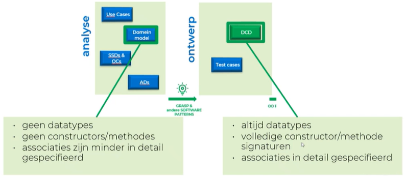

# Analyse vs ontwerp:
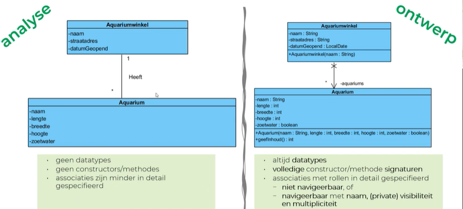
## Analyse fase

- bij OOSD focussen we op ontwerp en implementatie
- Zie software analyse
- Gebruik van Domeinmodel (vergelijkbaar met DCD)
- SSD is Statisch en bevat niet het alternatief verloop
- AD Bevat wel alternatieve verlopen

## Ontwerp
- Maken we gebruik van het DCD
# DCD Design Class Diagram

- Ons complete programma zal in 1 DCD komen
- Dit DCD zal groeien en evolueren
- Testen schrijven is voor hoofdstuk 8
- Werken volgens het Grasp software patronen
- Het kan dat we beginnen programmeren alvorens het DCD volledig af is, dit zullen we merken en zullen het DCD bijsturen (flexibel werken)

## Onderdelen

### Klasse

- Atrributen: type (gettters/setters/nvt)
- Constructors

### Associatie (verband)

= Relatie tussen klassen

- *Lijn*
- *Rollen*:
	- **Multipliciteit** (maak zinnetjes (aantal x is gereleerd aan aantal y))
		  \*  => 0 tot veel, zelfde als 0..\*
		  1 => exact 1
		  0..1 => maximaal 1, maar mogelijks geen
		  1..\* => meerdere, maar minimaal 1
		  n => meerdere zijnde exact n (n stelt een positief geheel getal voor)
		  n..m => meerdere, minimaal n en maximaal m (n en m stelt een positief geheel getal voor)
	* **Naam**
		* hoe we de associatie gaan aanspreken, als het gaat over meerdere dan zal het in meervoud zijn
		* Nooit beginnen met een cijfer
		* Nooit beginnen met een hoofdletter
	- tussentijds voorbeeld
	  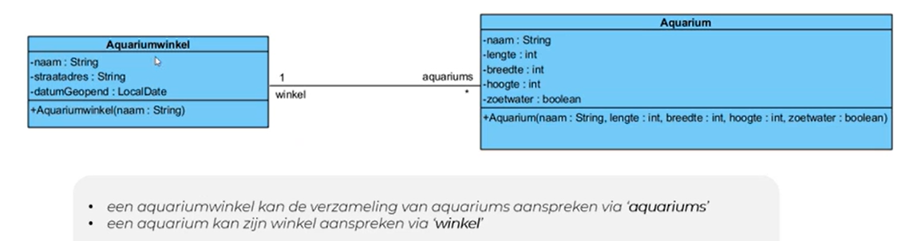
	- **Visibiliteit**
		- Public/private
		- zichtbaar met een - voor de naam voor *private*
		  Enkel klassen verbonden met deze rol kunnen deze aanspreken
		- Is altijd private bij ons
	- **Navigeerbaarheid**
		- We moeten de vraag stellen of een klasse  moet weten dat een andere klasse moet gekend zijn in deze klasse
		- Dit halen we uit de opgave
		- Dit lossen we op door de niet gewenste richting te kortsluiten 
		- Meestal zal dit 1 richting zijn
	
	- De rol voegt de andere klasse toe als een eigenschap, zoals in het voorbeeld is "aquariums" nu een eigenschap van "Aquariumwinkel" (een eigenschap van een zelf gedefinieerd type wordt met een associatie weergegeven )

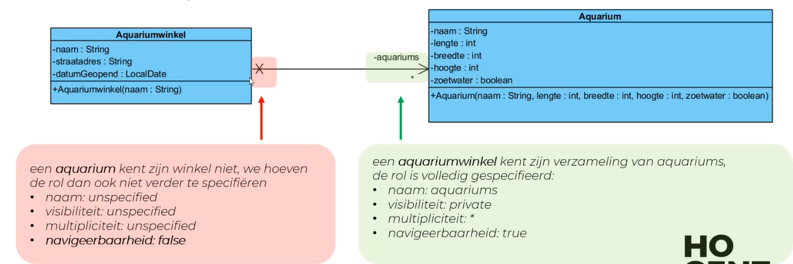

*Associaties niet letterlijk overnemen van het domeinmodel*, **altijd afvragen wie heeft wie nodig** (hoe gaan we dat oplossen)


## Stappen DCD
Maak klassen aan

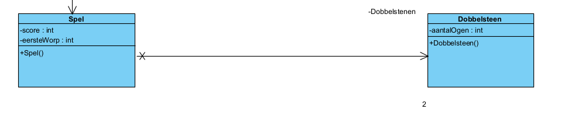

Voeg (klasse) domeincontroller toe

*Zeker kennen*
Eerste pijl in SSD en OC: DOING
Eerste pijl in SSD en geen OC: overslaan

	DOING= void methode
	KNOWING = methode die een waarde teruggeeft

Nooit doings en knowings combineren, want als we een knowing oproepen willen we niet steeds onze doing uitvoeren

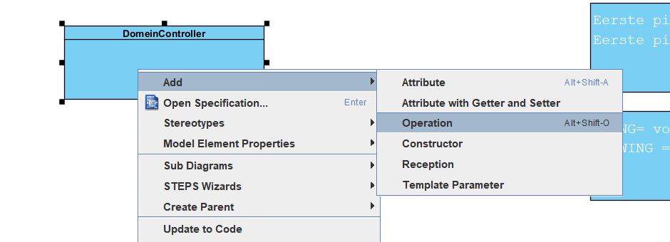

Voeg doings toe
Voeg knowings toe
vergeet niet de booleans (van de loop)


### Voeg constructor toe

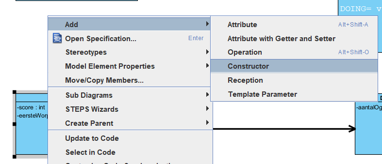

Hier default constructor (we hebben deze zoiezo altijd)

### Domeincontroller 
moet spel kennen (dus associatie leggen)

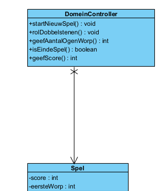


### voorbeeld

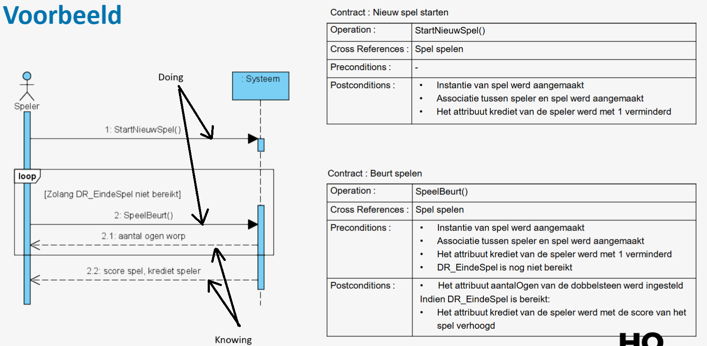


### Domeincontroller
We werken steeds met een domeincontroller, deze geeft door en ontvangt via DTO klasse
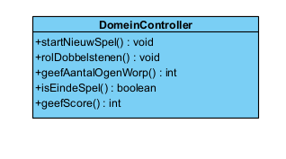

### Doing/ knowing

DOING= void methode
KNOWING = methode die een waarde teruggeeft


DOING = void methode, zal een verwerking uitvoeren waardoor
de waarde van attrubuut/attributen zal wijzigen.
	1 uitzondering: volle lijn geefXXX met een argument gevolgd door <---------- (dan is het een knowing)

KNOWING: gaat NOOIT een waarde van een attribuut wijzigen, 
geeft enkel een waarde terug.

**NOOIT DOING en KNOWING samenzetten**. Waarom? 
Je mag meerdere keren een waarde opvragen en NIET dat er telkens een verwerking mag uitgevoerd worden.


# Ontwerp patronen (te kennen en kunnen uitleggen)
## GRASP

Eerste pijl in SSD en OC: DOING
Eerste pijl in SSD en geen OC: overslaan

----------

GRASP patronen beschrijven de fundamentele principes voor het toekennen van verantwoordelijkheden aan objecten

In H5 zullen we 3 GRASP patronen bespreken: controller, creator en expert.

5.1.3.1. Stap 3A: Controller pattern toepassen

----------------------------------------------

##### Naam patroon: CONTROLLER
5.1.3.2. Stap 3B: Deelverantwoordelijkheden toekennen aan de juiste klassen

Controller (GRASP): DomeinController is de controller van Grasp

DomeinController is de creator (GRASP) om een spel te creëren
(omdat DC bevat een spel), Spel is de creator van de dobbelstenen

rolDobbelstenen van DC: Spel is de expert (rolDobbelstenen(): void), 
Dobbelsteen is de expert (rol(): void), attribuut aantalOgen is de expert.

  Deze geeft gewoon gewoon door, hier zit geen klasse in.
  We noemen deze altijd domein controller

Omschrijving probleem: Welk is het eerste object, achter de User Interface,

dat verantwoordelijk is voor het ontvangen en coördineren van een systeemoperatie?

  

Omschrijving oplossing: Ken de verantwoordelijkheid toe aan een klasse die het volledige systeem representeert,

een Controller klasse.

###### Voorbeeld

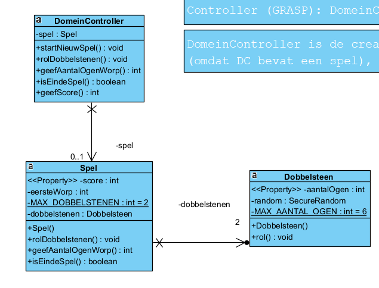

- De domein controller is de controller

```java
package domein;

public class DomeinController {

	private Spel spel;
 
	public void startNieuwSpel() {
		spel = new Spel();
	}

	public void rolDobbelstenen() {
		spel.rolDobbelstenen();
	}

	public int geefAantalOgenWorp() {
		return spel.geefAantalOgenWorp();
	}
 
	public boolean isEindeSpel() {
		return spel.isEindeSpel();
	}

	public int geefScore() {
		return spel.getScore();
	}

}
```


---------------------------------------------------------------------------

##### Naam patroon: CREATOR

Wie is verantwoordelijk voor het creëren van een klasse.
  - De klasse die het object bevat is verantwoordelijk voor de creatie
  

Omschrijving probleem: Wie is er verantwoordelijk voor het aanmaken van nieuwe instanties van een klasse?

  

Omschrijving oplossing: Ken de verantwoordelijkheid om instanties van klasse A te creëren toe aan klasse B,

wanneer 1 of meer van de volgende gelden:

###### 4 puntjes ==> HEEFT-EEN, bevat

- B bevat instanties van A (associatie: bevat, heeft)

- B is een aggregatie of een compositie van A

- B gebruikt A intensief

- B bevat de data om A te initialiseren

###### Voorbeeld

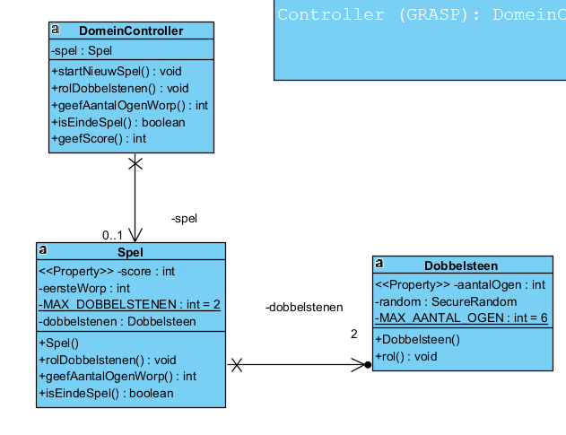

- Domeincontroller is creator van Spel (omdat de domeincontroller spel bevat)
- Spel is de creator van Dobbelstenen (omdat spel de dobbelstenen bevat)

5.2.4. Stap 3B voor rolDobbelstenen(): Deelverantwoordelijkheden toekennen aan de juiste klassen

------------------------------------------------------------------------------------------------

##### Naam patroon: EXPERT

Wie moet het echte werk doen
  - Is degene die de attributen bevat die de verwerking moeten doen
  - er zijn meerdere
  

Omschrijving probleem: Wat is het algemeen principe dat we kunnen hanteren voor het toekennen van

verantwoordelijkheden aan objecten?

  

Omschrijving oplossing: Ken de verantwoordelijkheid toe aan de Information Expert.

Dit is de klasse die alle informatie, nodig om de verantwoordelijkheid te realiseren, heeft.

###### Voorbeeld


rolDobbelstenen van DC: *Spel is de expert* **(rolDobbelstenen(): void)** (maar deze kan dit niet alleen dus), 
*Dobbelsteen is de expert* **(rol(): void)** (maar deze kan dit niet alleen dus), 
*attribuut aantalOgen is de expert*. (want we moeten daar de waarde in plaatsen)


##### Opbouw applicatie

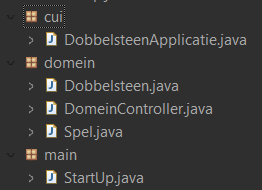

main = zit de startup waar de applicatie start
CUI = voor interface en bevat de SSD als code maar roept steeds de domeincontroller op.
domein = bevat de code

##### Compositie: 
heeft-een relatie, school verwijderen
==> alle klaslokalen verwijderen

##### Aggregatie:
heeft-een relatie, auto verwijderen
==> wielen NIET verwijderen

### Record
#### DTO

Om data terug te sturen (om enkel iets te tonen, enkel getters, GEEN setters)

Niet wijzigbaar object diend enkel om te lezen

Werkt niet en niet weergeefbaar in Visual Paradigm (klassediagram) (bestaat nog niet)

Data Transfer object

Doen we via een speciale pakkage (*dto*)

1. we maken pakkage DTO
2. voegen hier een nieuwe record aan toe
   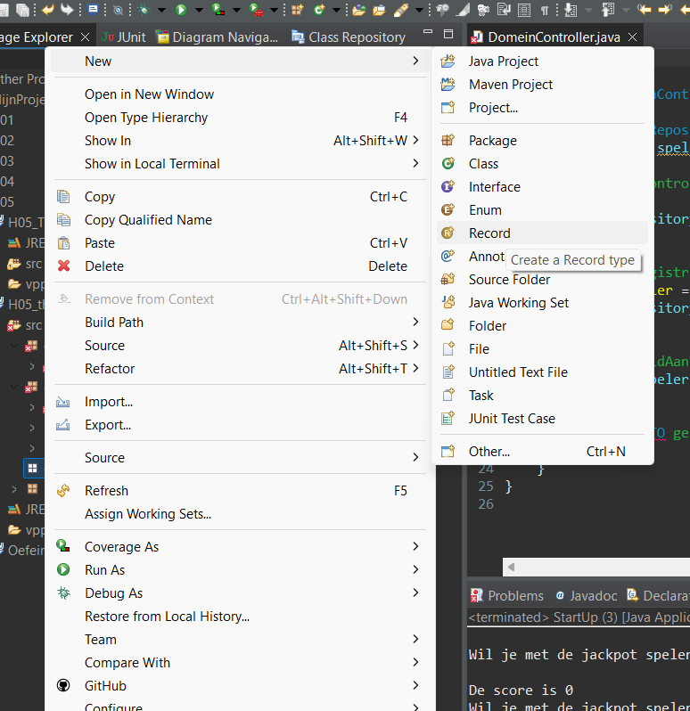
   ![[Pasted image 20241105141022.png]]
   LET OP in naam: DTO in hoofdletters

```java
package dto;

public record SpelerDTO("hier opsommen wat je wilt tonen") {
}
```

##### in ontwerp kunnen we het we zo weergeven:
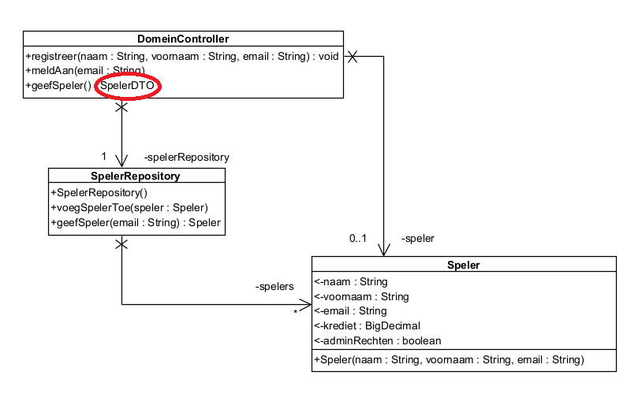
###### voorbeeld:
```java
package dto;
//Data transfer object

import java.math.BigDecimal;

//We willen naam, voornaam, krediet, adminrechten van een speler doorgeven aan de grafische laag
public record SpelerDTO(String naam, String voornaam, BigDecimal krediet, boolean adminrechten) {
}

//Wat hebben we gekregen
//constructor 4 argumenten
//getters
	//naam() ipv getNaam()
	//voornaam()
	//krediet()
	//adminrechten
//We krijgen geen setters
```
## Repository
- Klasse die iets bijhoud, er wordt niets gezegd in de analyse.
- Deze stuurt ook naar de persestentielaag (als we een database gaan gebruiken)
- De domeincontroller zal altijd creëren en deze geeft het door aan de repository

- Naam = "Naam van wat deze bevat" + "Repository"
  bv: TrekkingRepository
