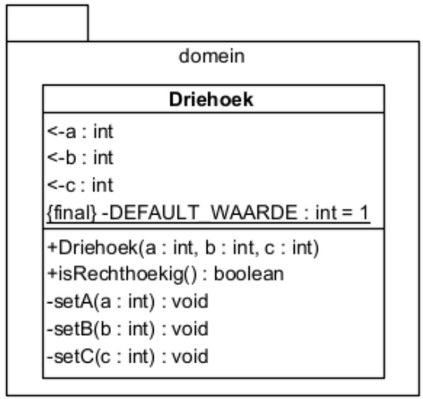

#Voorbeeld #Java #HoGent #toegepasteinformatica #OOSD #Klasse 
# domeinklasse


# uitleg

**Attributen** : a, b en c (stellen de zijden van een driehoek voor) 
**Constructor** met 3 parameters Getters en setters voor alle attributen (zijde moet > 0, indien niet defaultwaarde 1 (gebruik de constante die je static en final declareert)). 
Andere **methode** isRechthoekig: geeft true/false terug naargelang a, b en c de zijden van een rechthoekige driehoek kunnen voorstellen.
# klasse

```java
package domein;

public class Driehoek {

	private int a;
	private int b;
	private int c;
	public static final int DEFAULT_ZIJDE = 1;

//constructor
	public Driehoek(int a,int b,int c) {
		setA(a);
		setB(b);
		setC(c);
	}
 
//setters
	private void setA(int a) {
		this.a = controleZijde(a);
	}

	private void setB(int b) {
		this.b = controleZijde(b);
	}

	private void setC(int c) {
		this.c = controleZijde(c);
	}

//getter  (om data terug te sturen) (private=intern public=extern)
	public int getA() {
		return a;
	}
 
	public int getB() {
		return b;
	}

	public int getC() {
		return c;
	}

	private int controleZijde(int zijde) {
		return (zijde <= 0? DEFAULT_ZIJDE: zijde);
	}

//gedrag 
	public boolean isRechthoekig() {
		return a * a == b *b + c * c ||
			   b * b == a * a + c * c ||
			   c * c == a * a + b * b;
	}
	
}
```