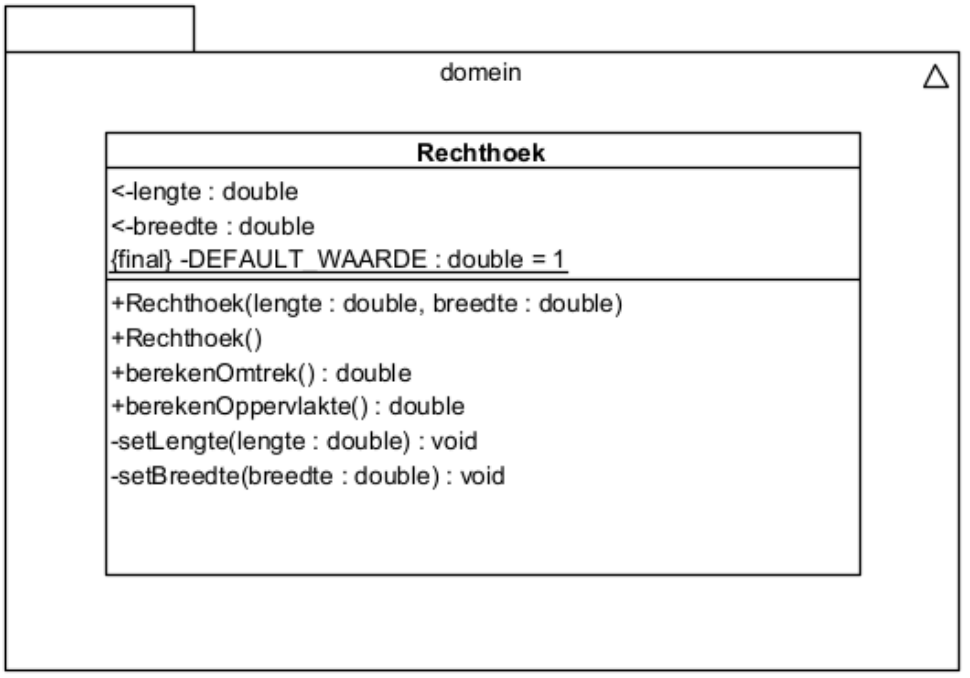

#Voorbeeld #Java #HoGent #toegepasteinformatica #OOSD #Klasse 
# domeinklasse


# uitleg

De klasse heeft als **attributen** lengte en breedte. 

De **constructor** is zo gedefinieerd dat bij creatie van een nieuw Rechthoek-object de attribuutwaarden worden meegegeven. 
Er is ook een **default constructor** gedefinieerd. Die maakt een rechthoek aan waarvan de lengte op 10.0 wordt ingesteld en de breedte op 7.0. 

Voorzie voor elk attribuut een **setter- en een getter-methode**. 
Lengte en breedte moeten strikt positief zijn. Anders wordens ze ingesteld op de defaultwaarde 1.0 (gebruik de constante!). 

Verder beschikt de klasse over **2 extra methodes** berekenOmtrek en berekenOppervlakte, die respectievelijk de omtrek en de oppervlakte van de rechthoek berekenen.
# klasse

```java
package domein;

public class Rechthoek {
 
	private double lengte;
	private double breedte;

	public static final int DEFAULT_LENGTE = 10;
	public static final int DEFAULT_BREEDTE = 7;
	public static final int DEFAULT = 1;

//constructor
	public Rechthoek(double lengte,double breedte) {
		setLengte(lengte);
		setBreedte(breedte);
	}

	public Rechthoek() {
		this(DEFAULT_LENGTE,DEFAULT_BREEDTE);
	}

//setter
	private void setBreedte(double breedte) {
		this.breedte = controlePositief(breedte);
	}

	private void setLengte(double lengte) {
		this.lengte = controlePositief(lengte);
	}

//getter  (om data terug te sturen) (private=intern public=extern)
	public double getBreedte() {
		return this.breedte;
	}
	
	public double getLengte() {
		return this.lengte;
	}

	private double controlePositief(double getal) {
		return (getal <= 0? DEFAULT: getal);
	}

// gedrag
	public double berekenOmtrek() {
		return((lengte + breedte) * 2);
	}

	public double berekenOppervlakte() {
		return(lengte * breedte);
	}

}
```