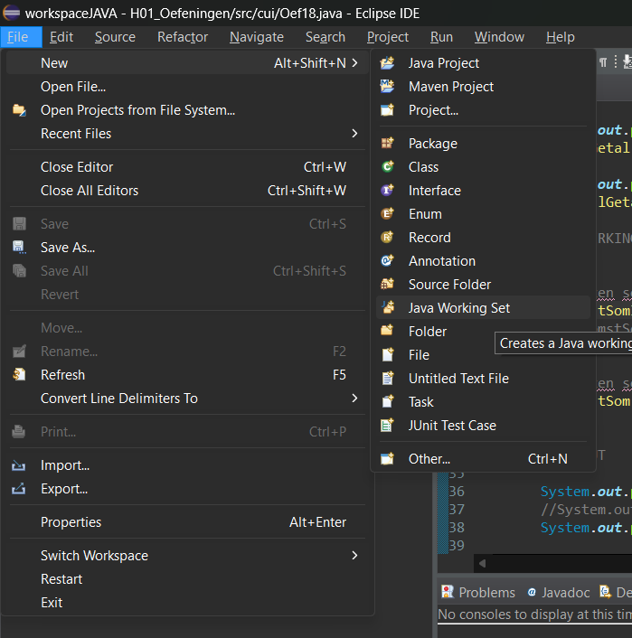
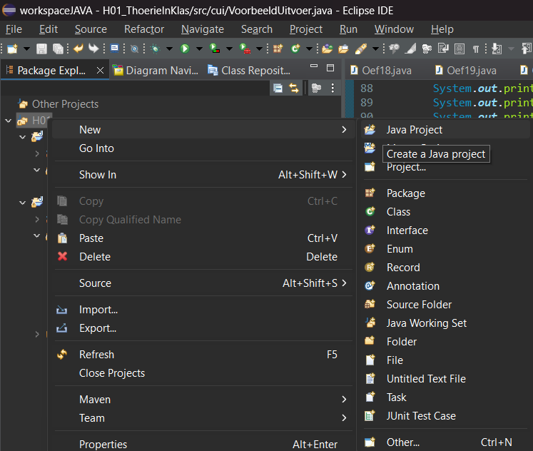
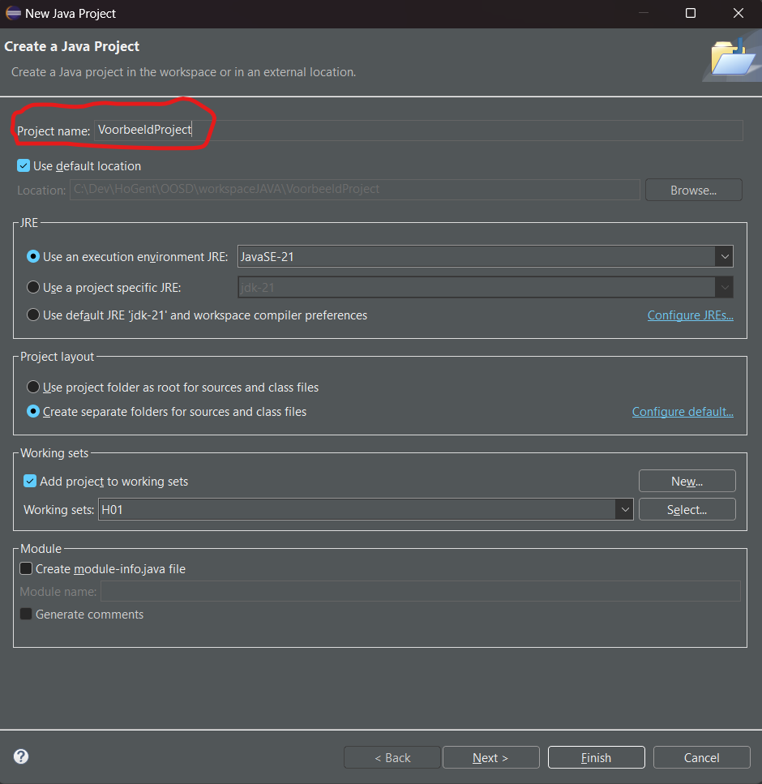
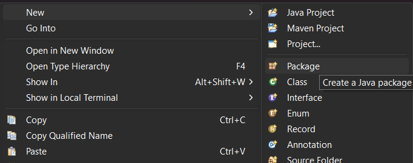
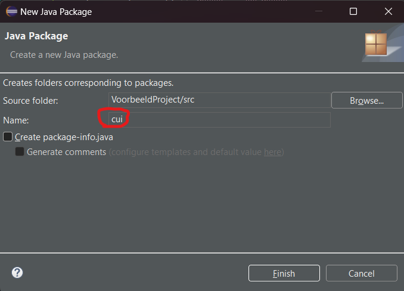
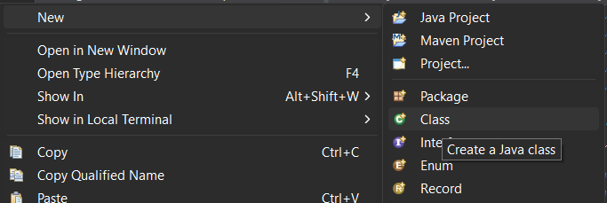
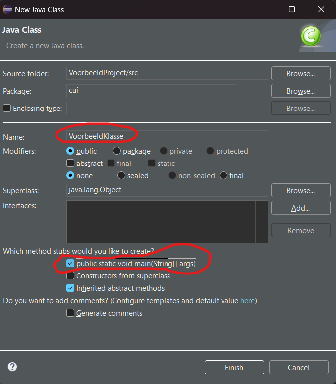
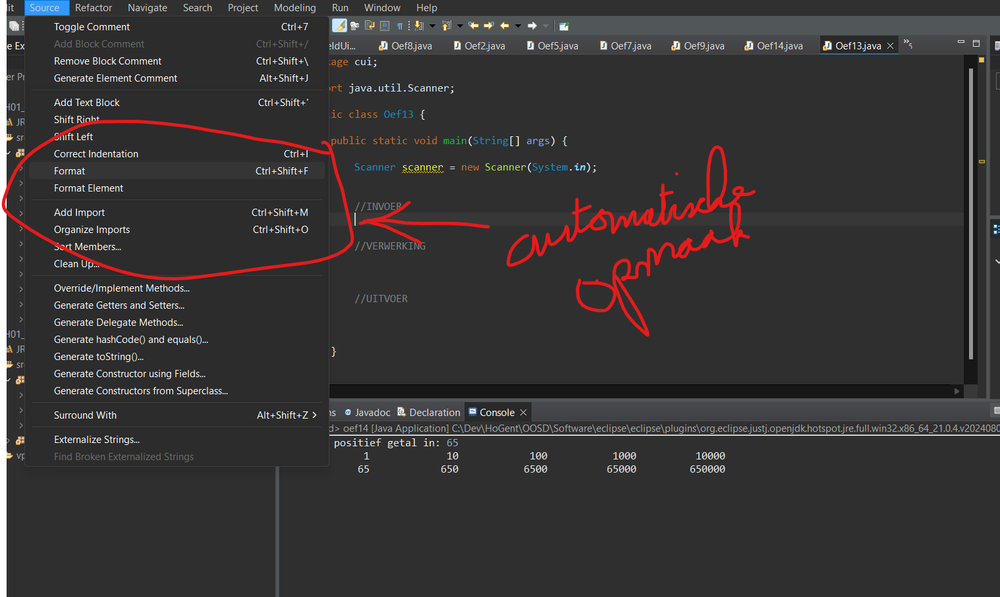

#Samenvatting #Java #HoGent #toegepasteinformatica #OOSD #Eclips
# Aanmaak programma

## Aanmaak workingset

## Aanmaak project

## Aanmaak package

In projectfile rechtermuistoets:

Naming convention: is steeds met kleine letters
## Aanmaken van een klasse

Rechter muisknop op package:

Naming convention: CamelCase, beginnend met HoofdLetter
# Automatische opmaak

