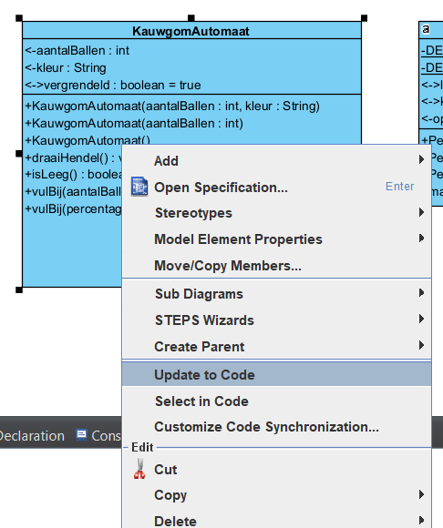
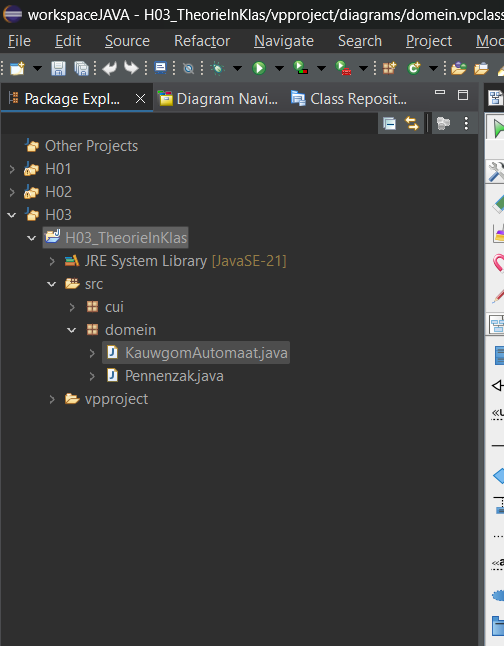
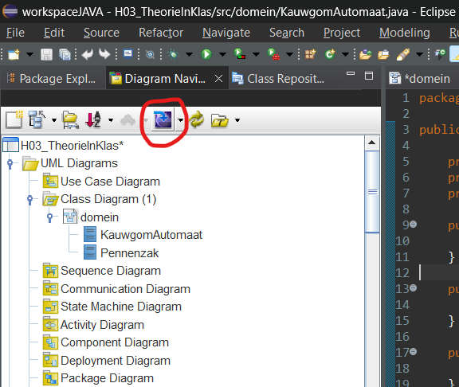

# 1 klasse omzetten naar code

### Na omzetten

1. volgorde goed zetten attribute, constructors , (controle constructors), g-setters, getters, gedrag
2. creëer methode voor controle constructors (in grootste constructor methode oproepen)
3. creëer CONSTANTEN indien nodig
4. vul andere constructors aan met `this(aantalBallen,DEFAULT_KLEUR);` met evenveel aantal als hoeveelheid van dezelfde constructor die meer argumenten heeft
5. vul de default constructors in met bijhorende default waarden `'this(DEFAULT_AANTAL_BALLEN,DEFAULT_KLEUR);`
6. getters staan al kant en klaar
7. zet final bij setters `public final void`
8. vul de code bij in ons gedrag

# Alle klassen omzetten naar code

