# Aanmaken van de klasse

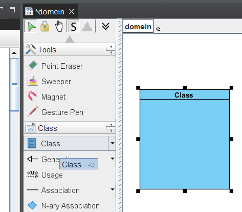
# Attribuut toevoegen

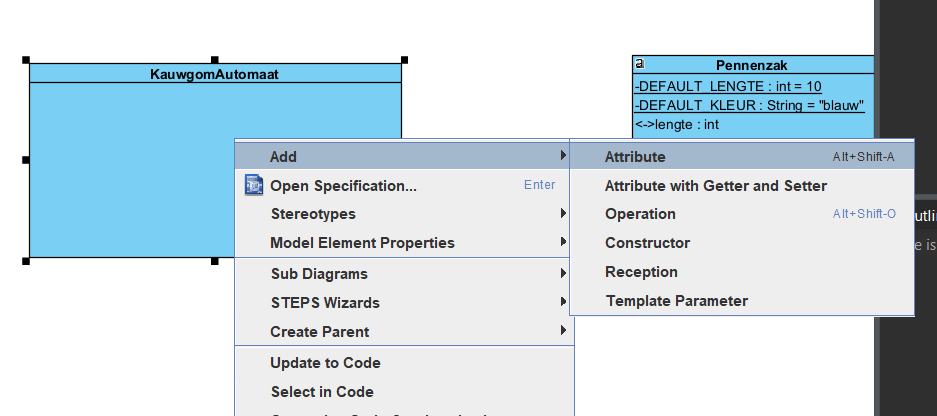

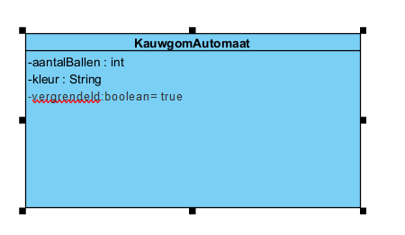

naam (kleine letters) 
dubbelpunt (:)
type

*optioneel:*
toewijzing door is gelijk aan (=)
toegewezen standaardwaarde

# constructor

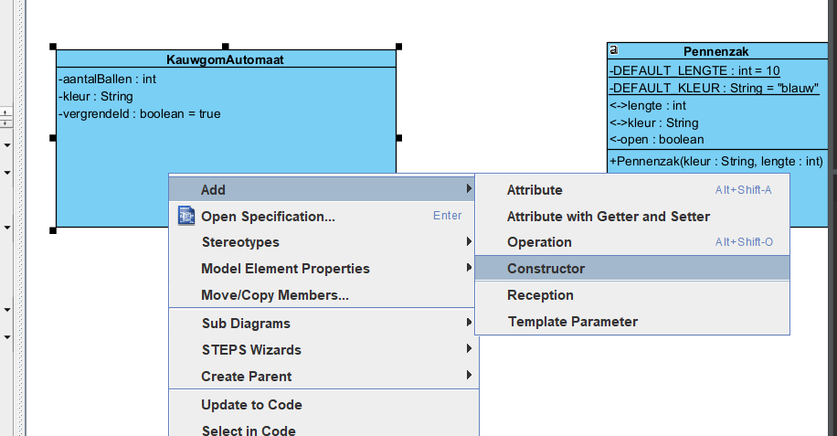

moet altijd naam van de klassen hebben

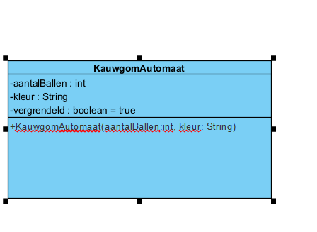

aangevuld met onze attributen

+NaamVanKlasse(attribuut:type,attribuut:type)

Default constructor ==> leeg laten

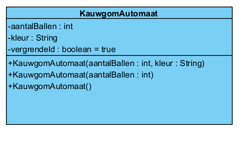

# Gedrag

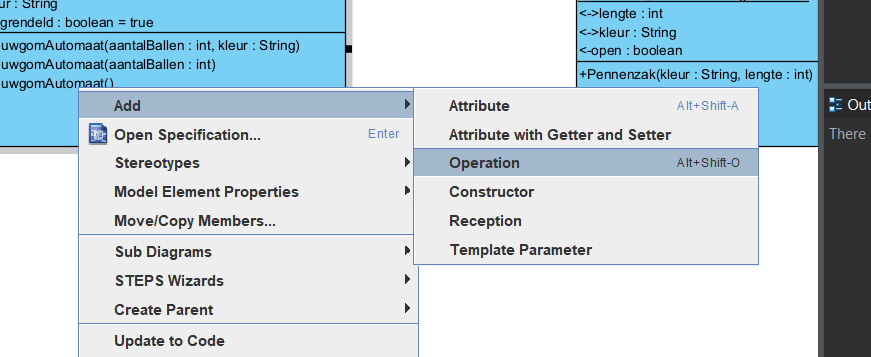
![[Pasted image 20241015140447.png]]

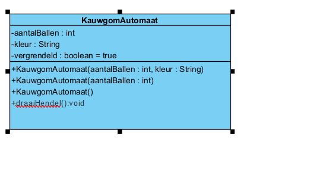

geef naam beginnend met kleine letter

+naam(nodigArgument:type):void
standaard is altijd void

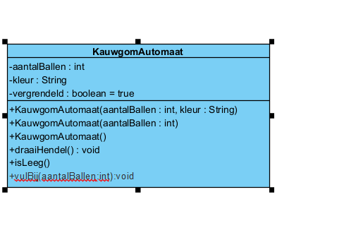

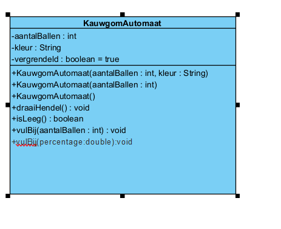

# getter setter (methodes)

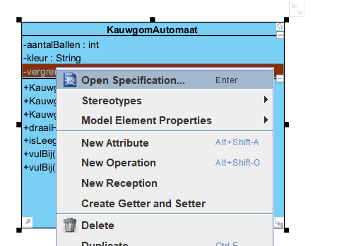

< getter

\> setter

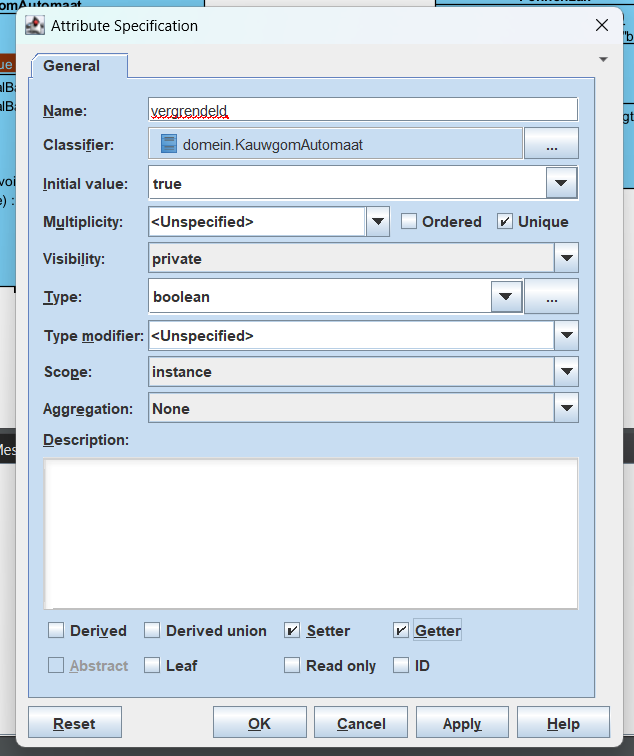

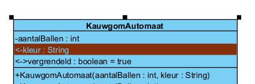

