Stap1

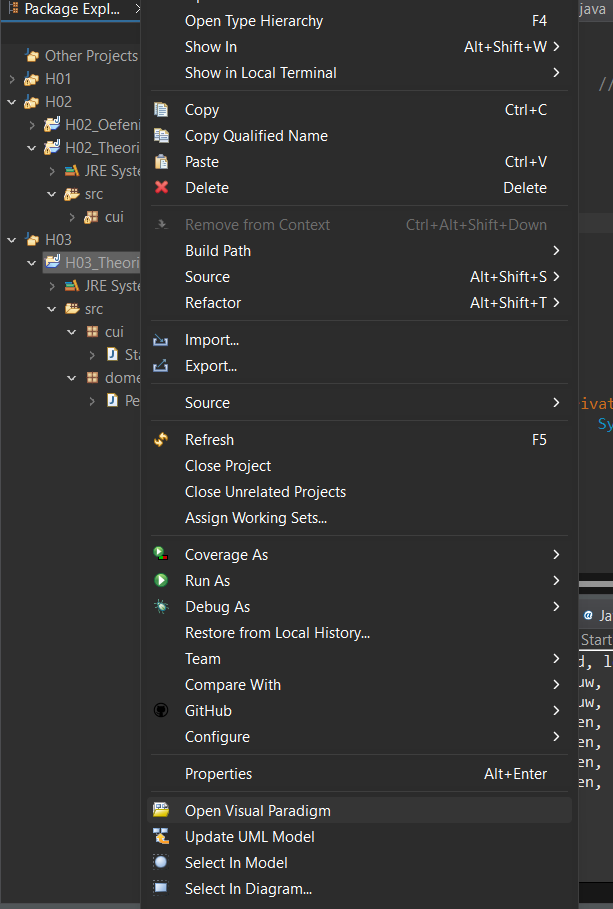

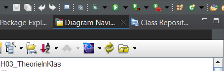

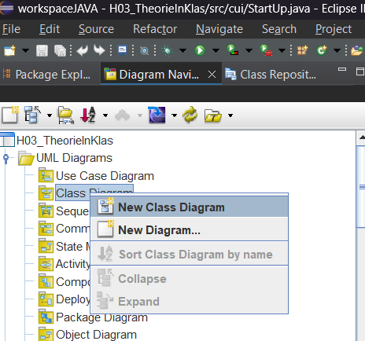

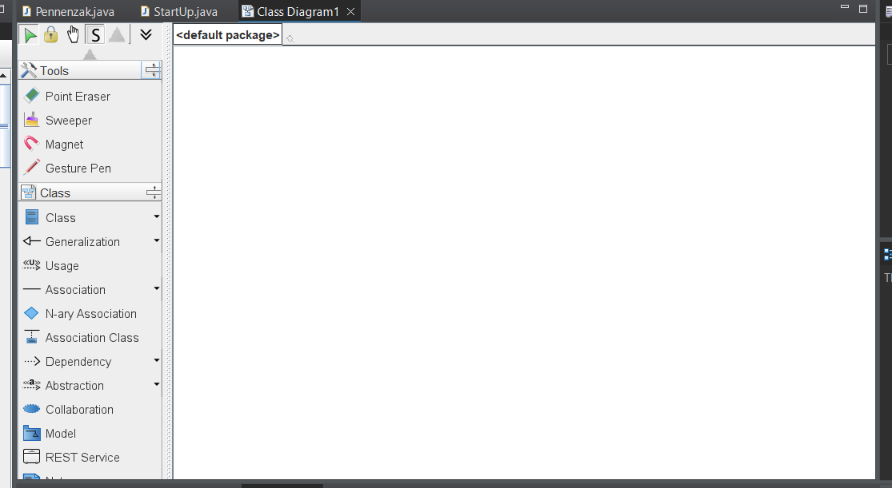

default package hernoemen naar "domein"

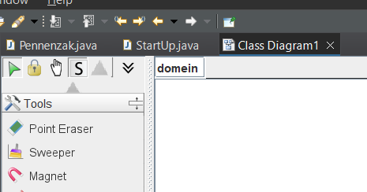

in klasse, in code staan

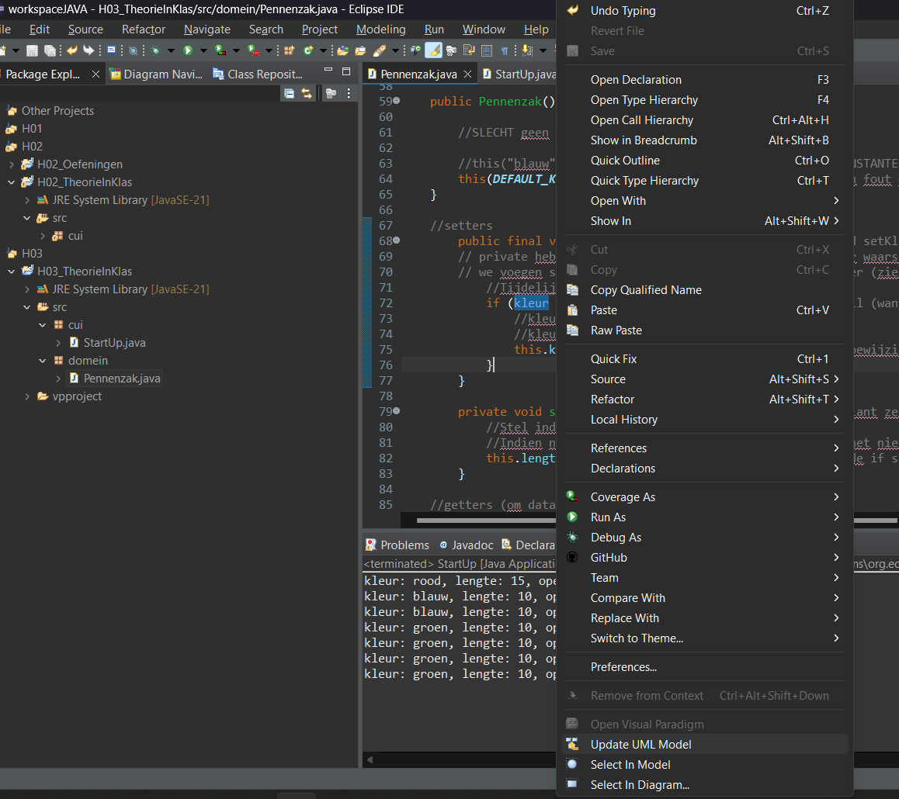

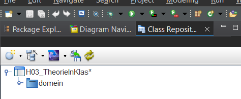

domein open klappen

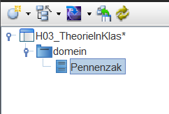

oonze klasse "Pennenzak" verslepen naar VP

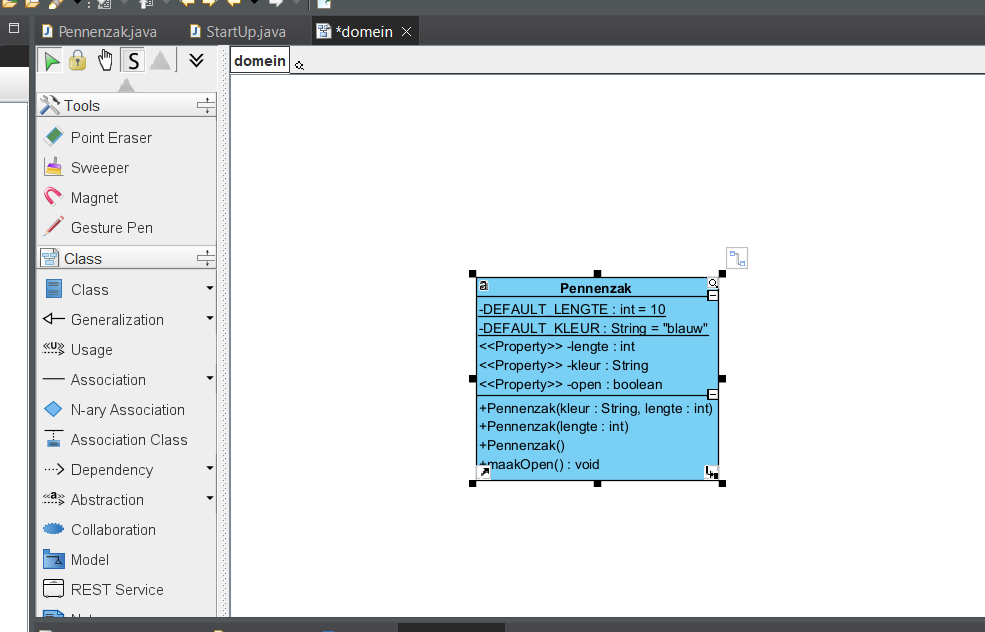

schakel steeds de properties uit (dit is enkel in het eerste jaar, propery wil zeggen dat deze een getter en/of een setter heeft)

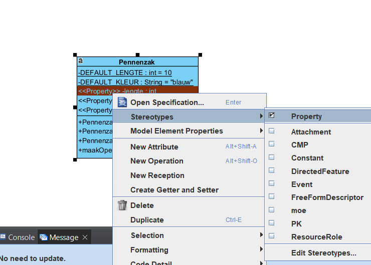

zet show getter setter aan

klik rechts naast je klasse
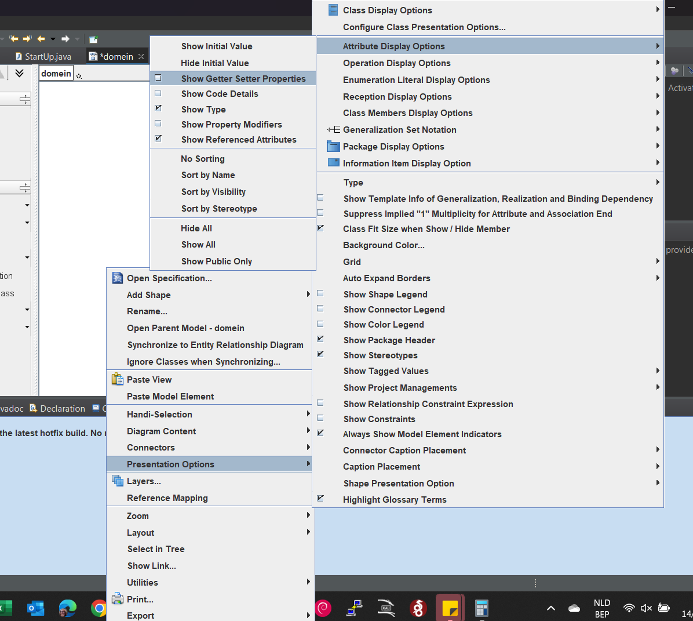