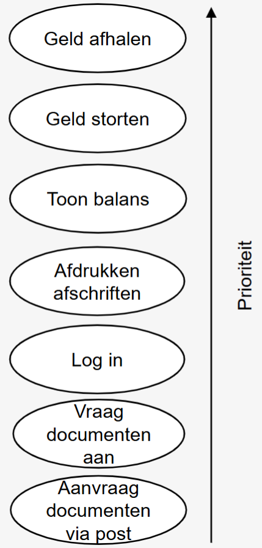
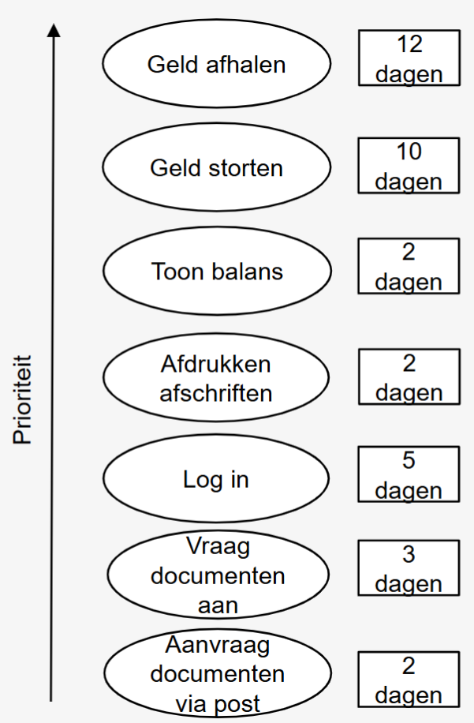
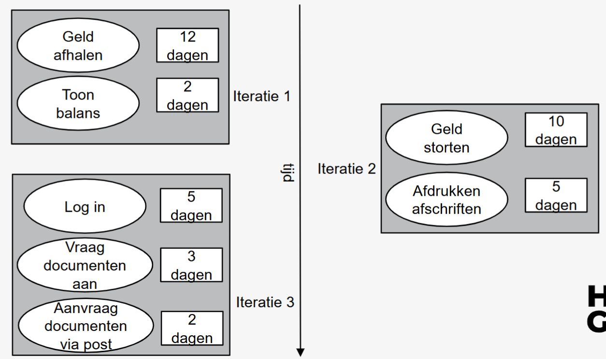

# Agile stappen

1. **De opdrachtgever** *formuleert probleem*
   ***Begin analyse***
2. **Analist** *noteert het verhaal en de eisen of behoeften* 
3. **Analist** *stelt een* **UseCase Diagram** *op met betrokken rollen en usecases*
4. **Analist** *vertaalt het verhaal naar* **usecases** (komt aan bod in olod Functionalanalyse)
5. **Analist** *stelt* ***aan de hand van usecase(s) het*** **domeinmodel** *op*
6. **Analist** *stelt* ***per usecase*** *een* **activitydiagram** *op met het oog op testen*
7. **Analist** *stelt* ***per usecase***, *voor minstens het normaal verloop,* **een Systeem Sequentie Diagram (SSD)** *op met bijhordende* **Operation Contracts(OC)**
   ***Einde analyse***
8. **De ontwerper** ***vertaalt elk SSD*** *naar een* **Sequentie Diagram (SD)**
9. **De ontwerper** *stelt het* **klassendiagram** *op basis van de verworven kennis*
10. *Uiteraard moet de nodige aandacht besteed worden aan het voorbereiden van de* **testen**
11. *De vertaalslag in de gewenste* **programmeertaal** *kan gebeuren*

# Situering in UML

# Planning aan de hand van use case

## 1. Identificeren

Voorbeeld:

## 2. Schat onwikkeltijd in

voorbeeld:

## 3. Verdeel het project in itteraties
 Voorbeeld:

