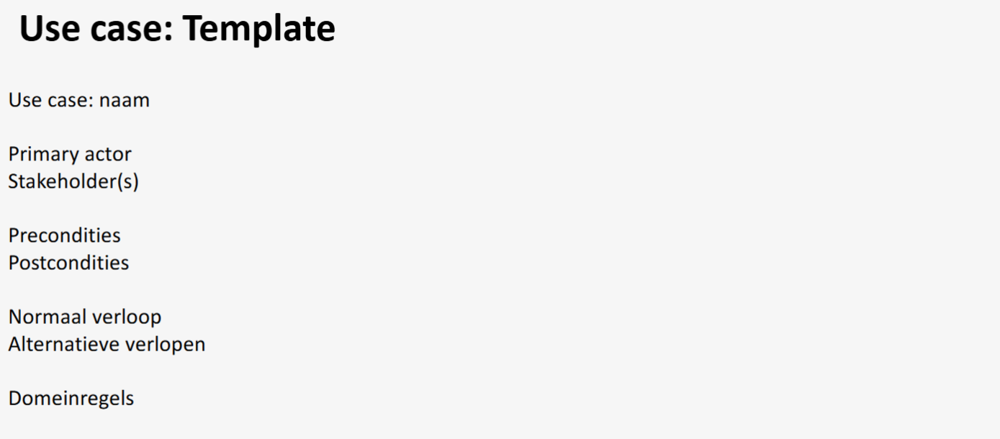

# Defenitie
Een usecase **omvat alle manieren waarop het systeem gebruikt kan worden om een bepaald doel voor eenbepaalde gebruiker te behalen**. 

Opgelet: een *usecase definieert niet hoe het systeem het implementeert*, het is conceptueel en niet technisch
# Nut
Een *complete set van usecases zoals weergegeven in het usecase diagram* **geeft je alle zinvolle manieren om het systeem te gebruiken en illustreert de waarde die dit zal opleveren**.

- **Maken van een planning**
- **Use cases vormen de basis voor verder ontwerp**
- **Use cases vormen de basis voor functionele testen**
# Opbouw

## Actoren
- Primary actor
- Supporting actor
- Stakeholder
- Doel

## Verloop
- Normaal verloop = eerste scenario = mainsucces story
- Als we afwijken van het hoofdscenario komen we in een alternatief scenario terecht

# Template

# Voorbeeld

## Opdracht klant:

Onze klant wil graag een simulatie krijgen van een dobbelspel. De klant meldde ons meteen dat als dit spelletje aanslaat, er dan heel snel uitbreidingen kunnen volgen. Hij beschrijft ons hieronder wat dit simulatiespel allemaal moet kunnen.

“Het spel is vrij eenvoudig. Een speler gooit met twee dobbelstenen. Die eerste worp is belangrijk. Werpt hij 7 of 11, dan wint de speler onmiddellijk het spel met een score van 2. Anders moet hij dit specifieke aantal ogen – van de eerste worp - nog eens werpen vooraleer hij een 7 of een 11 werpt, ook dan wint hij maar met een score van 1. Een speler kan pas spelen als hij voldoende krediet heeft. Een nieuwe speler start met een krediet van 5, hij kan een aanvraag indienen om dat krediet te verhogen – een beheerder controleert de betalingen. Het krediet kan verhoogd worden door te betalen of door spelletjes te winnen."

Het is een spel dat iedereen dus afzonderlijk kan spelen, maar we willen als dit aanslaat in een verder stadium ook graag tornooien opstellen. Elke speler moet gekend zijn in het spel zodat we een klassement kunnen opstellen.

We organiseren dit nu als volgt: afhankelijk van het aantal deelnemers, starten we met een aantal tafels. Stel dat er vijf mensen aan één tafel zitten, dan mag iedere speler dit spel 5 + 1 keer spelen. Van die tafel wordt een rangorde opgesteld, de twee beste gaan door naar de volgende rond. Daar worden terug groepjes gemaakt. Terug de twee beste gaan door. Dan kom je aan de ronde waar er maar drie tafels meer overschieten. Hier gaat slechts telkens de beste door. Deze drie beste spelers spelen dan de finale. Soms worden de spelers willekeurig in groepen verdeeld om het tornooi te starten, soms worden ze op basis van vorige klassementen bij elkaar geplaatst.

Daarnaast heb ik ook nog allerhande extra mogelijkheden in mijn hoofd: er bestaan ook spelvarianten van dit dobbelspel.

- Een eerste voorbeeld hiervan is dat de speler maximaal vijfmaal mag gooien met de dobbelstenen.
- Een ander voorbeeld kan zijn dat het cijfer 2 ook zorgt – naast een 7 of een 11 – dat de speler wint.
- Nog een andere wijziging die mogelijk is, is het aantal wedstrijden dat per ronde gespeeld wordt.

De mogelijkheden zijn eindeloos, maar misschien moeten we eerst zorgen dat we het basisspel via pc kunnen spelen?”

## Opstellen use case

### Use Case: Speler Registreren

**Primaire actor:** een (willekeurige) gebruiker

**Preconditie:**
- Geen specifieke precondities.

**Postconditie:**
- Het systeem heeft de nieuwe speler geregistreerd.

**Normaal verloop:**
1. De gebruiker wenst zich te registreren als speler.
2. Het systeem vraagt om de volgende gegevens: naam, voornaam, e-mail, geboortedatum, wachtwoord en bevestiging van het wachtwoord.
3. De gebruiker geeft de gevraagde gegevens in.
4. Het systeem valideert de ingevoerde gegevens (alle velden zijn verplicht, het wachtwoord moet voldoen aan de beveiligingsregels, en het e-mailadres moet correct zijn).
5. Het systeem registreert de nieuwe speler met een krediet van 5 Euro.
6. Het systeem toont een gepaste melding aan de gebruiker.

**Alternatieve verlopen:**

**4A. Het systeem detecteert dat niet alle gegevens ingevuld zijn.**
1. Het systeem geeft een gepaste melding.
2. Keer terug naar stap 2 in het normaal verloop.

**4B. Het systeem detecteert dat er reeds een speler bestaat met het opgegeven e-mailadres.**
1. Het systeem geeft een gepaste melding.
2. Keer terug naar stap 2 in het normaal verloop.

**4C. Het systeem detecteert dat wachtwoord en wachtwoordbevestiging niet gelijk zijn aan elkaar.**
1. Het systeem geeft een gepaste melding.
2. Keer terug naar stap 2 in het normaal verloop.

**4D. Het systeem detecteert dat de gebruiker jonger is dan 18 jaar.**
1. Het systeem geeft een gepaste melding.
2. Use case eindigt zonder bereiken van de postconditie.

**4E. Het systeem detecteert dat het e-mailadres niet voldoet aan de regels van een geldig e-mailadres.**
1. Het systeem geeft een gepaste melding.
2. Keer terug naar stap 2 in het normaal verloop.

**4F. Het systeem detecteert dat het wachtwoord niet voldoet aan de regels van een wachtwoord (zie DR-wachtwoord).**
1. Het systeem geeft een gepaste melding.
2. Keer terug naar stap 2 in het normaal verloop.

### Domeinregels

**DR-wachtwoord**
- Wachtwoord bestaat uit minstens 6 tekens, waarvan minstens 2 cijfers.

**DR-email**
- Het e-mailadres moet uniek zijn.

