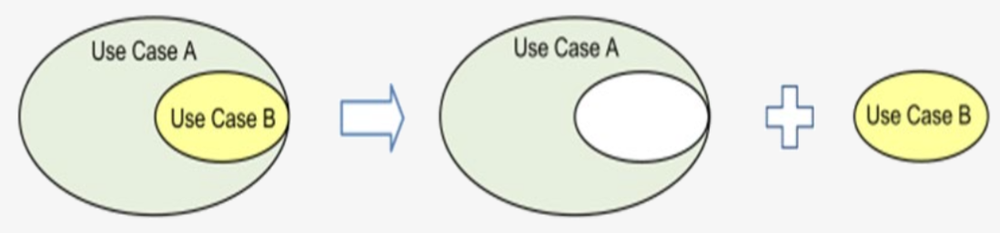
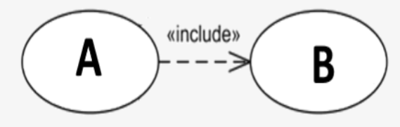
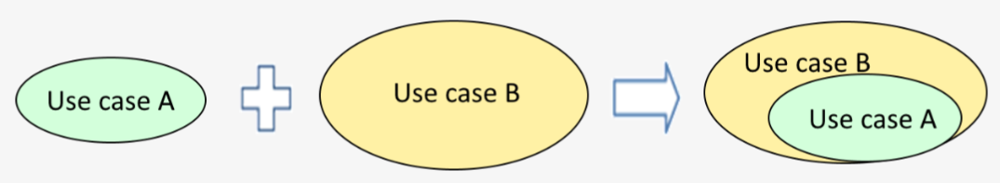
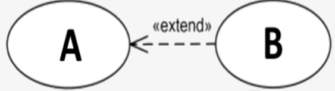
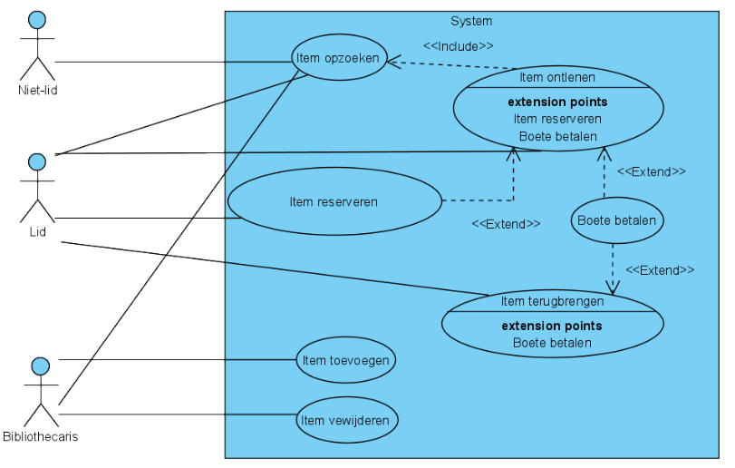

# Doel
Visualisatie van usecases: usecase diagram.
# Stappenplan
- Bevat **alle rollen** (= primary actors) die het systeem kunnen gebruiken
- Bevat **alle functionele requirements**
- Bevat **includes**:
	- use case A voertALTIJD use case B uit tijdens normaal verloop
	- 
	- 
- Bevat **extends**
	- use case A voert use case B uit tijdens een alternatief verloop
	- 
	- 
- Het is good practice om een Use Case diagram niet overdreven ingewikkeld te maken. **Vermijd dus in de mate van het mogelijke includes en extends**.

# Voorbeeld

