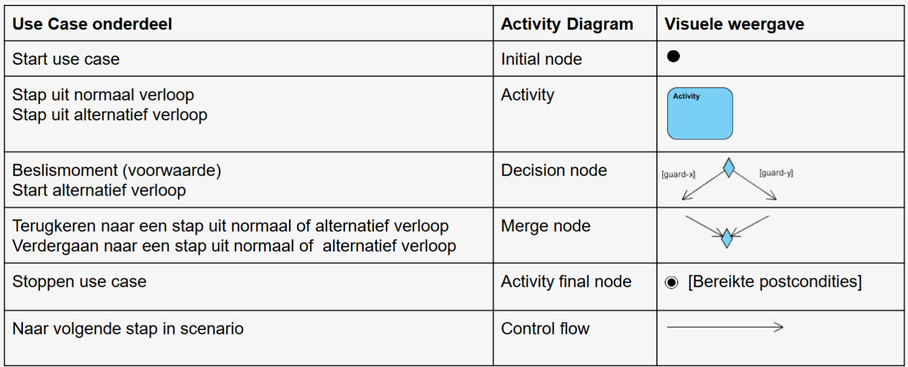
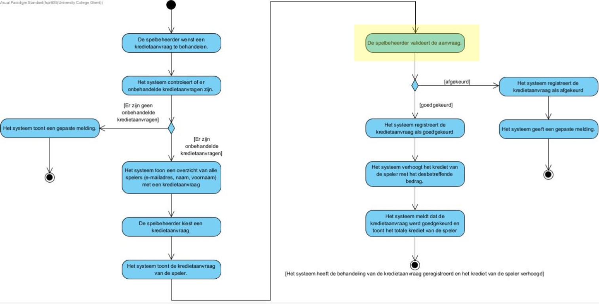
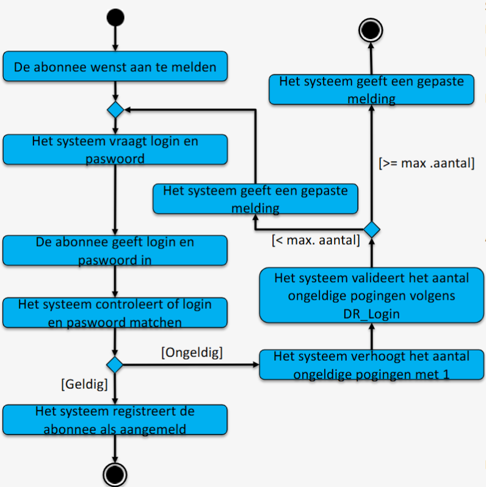

# Doel

# Stappenplan
1. maak eerst normaal verloop
2. einde normaal verloop is de Postconditie
3. voeg telkens de alternatieve verlopen toe
# Onderdelen

# Voorbeeld

## voorbeeld1

## voorbeeld2

