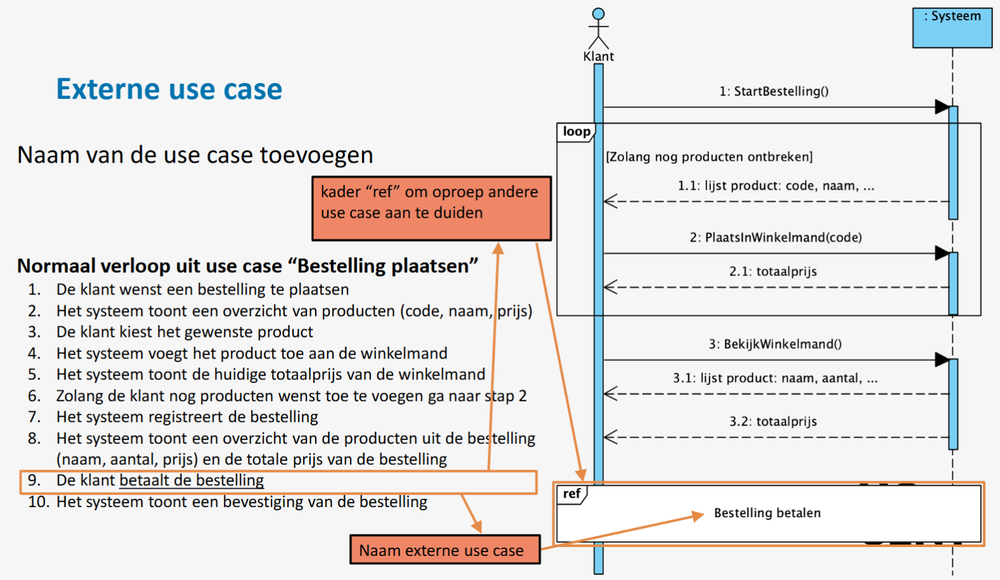
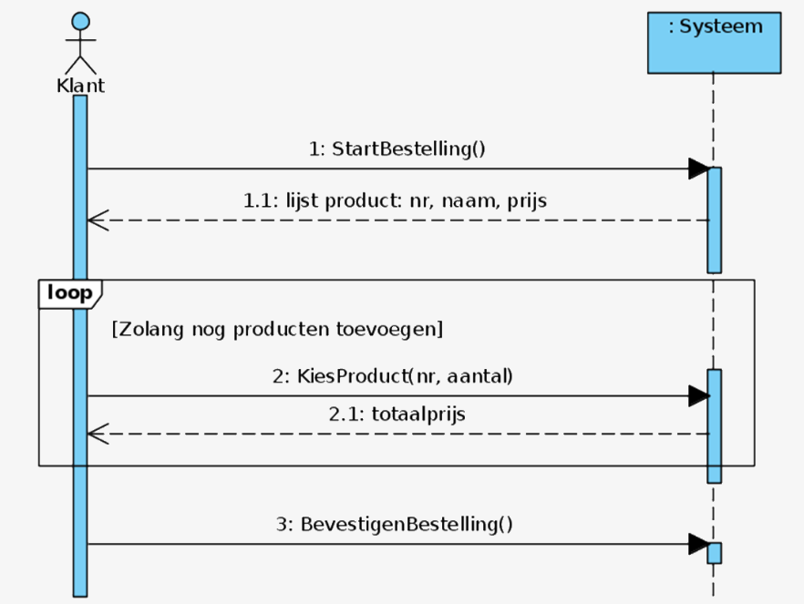

# Defenitie
Een systeem sequentiediagram is een **sequentiediagram** dat alle **interacties** tussen **actoren** het **systeem** van **1 use case scenario** weergeeft.

# Doel
- SSD *geeft inzicht in de systeemeisen die een eindgebruiker verwacht*
- SSD *toont de systeem boodschappen/operaties* = systeemgedrag
- SSD *toont wat het systeem moet doen*, niet hoe(black box)
- SSD *bevat de systeemoperaties*. *Als een actor communiceert met het systeem gebeurt dit altijd via zo’n systeemoperaties*. Dus alle mogelijk communicatie die een actor kan hebben met het systeem, wordt voorgesteld door een systeemoperatie op een SSD
- Als we dan al die gevonden systeemoperaties proberen uit te werken (ontwerp + implementatie) dan krijgt onze software vorm. **Het is dus eigenlijk een startpunt voor het ontwerp**

# Onderdelen

## Op voorbeeld

## Detail

### Deelnemers
- Actor
	- Aangeduid via:
	- Steeds benoemen!
		- Naam = rol van primary actor uit de use case
	- Staat steeds LINKS in het SSD
- Systeem
	- Aangeduid als 
	- Staat steeds RECHTS in het SSD

### Levenslijn
- ELKE deelnemer heeft een levenslijn
- Actor
	- Voorgesteld als blokje
	- Is STEEDS actief!
- Systeem
	- Indien geen systeemoperatie (= niet actief)
		- Voorgesteld als stippellijn
	- Indiensysteemoperatie(= actief)
		- Voorgesteld als blokje
		- APART blokje per systeemoperatie

### Systeemoperaties
- Boodschappen tussen actor en systeem
- Tijdordening
	- Chronologisch van boven naar beneden
	- Volgens de stappen uit het use case scenario
- Een systeemoperatie = 1 wisselwerking actor met systeem uit het use case scenario

#### Actor wil iets doen op het systeem

- Aanduiden met 
- Van blok op levenslijn actor naar blokje levenslijn systeem
- Regels
	- Naam
		- Werkwoord
		- Afsluiten met ()
	- Parameters indien nodig
	- GEEN datatypes
	
- Duidelijke naamgeving voor de systeemboodschappen
	- Moet duidelijk zeggen wat er gevraagd wordt aan het systeem, wat de bedoeling is dat het systeem doet. (Nietwat de actor doet!)
	- Moet de bedoeling op een hoog abstractieniveau weergeven
		- niet in termen van inputtechnologie (Geendatatypes)
	- Sluit aan bij het gebruikte jargon in het domeinmodel
	- Formuleert een opdracht «doeIets» (-> starten met de stam van een werkwoord)
	- Gegevens die meegegeven worden aan het systeem worden tussen ronde haakjes weergegeven. We noemen dit parameters. Deze parameters zijn informatie die het systeem nodig heeft om ‘zijn taak’ uit te voeren.
	- voorbeelden:
	  
#### Systeem geeft iets terug aan de actor

- Aanduiden met 
- Van blokje op levenslijn systeem naar blok levenslijn actor
- ENKEL
	- na communicatie van actor naar systeem
	- als het systeem iets teruggeeft
- Benoemen wat systeem teruggeeft
	- Enkel data uit het domeinmodel
- Regel
	- Zelfstandig naamwoord
	- GEEN operaties
	- GEEN datatypes
	
- Het systeem geeft informatie aan de actor. Voor sommige informatie zijn gegevensnodig, voor andere niet.
- worden er in deze stap gegevens geretourneerd?
	- het antwoord op deze vraag krijg je door het domeinmodel te bekijken..

### Herhaling (loop)
Stappen die herhaald worden in een usecase aanduiden

### Externe use case

# Stappenplan

### 1.Kies een use case scenario. 
- SSD is voor één usecase scenario
	- Normaal verloop OF
	- Normaal verloop met integratie stappen van 1 alternatief verloop
		- ENKEL indien het alternatief verloop complex is!
- Zorg voor passende naam SSD
### 2.Voeg elke deelnemer toe met zijn levenslijn. 
### 3.Voeg de systeemoperaties toe
- Overloop elke stap van het gekozen use case scenario in volgorde
	- Voor elke actie die de actor uitvoert, dient een systeemboodschap te worden toegevoegd aan het SSD tenzij de actor een andere use case oproept. In dat geval gebruiken we de ref (Zie “Externe use case oproepen”).
	- We tekenen per systemoperatie een activeringsblok je om aan te duiden dat het systeem reageert op de systeemboodschap.
		- hoe het systeem intern reageert op de systeemboodschap wordt niet vertaald naar het SSD (systeem is black box)
	- Wanneer het systeem gegevens retourneert naar de actor dan tekenen we één of meerdere terugkeerpijlen. Bovenop die pijlen plaatsen we welke gegevens de actor krijgt. Een terugkeerpijl is altijd een gegevensstroom
	- Beschouw telkens een actie van de actor samen met de bijhorende reactie(s) van het systeem. Deze vormen samen 1 blok.
	- Het systeem kan meerdere gegevens terug sturen naar de actor als gevolg van 1 systeemboodschap.
	- Visueel krijg je ofwel meerdere terugkeerpijlen, ofwel meerdere gegevens op één terugkeerpijl
	- je identificeert een stap als een actie van de actor
		- teken een systeemboodschapen benoem deze heel duidelijk (uitleg naamgeving zie verder).
		- Teken ook een nieuw activeringsblokje(het systeem reageert).
	- je identificeert een stap als een reactie van het systeem
		- bekijk het domeinmodel en ga na of er in deze stap gegevens uit het domein geretourneerd worden?
			- JA => teken een terugkeerpijl en benoem duidelijk de gegeven
			- NEE => deze stap hoef je niet op het SSD te zetten (deze stap zal wel belangrijk zijn bij het opstellen van een operation contract)

### 4.Voeg eventuele herhalingen toe

# Voorbeeld

