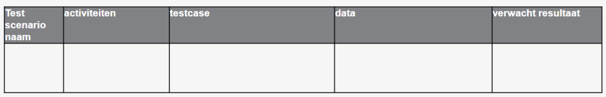
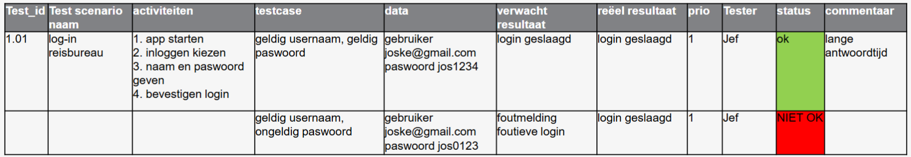
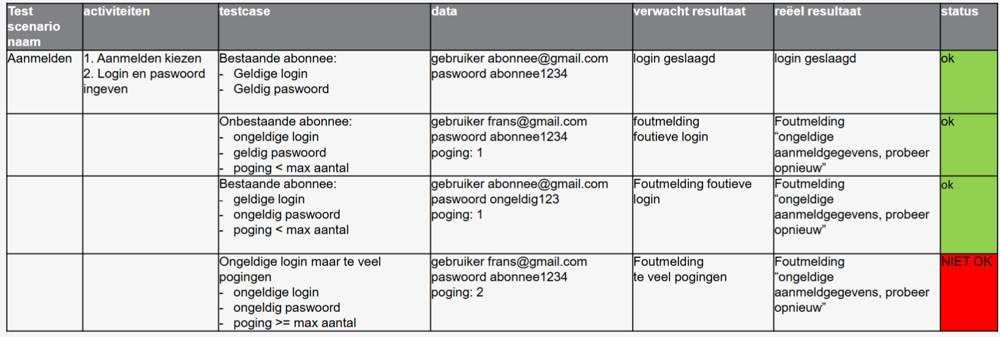

# Doel
Je bestelt als bedrijfsleider software op maat bij een software bedrijf.
- Je wil zeker zijn dat de software doet wat jij verwacht
- Je wil kunnen aantonen dat er verwachtingen in functionaliteit geformuleerd zijn die moeten werken. 

Je werkt in een softwarebureau en werkt mee aan een aantal projecten als programmeur:
- Kunnen tonen dat de functionaliteit werkt
- Tonen dat de opeenvolging van functionaliteiten werken zoals gevraagd.

# Stappenplan

⇒Prioritering van testscenario’s
⇒Functionele testen

- Test de functionaliteit
- Test of de getoonde antwoorden correct zijn
- Test of de informatie correct getoond wordt
# Template

# Voorbeeld

