# Moet ik niet kennen -> vrijstelling

# Doelstellingen:
- Kan de verschillende fasen in een software ontwikkelingsproces benoemen
- Kan UML-diagram (Domeinmodel, activiteitendiagram, SSD) en nut ervan situeren
- Kan geïdentificeerde behoeften vanuit usecasesen begeleidende contextbeschrijving vertalen naar een passend UML-diagram (Domeinmodel, activiteitendiagram, SSD)
- Kan testscenario’s opstellen voor eenvoudige toepassingen–Kan de basisbegrippen van UI omschrijvenen toepassen

# Software-ontwikkelingsproces

- Kader dat vastlegt hoe een softwareproject wordt aangepakt.
- Een methode om de activiteiten in verband met creatie, oplevering en onderhoud van softwaresystemen te organiseren

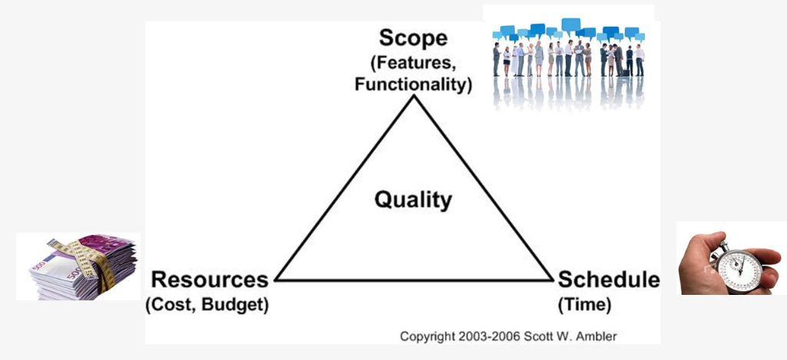

Aanpassing van 1 hoek heeft gevolgen van de andere 2

## Elk ontwikkelingsproces bevat volgende onderdelen:

1. Requirements (vereisten) verzamelen door te luisteren naar de opdrachtgever
2. Requirements analyseren
3. Een ontwerp (plan) maken
4. Implementeren: het ontwerp uitvoeren
5. Testen / controleren

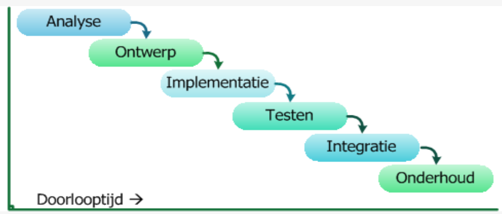

## Watervalmethode

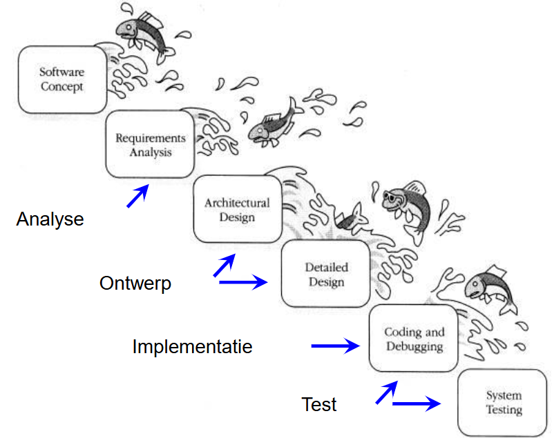

### Nadeel Waterval methode

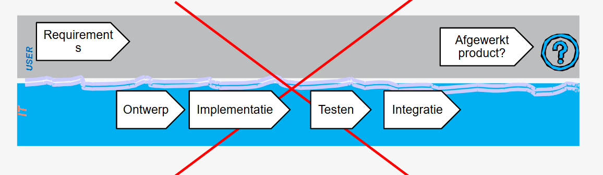

## Agile methode

2 belangrijkste pijlers: *iteratief* & *incrementeel*

### Iteratief en incrementeel

Een *iteratief-incrementele software-ontwikkelingsmethode* noemt men *"Agile"*

**Agile** = *wendbaar/flexibel* (vs. waterval!)
**Iteratief**: *je werkt in stappen, na elke stap lever je "werkende software" op*, waarmee de gebruiker kan werken *en krijg je feedback*
**Incrementeel**: *bij elke stap bouw je verder* aan de software

### Het Agile Manifesto (2001)BelangrijkerBelangrijk

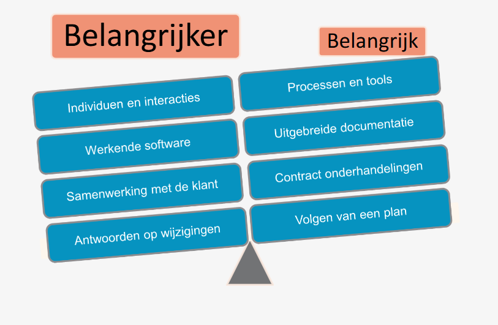

### Belangrijkste principes achter het Agile Manifesto

- *Hoogste prioriteit: klant tevreden*
- *Accepteren dat gebruikerseisen en wensen veranderen*, ook later in het project.
- *Lever geregeld werkende software op*
- *Business en ontwikkelaars werken dagelijks samen* “Face-to-face” communicatie binnen team
- *Werkende software is de eerste meting van vooruitgang*

### Iteratief-incrementele ontwikkeling

- Thinkbig, developsmall : *werk in iteraties*
- Een *iteratie bevat steeds dezelfde activiteiten*
- De *tijdsbesteding aan iedere activiteit kan gaandeweg tijdens het project veranderen*. (In het begin wellicht meer analyse ...)
- *Iteraties duren meestal 2 tot 6 weken*. Dit is niet strikt.

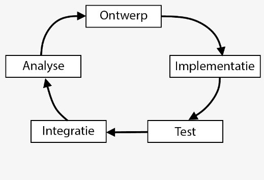

### Agile stappenplan

1. De opdrachtgever formuleert probleem
2. Analist noteert het verhaal en de eisen of behoeften
3. Analist stelt een UseCase Diagram op met betrokken rollen en usecases
4. Analist vertaalt het verhaal naar usecases (komt aan bod in olodFunctionalanalyse)
5. Analist stelt aan de hand van usecase(s) het domeinmodelop
6. Analist stelt per usecase een activitydiagram op met het oog op testen
7. Analist stelt per usecase, voor minstens het normaal verloop,een Systeem Sequentie Diagram (SSD) op met bijhordendeOperationContracts(OC)Agile stappenplan

# UML

= Unified modeling language

- Een modelleertaal om objectgeoriënteerde analyses en ontwerpen voor een informatiesysteem te kunnen maken
- UML zelf is geenmethode, maar eennotatiewijzedie bij verschillende methodes (zoals Iteratief-Incrementeel) kan worden gebruikt.
- Unified modeling language: UML is ontstaan in de jaren '90 als samenvoeging van verschillende methode die toen bestonden.

### Voordelen

- Communicatie
- Visualisatie
- Transformatie = UML vergemakkelijkt de overgang
	- analyse -> ontwerp
	- ontwerp -> programmeren
	- programmeren -> testen

### UML diagrammen

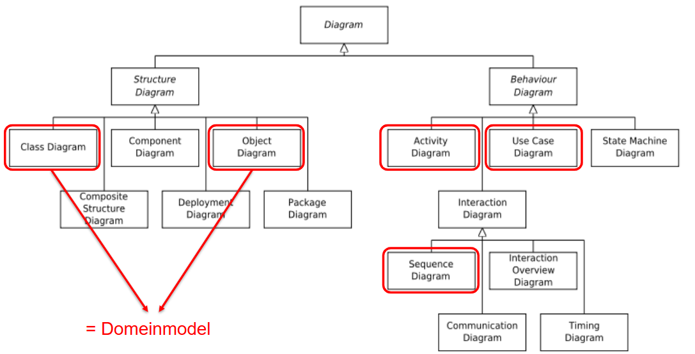

### UML: usecase diagram

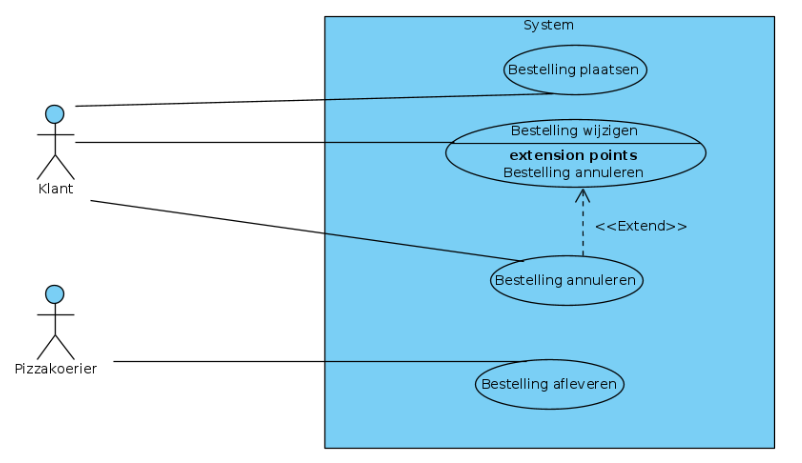

### UML: klassendiagram

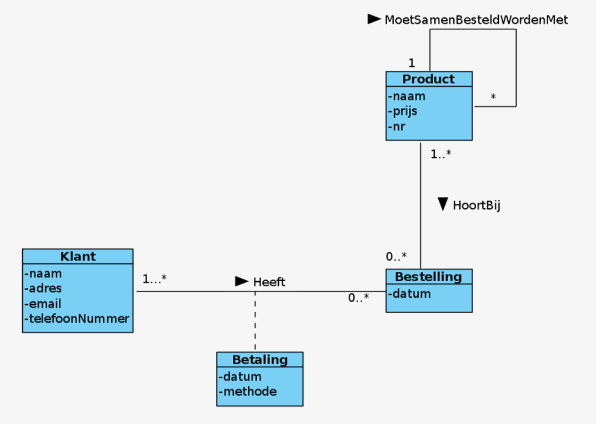

### UML: sequentiediagram

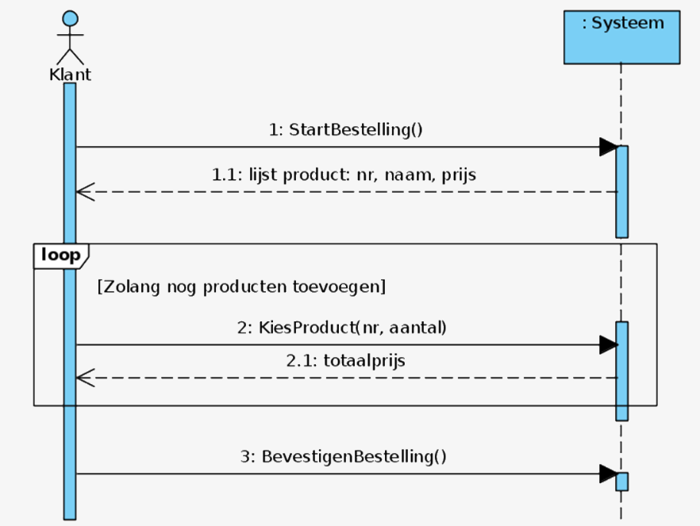

# Behoeftenanalyse

## Functioneel vs Niet-functioneel
### Functionele vereisten(Functional requirements)

- Mapt de inputs van het programma op de outputs
- Beschrijft dus wat het systeem moet kunnen

### Niet-functionele vereisten (Non-functional requirements)

Betreft alle andere beperkingen/vereisten
- Het systeem moet snel werken
- Het systeem moet mooi zijn
- Het systeem moet 99% van de tijd werken
- Het systeem zal geen persoonlijke informatie vrijgeven
- ..

## Analyse - algemeen verloop

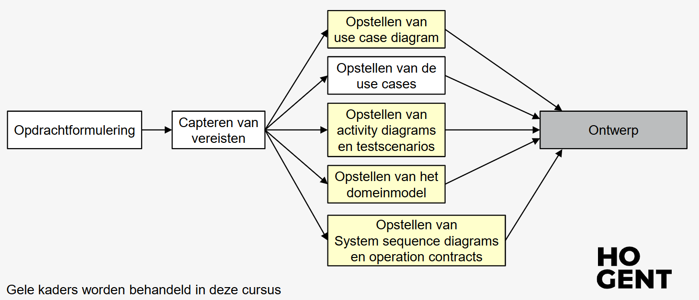

## Use Cases

### Use cases: definitie

Een use case omvat alle manieren waarop het *systeem* gebruikt kan worden om een *bepaald doel* voor een *bepaalde gebruiker* te behalen. Een complete set van use cases zoals weergegeven in het use case diagram geeft je alle zinvolle manieren om het systeem te gebruiken en illustreert de waarde die dit zal opleveren.

Opgelet: een use case definieert *niet hoe* het systeem het implementeert

### Verschillende soorten actors

- Primary actor
- Supporting actor
- Stakeholder
- Doel

### Usecase: Template

Usecase: naam

Primaryactor
Stakeholder(s)

Precondities
Postcondities

Normaal verloop
Alternatieve verlopen

Domeinregels
# Gebruik visual paradigm

https://chamilo.hogent.be/index.php?go=CourseViewer&application=Chamilo%5CApplication%5CWeblcms&course=62361&tool=Document&publication_category=336613&browser=Table&tool_action=Viewer&publication=2379871