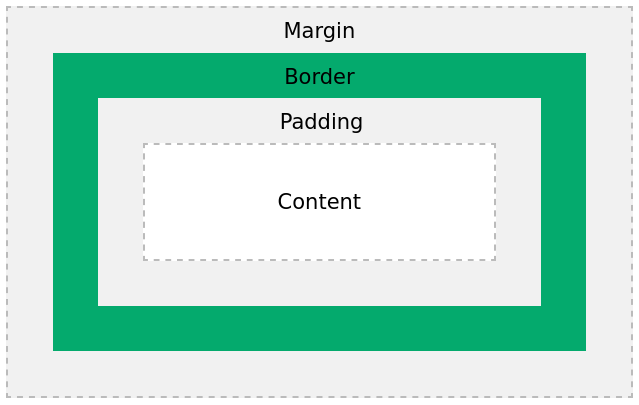
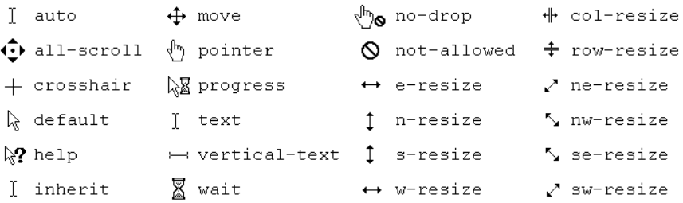

# Block vs Inline Elementen

### Block elementen:

```html
<div>Dit is een block element</div>
<p>Dit ook</p>
```

Kenmerken:

- Nemen volledige breedte in
- Beginnen op nieuwe regel
- Hoogte wordt bepaald door inhoud
- Voorbeelden: `<div>`, `<p>`, `<h1>`, `<article>`

### Inline elementen:

```html
<span>Dit is inline</span> <a href="#">Dit ook</a>
```

Kenmerken:

- Nemen alleen benodigde ruimte in
- Staan op dezelfde regel
- Voorbeelden: `<span>`, `<a>`, `<strong>`, ``

# Display en Visibility Properties

De display eigenschap is het meest belangrijke CSS element om controle te hebben over de layout.

```css
/* Display mogelijkheden */
.element {
    display: block;       /* Als block element */
    display: inline;      /* Als inline element */
    display: inline-block; /* Combinatie */
    display: none;        /* Element verbergen */
}

/* Visibility */
.element {
    visibility: hidden;   /* Onzichtbaar maar neemt ruimte in */
    visibility: visible;  /* Zichtbaar */
}
```

- De default breedte van een element wordt bepaald door de display property
- *block* : de box **neemt de volledige horizontale ruimte in voorzien door de parent**.
- *inline* en *inline-block* : **neemt de breedte van de inhoud in**.

 # CSS Box model

**In CSS, de term "box model" is gebruikt als er gepraat wordt over design en layout.**

De CSS box model is een box dat rond elk HTML element zit. Het bevat: *content, padding, borders and margins*. 
Onderstaande afbeelding illustreert het box model.

- **Content** - De inhoud van de box, waar de text en afbeeldingen zich bevinden
- **Padding** - Een ruimte rond de content. De padding is doorzichtig.
- **Border** - Een kader (border) komt rond de padding en de content.
- **Margin** - Maakt een ruimte buiten de border. Deze is ook  transparant.

## Voorbeeld
```css
div {  width: 300px;  
  border: 15px solid green;  
  padding: 50px;  
  margin: 20px;}
```

## Developer tools

Als je twijfelt over de afmetingen van een element dan is het een zeer goed idee om via Developer Tools > Elements de afmetingen af te lezen.

## Height & width

- Je kan enkel een width en height instellen voor block en inline-block elementen! Je kan geen width/height instellen voor inline elementen. Deze nemen steeds de breedte en hoogte in van de inhoud!!

- De value van de width en de height property kan onder andere uitgedrukt worden in:
	- *CSS pixels (absolute lengte eenheid)*: **px**
	- *percent - relatieve waarde tov van de parent container*: **%**
	- **em** – *relatieve waarde tov de grootte van het gebruikte lettertype.* (1em = breedte van de M in de gekozen font).
	- **rem** - *relatieve waarde tov de grootte van het gebruikte lettertype van het root element*.

## Padding
- **Elke waarde afzonderlijk**
```css
p{
	padding-top: 10px;
	padding-right: 25px;
	padding-bottom: 10px;
	padding-left: 5px;
}
```

- **Verkorte notatie** (shorthand notation) (Top Right Bottom Left)
```css
p{
padding: 10px 25px 10px 5px;
}
```

## Margin

- **Collapsing Margins**: top margin van een ander element raakt, is het *resultaat NIET de som, maar de grootste margin*.
	- voor aangrenzende verticale blokelementen in de normale flow, wordt de grootste marge behouden. *De kleinste marge zal dichtklappen (wordt 0)*

- Je kan ook een negatieve waarde als margin instellen.
- Een negatieve waarde vermindert de afstand. Deze eigenschap is bruikbaar om overlappende blokken te maken.

### Horizontaal centreren
```css
div {
	width: 80%;
		/* top en bottom krijgen waarde 0, left en right krijgen de waarde auto. 
		Hierdoor wordt het div-element gecentreerd binnen het ouderelement */
	margin: 0 auto;
}
```
### Verticaal centreren
- Is *niet mogelijk met margin-top*: auto en margin-bottom: auto
- Oplossingen: zie later bij **Grid** en **Flexbox**.

## Border

### Border
- Van een border kunnen we 3 waarden instellen : de breedte, kleur en stijl
	- **border-width** (px, %, em, rem, thin, medium, thick)
	- **border-style** (none/hidden/dotted/dashed/solid/double/…)
	- **border-color** (een kleurwaarde of transparent)

- Men kan ook de drie eigenschappen combineren in een *shorthand*:
	- **border**: *1px solid #000;* (volgorde van de waarden is niet belangrijk): dit is een zwarte solid border van 1px.

- Bij een transparante rand zie je de achtergrondkleur van het element

### Border radius

-  *Longhand properties*
	- border-top-left-radius
	- border-top-right-radius
	- border-bottom-right-radius
	- border-bottom-left-radius


- *Shorthand property*
	- border-radius


## Box-sizing

- box-sizing (*default waarde*): **content-box**;
	- De ingestelde *width en height hebben enkel betrekking op de content*.

- box-sizing: **border-box**;
	- De ingestelde *width en height hebben betrekking op de content + de padding + de border*.

### Best practice
- Het is een best practice om steeds voor alle elementen box-sizing in te stellen op border-box. Dit kan bijvoorbeeld als volgt:
```css
html {
	box-sizing: border-box;
}

*, ::before, ::after {
	box-sizing: inherit;
}
```
## Box-shadow

- Voegt een schaduw toe aan `<div>` elements:

	- Horizontale offset
	- Verticale offset
	- Blur afstand
	- Spread van schaduw
	- Kleur

```css
#example1 {  box-shadow: 5px 10px;}  
  
#example2 {  box-shadow: 5px 10px #888888;}
```


# Text shadow

De `text-shadow` eigenschap voegt een schaduw toe aan text.

```css
h1 {  text-shadow: 2px 2px #ff0000;}
```

# Writing mode

De `writing-mode` eigenschap specifeert of een text horizontaal of verticaal is.

```css
p.test1 {  writing-mode: horizontal-tb;}  /*(horizontal top-to-bottom)*/
  
p.test2 {  writing-mode: vertical-rl;}  /*(vertical left-to-right)*/
  
span.test2 {  writing-mode: vertical-rl;} /*(vertical right-to-left)*/
```

# Direction

- Stelt de richting in bij text, tabel kolommen (meestal gebruikt bij talen zoals Japans of Aabisch)
- `ltr` is de default.

```css
blockquote {
  direction: rtl;
  width: 300px;
}
```


# Logical an Physical Properties

In traditionele CSS gebruiken we termen als 'width', 'height', 'left' en 'right'. Dit werkt prima voor talen die van links naar rechts en van boven naar beneden geschreven worden (zoals Nederlands). Maar niet alle talen werken zo!

Daarom zijn er twee nieuwe manieren om afmetingen aan te geven:

1. `inline-size` (vervangt 'width' in horizontale tekst)
2. `block-size` (vervangt 'height' in horizontale tekst)

Een simpel voorbeeld:

```css
/* Oude manier */
.box {
    width: 100px;
    padding-left: 20px;
}

/* Nieuwe logische manier */
.box {
    inline-size: 100px;
    padding-inline-start: 20px;
}
```

Het voordeel? Als iemand je website in een andere schrijfrichting bekijkt (bijvoorbeeld van boven naar beneden, zoals in het Japans), past alles zich automatisch aan. De 'start' van de tekst blijft de 'start', ongeacht de schrijfrichting.

| Physical Property | Logical Property |
|-----------------|-----------------|
| width | inline-size |
| height | block-size |
| margin-top | margin-block-start |
| margin-bottom | margin-block-end |
| margin-top + margin-bottom | margin-block |
| margin-left | margin-inline-start |
| margin-right | margin-inline-end |
| margin-left + margin-right | margin-inline |
| text-align: left | text-align: start |
| text-align: right | text-align: end |
| border-top | border-block-start |
| border-bottom | border-block-end |
| border-top + border-bottom | border-block |
| border-left | border-inline-start |
| border-right | border-inline-end |
| border-left + border-right | border-inline |

# Cursor stijl

Bepaald de stijl van de cursor bij het element.



### Voorbeeld
```css
h1 {
	cursor: move;
}
```