# Lay out

## De normale flow

De normale flow (*position: static*) van een pagina **stapelt alle block elementen op elkaar**. **Elk block element begint op een nieuwe lijn**. Zelfs als de breedte van een element wordt aangepast (verminderd) zal een onderliggend element niet deze ruimte innemen, tenzij men ingrijpt in de normale flow.

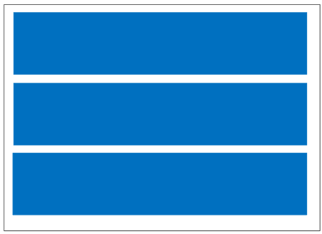

- *Om de normal flow te doorbreken heeft men de volgende mogelijkheden*:
	- **flexbox** *lay-out*: flex
	- **grid** *lay-out*: volgende les
	- **float** *lay-out*: float : volgende les
	- **relatieve** *positionering* : volgende les
	- **absolute** *positionering* : volgende les
	- **fixed** *positionering* : volgende les

## CSS Flex Layout

- Flexbox staat voor *Flexible Box*. Met deze lay-outmodule voor CSS kan je adaptieve ontwerpen (responsive design) maken. Al naargelang de grootte van het scherm en de richting (horizontaal, vertikaal) ervan, worden website-elementen automatisch:
	1. gerangschikt;
	2. een hoogte en een breedte toegekend;


## Flexible Box layout VS Grid Layout

- In tegenstelling tot ‘Flexible Box layout’ (kort **Flexbox** of flex), *dat een eendimensioneel lay-outsysteem is*, is ‘Grid Layout’ (kort **Grid**) *een tweedimensioneel lay-outsysteem*
- Grid en flex kunnen samen gebruikt worden om complexe lay-outs te maken

# Flexbox

## Inleiding

-  Flexbox is een **één dimensionele manier in CSS om delen van je webpagina eenvoudig te lay-outen in rijen en/of kolommen**
- Lost **moeilijkheden zoals verticaal centreren in “gewone CSS” op**.
- **Basisidee: elementen positioneren langs assen**.
	- Er is een *main axis* en een *cross axis*.
	- We spreken niet meer van links en rechts of van horizontaal en verticaal.
	- De main axis loopt default horizontaal van links naar rechts en de cross axis verticaal van boven naar onder

## Visuele voorstelling van de flexbox eigenschappen

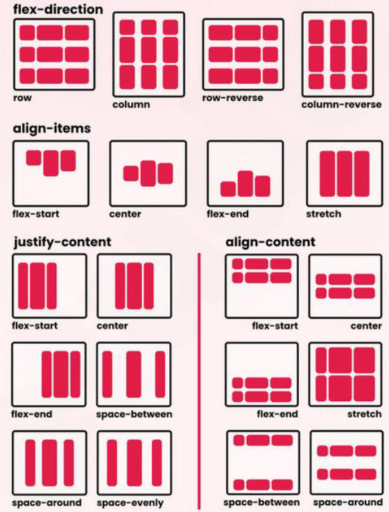

# Flex container

## Inleiding

- **Er is steeds een omvattende container.**

- De **rechtstreekse children** van deze omvattende container zullen op flexibele wijze getoond zullen worden:
	- *flex items*
	
- **CSS property om van de omvattende container een flexbox te maken** is: 
	- display: *block flex*;
	- display: *inline flex*;
	
- **De eerste waarde bepaalt het outer display type**, de omvattende container is dus een *block of een inline element*

- **De tweede waarde zorgt ervoor dat de rechtstreekse children flex-items worden**. Deze volgen niet meer de standaard lay-out.

- Vroeger was het voldoende 1 waarde mee te geven, dit zal je zeker nog tegenkomen in bestaande sites
	- *display: flex; = display: block flex;*
	- *display: inline-flex; = display: inline flex;*

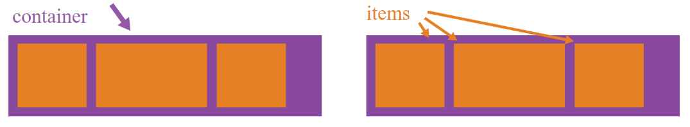

## Normal vs (block) flex

```css
/*nieuwe schrijfwijze*/
div {
	display: block flex;
}

/*oude schrijfwijze:*/
div {
	display: flex;
}
```

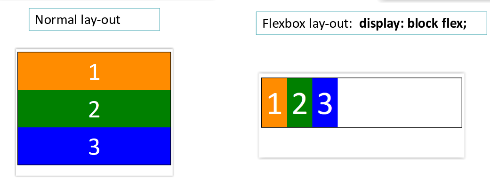

## Axis

- Flex containers hebben een **main axis** en een **cross axis**
	- Standaard gaat de *main axis van links naar rechts* en de *cross axis van boven naar onder*
	- *Wordt aangepast met flex-direction property*

- De **container wordt opgevuld langs de main axis**.

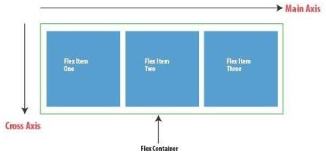

## Eigenschappen
### Flex direction

- De richting van de main axis kan gewijzigd worden door de flex-direction:
#### flex-direction: row; (default value)

#### flex-direction: column;

#### flex-direction: row-reverse;

#### flex-direction: column-reverse;


```css
div {
	display: block flex;  
	flex-direction: row-reverse;
}
```
### Flex Gap

- **Witruimte tussen kolommen en rijen**, genoemd ‘Gutters’, creëer je met *column-gap* en *row-gap* of de shorthand *gap*

- Als gap **2 waarden** heeft, is de *eerste voor row-gap*, de *tweede voor column-gap*

 - Mogelijke waarden:
	 - length (px, em, rem, …)
	 - percentages

```css
#flex-container {
  border: 1px solid black;
  background-color: rgb(255, 230, 251);
  display: block flex;
  flex-wrap: wrap;
  row-gap: 70px;
}
```

### Flex wrap

- Indien de container de **flex-items niet meer langs de main-axis kan plaatsen (te weinig ruimte)** vallen de flex-items standaard buiten de flex container.

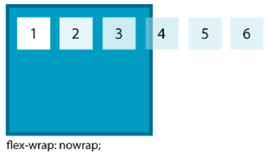

- Kan gewijzigd worden met flex-wrap
	- flex-wrap: nowrap; (default value)
	- flex-wrap: wrap;
	- flex-wrap: wrap-reverse;

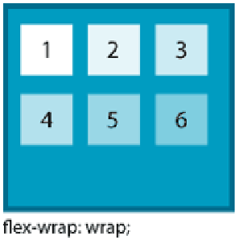

```css
div {
	display: flex;    
	flex-wrap: wrap;
}
```


## Uitlijnen
### Inleiding

- **langs de main-axis**: *justify-content*
- **langs de cross-axis**: *align-items*

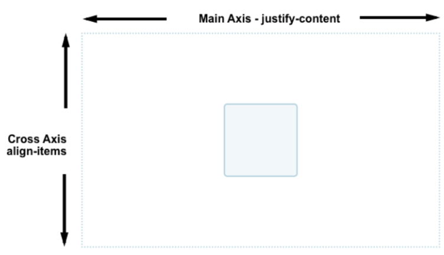

### justify-content
- Items positioneren langs main axis

####  justify-content: flex-start; (default)
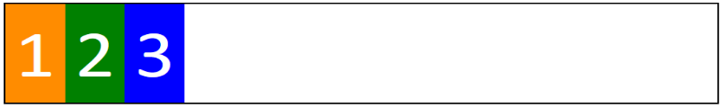
#### justify-content: flex-end;
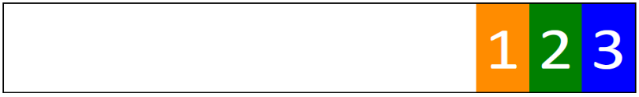
#### justify-content: center;

#### justify-content: space-around; 
- Rond elk item evenveel witruimte
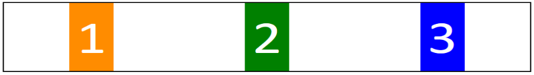
#### justify-content: space-between;
- Tussen elk item evenveel witruimte
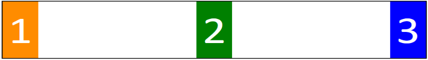
#### justify-content: space-evenly;
- Voor, na en tussen elk item evenveel witruimte
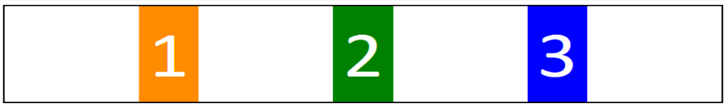
### align-items
- Items positioneren langs cross axis
#### align-items: stretch; (default)
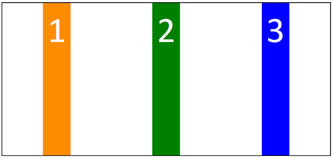
#### align-items: flex-start;
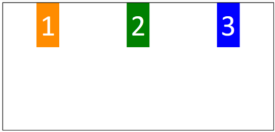
#### align-items: flex-end;
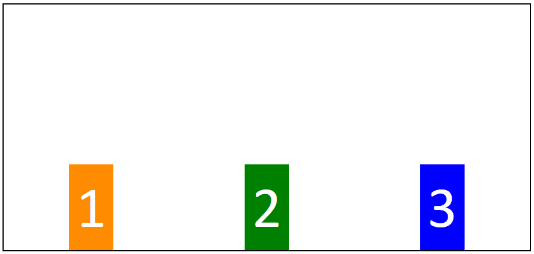
#### align-items: center;

#### align-items: baseline;
- aligneert items volgens “onderkant” tekst.
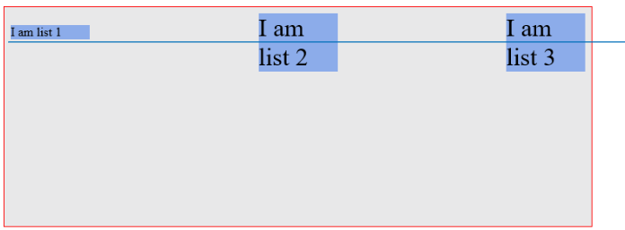
### align-content
- **Distributie van de flex lijnen langs de cross-axis** met align-content. *Deze eigenschap heeft geen effect op single-line containers*.

#### align-content: flex-start;
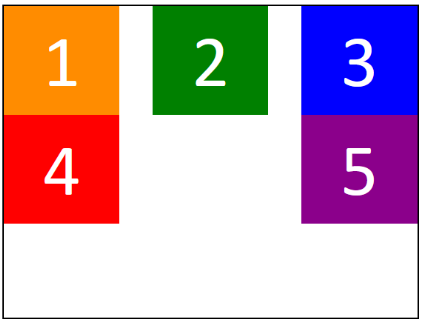
#### align-content: flex-end;
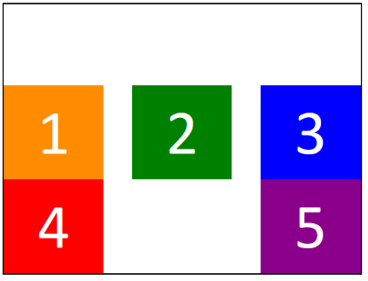
#### align-content: center;
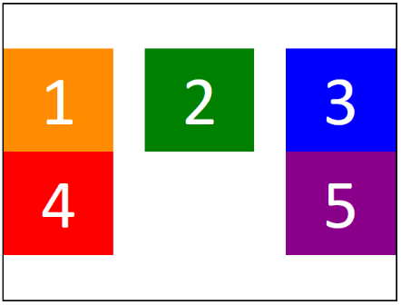
#### align-content: stretch;
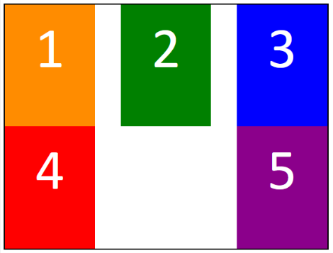

# Flex items

## Order
- **Volgorde waarin de items getoond worden wijzigen**, zonder HTML aan te passen
	- Standaardwaarde is 0
	- Items worden geordend van klein naar groot.

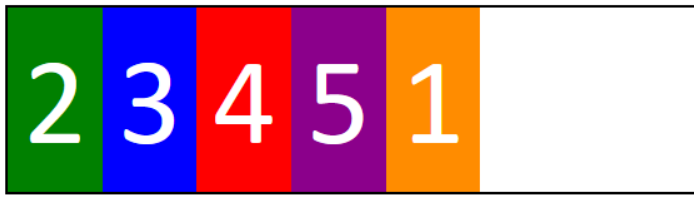

```html
<div class="flex-container">
  <div class="item1">1</div>
  <div class="item2">2</div>
  <div class="item3">3</div>
  <div class="item4">4</div>
</div>
```

```css
.flex-container {
  display: flex;
}

.item1 { order: 5; }
.item2 { order: 1; }
.item3 { order: 2; }
.item4 { order: 3; }
.item5 { order: 4; }
```

## flex-grow en flex-shrink

- bepalen **hoeveel een item mag groeien/verkleinen als er extra plaats is in de container**

- Waarde: getal
	- 0: niet groeien
	- positief: groei in verhouding met andere items

### grow

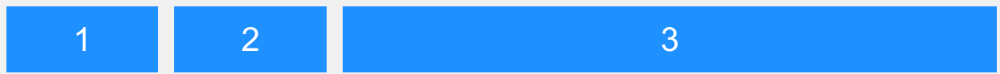

```html
<div class="flex-container"> 
  <div class="item1">1</div> 
  <div class="item2">2</div> 
  <div class="item3">3</div>
</div>
```

```css
.flex-container {
	display: flex; 
}

.item1 {flex-grow: 1; }
.item2 { flex-grow: 1; }
.item3 { flex-grow: 8; }
```

### shrink
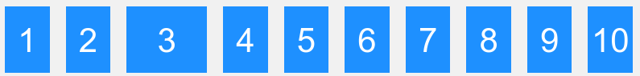

```html
<div class="flex-container">
  <div>1</div>
  <div>2</div>
  <div class="item3">3</div>
  <div>4</div>
  <div>5</div>
  <div>6</div>
  <div>7</div>
  <div>8</div>
  <div>9</div>
  <div>10</div>
</div>
```

```css
.flex-container {
  display: flex;
}

.item3 {
  flex-shrink: 0;
}
```

## flex-basis

- flex-basis **bepaalt de initiële grootte van een item voordat flex-grow en flex-shrink worden toegepast**.

- Als waarde op auto (initiële waarde) staat
	- Witdh wordt gebruikt bij horizontale tekst mode
	- Heigth bij verticale tekst mode

- merk op: de *flex-basis heeft voorrang op de ingestelde width voor het item*.

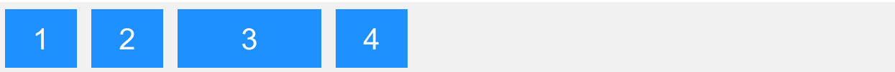

```html
<div class="flex-container">
  <div>1</div>
  <div>2</div>
  <div class="item3">3</div>
  <div>4</div>
</div>
```

```css
.flex-container {
  display: flex;
}

.flex-container div:nth-child(3) {
  flex-basis: 200px;
}
```

## flex shorthand

- De flex property laat je toe flex-grow, flex-shrink en flex-basis in een keer te definiëren

**zonder shorthand**
```css
flex-grow: 2;
flex-shrink: 1; flex: 2 1 50em;
flex-basis: 50em;
```

**met shorthand**
```css
flex: 2 1 50em;
```


## absolute flex en relative flex
### absolute flex

- flex-basis krijgt expliciet een waarde 0

- `flex: 1 1 0` vaak wordt gebruikt als je precies gelijke kolommen wilt, ongeacht de inhoud. Het is perfect voor layouts waar je wilt dat alle kolommen dezelfde breedte hebben.
#### voorbeeld:
- flex: 1 1 0;
- flex-items kunnen groeien (waarde 1) & kunnen krimpen (waarde 1)
- startpunt: elk flex-item neemt geen ruimte in (flex-basis:0), dus alle ruimte in de flex-container is vrije ruimte die kan worden verdeeld
-  als resultaat zijn je flex-items even breed


### relative flex

#### flex-basis wordt ingesteld op **content**
- flex: 1 1 content;
	- flex-items kunnen groeien & kunnen krimpen
	- startpunt: ingenomen ruimte wordt eerst bepaald door de max-content van de flex-items

#### flex-basis wordt ingesteld op **auto** (initial value)
- flex: 1 1 auto;
	- flex-items kunnen groeien & kunnen krimpen
	- startpunt: ingenomen ruimte wordt eerst automatisch bepaald door de oorspronkelijke grootte van de flex items, i.e.
		- waarde van width indien width werd ingesteld op de flex-items
		- max-content indien niet expliciet een width werd ingesteld
			- in dit geval is dit hetzelfde als flex-basis content

### Voorbeeld

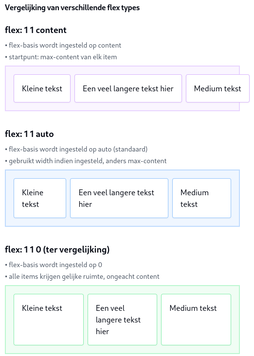

## margin: auto;

margin: auto **instellen op een item zal vrije ruimte“verplaatsen”.**


### Rechtermarge instellen
- zorgt dat daar de vrije ruimte geplaatst wordt.

```css
li:nth-child(1){
	margin-inline-end: auto;
}
```


### Beide margins instellen
- zorgt dat de vrije ruimte langs beide kanten verspreid wordt

```css
li:nth-child(1){
	margin-inline-end: auto;
	margin-inline-start: auto;
}
```


