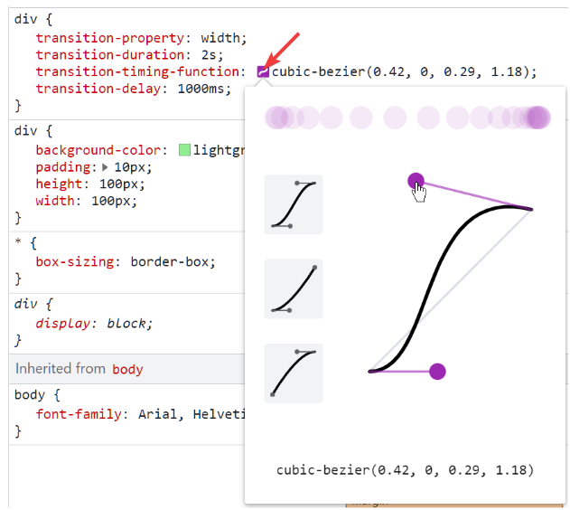
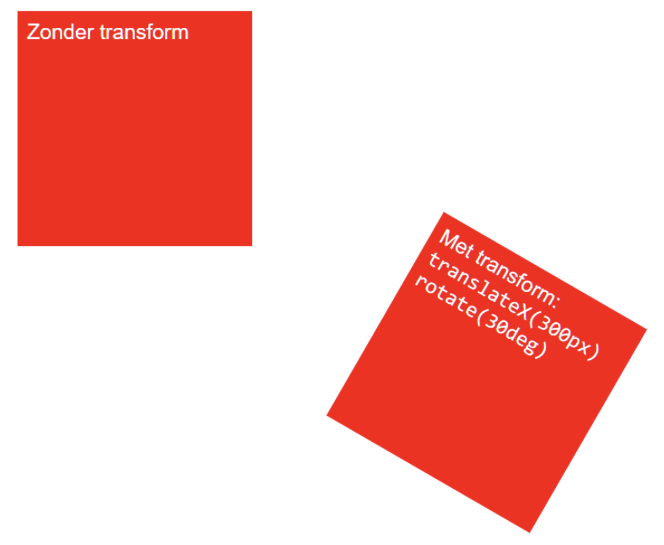
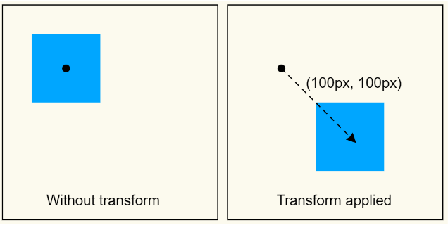
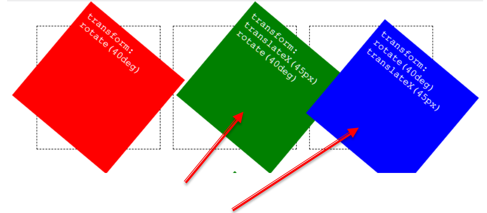
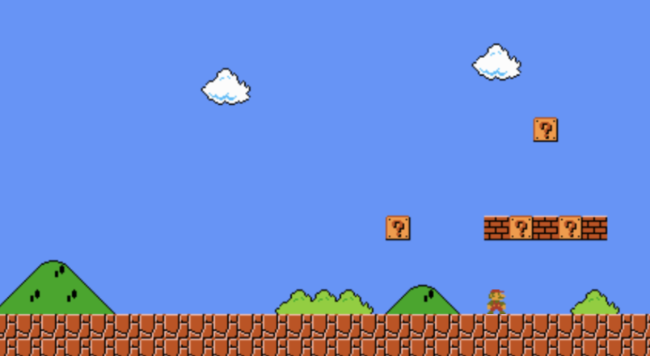

# CSS Transistions

Met een CSS transition kan je ervoor zorgen dat als de waarde van een CSS property wijzigt, de overgang van de oude naar de nieuwe waarde geleidelijk verloopt over een zekere tijdsperiode. De browser zal hierbij automatisch de tussenliggende beelden (frames) tekenen en zo een animatie creëren.

# CSS transistions properties

De CSS properties die je kan instellen voor een transition (overgang), met hun beginwaarden, zijn:

- transition-property : all;
- transition-duration: 0s;
- transition-timing-function: ease;
- transition-delay: 0s;


```css
div {
	...
	width: 100px;
	background-color: lightgreen;
}

/* CSS transition */
div {
	transition-property: width;
	transition-duration: 2s;
	transition-timing-function: linear;
	transition-delay: 1000ms;
}

div:hover {
	width: 300px;
	background-color: lightpink;
}
```

## transition-property

- Bij het instellen van een transition op een element kan je via deze property instellen voor welke CSS property(ies) er een transitie-effect moet toegepast worden.

- De beginwaarde voor deze property is all, zodat er standaard een transitie-effect toegepast wordt op alle CSS properties.

```css
transition-property: width;
```
## transition-duration

- Deze property definieert de duur van de transitie uitgedrukt in milliseconden of seconden, m.a.w hoe lang het duurt om de overgang van de oude naar de nieuwe waarde te maken.

- De transition-duration is standaard 0 seconden wat betekent dat de transitie onmiddellijk gebeurt en er geen animatie is. Bijgevolg moeten we minstens de transition-duration instellen om de transitie te zien. Het is tevens ‘best practice’ om ook de transition-property property in te stellen.

```css
transition-duration: 2s;
```

## transition-timing-function

https://developer.mozilla.org/en-US/docs/Web/CSS/easing-function

- Bij animaties is het belangrijk om de snelheid waarmee een waarde wijzigt te kunnen controleren. Bijvoorbeeld traag in het begin en geleidelijk sneller. Zo kunnen we een meer natuurlijke beweging creëren. Hiervoor dient de transition-timing-function property. De waarde voor deze property is een \<easing-function\> die de versnellingscurve definieert.

- De standaardwaarde is ease en definieert een meer natuurlijke beweging dan de waarde linear. Om verschillende waarden met elkaar te vergelijken kan je gebruik maken van Example Easing function comparison op [MDN](https://developer.mozilla.org/en-US/docs/Web/CSS/easing-function).

```css
transition-timing-function: linear;
```

### cubic-bezier

- Meer geavanceerde timing functions kunnen gemaakt worden aan de hand van een cubic-bezier function

```css
transition-timing-function: cubic-bezier(0.99, 0.21, 0, 0.85);
```

- Je kan een cubic-bezier function visualiseren en eventueel aanpassen met de Chrome of Firefox Dev Tools (zie schermafbeelding op de volgende dia en onderstaande procedure)
	1. Stel een waarde voor de transition-timing-function in, zoals ease. 
	2. Open de Chrome Dev Tools en selecteer het element met de transition.
	3. Klik op het icoontje bij de transition-timing-function om de cubic bezier editor te openen.
	4. Kies een andere waarde of gebruik de hendels om de curve aan te passen



## transition-delay

- Bepaalt **hoe lang er moet gewacht worden met het starten van het transitie-effect nadat de waarde van een property gewijzigd is**.
- De standaardwaarde is 0s en betekent dat het transitie-effect onmiddellijk start nadat de property gewijzigd is.

```css
transition-delay: 800ms;
```

## Meerdere transities instellen

- Als we meerdere CSS properties wijzigen dan kunnen we voor elke CSS property apart de transition properties instellen. Standaard zullen alle transities dezelfde waarden gebruiken.

```css
div {
	transition-property: opacity, height;
	transition-duration: 3s, 5s;
}
```

## Transition op de element en element:hover selector

- **`transition` op `element`**: De overgang wordt toegepast bij zowel het **binnengaan** als het **verlaten** van het element.
- **`transition` op `element:hover`**: De overgang wordt **alleen toegepast bij het binnengaan** van het element, en het element keert meteen terug naar de begintoestand zonder overgang bij het verlaten.
- **Verschillende overgangseigenschappen**: Je kunt verschillende overgangseigenschappen instellen voor het **binnengaan** en het **verlaten** van het element, door deze respectievelijk in de `element:hover` en de gewone `element` selector te plaatsen.

```css
/* Voorwaartse en achterwaartse overgang voor het hele element */
div {
  transition: background-color 0.5s ease;
}

div:hover {
  background-color: red;
}
```

```css
/* Alleen voorwaartse overgang bij hover */
div:hover {
  transition: background-color 0.5s ease;
  background-color: red;
}
```

```css
/* Voorwaartse transitie op hover (element:hover) */
div:hover {
  transition: background-color 0.5s ease;
  background-color: red;
}

/* Achterwaartse transitie op het element zelf (element) */
div {
  transition: background-color 1s ease-out;
}
```

## opmerking

Om waarden te wijzigen zonder gebruik te maken van JavaScript hebben we tot nu toe steeds *:hover* gebruikt, maar je kan hiervoor ook andere pseudo classes gebruiken zoals *:focus* en *:checked* (zie Les 9: Oefening Hamburger menu)

# CSS 2D transformatie

Met de transform property kan je een element **schalen** (*scale*), **roteren** (*rotate*), **scheef maken** (*skew*) en **verplaatsen** (*translate*).

```css
/* Het tweede div-element 300px naar
rechts verschuiven en 30 graden roteren. */
div:nth-of-type(2) {
	transform: translateX(300px) rotate(30deg);
}
```


## transform
-  De mogelijke waarden zijn:
	- none ( is de initiële waarde en betekent dat er geen transformatie is).
	- één of meerdere van de CSS transform functions.

-  Transform werkt standaard niet bij inline-elementen zoals het a-element of het span-element, maar wel bij een img-element. (Technisch: transform werkt niet bij ‘atomic inline elements’)

```css
 transform: rotate(20deg) translateX(50px);
```

 ## transform-origin:
◦ Stelt de oorsprong in. De initiële waarde is transform-origin: center center; (wat overeenkomt met transform-origin: 50% 50%;) m.a.w. de oorsprong ligt standaard in het middelpunt van het element.

```css
transform-origin: 0% 0%; /* x-offset y-offset */
```

## Enkele 2D transformatie functies

| 2D Transform Function | Beschrijving                              | Voorbeeld                     |
|-----------------------|-------------------------------------------|-------------------------------|
| `rotate()`            | Roteren                                   | `transform: rotate(45deg);`    |
| `scale()`             | Schalen                                   | `transform: scale(1.2);`       |
| `translateX()`        | Verplaatsen in de X-richting              | `transform: translateX(50%);`  |
| `translateY()`        | Verplaatsen in de Y-richting              | `transform: translateY(200px);`|
| `translate()`         | Verplaatsen in de X- en Y-richting        | `transform: translate(100px,200px);` |
| `skew()`              | Scheef maken                              | `transform: skew(10deg, 10deg);` |

## translate()

Verplaatst het element 100 pixels in de X- en de Y-richting. De X-richting is horizontaal naar rechts en de Y-richting is verticaal naar beneden.





- Merk op dat `transform: translateX(45px) rotate(40deg);` niet hetzelfde is als `transform: rotate(40deg) translateX(45px);`



## CSS 3D transformatie

We beperken ons in deze cursus tot 2D transformaties, maar er zijn ook 3D transformaties mogelijk. Voor wie meer info wenst over 3D transform zie:
https://3dtransforms.desandro.com/

# CSS-animations

- Bij een CSS transition konden we enkel een begin- en eindtoestand opgeven. Bij CSS animations zullen we meer toestanden zgn. keyframes kunnen opgeven en we zullen bijvoorbeeld ook de animatie een aantal keren kunnen herhalen.

 - In animatie-terminologie is een keyframe, een frame waar je veranderingen in de animatie definieert.

 - Een CSS animation kan automatisch starten bij het laden van de webpagina. Dit is zelfs de default. Je kan ze ook starten via JavaScript of met behulp van :hover.

## Stappen

1. STAP 1 (definiëren animatie)
	- Definieer de animatie door middel van keyframes.
		`@keyframes` at-rule
	- De browser zal bij het afspelen van de animatie de tussenliggende waarden tussen de opeenvolgende keyframes automatisch genereren.

2. STAP 2 (afspelen van de animatie op een bepaald element)
	- properties `animation-name`, `animation-duration`, `animation-timing-function`, … . shorthand property `animation`

```css
div {
animation-name: my-animation;
animation-duration: 2s;
}
@keyframes my-animation {
0% {transform: translate(0,0);}
50% {transform: translate(100px, 0);}
100% {transform: translate(100px, 100px);}
}
```

## animation

- Het @keyframe statement.
- De shorthand property animation:
- De 8 long hand properties met hun beginwaarden:
	- **animation-name: none;**
	- **animation-duration: 0s;**
	- **animation-delay: 0s;**
	- **animation-fill-mode: none;**
	- **animation-iteration-count: 1;**
	- **animation-timing-function: ease;**
	- **animation-direction: normal;**
	- **animation-play-state: running;**

## animation-name

- De naam van de @keyframes animation die moet afgespeeld worden.

## animation-duration

- De lengte van de animatie.
- Analoog als bij transition-duration kan je hier waarden opgeven zoals 1s voor 1 seconde of 300ms voor driehonderd milliseconden.

## animation-delay

- Is vergelijkbaar met transition-delay. We kunnen deze property gebruiken om een wachttijd op te geven vooraleer de animatie start. Dit is vooral nuttig in situaties waarbij er verschillende animaties tegelijkertijd worden afgespeeld.

 - Als de animatie een aantal keren herhaald wordt, wordt de wachttijd niet bij elke herhaling toegepast, maar enkel bij de start van de animatie (om de animatie te pauzeren zie het @keyframes voorbeeld verderop)

```css
animation-delay: 2s;
```


## animation-iteration-count

- Aantal keren dat de animatie afgespeeld wordt. Standaard wordt ze één keer afgespeeld. Je kan als waarde een getal opgeven of de waarde infinite, als je de animatie continu wilt afspelen.

```css
animation-iteration-count: 3;
animation-iteration-count: infinite;
```


## animation-direction

- Met deze property controleer je de richting van de animatie.
- CSS animations beginnen normaal bij 0% en eindigen bij 100%.
- De mogelijke waarden voor animation-direction zijn: 
	- *normal* (initial value), *reverse*, *alternate*, *alternate-reverse*
- Bij alternate speelt de animatie van 0% naar 100% bij de eerste iteratie en bij de tweede terug naar 0%, enz.

```css
animation-direction: alternate;
```

## animation-play-state

- Met deze property kan je een animatie pauzeren of hervatten.
- De default is running

```css
div:hover {
	animation-play-state: paused;
}
```

## animation-timing-function

- Bij een CSS animation kan je bij elk keyframe een timing function opgeven (in het @keyframes statement) en je kan hiervoor dezelfde waarden gebruiken als bij de transition-timing-function.

- Ook als je slechts één enkele animation-timing-function opgeeft bij het element, zal de timing function toegepast worden op elk keyframe afzonderlijk en niet op de volledige animatie. 


```css
/*Dit betekent dat in het voorbeeld de animatie snel start dan vertraagt bij 25% om daarna weer te versnellen en terug te vertragen bij 50% en weer te versnellen enz. Het is daarom dat we de timing function voor een animation meestal op linear plaatsen.*/

div {
	...
	animation-timing-function: linear;
}

@keyframes to-right {
	...
	75% {
		...
		animation-timing-function: ease-out;
	}
	...
}
```


## bounce

```css
.bounce {
	animation: 2s my-bounce 2; /* duration name iteration-count */
}

@keyframes my-bounce {
	/* de animatie pauzeert van 0% tot 20% */
	0%, 20% {transform: translateY(0);}
	40% {transform: translateY(-30px);}
	50% {transform: translateY(0);}
	60% {transform: translateY(-15px);}
	/* de animatie pauzeert van 80% tot 100% */
	80%, 100% {transform: translateY(0);}
}
```

## Opmerkingen

- Je kan een animatie ook starten met :hover.

```css
a:hover {
	animation: bounce 400ms;
}
```

-  Gebruik overflow: hidden; om ongewenste schuifbalken bij het afspelen van animaties te verbergen.
- Je kan een volledig element transparant maken met de animatable CSS property opacity.

# Variabelen in CSS

CSS ondersteunt het gebruik van variabelen.

- Hiervoor declareer je een nieuw property wiens naam begint met --:
```css
--primary-color
```

- De waarde van deze variabele kan je opvragen met:
```css
var(--primary-color)
```

- Variabelen declareer je net zoals alle andere properties in een CSS rule:
```css
:root {
--primary-color: rgb(10, 10, 10)
}
```

- De *:root* pseudo-class is een goede plaats om globale variabelen te definiëren.

- Variabelen volgen de regels van de cascade en inheritance.
- Je kan dus ook lokale variabelen declareren:

```css
#container {
--max-width: 800px;
}
```

- Deze variabele is beschikbaar binnen het element met id \#container, en zijn kinderen.

- Variabelen zijn handig voor waarden die vaak herhaald worden:
	- Kleuren 
	- Lettertypes
	- Groottes
	- Parameters van animaties
	- ...

## voorbeeld
https://github.com/svanimpe/css-sprite-sheet-animation

```css
:root {
	/* The size of a block that makes up the world of Mario */
	--block-size: 16px;
	/* How far Mario will walk (in blocks) */
	--steps: 18;
	/* How long it takes to walk a single block */
	--step-time: 0.3s;
	/* How long Mario should wait before starting his walk */
	--delay: 2s;
}
```



