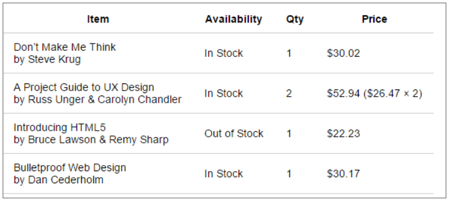

# Webserver - client

Als je een webpagina bezoekt, ga je eigenlijk een *verzoek doen aan een server* (URL = adres van webpagina – https://www.vrt.be/nl/) om een *webpagina naar jouw toestel (laptop – tablet – smartphone) door te sturen*. 

Als deze pagina op de server staat, zal deze naar jouw toestel doorgestuurd worden. Je browser (de client) op je toestel zal deze pagina opbouwen en weergeven.

Surfen op het web maakt dus gebruik van een *client-server architectuur*. Meer details hierover in het OLOD Computer Networks.

Client (webbrowser app) -> server (html server app) -> Client (webbrowser app)

# HTML CSS JAVASCRIPT
De client (browser) begrijpt drie talen:

-  *HTML* – ‘HyperText Markup Language’ is de taal die je gebruikt om je webpagina’s te beschrijven. Met behulp van HTML-codes breng je *structuur en betekenis (semantiek)* aan in je webpagina’s, door middel van headings, tabellen, afbeeldingen, lijsten, … (De HTML-taal voorziet ook in enkele zeer eenvoudige gebruikersinteracties: het aanklikken van verwijzingen, het invullen van tekstvelden, het doorsturen van formulierdata naar de server,…)

- *CSS* – ‘Cascading Style Sheets’ is de taal waarmee je de *opmaak en layout* van je webpagina‘s beschrijft. (Met behulp van CSS zijn eenvoudige gebruikersinteracties mogelijk: bijv. een grotere afbeelding weergeven als je over een miniatuur afbeelding hovert, …) 

- *JavaScript* is een programmeertaal waarmee je *complexe interacties* aan je webpagina‘s kan toevoegen

## HTML

Een HTML-document, HTML-pagina, webpagina of HTML-bestand 

- is een *tekstbestand* met als *bestandsextensie .html*
- is *platform onafhankelijk*
- je kan *webpagina’s maken:*
	 - met behulp van een *eenvoudig tekstbewerkingsprogramma* (text editor) bijv. notepad, brackets, … 
	 - met een *IDE (Integrated Development Environment)* bijv. Visual Studio, WebStorm, … 
	 - met een *WYSIWYG HTML-editor* programma bijv. Adobe Dreamweaver, … 
	
 Voor dit olod gebruiken we Visual Studio Code als text editor.

HTML beschrijft de *structuur* van je HTML document en de *betekenis (semantiek)* van de verschillende onderdelen. 

De drie belangrijkste begrippen zijn: 
- *element*
- *tag*
- *attribute*

### Elements en tags

[HTML Elements (w3schools.com)](https://www.w3schools.com/html/html_elements.asp)

Een *HTML-pagina (webpagina) bevat HTML-elementen*. Een voorbeeld van een veel gebruikt HTML-element is een p-element (paragraph element). 

Merk op dat het *begin en het einde* van het p-element aangeduid worden door middel van een *‘Opening tag’ en een ‘Closing tag’*.

```html
<!-- de volledige lijn code hier onder is een element -->
<openingtag>Content goes here...</closingtag>

```

Voorbeeld van Elementen met Tags:
```html
<!DOCTYPE html>  
<html>  
<body>  
  
<h1>My First Heading</h1>  
<p>My first paragraph.</p>  
  
</body>  
</html>
```
#### void elements

Sommige HTML-elementen hebben *alleen een start-tag en geen end-tag* we noemen ze *void elements*.
Het *Line Break element*   is bijvoorbeeld een void element. 
Met de line break breken we de lijn en gaat de text na de linebreak verder op de volgende lijn.

```html
<br>
<!-- In plaats van <br> schrijft men ook soms <br /> omdat deze syntax compatibel is met XML -->

<!-- voorbeeld: -->
<p> De beste hogeschool in Vlaanderen<br> en kleine omstreken. </p>

```

#### geneste element

Je kan *elementen in andere elementen stoppen*, dit noemen we nesten van elementen. Om het woord very te benadrukken in onderstaande paragraaf, kunnen we het woord in een *strong-element* stoppen. Het strong-element is dan genest in het p-element.
```html
<p>My cat is <strong>very</strong> grumpy.</p>
```

#### block en inline elementen

**Block elements** (\<h1>\<\\h1>,\<p>\<\\p>,....) 
- Een block-level element *start altijd op een nieuwe regel en neemt de volledige beschikbare breedte in* op de webpagina. 

**Inline elements** (\<a>,\,...)
- Een inline element *begint niet op een nieuwe regel en neemt maar zoveel breedte is als nodig*.

#### \<span> en \<div> elementen

Zijn twee HTML-elementen die *geen semantische betekenis* hebben nl.

 **\<div>** is een block element en *een algemene container*. Het wordt veelvuldig gebruikt worden *om elementen te groeperen*. Bijvoorbeeld om ze daarna op te maken met CSS of omdat ze een gemeenschappelijk attribuut, zoals bijv. het lang-attribuut hebben. 
 
  **\<span>** is net als het \<div> *een algemene container, maar is een inline element*. 
  
  Gebruik *\<span> en \<div> enkel als er geen semantisch element voorhanden is*.


### Attributes

Attributen bevatten *extra informatie over een element*. Elementen kunnen geen, één of meerdere attributen hebben.
Een attribuut bestaat uit een *naam en een waarde* en wordt *in de openingstag* geplaatst na de naam van de tag.
De attribuutwaarde wordt toegekend aan de *attribuutnaam* door een *gelijkheidsteken*. De *waarde staat tussen dubbele aanhalingstekens*. (dit mogen ook enkele aanhalingstekens zijn, maar wij zullen steeds dubbele gebruiken)

Syntax: attribute name="attribute value"

```html
<p class="editor note">My cat is very grumpy.</p>
```
In het voorbeeld is class de attribuutnaam en editor-note de attribuutwaarde.


```html
<p class="editor-note">Dit is een voorbeeld van een klasse</p>
<!-- class is een atrribuutnaam en editor-note is de attribuutwaarde, samen is dit een attribuut -->
```


extra: je kan ook zelf attributen aanmaken en inhoud geven (niet te kennen)
```html
<p eigenAttribuut="Ideaal voor een tooltip text">Dit is een voorbeeld van een klasse</p>
```

### Comments (commentaar)

Naast HTML-tags kan je in een webpagina ook commentaar opnemen:
```html
<!-- Dit is commentaar -->
```

Om in Visual studio code commentaar toe te voegen doen we dit met *ctrl + :*

### Soorten elementen

[HTML Element Reference](https://www.w3schools.com/tags/default.asp)

| naam element | openingtag element |
| ------------ | ------------------ |
| Koppen       | \<h1> tot \<h6>    |
| Paragraaf    | \<p>               |
| Hyperlink    | \<a>               |
| Afbeelding   | \             |
#### Koppen en paragrafen

De \<h1> tot \<h6> HTML elementen stellen zes niveaus van section heading voor.
Het \<p> HTML element stelt een paragraaf voor.
```html
<h1>Heading level 1</h1>
<h2>Heading level 2</h2>
<p>
		Dit is een paragraaf text.
		Dit is een paragraaf text.
</p>
```


```html
<p>Dit is een parafgraaf</p>
<!-- <p> is een begin tag -->
<!-- </p> is een eind tags -->
<!-- <br> is ook een tag -->
<!-- <p>Dit is een parafgraaf</p> is een element -->
```

#### Hyperlinks

Met het element \<a> (of het anchor element) kunnen we een hyperlink creëren in een HTML document. Met het *attribuut* **href** kunnen we aangeven naar welke locatie de bezoeker moet gaan wanneer er op de hyperlink geklikt wordt. De inhoud (content) van het element is een indicatie van de bestemming van de link en wordt in browsers standaard onderlijnd weergegeven.

```html
<p>
Bekijk de info op <a href=https://www.hogent.be>HoGent</a> om meer te weten te komen over Hogeschool Gent.
</p>
```

#### Afbeelding

Om een afbeelding toe te voegen aan een webpagina wordt het \element gebruikt. 

Dit element *bevat geen image maar wel een verwijzing naar de image*. Hiervoor dient het **src**-*attribuut*. De waarde van *dit attribuut bevat de locatie van de image*. Dit kan binnen de website zijn, maar het attribuut kan ook verwijzen naar een image op een andere website.

Een *verplicht attribuut* bij \ is **alt**. Dit is een korte beschrijving van de image. Dit is o.a. voor slechtziende gebruikers die door middel van ‘screen reading software’ pagina’s “bekijken”. Deze software zal de waarde van het alt-attribuut voorlezen.

Merk op: het img-element heeft geen content (en dus geen closing tag). *Het is een void-element*

```html

```

#### Lijsten

| openingstag  | naam                           | actie                                                                                           | attributen            |
| ------------ | ------------------------------ | ----------------------------------------------------------------------------------------------- | --------------------- |
| \<ol> \<\ol> | Ordered List                   | lijst met rangschikking                                                                         | start, type, reversed |
| \<ul> \<\ul> | Unordered List                 | lijst zonder rangschikking                                                                      |                       |
| \<li> \<\li> | List item                      | item van een Ordered of Unordered List                                                          |                       |
| \<dl> \<\dl> | Description of Definition List | lijst met beschrijvingen of definities, Kan bijvoorbeeld gebruikt worden om een FAQ te markeren |                       |
| \<dt> \<\dt> | Description Term               | Deel van Description List,de term waarvoor een beschrijving of definitie wordt gegeven          |                       |
| \<dd> \<\dd> | Description Details            | Deel van Decription beschrijving of definitie van de term                                       |                       |

#### Tabel

| openingstag             | naam                         | actie                                             | attributen         |
| ----------------------- | ---------------------------- | ------------------------------------------------- | ------------------ |
| \<table> \<table>       | Tabel                        | tag waarbinnen de tabel zich bevind               |                    |
| \<caption> \<caption>   | Bijschrift                   | Bijschrift boven de tabel                         |                    |
| \<tr> \<tr>             | Tabel rij                    | een rij                                           |                    |
| \<th> \<\th>            | Tabel hoofding               | Kolomnaam                                         |                    |
| \<td> \<\td>            | Tabel data                   | data kolom                                        | colspan<br>rowspan |
| \<thead> \<\thead>      | Het head deel van de tabel   | Deel dat de head van de tabel aflijnt (voor css)  |                    |
| \<tbody> \<\tbody>      | Het body deel van de tabel   | eel dat de body van de tabel aflijnt (voor css)   |                    |
| \<tfoot> \<\tfoot>      | Het footer deel van de tabel | eel dat de footer van de tabel aflijnt (voor css) |                    |
| \<colgroup> \<colgroup> |                              |                                                   |                    |
| \<col> \<col>           |                              |                                                   |                    |
##### Border
**Dubbele rand naar enkele rand**
```css
table { 
  border-collapse: collapse; 
}
```

**moderne opmaak**
```css
table {
  border-collapse: collapse;
  font-size: 14px;
}

table, th, td {
  border-block-end: 1px solid #cecfd5;
  padding: 10px 15px;
}
```

##### Cellen samenvoegen
Toevoegen als *attribuut*:
- **colspan** (rijen samen voegen)
```html
<tr>
	<td colspan="3">Subtotaal</td>
	<td>$135.36$</td>
</tr>
```

- **rowspan** (kolommen samen voegen)
```html
<tr>
	<td rowspan="2">In Stock</td>
	<td>1</td>
	<td>$30.02</td>
</tr>
```

##### Voorbeeld
```html
  <h1>Example lists</h1>
  <h2>Ordered List</h2>
  <h3>Simple example</h3>
  <ol>
    <li>Mix flour, baking powder and sugar.</li>
    <li> In another bowl, mix eggs and milk.</li>
    <li>Stir both mixtures together.</li>
    <li>Fill muffin tray 3/4 full. Bake for 20 minutes.</li>
  </ol>
  <h3>Using Roman Numeral type</h3>
  <ul>
    <li>Introduction</li>
    <li>List of Grievances</li>
    <li>Conclusion</li>
  </ul>
  <h2>Unordered List</h2>
  <ol type="i">
    <li>apples</li>
    <li>oranges</li>
    <li>bananas</li>
  </ol>
  <h2>Description List</h2>
  <h3>Example HTTP response status codes</h3>
  <dl><!-- start defenition list -->
    <dt>200 OK </dt><!-- title van defenition list -->
    <dd>The request has succeeded.</dd> <!-- description van defenition list -->
    <dt>404 Not Found</dt>
    <dd>The server can not find the requested resource. This response code is probably the most famous one due to its
      frequent occurrence on the web.</dd>
    <dt>500 Internal Server Error</dt>
    <dd>The server has encountered a situation it doesn't know how to handle.</dd>
  </dl><!-- einde defenition list -->
  <h2>Nested lists</h2>
  <ol>
    <li>first item</li>
    <li>second item<ul>
        <li>second item first subitem</li>
        <li>second item second subitem</li>
        <li>second item third subitem </li>
      </ul>
    </li>
    <li>third item</li>
  </ol>
```


[Global attributes - HTML: HyperText Markup Language | MDN (mozilla.org)](https://developer.mozilla.org/en-US/docs/Web/HTML/Global_attributes)

Welke attributen je allemaal kan *gebruiken bij een bepaald HTML-element* kan je o.a. *opzoeken op de MDN website*.

Een *aantal attributen kan je bij elk HTML-element gebruiken*. We noemen deze globale attributen. Enkele veel gebruikte *globale attributen* zijn: 
- **class**: specifieert een of meerdere class names voor een element. 
- **id**: definieert een unieke identifier (ID) voor een element. 
- **lang**: stelt de taal in van een element.


#### id attribuut

Het id-attribuut definieert een *unieke identifier (ID) voor een element*.
- id’s zijn *case sensitive* (hoofdlettergevoelig)
- id’s mogen *geen spaties* bevatten

```html
<button id="feedback-button">Feedback</button>
```

#### het lang-attribuut

Via het lang-attribuut *stel je de* **taal** *in van een element*. Dit is niet verplicht maar is handig voor zoekrobotten, screenreaders, … 

Mogelijke waarden zijn *"en"* voor Engels, *"fr"* voor Frans en *"nl"* voor Nederlands.

Best practice: *stel steeds de standaardtaal in* van je webpagina door aan het **html**-*element* een *lang-attribuut* toe te voegen

```html
<html lang="nl">
```

Het is *ook mogelijk* om naast de taal een **regio** te vermelden. Bijvoorbeeld en-GB => Engels zoals gebruikt in Groot-Brittanië.

```html
<p lang="en-GB">This paragraph is defined as British English.</p>
```

### HTML5 Specificatie

In dit OLOD wordt gewerkt met HTML5.

Een overzicht van de verschillende versies van HTML: zie appendix.

De HTML5 specificatie: http://www.w3.org/TR/html5/. Het *World Wide Web Consortium (W3C)* en het *WHATWG* zijn de organisaties die momenteel *verantwoordelijk zijn voor de ontwikkeling van HTML5*.

### Opbouw van HTML5 document

Alle webpagina’s hebben een gelijkaardige opbouw
```html
<!DOCTYPE html>
<html lang="nl">
  <head>
	<meta charset="UTF-8" />
	<title>Hello World</title>
  </head>
  <body>
	<h1>Hello World!!</h1>
	<p>This is a web page.</p>
  </body>
</html>
```

#### \<!DOCTYPE html\>

```html
<!DOCTYPE html>
```
- *is steeds de eerste lijn in je document*
- het is *geen html-tag*, het is een *instructie voor de browser* en geeft aan volgens welke *specificatie de HTML moet worden geïnterpreteerd* door de browser.
- *wijst op HTML versie 5*.
- alhoewel DOCTYPE ook in kleine letters mag geschreven worden *schrijven we het in hoofdletters* om aan te geven dat het geen html-tag is.
- een DOCTYPE is ook nodig als je jouw HTML-code wilt laten controleren op fouten door een Validator (zie verderop)

#### html element

*Na de DOCTYPE-regel volgt het* **html**-*element*. Het html-element *bevat twee elementen* nl. **head** en **body**.
- **head**-*element*: *bevat metadata*, dit is extra informatie over de pagina zoals de gebruikte karakterset, de title van je document, linken naar externe bestanden zoals een css-bestand (zie verderop), … De title wordt weergegeven in je browser tabblad, dit is het enige visuele element van het head-element.
- **body**-*element*: bevat *alle zichtbare content* van onze webpagina


# Emmet

[Cheat Sheet (emmet.io)](https://docs.emmet.io/cheat-sheet/)

Emmet is een krachtige en tijdbesparende tool voor webdevelopers. Het is een plugin die je kunt gebruiken in verschillende code-editors zoals Visual Studio Code, Sublime Text, en Atom. Emmet helpt je om sneller HTML en CSS te schrijven door middel van afkortingen en snippets.

| Emmet abbreviation | Emmet expansion                                          |
| ------------------ | -------------------------------------------------------- |
| !\<tab>            | \<!DOCTYPE html><br>\<html lang="en"><br>...<br>\</html> |
| h1\<tab>           | \<h1>\</h1>                                              |
| i\<tab>            | \<i>\</i>                                                |
| img\<tab>          | \                                     |
| link\<tab>         | \<link rel="stylesheet" href="" />                       |
# CSS

*Cascading Style Sheets* (afgekort CSS) is de technologie voor de *opmaak van je webpagina*.

CSS-code *bestaat uit stijlregels* waarmee we de stijl (bijv. kleur, de lettergrootte, …) en de lay-out (bijv. meerdere kolommen, …) van webpagina’s kunnen vastleggen.

De belangrijkste begrippen in CSS zijn: 
- **selector**
- **style rule** (stijlregel), *declaration*, *property*, *value*


Een aantal begrippen
- **Selector**: duidt aan *welk(e) element(en)* beïnvloed worden door deze stijlregel. Is het ‘target’ in ons HTML document (hier alle h1-elementen).
- **Declaration**: is van *de vorm property: value;* De declaratie *eindigt altijd op een* **;**
- **Property**: de *CSS-eigenschap* die je wil instellen
- **Value**: *waarde* voor de eigenschap.
- **Declaration block**: *alles wat tussen {}* staat

voorbeeld van een **Declaration block**
```css
h1{
	color: green;
	font-size: 12px;
}
```
*h1* = **selector**
*color* en *fontsize* = **property**
*green* en *12px* = **value**
*color:green;* en *font-size12px;* = **declaration**

## CSS commentaar

```css
/* dit is commentaar */
```

sneltoets: **ctr** + **:**
## Toevoegen van CSS bestand

1. Maak een map css aan.
2. Maak in déze map een leeg css-bestand aan met als naam styles.css
3. Voeg in index.html in de head de link naar het css-bestand toe.

```html
<link rel="stylesheet" href="css/styles.css" />
```

Emmet afkorting: link\<tab>

## CSS selectors

**Class** *selectors* laten toe om *verschillende elementen dezelfde opmaak te geven*. Deze elementen hebben allen dezelfde value voor het class-attribuut (voor elementen met meerdere classes zie verderop)

De naam van een **class** *selector begint met een . (punt) gevolgd door de waarde* van het class-attribuut.

```css
.awesome{ ... }
```

```html
<div class="awesome"> ... </div>
<p class="awesome"> ... </p>
```

## ID selectors

ID selectors worden gebruikt om een *uniek deel (element) van de pagina te identificeren* en worden in de *style sheet voorafgegaan door een* **#**.
Geef aan een element een **id** *attribuut met een zelfgekozen waarde*. Een *id mag maar één keer voorkomen binnen dezelfde pagina*. 

*Id’s worden in CSS minder gebruikt dan classes*.

```css
#shayhowe { ... }
```

```html
<div id="shayhowe"> ... </div>
```

## Group selectors

Group selectors worden gebruikt als je dezelfde stijl wilt gebruiken bij verschillende CSS selectors.

De CSS selectors worden in de Group selector gescheiden van elkaar met behulp van een komma.

```css
h1, .note, a {
	font-style: italic;
	color: red;	
}
```

# Files en Folders

## Naamgeving

Gebruik *steeds kleine letters* voor namen van mappen (folders) en bestanden (files). 
- Op Windows zijn map- en bestandsnamen case-insensitive (hoofdletterongevoelig) maar dit is niet het geval op linux.

Gebruik *geen spaties*.
- Gebruik *min-tekens* of onderstrepingstekens in map- en bestandsnamen *ter vervanging van spaties*.
- Google raadt aan om min-tekens te gebruiken in plaats van onderstrepingstekens. Wil je dus jouw webpagina optimaliseren voor de google zoekrobot gebruik dan min-tekens ipv van onderstrepingstekens.

*Vermijd speciale karakters* in map- en bestandsnamen. Sommige karakters zijn niet toegestaan en andere hebben een speciale betekenis.

## Folder structuur

Het is *wenselijk om je website op te delen in folders*, zodat alles overzichtelijk en geordend blijft.

Folders hebben een *eenvoudige naam*, meestal 1 woord.

Bij een *kleine website* met een beperkt aantal pagina’s plaats je alle HTML bestanden *in de root folder* van je site.

Bij een *grotere website* wordt er steeds gewerkt met een menu dat per menu-item een aantal pagina’s bevat. Je maakt dan best een *folder per menu-item* aan, waarin alle pagina’s geplaatst worden.

De *root bevat steeds je index.html* (startpagina)
- Webservers gaan, indien er geen bestandsnaam vermeld is in de URL automatisch op zoek naar de index.html pagina

http://website.com -> http://website.com/index.html

De overige bestanden zoals *afbeeldingen, CSS, pdf-bestanden, javascript plaats je in aparte mappen*.
- folder *“images” voor je afbeeldingen*.
- folder *“css” of “styles” voor de stijlbestanden*.
- *eventueel samen in de map assets* bij kleine hoeveelheid

Merk op: indien je veel afbeeldingen gebruikt, kan je binnen de map images zelf meerdere mappen aanmaken per onderwerp.

*Folder structuur bepaalt ook de url*

# CSS

## algemeen

niet shorthand-property (zoals `background`) met long-hand (zoals `background-color`) door elkaar gebuiken.
dia 18
## toevoegen
3 manieren om toe te voegen:

-external (met link)
-internal (met style)
-inline (met style in betreffende tag)


## Background

niet shorthand-property (zoals `background`) met long-hand (zoals `background-color`) door elkaar gebuiken.
dia 18


## Fonts

- formaat:
	- em : De groote van letter M *berekend tov het parent element* (bv: body = 14px; em2 => dan is het 28px (14px\*2em))
	- px : (zijn css pixels en is op ieder scherm even groot) 
	- rem : wordt berekend vanaf het rood element \<html>(heeft de voorkeur)

