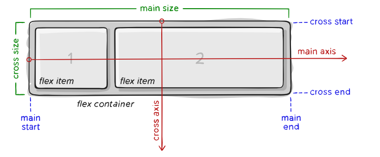
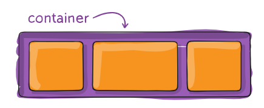
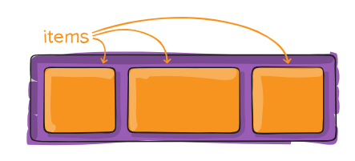

| naam element                                                                | voorbeeld                                                                                                                                                                                                                                                                                                                                                                                                                                                                                                       |                                                                                                                                                                                                                                                               | Te kennen |
| --------------------------------------------------------------------------- | --------------------------------------------------------------------------------------------------------------------------------------------------------------------------------------------------------------------------------------------------------------------------------------------------------------------------------------------------------------------------------------------------------------------------------------------------------------------------------------------------------------- | ------------------------------------------------------------------------------------------------------------------------------------------------------------------------------------------------------------------------------------------------------------- | --------- |
| **BACKGROUND**                                                              | **BACKGROUND**                                                                                                                                                                                                                                                                                                                                                                                                                                                                                                  | **BACKGROUND**                                                                                                                                                                                                                                                |           |
| Achtergrondkleur                                                            | background-color                                                                                                                                                                                                                                                                                                                                                                                                                                                                                                |                                                                                                                                                                                                                                                               | X         |
| Achtergrondafbeelfding                                                      | background-image: url("../images/image.png");                                                                                                                                                                                                                                                                                                                                                                                                                                                                   | ook steeds een bgc instellen                                                                                                                                                                                                                                  | X         |
| Achtergrond herhaling                                                       | background-repeat: no-repeat;                                                                                                                                                                                                                                                                                                                                                                                                                                                                                   | staat standaard op `repeat`<br>no-repeat<br>repeat-x                                                                                                                                                                                                          | X         |
| achtergrondLock                                                             | background-attachment                                                                                                                                                                                                                                                                                                                                                                                                                                                                                           | zal niet mee scrollen<br>`fixed`<br>`scroll` (default)<br>`local`                                                                                                                                                                                             |           |
| kleurverloop                                                                | background: linear-gradient(\#e66465, \#9198e5);                                                                                                                                                                                                                                                                                                                                                                                                                                                                | radial-gradient                                                                                                                                                                                                                                               |           |
| **COLOR**                                                                   | **COLOR**                                                                                                                                                                                                                                                                                                                                                                                                                                                                                                       | **COLOR**                                                                                                                                                                                                                                                     |           |
| Kleur<br><br><br><br>Kleur transparant                                      | color: rgb(255 127 0);<br>color: rgb(100% 50% 0%);<br>color: rgb(\#ff7f00);<br>color: red;<br>color: rgb(255 127 0 / 0.5);                                                                                                                                                                                                                                                                                                                                                                                      | <br><br><br><br>na / is voor transparantie                                                                                                                                                                                                                    |           |
| **LISTS**                                                                   | **LISTS**                                                                                                                                                                                                                                                                                                                                                                                                                                                                                                       | **LISTS**                                                                                                                                                                                                                                                     |           |
| opsommingstekens                                                            | list-style-type: none                                                                                                                                                                                                                                                                                                                                                                                                                                                                                           |                                                                                                                                                                                                                                                               | X         |
| afbeelding als opsomming                                                    | list-style-image                                                                                                                                                                                                                                                                                                                                                                                                                                                                                                |                                                                                                                                                                                                                                                               |           |
| plaatsing van opsommingteken                                                | list-style position                                                                                                                                                                                                                                                                                                                                                                                                                                                                                             |                                                                                                                                                                                                                                                               |           |
| shorthand                                                                   | list-style                                                                                                                                                                                                                                                                                                                                                                                                                                                                                                      |                                                                                                                                                                                                                                                               |           |
| **TEXT LAYOUT**                                                             | **TEXT LAYOUT**                                                                                                                                                                                                                                                                                                                                                                                                                                                                                                 | **TEXT LAYOUT**                                                                                                                                                                                                                                               |           |
| Regelhoogte                                                                 | line-height: 1.5;                                                                                                                                                                                                                                                                                                                                                                                                                                                                                               | 1.2<br>1.3                                                                                                                                                                                                                                                    | X         |
|                                                                             | text-align: center;                                                                                                                                                                                                                                                                                                                                                                                                                                                                                             | center                                                                                                                                                                                                                                                        | X         |
| om te onderlijnen                                                           | text-decoration: none;                                                                                                                                                                                                                                                                                                                                                                                                                                                                                          | none<br>underline<br>overline                                                                                                                                                                                                                                 | X         |
| color                                                                       | color                                                                                                                                                                                                                                                                                                                                                                                                                                                                                                           |                                                                                                                                                                                                                                                               | X         |
| text-align-last                                                             | text-align-last                                                                                                                                                                                                                                                                                                                                                                                                                                                                                                 |                                                                                                                                                                                                                                                               |           |
| text-indent                                                                 | text-indent                                                                                                                                                                                                                                                                                                                                                                                                                                                                                                     |                                                                                                                                                                                                                                                               |           |
| text-orientation                                                            | text-orientation                                                                                                                                                                                                                                                                                                                                                                                                                                                                                                |                                                                                                                                                                                                                                                               |           |
| text-overflow                                                               | text-overflow                                                                                                                                                                                                                                                                                                                                                                                                                                                                                                   |                                                                                                                                                                                                                                                               |           |
| text-shadow                                                                 | text-shadow                                                                                                                                                                                                                                                                                                                                                                                                                                                                                                     | Horizontale offset <br>Verticale offset<br>Blur afstand (optioneel)<br>Kleur                                                                                                                                                                                  |           |
| text-transform: uppercase;                                                  | text-transform: uppercase;                                                                                                                                                                                                                                                                                                                                                                                                                                                                                      |                                                                                                                                                                                                                                                               |           |
| white-space                                                                 | white-space                                                                                                                                                                                                                                                                                                                                                                                                                                                                                                     |                                                                                                                                                                                                                                                               |           |
| letter-scaling                                                              | letter-scaling                                                                                                                                                                                                                                                                                                                                                                                                                                                                                                  |                                                                                                                                                                                                                                                               |           |
| word-spacing                                                                | word-spacing                                                                                                                                                                                                                                                                                                                                                                                                                                                                                                    |                                                                                                                                                                                                                                                               |           |
| word-break                                                                  | word-break                                                                                                                                                                                                                                                                                                                                                                                                                                                                                                      |                                                                                                                                                                                                                                                               |           |
| overflow-wrap                                                               | overflow-wrap                                                                                                                                                                                                                                                                                                                                                                                                                                                                                                   |                                                                                                                                                                                                                                                               |           |
| **FONT**                                                                    | **FONT**                                                                                                                                                                                                                                                                                                                                                                                                                                                                                                        | **FONT**                                                                                                                                                                                                                                                      |           |
| font-family<br>lettertypes<br>meerdere als fallback                         | font-family: Georgia, 'Times New Roman', Times, serif;                                                                                                                                                                                                                                                                                                                                                                                                                                                          | (font stack)<br><br>laatste = generische font                                                                                                                                                                                                                 | X         |
| font-size                                                                   | font-size: 14px;<br>font-size: 3em;<br>font-size: 2rem;                                                                                                                                                                                                                                                                                                                                                                                                                                                         | px<br>em<br>rem (voorkeur)                                                                                                                                                                                                                                    | X         |
| font-weight                                                                 | font-weight: bold;<br>font-weight: 700;<br>font-weight: 900;                                                                                                                                                                                                                                                                                                                                                                                                                                                    | range: 100 - 900<br>default: 400<br>bold: 700<br>bolder, lighter                                                                                                                                                                                              | X         |
| font-size-adjust                                                            | font-size-adjust                                                                                                                                                                                                                                                                                                                                                                                                                                                                                                |                                                                                                                                                                                                                                                               |           |
| font-style                                                                  | font-style                                                                                                                                                                                                                                                                                                                                                                                                                                                                                                      |                                                                                                                                                                                                                                                               |           |
| font-variant: smal-caps;                                                    | font-variant: smal-caps;                                                                                                                                                                                                                                                                                                                                                                                                                                                                                        |                                                                                                                                                                                                                                                               |           |
| font-stretch                                                                | font-stretch                                                                                                                                                                                                                                                                                                                                                                                                                                                                                                    |                                                                                                                                                                                                                                                               |           |
| font                                                                        | font                                                                                                                                                                                                                                                                                                                                                                                                                                                                                                            |                                                                                                                                                                                                                                                               |           |
| **Images**                                                                  | **Images**                                                                                                                                                                                                                                                                                                                                                                                                                                                                                                      | **Images**                                                                                                                                                                                                                                                    |           |
| max-width                                                                   | max-width: 100%;                                                                                                                                                                                                                                                                                                                                                                                                                                                                                                | gewenste grootte voor iedere breedte                                                                                                                                                                                                                          |           |
|                                                                             |                                                                                                                                                                                                                                                                                                                                                                                                                                                                                                                 |                                                                                                                                                                                                                                                               |           |
| **Lay-out**                                                                 | **Lay-out**                                                                                                                                                                                                                                                                                                                                                                                                                                                                                                     | **Lay-out**                                                                                                                                                                                                                                                   |           |
| display                                                                     | flex<br>grid<br>none<br>block                                                                                                                                                                                                                                                                                                                                                                                                                                                                                   |                                                                                                                                                                                                                                                               |           |
| visible                                                                     |                                                                                                                                                                                                                                                                                                                                                                                                                                                                                                                 |                                                                                                                                                                                                                                                               |           |
| height                                                                      |                                                                                                                                                                                                                                                                                                                                                                                                                                                                                                                 |                                                                                                                                                                                                                                                               |           |
| width                                                                       |                                                                                                                                                                                                                                                                                                                                                                                                                                                                                                                 |                                                                                                                                                                                                                                                               |           |
| padding                                                                     |                                                                                                                                                                                                                                                                                                                                                                                                                                                                                                                 |                                                                                                                                                                                                                                                               |           |
| margin                                                                      |                                                                                                                                                                                                                                                                                                                                                                                                                                                                                                                 |                                                                                                                                                                                                                                                               |           |
| border                                                                      |                                                                                                                                                                                                                                                                                                                                                                                                                                                                                                                 |                                                                                                                                                                                                                                                               |           |
| border-color                                                                |                                                                                                                                                                                                                                                                                                                                                                                                                                                                                                                 |                                                                                                                                                                                                                                                               |           |
| border-style                                                                |                                                                                                                                                                                                                                                                                                                                                                                                                                                                                                                 |                                                                                                                                                                                                                                                               |           |
| border-width                                                                |                                                                                                                                                                                                                                                                                                                                                                                                                                                                                                                 |                                                                                                                                                                                                                                                               |           |
| border-radius                                                               | border-radius: 10px;<br>border-radius: 50%;<br>border-radius: 15px 75px;                                                                                                                                                                                                                                                                                                                                                                                                                                        | afronding van hoek met 10px<br>circel<br>elipse                                                                                                                                                                                                               |           |
| max-height                                                                  |                                                                                                                                                                                                                                                                                                                                                                                                                                                                                                                 |                                                                                                                                                                                                                                                               |           |
| min-height                                                                  |                                                                                                                                                                                                                                                                                                                                                                                                                                                                                                                 |                                                                                                                                                                                                                                                               |           |
| max-width                                                                   |                                                                                                                                                                                                                                                                                                                                                                                                                                                                                                                 |                                                                                                                                                                                                                                                               |           |
| min-width                                                                   |                                                                                                                                                                                                                                                                                                                                                                                                                                                                                                                 |                                                                                                                                                                                                                                                               |           |
| overflow                                                                    |                                                                                                                                                                                                                                                                                                                                                                                                                                                                                                                 | visible (Default)<br>hidden(geen schuifbalk)<br>scroll(altijd schuifbalk)<br>auto (schuifbalk als nodig)                                                                                                                                                      |           |
| overflow-y                                                                  |                                                                                                                                                                                                                                                                                                                                                                                                                                                                                                                 |                                                                                                                                                                                                                                                               |           |
| calc()                                                                      | width: calc(100%- 30px);                                                                                                                                                                                                                                                                                                                                                                                                                                                                                        | Berekening van eenheden                                                                                                                                                                                                                                       |           |
| box-sizing                                                                  | box-sizing: content-box;<br>box-sizing: border-box;<br><br>html { box-sizing: border-box; }<br>\*, ::before, ::after { box-sizing: inherit; }                                                                                                                                                                                                                                                                                                                                                                   | content-box (default)<br>width inclusief border padding,...<br>we stellen dit in in de html<br>ook deze regel wan boxsizing heeft geen standaard inherantance                                                                                                 |           |
| box-shadow                                                                  | box-shadow: -5px -5px #777777;<br>box-shadow: 5px 5px 5px #777777;<br>box-shadow: 5px 5px 5px 5px #777777;<br>box-shadow: 0 0 10px #777777;<br>box-shadow: inset 0 0 10px #777777;                                                                                                                                                                                                                                                                                                                              | Horizontale offset <br>Verticale offset<br>Blur afstand<br>Spread van schaduw<br>Kleur                                                                                                                                                                        |           |
| writing-mode                                                                | <br>writing-mode: horizontal-tb;<br>writing-mode: vertikaal-rl;                                                                                                                                                                                                                                                                                                                                                                                                                                                 | schrijfrichting (zijbalkje maken)<br>horizontaal top-to-bottom<br>vertikaal rechts-naar-links                                                                                                                                                                 |           |
| inline-size                                                                 |                                                                                                                                                                                                                                                                                                                                                                                                                                                                                                                 | De breedte (with) bij verticale writingmodus (klopt beter)                                                                                                                                                                                                    |           |
| cursor                                                                      | cursor: auto;<br>cursor: crosshair;<br>cursor: default;<br>cursor: pointer;<br>cursor: move;<br>cursor: text;<br>cursor: wait;<br>cursor: help;<br>cursor: url("cursor.gif");                                                                                                                                                                                                                                                                                                                                   | auto<br>crosshair<br>default<br>pointer<br>move<br>text<br>wait<br>help<br>url("cursor.gif")                                                                                                                                                                  |           |
| margin-inline                                                               | margin-inline: auto;                                                                                                                                                                                                                                                                                                                                                                                                                                                                                            | horizontaal centreren                                                                                                                                                                                                                                         |           |
| **Flexbox** container                                                       |                                                                                                                                                                                                                                                                                                                                                                                                                                                                                                                 |                                                                                                                                                                                                                                                               |           |
| display                                                                     | display:flex;                                                                                                                                                                                                                                                                                                                                                                                                                                                                                                   | toepassen op de container                                                                                                                                                                                                                                     |           |
| flex-direction                                                              | flex-direction:row;<br>flex-direction:column;<br>flex-direction:row-reverse;<br>flex-direction:column-reverse;                                                                                                                                                                                                                                                                                                                                                                                                  | (default) richting van main axis                                                                                                                                                                                                                              |           |
| gap                                                                         | gap:2rem;<br>gap:10%;<br>gap:2rem 4rem;                                                                                                                                                                                                                                                                                                                                                                                                                                                                         | row gap<br>row gap<br>row gap, column gap                                                                                                                                                                                                                     |           |
| flex-wrap                                                                   | flex-wrap: nowrap;<br>flex-wrap: wrap;<br>flex-wrap: wrap-reverse;                                                                                                                                                                                                                                                                                                                                                                                                                                              | (default) doorlopen<br>naar volgende regel bij beperkte breedte<br>                                                                                                                                                                                           |           |
| justify-content                                                             | justify-content: flex-start;<br>justify-content: flex-end;<br>justify-content: center;<br>justify-content: space-arround;<br>justify-content: space-between;<br>justify-content: space-evenly;                                                                                                                                                                                                                                                                                                                  | uitlijning langs main axis (default) verticaal<br>aan de rechter kant<br>Centreren<br>Rond alle items evenveel witruimte<br>Tussen alle items evenveel witruimte<br>witruimte verdeeld                                                                        |           |
| align-items                                                                 | align-items: strech;<br>align-items: flex-start;<br>align-items: flex-end;<br>align-items: center;<br>align-items: baseline;<br>align-items: stretch;                                                                                                                                                                                                                                                                                                                                                           | uitlijning langs cross axis (default) horizon<br>Boven<br>Onder<br>Centreren<br>Volgens onderkant text<br>                                                                                                                                                    |           |
| align-content                                                               | align-content: flex-start;<br>align-content: flex-end;<br>align-content: center;<br>align-content: stretch;                                                                                                                                                                                                                                                                                                                                                                                                     | (enkel bij flew-wrap) boven<br>onder<br>midden<br>uitrekken                                                                                                                                                                                                   |           |
|                                                                             |                                                                                                                                                                                                                                                                                                                                                                                                                                                                                                                 |                                                                                                                                                                                                                                                               |           |
| **Flexbox** item                                                            | **Flexbox** item                                                                                                                                                                                                                                                                                                                                                                                                                                                                                                | **Flexbox** item                                                                                                                                                                                                                                              |           |
| order                                                                       | order: 1;                                                                                                                                                                                                                                                                                                                                                                                                                                                                                                       | volgorde vernderen van de item                                                                                                                                                                                                                                |           |
| flex-grow                                                                   | flex-grow: 1;<br>lex-grow: 0;                                                                                                                                                                                                                                                                                                                                                                                                                                                                                   | meegroeien met andere items<br>niet meegroeien                                                                                                                                                                                                                |           |
| flex-shrink                                                                 | flex-shrink: 1;<br>flex-shrink: 0;                                                                                                                                                                                                                                                                                                                                                                                                                                                                              | verkleinen met andere items<br>niet verkleinen                                                                                                                                                                                                                |           |
| flex-basis                                                                  | flex-basis: auto;<br>flex-basis: content;<br>flex-basis: 0;                                                                                                                                                                                                                                                                                                                                                                                                                                                     | absolute flex<br>relatieve flex                                                                                                                                                                                                                               |           |
| flex                                                                        | flex: 0 1 auto;                                                                                                                                                                                                                                                                                                                                                                                                                                                                                                 | flex-grow flex-shrink flex-basis (default)<br>combinatie van de 3 in 1 (shorthand)                                                                                                                                                                            |           |
| margin-inline-end<br>margin-right                                           | margin-inline-end: auto;<br>margin-right: auto;                                                                                                                                                                                                                                                                                                                                                                                                                                                                 | zet rechts ruimte er bij<br>zet rechts ruimte er bij                                                                                                                                                                                                          |           |
| margin-inline-start<br>margin-left                                          | margin-inline-start: auto;<br>margin-left: auto;                                                                                                                                                                                                                                                                                                                                                                                                                                                                | zet links ruimte er bij<br>zet links ruimte er bij                                                                                                                                                                                                            |           |
|                                                                             |                                                                                                                                                                                                                                                                                                                                                                                                                                                                                                                 |                                                                                                                                                                                                                                                               |           |
| **Grid** Lay-out                                                            | **Grid** Lay-out                                                                                                                                                                                                                                                                                                                                                                                                                                                                                                | **Grid** Lay-out                                                                                                                                                                                                                                              |           |
| display                                                                     | display:grid<br>display:block grid<br>display:inline grid                                                                                                                                                                                                                                                                                                                                                                                                                                                       | creëert block level element<br>creëert block level element<br>creëert inline level element                                                                                                                                                                    |           |
| gap                                                                         | gap: 5px;                                                                                                                                                                                                                                                                                                                                                                                                                                                                                                       | tussenruimte                                                                                                                                                                                                                                                  |           |
| grid-template-row                                                           | grid-template-row                                                                                                                                                                                                                                                                                                                                                                                                                                                                                               | rijen definieren                                                                                                                                                                                                                                              |           |
| grid-template-columns                                                       | grid-template-columns: 150px 150px 150px;<br>grid-template-columns:20% 60% 40%;<br>grid-template-columns:100px 1fr 2fr;<br>grid-template-columns:minmax(100px, 200px)<br>grid-template-columns:fit-content(40%)<br>grid-template-columns:auto 100px 1fr;<br>grid-template-columns: 20px repeat(4, 1fr 2fr)<br>grid-template-columns: repeat(auto-fill, 150px)                                                                                                                                                   | kolomen definieren<br><br><br><br><br><br><br>browser bepaald aantal kolommen                                                                                                                                                                                 |           |
| grid-template-areas                                                         | grid-template-areas:<br>"one three two"<br>"one . two"<br>"one four four"                                                                                                                                                                                                                                                                                                                                                                                                                                       | om items te plaatsen<br>.box1 {grid area: one;}<br>.box2 {grid area: two;}<br>.box3 {grid area: three;}<br>.box4 {grid area: four;}                                                                                                                           |           |
| align-items                                                                 | align-items: start;<br>align-items: center;<br>align-items: end;                                                                                                                                                                                                                                                                                                                                                                                                                                                |                                                                                                                                                                                                                                                               |           |
| justify-items                                                               |                                                                                                                                                                                                                                                                                                                                                                                                                                                                                                                 |                                                                                                                                                                                                                                                               |           |
| justify-content                                                             | justify-content: center;                                                                                                                                                                                                                                                                                                                                                                                                                                                                                        |                                                                                                                                                                                                                                                               |           |
| align-content                                                               |                                                                                                                                                                                                                                                                                                                                                                                                                                                                                                                 |                                                                                                                                                                                                                                                               |           |
| grid-auto-rows                                                              | grid-auto-rows: 150px;<br>grid-auto-rows: minmax(100px, auto);                                                                                                                                                                                                                                                                                                                                                                                                                                                  | <br>rijhoogte zal aangepast worden aan de content                                                                                                                                                                                                             |           |
| grid-auto-colomns                                                           | grid-auto-colomns: 150px;                                                                                                                                                                                                                                                                                                                                                                                                                                                                                       |                                                                                                                                                                                                                                                               |           |
|                                                                             |                                                                                                                                                                                                                                                                                                                                                                                                                                                                                                                 |                                                                                                                                                                                                                                                               |           |
| **Grid** item                                                               | **Grid** item                                                                                                                                                                                                                                                                                                                                                                                                                                                                                                   | **Grid** item                                                                                                                                                                                                                                                 |           |
| grid-row                                                                    | grid-row:3;<br>grid-row: 1 / span 3;                                                                                                                                                                                                                                                                                                                                                                                                                                                                            | <br>begint op rij 1 (start van grid) en **strekt zich uit over 3 rijen**                                                                                                                                                                                      |           |
| grid-row-start                                                              | grid-row-start: 1;                                                                                                                                                                                                                                                                                                                                                                                                                                                                                              |                                                                                                                                                                                                                                                               |           |
| grid-row-end                                                                | grid-row-end: 4;                                                                                                                                                                                                                                                                                                                                                                                                                                                                                                |                                                                                                                                                                                                                                                               |           |
| grid-column                                                                 |                                                                                                                                                                                                                                                                                                                                                                                                                                                                                                                 |                                                                                                                                                                                                                                                               |           |
| grid-column-start                                                           |                                                                                                                                                                                                                                                                                                                                                                                                                                                                                                                 |                                                                                                                                                                                                                                                               |           |
| grid-column-end                                                             |                                                                                                                                                                                                                                                                                                                                                                                                                                                                                                                 |                                                                                                                                                                                                                                                               |           |
| z-index:                                                                    | z-index: 10;                                                                                                                                                                                                                                                                                                                                                                                                                                                                                                    | naar de voorgrond brengen                                                                                                                                                                                                                                     |           |
| align-self                                                                  | align-self: start;<br>align-self: center;<br>align-self: end;                                                                                                                                                                                                                                                                                                                                                                                                                                                   |                                                                                                                                                                                                                                                               |           |
| justify-self                                                                |                                                                                                                                                                                                                                                                                                                                                                                                                                                                                                                 |                                                                                                                                                                                                                                                               |           |
| **Layout**                                                                  | **Layout**                                                                                                                                                                                                                                                                                                                                                                                                                                                                                                      | **Layout**                                                                                                                                                                                                                                                    |           |
| float                                                                       | float: left;<br>float: right;<br>float: none;                                                                                                                                                                                                                                                                                                                                                                                                                                                                   | Om tekst rechts van container te vullen<br>Om tekst links van container te vullen<br>Default                                                                                                                                                                  |           |
| clear                                                                       | clear: left;<br>clear: right;<br>clear: both;<br>clear: none;                                                                                                                                                                                                                                                                                                                                                                                                                                                   | Rechts van container een lege ruimte                                                                                                                                                                                                                          |           |
| position                                                                    | position: relative;<br>position: static;<br>position: fixed;<br>position: absolute;                                                                                                                                                                                                                                                                                                                                                                                                                             | Met "left","right","top","bottom" verplaatsen<br>Container staat vast tov pagina<br>Container staat vast tov venster (viewport)<br>Vast tov eerste niet static parent of body                                                                                 |           |
| left                                                                        | left: 50px;                                                                                                                                                                                                                                                                                                                                                                                                                                                                                                     |                                                                                                                                                                                                                                                               |           |
| right                                                                       | right: 50px                                                                                                                                                                                                                                                                                                                                                                                                                                                                                                     |                                                                                                                                                                                                                                                               |           |
| top                                                                         | top: 50px;                                                                                                                                                                                                                                                                                                                                                                                                                                                                                                      |                                                                                                                                                                                                                                                               |           |
| bottom                                                                      | bottom: 50px;                                                                                                                                                                                                                                                                                                                                                                                                                                                                                                   |                                                                                                                                                                                                                                                               |           |
| z-index                                                                     | z-index: 10px;                                                                                                                                                                                                                                                                                                                                                                                                                                                                                                  | container naar boven verplaatsen in z as                                                                                                                                                                                                                      |           |
| **@media**                                                                  | **@media**                                                                                                                                                                                                                                                                                                                                                                                                                                                                                                      | **@media**                                                                                                                                                                                                                                                    |           |
| @media screen                                                               | @media screen and (min-width: 800px){<br>p{background-color: red;<br>color: yelow}<br>}                                                                                                                                                                                                                                                                                                                                                                                                                         | ander css gedrag bij scherm < 800px<br>media type: screen<br>EXAMEN<br>is uitbreiding na mobile first                                                                                                                                                         |           |
| @media all                                                                  |                                                                                                                                                                                                                                                                                                                                                                                                                                                                                                                 |                                                                                                                                                                                                                                                               |           |
| @media print                                                                | @media not print{}                                                                                                                                                                                                                                                                                                                                                                                                                                                                                              |                                                                                                                                                                                                                                                               |           |
| @media screen and                                                           | (min-width: 500px){}<br>(max-width: 50em){}<br>(min-aspect-ratio: 1/1){}<br>(orientation:landscape){}                                                                                                                                                                                                                                                                                                                                                                                                           |                                                                                                                                                                                                                                                               |           |
|                                                                             |                                                                                                                                                                                                                                                                                                                                                                                                                                                                                                                 |                                                                                                                                                                                                                                                               |           |
| **[Animatie](https://developer.mozilla.org/en-US/docs/Web/CSS/transition)** | **Animatie**                                                                                                                                                                                                                                                                                                                                                                                                                                                                                                    | **Animatie**                                                                                                                                                                                                                                                  |           |
| :hoover                                                                     | div:hoover {width: 300px;}<br>                                                                                                                                                                                                                                                                                                                                                                                                                                                                                  | bij hoover wijzigd breedte<br>                                                                                                                                                                                                                                |           |
| transition                                                                  | div {transition-duration: 2s;}<br>div {transition-duration: 0s,2s;}<br>div {transition-property: all;}<br>div {transition-property: width;}<br>div {transition-property: background;}<br>div {transition-property: opacity;}<br>div {transition-property: width, background;}<br>div {transition-timing-function: ease;}<br>div {transition-timing-function: linear;}<br>div {transition-timing-function: cubic-bezier<br>(0.99,0.21,0,0.85);}<br>div {transition-delay: 0s;}<br>div {transition-delay: 800ms;} | transisitetijd 2 seconden<br><br><br><br><br><br><br><br><br><br>Niet op het examen<br><br>800ms wachten voor animatie te starten                                                                                                                             |           |
| :checked                                                                    |                                                                                                                                                                                                                                                                                                                                                                                                                                                                                                                 | ommuisklick te registreren                                                                                                                                                                                                                                    |           |
| :focus                                                                      |                                                                                                                                                                                                                                                                                                                                                                                                                                                                                                                 |                                                                                                                                                                                                                                                               |           |
| transform<br><br>[3D transform](https://3dtransforms.desandro.com/)         | div {transform: translateX(300px) rotate(30deg);}<br>div {transform: scale(1.2);}<br>div {transform: rotate(45deg);}<br>div {transform: translateX(50%);}<br>div {transform: translateY(200px);}<br>div {transform: translate(100px,200px);}<br>div {transform: skew(10deg,10deg);}                                                                                                                                                                                                                             | Assenstelsel verplaatsen<br>schalen<br>roteren<br>verplaats in de X as<br>verplaats in de y as<br>verplaats in de x en y as<br>scheef maken                                                                                                                   |           |
| @keyframes                                                                  | @keyframes my-animation{<br>  0% {transform: translate(0,0);}<br>  50% {transform: translate(100px,0);}<br>  100% {transform: translate(100px,100px);}<br>}                                                                                                                                                                                                                                                                                                                                                     | hoort bij animation                                                                                                                                                                                                                                           |           |
| animation                                                                   | div {<br>  animation-name: my-animation;<br>  animation-duration: 2s;<br>  animation-delay: 0s;<br>  animation-fill-mode: none;<br>  animation-iteration-count: 1;<br>  animation-timing-function: ease;<br>  animation-direction: normal;<br>  animation-play-state: running;<br>}                                                                                                                                                                                                                             | <br>naam van animatie<br>tijd van animatie<br>delay voor start<br>gaat deze na einde naar beginstatus<br>Herhaling van animatie<br>linair voor smooth animatie<br>richting (alternate is op en af)<br>wanneer moet deze stoppen (kan je in hoover:div steken) |           |
|                                                                             |                                                                                                                                                                                                                                                                                                                                                                                                                                                                                                                 |                                                                                                                                                                                                                                                               |           |
| **Variabelen**                                                              | **Variabelen**                                                                                                                                                                                                                                                                                                                                                                                                                                                                                                  | **Variabelen**                                                                                                                                                                                                                                                |           |
| :root                                                                       | :root {<br>  --primary-color: rgb(10,10,10)<br>}                                                                                                                                                                                                                                                                                                                                                                                                                                                                | <br>definieren van de variabele primairy color                                                                                                                                                                                                                |           |
| var()                                                                       | var(--primairy-color)                                                                                                                                                                                                                                                                                                                                                                                                                                                                                           | oproepen van een variabele                                                                                                                                                                                                                                    |           |
| \#container                                                                 | \#container {<br>  --max-width: 800px;<br>}                                                                                                                                                                                                                                                                                                                                                                                                                                                                     | definieren van locale variabele in \#container                                                                                                                                                                                                                |           |
| extra                                                                       | https://github.com/svanimpe/css-sprite-sheet-animation<br>https://threejs.org/                                                                                                                                                                                                                                                                                                                                                                                                                                  | niet te kennen                                                                                                                                                                                                                                                |           |
|                                                                             |                                                                                                                                                                                                                                                                                                                                                                                                                                                                                                                 |                                                                                                                                                                                                                                                               |           |
## Logical property's (altijd longhand)

voorkeur Physical property, maak steeds een keuze, gebruik liefst niet door elkaar

![[Pasted image 20241030112726.png]]

![[Pasted image 20241030112646.png]]

![[Pasted image 20241030112657.png]]


### Lettertype fallback
[CSS Font Fallbacks (w3schools.com)](https://www.w3schools.com/Css/css_font_fallbacks.asp)

| Lettetype                                 | fallback   |
| ----------------------------------------- | ---------- |
| Courier<br>console<br>                    | monospace  |
| Times New Roman<br>Georgia<br>Garamond    | Serif      |
| Arial<br>Tahoma<br>Trebuchet MS<br>Geneva | Sans Serif |

# CSS selectors
### Termen

- child : onderliggend element
- parent : bovenliggend element
- descendant : afstamming
- sibling : elementen die op hetzelfde niveau staan (broers of zusters van)
### soorten
- Universal selector en de type selector
- Class en Id selectors
- Selector list (aka Group selector)
- Child en Descendant combinators
- Adjacent en General sibling combinator
- Attribute selectors
- Pseudo-classes
- Pseudo-elements

### Universal selector en de type selector (TE KENNEN)

| voorbeeld | 1ste teken in css | naam               | prioriteit |
| --------- | ----------------- | ------------------ | ---------- |
| \* {};    | \*                | Universal selector | 1          |
| h2{};     | naamVanElement    | Type selector      | 2          |

### Class en Id selectors (TE KENNEN)

Waar mogelijk andere selectors gebruiken.

| voorbeeld      | 1ste teken in css | naam  | prioriteit | komt van (niet zo geschreven) |
| -------------- | ----------------- | ----- | ---------- | ----------------------------- |
| \#archives {}; | #                 | id    | 3          |                               |
| .archives{};   | .                 | class | 3          | \*.archives{};                |
### Selector list (aka Group selector)(TE KENNEN)

*meerdere* elementen gebruiken, *gescheiden met komma*
```css
h2, h1, .archives{};
```
### Child en Descendant combinators

#### Descendant combinator(TE KENNEN)
Een *afstammeling* selecteren, *gebruik spaties*, het meest rechtse element (key selector) zal opgemaakt worden.
```css
div p {};
```
Enkel het `p` element onder het `div` element zal opgemaakt worden, andere `p` elementen niet.

#### Child combinator (TE KENNEN)
Een *directe afstammeling* selecteren, *gebruik \>*, het meest rechtse element (key selector) zal opgemaakt worden.
```css
div > p {};
```
Enkel het `p` element *rechtstreeks* onder het `div` element zal opgemaakt worden, andere `p` elementen niet.

### Adjacent en General sibling combinator

*Selecteren op hetzelfde niveau*
#### Sibling
Alle p die *onmiddelijk naast* h1 staat. (zal niet geselecteerd worden als er een element tussen zit)
```css
h1 + p {};
```
#### General
Alle p die *naast* h1 staat. (niet per se onmiddellijk naast)
```css
h1 ~ p {};
```

### Attribute selectors
Selecteren op basis van attribuut, zet het attrubuut tussen \[\]

```css
a[href] {}
```

### Pseudo-classes (ENKELE VAN KENNEN)

Pseudo-class *start altijd met een* **:** en dan de naam van de pseudo-class
Deze kunnen we *gebruiken om iets interactief te maken met CSS*

| voorbeeld  | 1ste teken in css | naam                               | actie                  | te kennen |
| ---------- | ----------------- | ---------------------------------- | ---------------------- | --------- |
|            | :link             |                                    |                        |           |
|            | :visited          |                                    |                        |           |
|            | :active           |                                    |                        |           |
| a:hover{}; | :hover            |                                    | met muis over hooveren | X         |
|            | :first-child      | eerste kind van een parent         |                        |           |
|            | :last-child       | laatste kind van een parent        |                        |           |
|            | :only-child       | element die geen ouder heeft       |                        |           |
|            | :first-of-type    | het eerste element van dat type    |                        | X         |
|            | :last-of-type     | het laatste elemetn van dat type   |                        |           |
|            | :only-of-type     | het enige element van dat type     |                        |           |
|            | :nth-of-child(n)  | elk zoveelste child-element        |                        |           |
|            | :nth-last-child   | gerekend vanaf laatste element     |                        |           |
|            | :nth-of-type(n)   | elk zoveelste (n) element van type |                        | X         |
|            | :nth-last-of-type | gerekend vanaf laatste element     |                        |           |
|            | :empty            | leeg element                       |                        |           |

mooi voorbeeld voor een hyperlink (\<a> element)
```html
  <style>
    a{
      text-decoration: none;
    }
    a:hover{
      text-decoration: underline;
    }
  </style>
```
Dit zal de onderlijning van de hyperlink weghalen behalve als je er over hoverd.
### Pseudo-elements

| voorbeeld                 | 1ste teken in css | naam                                         | gebruik                     |
| ------------------------- | ----------------- | -------------------------------------------- | --------------------------- |
|                           | ::first-line      | eerste regel opgemaakte text van een element |                             |
| p::first-letter{};        | ::first-letter    | de eerste letter                             |                             |
| a::before{content: '❤️'}; | ::before          | voor de inhoud van een element               | om afbeelding toe te voegen |
|                           | ::after           | na de inhoud van een element                 |                             |
# Flexbox

[CSS Flexbox Layout Guide | CSS-Tricks](https://css-tricks.com/snippets/css/a-guide-to-flexbox/)

[Flexbox Froggy - Een spel om CSS flexbox te leren](https://flexboxfroggy.com/#nl)








## display

This defines a flex container; inline or block depending on the given value. It enables a flex context for all its direct children.

```css
.container {
  display: flex; /* or inline-flex */
}
```

Note that CSS columns have no effect on a flex container.

## Properties for the Parent  
(flex container)
### flex-direction


  
This establishes the main-axis, thus defining the direction flex items are placed in the flex container. Flexbox is (aside from optional wrapping) a single-direction layout concept. Think of flex items as primarily laying out either in horizontal rows or vertical columns.

```css
.container {
  flex-direction: row | row-reverse | column | column-reverse;
}
```

- `row` (default): left to right in `ltr`; right to left in `rtl`
- `row-reverse`: right to left in `ltr`; left to right in `rtl`
- `column`: same as `row` but top to bottom
- `column-reverse`: same as `row-reverse` but bottom to top

### flex-wrap


By default, flex items will all try to fit onto one line. You can change that and allow the items to wrap as needed with this property.

```css
.container {
  flex-wrap: nowrap | wrap | wrap-reverse;
}
```

- `nowrap` (default): all flex items will be on one line
- `wrap`: flex items will wrap onto multiple lines, from top to bottom.
- `wrap-reverse`: flex items will wrap onto multiple lines from bottom to top.

There are some [visual demos of `flex-wrap` here](https://css-tricks.com/almanac/properties/f/flex-wrap/).

### flex-flow

This is a shorthand for the `flex-direction` and `flex-wrap` properties, which together define the flex container’s main and cross axes. The default value is `row nowrap`.

```css
.container {
  flex-flow: column wrap;
}
```

### justify-content


  
This defines the alignment along the main axis. It helps distribute extra free space leftover when either all the flex items on a line are inflexible, or are flexible but have reached their maximum size. It also exerts some control over the alignment of items when they overflow the line.

```css
.container {
  justify-content: flex-start | flex-end | center | space-between | space-around | space-evenly | start | end | left | right ... + safe | unsafe;
}
```

- `flex-start` (default): items are packed toward the start of the flex-direction.
- `flex-end`: items are packed toward the end of the flex-direction.
- `start`: items are packed toward the start of the `writing-mode` direction.
- `end`: items are packed toward the end of the `writing-mode` direction.
- `left`: items are packed toward left edge of the container, unless that doesn’t make sense with the `flex-direction`, then it behaves like `start`.
- `right`: items are packed toward right edge of the container, unless that doesn’t make sense with the `flex-direction`, then it behaves like `end`.
- `center`: items are centered along the line
- `space-between`: items are evenly distributed in the line; first item is on the start line, last item on the end line
- `space-around`: items are evenly distributed in the line with equal space around them. Note that visually the spaces aren’t equal, since all the items have equal space on both sides. The first item will have one unit of space against the container edge, but two units of space between the next item because that next item has its own spacing that applies.
- `space-evenly`: items are distributed so that the spacing between any two items (and the space to the edges) is equal.

Note that that browser support for these values is nuanced. For example, `space-between` never got support from some versions of Edge, and start/end/left/right aren’t in Chrome yet. MDN [has detailed charts](https://developer.mozilla.org/en-US/docs/Web/CSS/justify-content). The safest values are `flex-start`, `flex-end`, and `center`.

There are also two additional keywords you can pair with these values: `safe` and `unsafe`. Using `safe` ensures that however you do this type of positioning, you can’t push an element such that it renders off-screen (e.g. off the top) in such a way the content can’t be scrolled too (called “data loss”).

### align-items


  
This defines the default behavior for how flex items are laid out along the **cross axis** on the current line. Think of it as the `justify-content` version for the cross-axis (perpendicular to the main-axis).

```css
.container {
  align-items: stretch | flex-start | flex-end | center | baseline | first baseline | last baseline | start | end | self-start | self-end + ... safe | unsafe;
}
```

- `stretch` (default): stretch to fill the container (still respect min-width/max-width)
- `flex-start` / `start` / `self-start`: items are placed at the start of the cross axis. The difference between these is subtle, and is about respecting the `flex-direction` rules or the `writing-mode` rules.
- `flex-end` / `end` / `self-end`: items are placed at the end of the cross axis. The difference again is subtle and is about respecting `flex-direction` rules vs. `writing-mode` rules.
- `center`: items are centered in the cross-axis
- `baseline`: items are aligned such as their baselines align

The `safe` and `unsafe` modifier keywords can be used in conjunction with all the rest of these keywords (although note [browser support](https://developer.mozilla.org/en-US/docs/Web/CSS/align-items)), and deal with helping you prevent aligning elements such that the content becomes inaccessible.

### align-content


  
This aligns a flex container’s lines within when there is extra space in the cross-axis, similar to how `justify-content` aligns individual items within the main-axis.

**Note:** This property only takes effect on multi-line flexible containers, where `flex-wrap` is set to either `wrap` or `wrap-reverse`). A single-line flexible container (i.e. where `flex-wrap` is set to its default value, `no-wrap`) will not reflect `align-content`.

```css
.container {
  align-content: flex-start | flex-end | center | space-between | space-around | space-evenly | stretch | start | end | baseline | first baseline | last baseline + ... safe | unsafe;
}
```

- `normal` (default): items are packed in their default position as if no value was set.
- `flex-start` / `start`: items packed to the start of the container. The (more supported) `flex-start` honors the `flex-direction` while `start` honors the `writing-mode` direction.
- `flex-end` / `end`: items packed to the end of the container. The (more support) `flex-end` honors the `flex-direction` while end honors the `writing-mode` direction.
- `center`: items centered in the container
- `space-between`: items evenly distributed; the first line is at the start of the container while the last one is at the end
- `space-around`: items evenly distributed with equal space around each line
- `space-evenly`: items are evenly distributed with equal space around them
- `stretch`: lines stretch to take up the remaining space

The `safe` and `unsafe` modifier keywords can be used in conjunction with all the rest of these keywords (although note [browser support](https://developer.mozilla.org/en-US/docs/Web/CSS/align-items)), and deal with helping you prevent aligning elements such that the content becomes inaccessible.

### gap, row-gap, column-gap


[The `gap` property](https://css-tricks.com/almanac/properties/g/gap/) explicitly controls the space between flex items. It applies that spacing _only between items_ not on the outer edges.

```css
.container {
  display: flex;
  ...
  gap: 10px;
  gap: 10px 20px; /* row-gap column gap */
  row-gap: 10px;
  column-gap: 20px;
}
```

The behavior could be thought of as a _minimum_ gutter, as if the gutter is bigger somehow (because of something like `justify-content: space-between;`) then the gap will only take effect if that space would end up smaller.

It is not exclusively for flexbox, `gap` works in grid and multi-column layout as well.

## Properties for the Children  
(flex items)

### order


  
By default, flex items are laid out in the source order. However, the `order` property controls the order in which they appear in the flex container.

```css
.item {
  order: 5; /* default is 0 */
}
```

Items with the same `order` revert to source order.

### flex-grow


  
This defines the ability for a flex item to grow if necessary. It accepts a unitless value that serves as a proportion. It dictates what amount of the available space inside the flex container the item should take up.

If all items have `flex-grow` set to `1`, the remaining space in the container will be distributed equally to all children. If one of the children has a value of `2`, that child would take up twice as much of the space as either one of the others (or it will try, at least).

```css
.item {
  flex-grow: 4; /* default 0 */
}
```

Negative numbers are invalid.

### flex-shrink

This defines the ability for a flex item to shrink if necessary.

```css
.item {
  flex-shrink: 3; /* default 1 */
}
```

Negative numbers are invalid.

### flex-basis

This defines the default size of an element before the remaining space is distributed. It can be a length (e.g. 20%, 5rem, etc.) or a keyword. The `auto` keyword means “look at my width or height property” (which was temporarily done by the `main-size` keyword until deprecated). The `content` keyword means “size it based on the item’s content” – this keyword isn’t well supported yet, so it’s hard to test and harder to know what its brethren `max-content`, `min-content`, and `fit-content` do.

```css
.item {
  flex-basis:  | auto; /* default auto */
}
```

If set to `0`, the extra space around content isn’t factored in. If set to `auto`, the extra space is distributed based on its `flex-grow` value. [See this graphic.](http://www.w3.org/TR/css3-flexbox/images/rel-vs-abs-flex.svg)

#### [](https://css-tricks.com/snippets/css/a-guide-to-flexbox/#aa-flex)flex

This is the shorthand for `flex-grow,` `flex-shrink` and `flex-basis` combined. The second and third parameters (`flex-shrink` and `flex-basis`) are optional. The default is `0 1 auto`, but if you set it with a single number value, like `flex: 5;`, that changes the `flex-basis` to 0%, so it’s like setting `flex-grow: 5; flex-shrink: 1; flex-basis: 0%;`.

```css
.item {
  flex: none | [ <'flex-grow'> <'flex-shrink'>? || <'flex-basis'> ]
}
```

**It is recommended that you use this shorthand property** rather than set the individual properties. The shorthand sets the other values intelligently.

### align-self


  
This allows the default alignment (or the one specified by `align-items`) to be overridden for individual flex items.

Please see the `align-items` explanation to understand the available values.

```css
.item {
  align-self: auto | flex-start | flex-end | center | baseline | stretch;
}
```

Note that `float`, `clear` and `vertical-align` have no effect on a flex item.

# Grid

### Grid-area Grid-template-area

```css
.container {
	display: grid;
	grid-template-columns: 20ch 1fr;
	grid-template-areas:
		"header header"
		"nav main"
		"footer footer"
	;
}

header{
	grid-area: header;
}

nav{
	grid-area: nav;
}

main{
	grid-area: main;
}

footer{
	grid-area: footer;
}
```

# Viewport
```html
<head>
  <meta name="viewport" content="width=device-width, initial-scale=1.0" />
</head>
```
### Grotere schermen: 
de grootte van het browservenster

### Smartphones: 
het volledige scherm

#### Visual viewport

#### layout viewport

#### Debuggen (devolper tools)


### 

