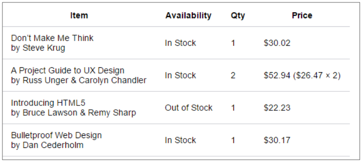

[HTML Element Reference](https://www.w3schools.com/tags/default.asp)


| naam element                                                                     | openingtag element | attribuut          | block | inline |
| -------------------------------------------------------------------------------- | ------------------ | ------------------ | ----- | ------ |
| Koppen                                                                           | \<h1> tot \<h6>    |                    | x     |        |
| Paragraaf                                                                        | \<p>               |                    | x     |        |
| Hyperlink                                                                        | \<a>               |                    |       | x      |
| Afbeelding                                                                       | \             |                    |       | x      |
| picture (met meerdere afbeeldingen met voorwaarde)                               | \<picture>         |                    |       |        |
| geen semantisch element voorhanden                                               | \<div>             |                    | x     |        |
| geen semantisch element voorhanden is                                            | \<span>            |                    |       | x      |
| lange citaten                                                                    | \<blockquote>      |                    | x     |        |
| groepeert illustratie met bijschrift (moet geen beeld zijn)                      | \<figure>          |                    | x     |        |
| bijschrift bij \<figure>                                                         | \<figcaption>      |                    | x     |        |
| markeren van contactinformatie                                                   | \<address>         |                    | x     |        |
| behouden van tabs en spaties (zoals voor ascii art)                              | \<pre>             |                    | x     |        |
| thematische scheiding tussen parafen                                             | \<hr>              |                    |       | x      |
| logische blok: voor een zelfstandig stuk inhoud                                  | \<article>         |                    | x     |        |
| logische blok: onderdeel van een pagina waarvoor geen meer specifiek element is  | \<section>         |                    | x     |        |
| logische blok: voor de hoofdnavigatie                                            | \<nav>             |                    | x     |        |
| logische blok: voor ‘zijdelingse’ informatie                                     | \<aside>           |                    | x     |        |
| logische blok: voor het kopgedeelte                                              | \<header>          |                    | x     |        |
| logische blok: voor het footer gedeelte                                          | \<footer>          |                    | x     |        |
| tekst: aandacht van de lezer op tekst te vestigen                                | \<b>               |                    |       | x      |
| tekst aan te duiden met als doel het vergroten van de leesbaarheid               | \<i>               |                    |       | x      |
| tekst: Belangrijk stuk text                                                      | \<strong>          |                    |       | x      |
| tekst: Klemtoon leggen                                                           | \<em>              |                    |       | x      |
| tekst: aanvullende informatie                                                    | \<small>           |                    |       | x      |
| tekst: markeren van de naam van een auteur of van een creatief werk              | \<cite>            |                    |       | x      |
| tekst: korte citaten in lopende zin (quote), attribuut cite om bron te vermelden | \<q>               |                    |       | x      |
| tekst: afkorting                                                                 | \<abbr>            |                    |       | x      |
| tekst: markeert de eerste keer dat een definitie voorkomt                        | \<gfn>             |                    |       | x      |
| tekst: markeren van programma code                                               | \<code>            |                    |       | x      |
| tekst: om een tijdstip of datum aan te duiden                                    | \<time>            |                    |       | x      |
| tekst: computer uitvoer                                                          | \<samp>            |                    |       | x      |
| tekst: gebruikersinvoer (keyboard)                                               | \<kbd>             |                    |       | x      |
| tekst: informatie die niet meer klopt (suppress)                                 | \<s>               |                    |       | x      |
| tekst: subscript                                                                 | \<sub>             |                    |       | x      |
| tekst: superscript                                                               | \<sup>             |                    |       | x      |
| tekst: markeer tekst (om tekst met speciale relevantie te markeren)              | \<mark>            |                    |       | x      |
| tekst: geeft aan dat inhoud is toegevoegd                                        | \<ins>             |                    |       | x      |
| tekst: geeft aan dat inhoud is verwijderd                                        | \<del>             |                    |       | x      |
| tabel: tabelrij                                                                  | \<tr>              |                    | x     |        |
| tabel: hoofding kolom                                                            | \<th>              |                    | x     |        |
| tabel: data kolom                                                                | \<td>              | colspan<br>rowspan | x     |        |
|                                                                                  | \<>                |                    |       |        |
|                                                                                  |                    |                    |       |        |
#### Lijsten

| openingstag  | naam                           | actie                                                                                           | attributen            |
| ------------ | ------------------------------ | ----------------------------------------------------------------------------------------------- | --------------------- |
| \<ol> \<\ol> | Ordered List                   | lijst met rangschikking                                                                         | start, type, reversed |
| \<ul> \<\ul> | Unordered List                 | lijst zonder rangschikking                                                                      |                       |
| \<li> \<\li> | List item                      | item van een Ordered of Unordered List                                                          |                       |
| \<dl> \<\dl> | Description of Definition List | lijst met beschrijvingen of definities, Kan bijvoorbeeld gebruikt worden om een FAQ te markeren |                       |
| \<dt> \<\dt> | Description Term               | Deel van Description List,de term waarvoor een beschrijving of definitie wordt gegeven          |                       |
| \<dd> \<\dd> | Description Details            | Deel van Decription beschrijving of definitie van de term                                       |                       |
##### Voorbeeld
```html
  <h1>Example lists</h1>
  <h2>Ordered List</h2>
  <h3>Simple example</h3>
  <ol>
    <li>Mix flour, baking powder and sugar.</li>
    <li> In another bowl, mix eggs and milk.</li>
    <li>Stir both mixtures together.</li>
    <li>Fill muffin tray 3/4 full. Bake for 20 minutes.</li>
  </ol>
  <h3>Using Roman Numeral type</h3>
  <ul>
    <li>Introduction</li>
    <li>List of Grievances</li>
    <li>Conclusion</li>
  </ul>
  <h2>Unordered List</h2>
  <ol type="i">
    <li>apples</li>
    <li>oranges</li>
    <li>bananas</li>
  </ol>
  <h2>Description List</h2>
  <h3>Example HTTP response status codes</h3>
  <dl><!-- start defenition list -->
    <dt>200 OK </dt><!-- title van defenition list -->
    <dd>The request has succeeded.</dd> <!-- description van defenition list -->
    <dt>404 Not Found</dt>
    <dd>The server can not find the requested resource. This response code is probably the most famous one due to its
      frequent occurrence on the web.</dd>
    <dt>500 Internal Server Error</dt>
    <dd>The server has encountered a situation it doesn't know how to handle.</dd>
  </dl><!-- einde defenition list -->
  <h2>Nested lists</h2>
  <ol>
    <li>first item</li>
    <li>second item<ul>
        <li>second item first subitem</li>
        <li>second item second subitem</li>
        <li>second item third subitem </li>
      </ul>
    </li>
    <li>third item</li>
  </ol>
```


#### Koppen en paragrafen

De \<h1> tot \<h6> HTML elementen stellen zes niveaus van section heading voor.
Het \<p> HTML element stelt een paragraaf voor.
```html
<h1>Heading level 1</h1>
<h2>Heading level 2</h2>
<p>
		Dit is een paragraaf text.
		Dit is een paragraaf text.
</p>
```

#### Hyperlinks

Met het element \<a> (of het anchor element) kunnen we een hyperlink creëren in een HTML document. Met het *attribuut **href*** kunnen we aangeven naar welke locatie de bezoeker moet gaan wanneer er op de hyperlink geklikt wordt. De inhoud (content) van het element is een indicatie van de bestemming van de link en wordt in browsers standaard onderlijnd weergegeven.

```html
<p>
Bekijk de info op <a href=https://www.hogent.be>HoGent</a> om meer te weten te komen over Hogeschool Gent.
</p>
```

- Zonder href attribuut er gebeurt niets bij klik
- href= "" dezelfde pagina wordt geladen
- href="#" er wordt naar de top van de pagina gesprongen

##### Absolute paden

```html
<a href="/contacts.html">contacts page</a>
<a href="/projects/index.html">project homepage</a>

```
##### Relatieve paden

```html
<a href="contacts.html">contacts page</a>
<a href="projects/index.html">project homepage</a>
<a href="../index.html">Projects Page</a>
<a href="../../pdfs/project-brief.pdf">project brief</a>
```

##### bookmarks

geef een id attribuut aan het element waar je een bookmark voor wilt
```html
<h2 id="Mailing_address">Mailing address</h2>

<a href="contacts.html#Mailing_address">mailing address</a>
```
Om dan te linken naar het specifieke id voeg je op het einde van de url een **\#**- teken toe *gevolgd door het id*

Als je *links* maakt *binnen eenzelfde pagina* mag je de bestandsnaam weglaten. De url start dan met een **\#**

##### target attribuut

|Value|Description|
|---|---|
|_blank|Opens the linked document in a new window or tab|
|_self|Opens the linked document in the same frame as it was clicked (this is default)|
|_parent|Opens the linked document in the parent frame|
|_top|Opens the linked document in the full body of the window|
|_framename_|Opens the linked document in the named iframe|

```html
<a href="http://www.w3.org" target="_blank">Word Wide Web Consortium</a>

```

##### mail, telefoon, sms, pdf downloaden

```html
<a href="mailto:webmaster@hogent.be">Mail de webmaster</a>
<a href="mailto:webmaster@hogent.be?subject=reactie">Mail de webmaster</a>

<a href="tel:+3209828282">Bel de webmaster</a>

<a href="sms:+18664504185">Stuur de webmaster een sms</a>

<a href="./pdf/h05.pdf" >pdf van hoofdstuk 5</a>
<a href="./pdf/h05.pdf" download="hoofdstuk 5">pdf van hoofdstuk 5</a>
```

#### Afbeelding

Maak bij voorkeur *een aparte map aan binnen je webstructuur waar je de afbeeldingen opslaat*. Indien er heel veel afbeeldingen zijn, maak dan ook *submappen* aan.

De **\** tag bevat geen image maar wel *een verwijzing naar de image*. Hiervoor dient *het* **src**-*attribuut*.

Een *verplicht attribuut* bij  is **alt**. Dit is een korte beschrijving van de image. Dit is *voor slechtziende gebruikers die door middel van ‘screen reading software’* pagina’s “bekijken”.

Er bestaat ook het **title**-*attribuut*. Dit geeft een meer *uitgebreide beschrijving* van de image en zorgt voor *een tooltip*.
```html

```

##### Andere afbeelding laden bij verschillende grotes

De browser bepaald de beste afbeelding
```html

```
##### Richting aanpassen bij andere formaat met \<picture>

De auteur beslist de beste afbeelding
```html
<picture>
	<source media="(max-width: 600px)" srcset="images/flower-square.jpg">
	<source media="(max-width: 1023px)" srcset="images/flower-rectangle.jpg">
	<source media="(min-width: 1024px)" srcset="images/flower-large.jpg">
	
</picture>
```
##### afbeelding als hyperlink

Dit kan je doen door *tussen* de open **\<a>** *tag en de closing tag een afbeelding te plaatsen*.

```html
<a href="https://www.hogent.be">
	
</a>
```
#### Form

bij action mailto:stuster@live.be?subject=formulierinhoud

```html
        <form action="mailto:nikki.stuster@student.hogent.be?subject=formulierinhoud" method="post">
            <label for="firstname">Voornnaam</label> <input type="text" name="fname" id="firstname">
        </form>
```
label for="firstname" komt overeen met id van de control, hier id="firstname"

| openingstag             | naam                  | actie                                        | attributen                                                                                                                                                                                                                                                                           |
| ----------------------- | --------------------- | -------------------------------------------- | ------------------------------------------------------------------------------------------------------------------------------------------------------------------------------------------------------------------------------------------------------------------------------------ |
| \<form> \<form>         | Form                  | aflijning van het formulier                  | action<br>method (*post,get*)<br>autocomplete                                                                                                                                                                                                                                        |
| \<label> \<label>       | Label                 | Bijschrift bij het type                      | for                                                                                                                                                                                                                                                                                  |
| \<input> \<input>       |                       |                                              | type (*text, password, email, date, number, search, radio, checkbox, file, list, image, hidden, submit*)<br>name<br>id (moet naan van label zijn)<br>placeholder (hint invoerveld)<br>maxlength (maximum invoer lengte)<br>required (verplicht (field validation))<br>min<br>max<br> |
| \<select> \<select>     | Keuzelijst            | aflijning de keuzelijst                      | name<br>id<br>size<br>multiple                                                                                                                                                                                                                                                       |
| \<option> \<option>     | Optie                 | onderdeel van de keuzelijst of datalist      | value (de waarde, steeds invulen)<br>selected (standaardselectie)                                                                                                                                                                                                                    |
| \<datalist> \<datalist> | Combobox              | Aflijning van combobox                       | id (zelfde waarde als attrbt list)<br>                                                                                                                                                                                                                                               |
| \<textarea> \<textarea> | Multi line text input | voor meerdere regels tekstinvoer             | name                                                                                                                                                                                                                                                                                 |
| \<fieldset> \<fieldset> | fieldset              | Form controls groeperen, bevat een \<legend> |                                                                                                                                                                                                                                                                                      |
| \<legend> \<legend><br> | legend                | titel van de fieldset                        |                                                                                                                                                                                                                                                                                      |

**Attribuut method**:
- **get**: de *formulier-data worden toegevoegd aan de URL via naam-waarde paren* => zijn zichtbaar in de adresbalk + beperkt in lengte (afhankelijk van de browser) => enkel voor non-secure data
- **post**: voegt de *formulier-data toe aan de header van het HTTP request (niet zichtbaar)*. Wordt gebruikt bij data bestemd voor een databank, gevoelige data, uploaden bestanden.
#### Tabel

| openingstag             | naam                         | actie                                             | attributen         |
| ----------------------- | ---------------------------- | ------------------------------------------------- | ------------------ |
| \<table> \<table>       | Tabel                        | tag waarbinnen de tabel zich bevind               |                    |
| \<caption> \<caption>   | Bijschrift                   | Bijschrift boven de tabel                         |                    |
| \<tr> \<tr>             | Tabel rij                    | een rij                                           |                    |
| \<th> \<\th>            | Tabel hoofding               | Kolomnaam                                         |                    |
| \<td> \<\td>            | Tabel data                   | data kolom                                        | colspan<br>rowspan |
| \<thead> \<\thead>      | Het head deel van de tabel   | Deel dat de head van de tabel aflijnt (voor css)  |                    |
| \<tbody> \<\tbody>      | Het body deel van de tabel   | eel dat de body van de tabel aflijnt (voor css)   |                    |
| \<tfoot> \<\tfoot>      | Het footer deel van de tabel | eel dat de footer van de tabel aflijnt (voor css) |                    |
| \<colgroup> \<colgroup> |                              |                                                   |                    |
| \<col> \<col>           |                              |                                                   |                    |

##### Border
**Dubbele rand naar enkele rand**
```css
table { 
  border-collapse: collapse; 
}
```

**moderne opmaak**
```css
table {
  border-collapse: collapse;
  font-size: 14px;
}

table, th, td {
  border-block-end: 1px solid #cecfd5;
  padding: 10px 15px;
}
```

##### Cellen samenvoegen
Toevoegen als *attribuut*:
- **colspan** (rijen samen voegen)
```html
<tr>
	<td colspan="3">Subtotaal</td>
	<td>$135.36$</td>
</tr>
```

- **rowspan** (kolommen samen voegen)
```html
<tr>
	<td rowspan="2">In Stock</td>
	<td>1</td>
	<td>$30.02</td>
</tr>
```

# Global attributes

[Global attributes - HTML: HyperText Markup Language | MDN (mozilla.org)](https://developer.mozilla.org/en-US/docs/Web/HTML/Global_attributes)

Welke attributen je allemaal kan *gebruiken bij een bepaald HTML-element* kan je o.a. *opzoeken op de MDN website*.

Een *aantal attributen kan je bij elk HTML-element gebruiken*. We noemen deze globale attributen. Enkele veel gebruikte *globale attributen* zijn: 
- **class**: specifieert een of meerdere class names voor een element. 
- **id**: definieert een unieke identifier (ID) voor een element. 
- **lang**: stelt de taal in van een element.

